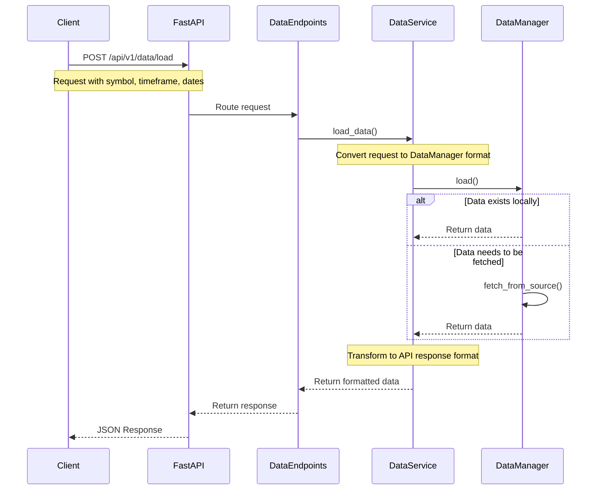
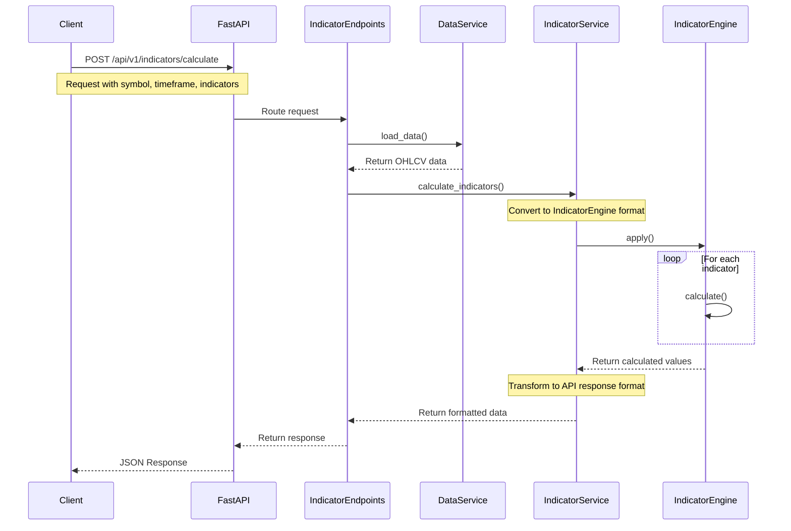
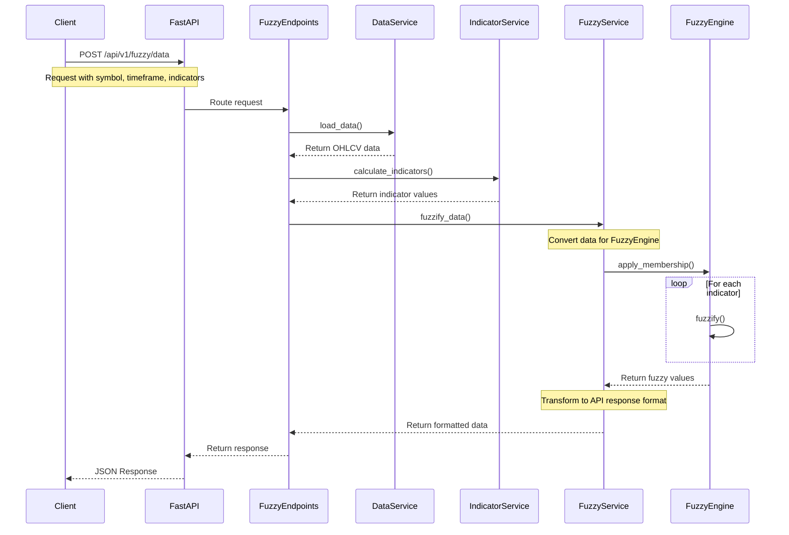
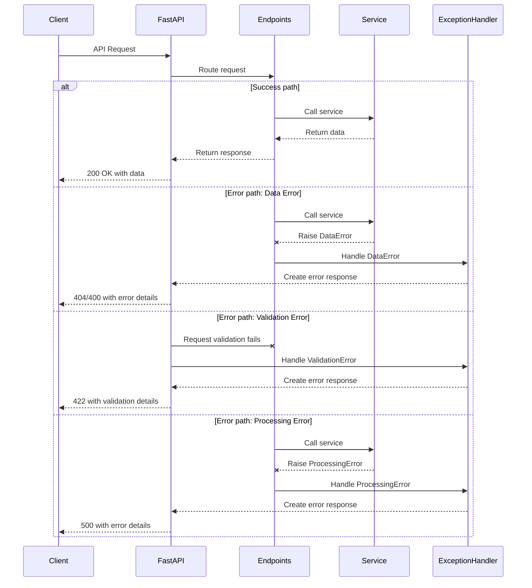
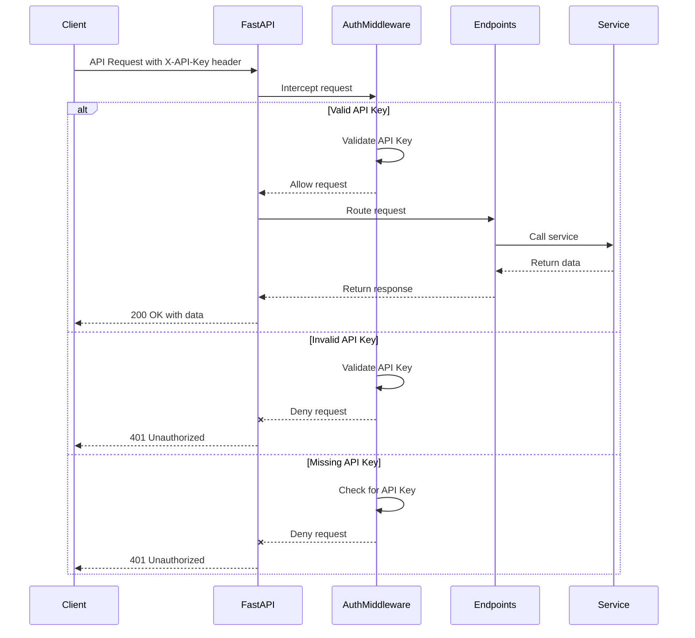

# KTRDR API Workflow Sequences

This document contains sequence diagrams showing common API workflows in the KTRDR system.

## 1. Data Loading Workflow

The following sequence diagram shows the workflow for loading market data through the API:

## 2. Indicator Calculation Workflow

The following sequence diagram shows the workflow for calculating technical indicators:

## 3. Fuzzy Logic Evaluation Workflow

The following sequence diagram shows the workflow for fuzzifying indicator data:

## 4. Error Handling Workflow

The following sequence diagram shows how errors are handled in the API:

## 5. Authentication Workflow (Planned)

The following sequence diagram shows the planned authentication workflow:

