# KTRDR Async Architecture Specification

**Version**: 2.0
**Status**: Production (Slices 1,2,3,5 Complete | Slice 4 Pending)
**Last Updated**: 2025-10-03

> **Note**: For implementation status and what's pending, see [IMPLEMENTATION-STATUS.md](IMPLEMENTATION-STATUS.md)

## Executive Summary

This specification defines the **ServiceOrchestrator-based unified async architecture** for KTRDR that enables consistent async patterns across ALL subsystems while respecting domain-specific requirements. The architecture builds upon the existing ServiceOrchestrator foundation to provide structured progress reporting, unified cancellation handling, and shared host service communication patterns.

**Implementation Status**:
- ✅ Slice 1: Generic Progress Foundation (Complete)
- ✅ Slice 2: Cancellation Enhancement (Complete)
- ✅ Slice 3: Training System Integration (Complete)
- 🚧 Slice 4: Host Service Integration (Pending - AsyncServiceAdapter not implemented)
- ✅ Slice 5: Training Service Orchestrator Migration (Complete)

## 🎯 **CORE ARCHITECTURAL PRINCIPLE**

### ServiceOrchestrator Foundation + Domain-Specific Enhancements

The async system leverages the existing ServiceOrchestrator base class as the foundation, enhanced with domain-specific progress rendering, unified cancellation flow, and shared infrastructure patterns.

## System Architecture Overview

```mermaid
graph TB
    subgraph "🏗️ ServiceOrchestrator Foundation (ktrdr/managers/)"
        SO[ServiceOrchestrator<br/>• execute_with_progress <br/>• execute_with_cancellation<br/>• Environment-based configuration]
        PC[ProgressCallback Protocol<br/>Generic progress interface]
        CT[CancellationToken Protocol<br/>Generic cancellation interface]
    end
    
    subgraph "🎨 Progress Enhancement Layer (Slice 1)"
        PR[ProgressRenderer<br/>Abstract domain renderer]
        DPR[DataProgressRenderer<br/>Data-specific context]
        TPR[TrainingProgressRenderer<br/>Training-specific context]
    end
    
    subgraph "🔗 Cancellation Enhancement (Slice 2)"
        CTS[CancellationToken System<br/>Enhanced cancellation flow]
        DJM[DataJobManager<br/>Job orchestration patterns]
        DLJ[DataLoadingJob<br/>Individual jobs with cancellation]
    end
    
    subgraph "📊 Data Domain (Current + Enhanced)"
        DM[DataManager<br/>ServiceOrchestrator inheritance<br/>Complex job orchestration]
        IDA[IbDataAdapter<br/>Enhanced with AsyncServiceAdapter]
    end
    
    subgraph "🧠 Training Domain (Slice 3 Enhancement)"
        TM[TrainingManager<br/>ServiceOrchestrator inheritance<br/>Simple delegation pattern]
        TA[TrainingAdapter<br/>Enhanced with AsyncServiceAdapter]
    end
    
    subgraph "🌐 Unified Infrastructure (Slice 4)"
        ASA[AsyncServiceAdapter<br/>Shared HTTP infrastructure<br/>Connection pooling]
        IHS[IB Host Service<br/>Enhanced async patterns]
        THS[Training Host Service<br/>Enhanced async patterns]
    end
    
    SO --> PC
    SO --> CT
    SO --> DM
    SO --> TM
    
    PR --> DPR
    PR --> TPR
    PC --> PR
    
    CT --> CTS
    CTS --> DJM
    DJM --> DLJ
    
    DM --> DPR
    DM --> DJM
    DM --> IDA
    
    TM --> TPR
    TM --> TA
    
    IDA --> ASA
    TA --> ASA
    ASA --> IHS
    ASA --> THS
```



## 🏛️ **SERVICEORCHESTRATOR FOUNDATION**

### Current ServiceOrchestrator Capabilities

**Location**: `ktrdr/managers/base.py`

The ServiceOrchestrator provides the foundation that all managers inherit from:

```python
class ServiceOrchestrator(ABC, Generic[T]):
    """Base class for all service managers with unified patterns."""
    
    # Environment-based adapter initialization
    def __init__(self) -> None:
        self.adapter: T = self._initialize_adapter()
    
    # Generic progress execution 
    async def execute_with_progress(
        self,
        operation: Awaitable[T],
        progress_callback: Optional[ProgressCallback] = None,
        timeout: Optional[float] = None,
        operation_name: str = "operation",
    ) -> T:
        """Execute operation with progress tracking."""
    
    # Generic cancellation support
    async def execute_with_cancellation(
        self,
        operation: Awaitable[T], 
        cancellation_token: Optional[CancellationToken] = None,
        check_interval: float = 0.1,
        operation_name: str = "operation",
    ) -> T:
        """Execute operation with cancellation support."""
    
    # Abstract methods for domain-specific implementation
    @abstractmethod
    def _initialize_adapter(self) -> T: pass
    
    @abstractmethod  
    def _get_service_name(self) -> str: pass
```

### ServiceOrchestrator Protocol Definitions

```python
class ProgressCallback(Protocol):
    """Current progress callback interface."""
    def __call__(self, progress: dict[str, Any]) -> None: ...

class CancellationToken(Protocol):
    """Current cancellation token interface."""
    @property
    def is_cancelled_requested(self) -> bool: ...
```

## 🎨 **SLICE 1: PROGRESS ENHANCEMENT LAYER**

### ProgressRenderer Pattern

**Enhancement**: Add domain-specific progress rendering while maintaining ServiceOrchestrator compatibility.

```mermaid
graph LR
    subgraph "📋 Generic Progress State"
        GPS[Generic Progress<br/>• percentage: float<br/>• message: string<br/>• operation: string<br/>• context: dict]
    end
    
    subgraph "🎨 Domain Renderers"
        PR[ProgressRenderer<br/>Abstract base]
        DPR[DataProgressRenderer<br/>Data context formatting]
        TPR[TrainingProgressRenderer<br/>Training context formatting]
    end
    
    subgraph "📱 Enhanced Display"
        DD[Data Display<br/>Loading AAPL 1h data<br/>backfill mode 3/5]
        TD[Training Display<br/>Training MLP model<br/>on AAPL, MSFT epoch 15/50]
    end
    
    GPS --> PR
    PR --> DPR
    PR --> TPR
    
    DPR --> DD
    TPR --> TD
    
    GPS -.->|context: symbol, timeframe, mode| DPR
    GPS -.->|context: model_type, symbols, epochs| TPR
```



### DataProgressRenderer Implementation

```python
class ProgressRenderer(ABC):
    """Abstract progress renderer for domain-specific formatting."""
    
    @abstractmethod
    def render_progress_message(self, progress: dict[str, Any]) -> str:
        """Render enhanced progress message with domain context."""
        pass

class DataProgressRenderer(ProgressRenderer):
    """Data-specific progress rendering."""
    
    def render_progress_message(self, progress: dict[str, Any]) -> str:
        context = progress.get('context', {})
        symbol = context.get('symbol', 'Unknown')
        timeframe = context.get('timeframe', '')
        mode = context.get('mode', '')
        
        base_message = progress.get('message', '')
        step_info = f"[{progress.get('current_step', 0)}/{progress.get('total_steps', 0)}]"
        
        return f"{base_message} ({symbol} {timeframe}, {mode} mode) {step_info}"
```

### Enhanced DataManager Integration

```python
class DataManager(ServiceOrchestrator):
    """Enhanced DataManager with structured progress."""
    
    def __init__(self, ...):
        super().__init__()
        self.progress_renderer = DataProgressRenderer()
    
    def load_data(self, symbol: str, timeframe: str, ...):
        # Enhanced progress callback with domain context
        def enhanced_progress_callback(progress: dict[str, Any]):
            if original_callback:
                # Add domain context
                progress['context'] = {
                    'symbol': symbol,
                    'timeframe': timeframe, 
                    'mode': mode
                }
                # Use renderer for enhanced message
                progress['message'] = self.progress_renderer.render_progress_message(progress)
                original_callback(progress)
        
        # Use ServiceOrchestrator foundation with enhanced callback
        return self.execute_with_progress(
            operation=self._perform_load_operation(symbol, timeframe, mode),
            progress_callback=enhanced_progress_callback,
            operation_name=f"load_data_{symbol}_{timeframe}"
        )
```

## 🔗 **SLICE 2: CANCELLATION ENHANCEMENT**

### Enhanced Cancellation Architecture

Building on ServiceOrchestrator's `execute_with_cancellation`, we enhance the cancellation flow for complex operations.


### DataJobManager Pattern

```python
class DataJobManager:
    """Job orchestration with cancellation support."""
    
    async def execute_job(
        self, 
        job: DataLoadingJob,
        cancellation_token: Optional[CancellationToken] = None
    ) -> pd.DataFrame:
        """Execute job with cancellation checking."""
        
        for segment in job.segments:
            # Check cancellation before each segment
            if cancellation_token and cancellation_token.is_cancelled_requested:
                raise asyncio.CancelledError(f"Job {job.job_id} cancelled")
            
            # Process segment with cancellation token
            segment_data = await self._process_segment(segment, cancellation_token)
            
        return job.combine_results()

class DataLoadingJob:
    """Individual job with CancellationToken protocol."""
    
    def __init__(self, job_id: str, segments: List[DataSegment]):
        self.job_id = job_id
        self.segments = segments
        self.cancellation_token: Optional[CancellationToken] = None
    
    def is_cancelled(self) -> bool:
        """Check if job should be cancelled."""
        return (self.cancellation_token and 
                self.cancellation_token.is_cancelled_requested)
```

## 🧠 **SLICE 3: TRAINING SYSTEM INTEGRATION**

### TrainingManager ServiceOrchestrator Integration

**Key Insight**: Training operations are simpler than data operations - they delegate work in one block rather than orchestrating complex multi-step jobs.


### TrainingManager Implementation

```python
class TrainingManager(ServiceOrchestrator[TrainingAdapter]):
    """Training manager with ServiceOrchestrator foundation."""
    
    def __init__(self):
        super().__init__()  # Initialize ServiceOrchestrator foundation
        self.progress_renderer = TrainingProgressRenderer()
    
    def _initialize_adapter(self) -> TrainingAdapter:
        """Initialize training adapter based on environment."""
        use_host_service = os.getenv("USE_TRAINING_HOST_SERVICE", "").lower() in ("true", "1")
        host_url = os.getenv("TRAINING_HOST_SERVICE_URL", self._get_default_host_url())
        
        return TrainingAdapter(
            use_host_service=use_host_service,
            host_service_url=host_url
        )
    
    async def train_multi_symbol_strategy(
        self,
        strategy_config_path: str,
        symbols: list[str],
        timeframes: list[str],
        progress_callback=None,
        cancellation_token=None,
        **kwargs
    ) -> dict[str, Any]:
        """Train strategy using ServiceOrchestrator patterns."""
        
        def enhanced_progress_callback(progress: dict[str, Any]):
            if progress_callback:
                # Add training context
                progress['context'] = {
                    'model_type': 'mlp',  # Extract from config
                    'symbols': symbols,
                    'timeframes': timeframes
                }
                # Use renderer for enhanced message  
                progress['message'] = self.progress_renderer.render_progress_message(progress)
                progress_callback(progress)
        
        # Use ServiceOrchestrator foundation with enhanced context
        return await self.execute_with_cancellation(
            operation=self._perform_training_operation(
                strategy_config_path, symbols, timeframes, **kwargs
            ),
            cancellation_token=cancellation_token,
            operation_name=f"train_{len(symbols)}_symbols"
        )
    
    async def _perform_training_operation(self, ...):
        """Delegate to adapter with cancellation token."""
        return await self.adapter.train_multi_symbol_strategy(
            strategy_config_path=strategy_config_path,
            symbols=symbols,
            timeframes=timeframes,
            cancellation_token=self.get_current_cancellation_token(),  # Pass through
            **kwargs
        )
```

### Training Cancellation Flow

**Critical Enhancement**: Training operations must check cancellation at both epoch and batch levels for responsive cancellation without performance degradation.


### TrainingProgressRenderer

```python
class TrainingProgressRenderer(ProgressRenderer):
    """Training-specific progress rendering."""
    
    def render_progress_message(self, progress: dict[str, Any]) -> str:
        context = progress.get('context', {})
        model_type = context.get('model_type', 'Model').upper()
        symbols = context.get('symbols', [])
        timeframes = context.get('timeframes', [])
        
        # Smart symbol truncation
        if len(symbols) <= 2:
            symbol_str = ', '.join(symbols)
        else:
            symbol_str = f"{', '.join(symbols[:2])} (+{len(symbols)-2} more)"
        
        # Timeframe display
        tf_str = ', '.join(timeframes) if timeframes else ''
        
        # Training-specific context
        epoch_info = ""
        if context.get('current_epoch') and context.get('total_epochs'):
            epoch_info = f" [epoch {context['current_epoch']}/{context['total_epochs']}]"
        
        base_message = progress.get('message', '')
        return f"{base_message} ({model_type} on {symbol_str} [{tf_str}]{epoch_info})"
```

## 🌐 **SLICE 4: UNIFIED HOST SERVICE INTEGRATION**

### AsyncServiceAdapter Architecture

**Enhancement**: Create shared infrastructure for both client adapters AND host services.

```mermaid
graph TB
    subgraph "🔧 Client Adapters (Enhanced)"
        IDA[IbDataAdapter<br/>AsyncServiceAdapter inheritance]
        TA[TrainingAdapter<br/>AsyncServiceAdapter inheritance]
    end
    
    subgraph "🏗️ Shared Infrastructure" 
        ASA[AsyncServiceAdapter<br/>• Connection pooling<br/>• Unified retry logic<br/>• Cancellation integration<br/>• Generic error handling]
        CP[Connection Pool<br/>HTTP/1.1 keep-alive<br/>Max 20 connections/host]
    end
    
    subgraph "🎯 Host Services (Enhanced)"
        IHS[IB Host Service<br/>• Structured progress<br/>• Cancellation handling<br/>• Unified error patterns]
        THS[Training Host Service<br/>• Structured progress<br/>• Cancellation handling<br/>• Unified error patterns]
    end
    
    IDA --> ASA
    TA --> ASA
    ASA --> CP
    ASA --> IHS
    ASA --> THS
    
    IDA -.->|"10 connections<br/>30s timeout"| CP
    TA -.->|"5 connections<br/>60s timeout"| CP
```



### AsyncServiceAdapter Implementation

```python
class AsyncServiceAdapter(ABC):
    """Generic host service infrastructure without domain knowledge."""
    
    def __init__(self, config: HostServiceConfig):
        self.config = config
        self._http_client: Optional[httpx.AsyncClient] = None
        self._client_lock = asyncio.Lock()
    
    @abstractmethod
    def get_service_name(self) -> str:
        """Service identifier for logging."""
        pass
    
    @abstractmethod
    def get_service_type(self) -> str:
        """Service type (e.g., 'ib_data', 'training')."""
        pass
    
    async def _call_host_service_post(
        self, 
        endpoint: str,
        data: dict[str, Any],
        cancellation_token: Optional[CancellationToken] = None
    ) -> dict[str, Any]:
        """POST with unified cancellation and retry logic."""
        
        for attempt in range(self.config.max_retries + 1):
            # Check cancellation before each attempt
            if cancellation_token and cancellation_token.is_cancelled_requested:
                raise asyncio.CancelledError(f"Request cancelled: {endpoint}")
            
            try:
                client = await self._get_http_client()
                response = await client.post(endpoint, json=data)
                response.raise_for_status()
                return response.json()
                
            except (httpx.TimeoutException, httpx.NetworkError) as e:
                if attempt == self.config.max_retries:
                    raise HostServiceError(f"Failed after {attempt + 1} attempts: {e}")
                
                # Exponential backoff with cancellation checking
                backoff = min(2 ** attempt, 10)
                await self._cancellable_sleep(backoff, cancellation_token)
    
    async def _get_http_client(self) -> httpx.AsyncClient:
        """Connection pooling with lifecycle management."""
        async with self._client_lock:
            if self._http_client is None or self._http_client.is_closed:
                limits = httpx.Limits(
                    max_keepalive_connections=self.config.max_connections,
                    max_connections=self.config.max_connections,
                    keepalive_expiry=self.config.keepalive_expiry
                )
                
                self._http_client = httpx.AsyncClient(
                    base_url=self.config.base_url,
                    timeout=httpx.Timeout(self.config.timeout),
                    limits=limits
                )
            
            return self._http_client
```

### Enhanced Adapter Implementations

```python
class IbDataAdapter(AsyncServiceAdapter):
    """IB data adapter with unified infrastructure."""
    
    def get_service_name(self) -> str:
        return "IB Data Service"
    
    def get_service_type(self) -> str:
        return "ib_data"
    
    async def fetch_data(
        self,
        symbol: str,
        timeframe: str,
        start_date: str,
        end_date: str,
        cancellation_token: Optional[CancellationToken] = None
    ) -> pd.DataFrame:
        """Fetch data with unified cancellation and connection pooling."""
        
        response = await self._call_host_service_post(
            "/data/fetch",
            {
                "symbol": symbol,
                "timeframe": timeframe, 
                "start_date": start_date,
                "end_date": end_date
            },
            cancellation_token=cancellation_token
        )
        
        return self._parse_data_response(response)

class TrainingAdapter(AsyncServiceAdapter):
    """Training adapter with unified infrastructure."""
    
    def get_service_name(self) -> str:
        return "Training Service"
    
    def get_service_type(self) -> str:
        return "training"
    
    async def train_multi_symbol_strategy(
        self,
        strategy_config_path: str,
        symbols: list[str],
        timeframes: list[str],
        cancellation_token: Optional[CancellationToken] = None,
        **kwargs
    ) -> dict[str, Any]:
        """Training with unified cancellation and connection pooling."""
        
        if self.use_host_service:
            # Host service training with structured progress
            response = await self._call_host_service_post(
                "/training/start",
                {
                    "model_configuration": {
                        "strategy_config": strategy_config_path,
                        "symbols": symbols,
                        "timeframes": timeframes
                    },
                    "cancellation_context": {
                        "token_id": id(cancellation_token) if cancellation_token else None
                    }
                },
                cancellation_token=cancellation_token
            )
            return response
        else:
            # Local training with cancellation token
            return await self.local_trainer.train_multi_symbol_strategy(
                strategy_config_path=strategy_config_path,
                symbols=symbols,
                timeframes=timeframes,
                cancellation_token=cancellation_token,
                **kwargs
            )
```

## 🔄 **END-TO-END INTEGRATION FLOWS**

### Complete Data Operation Flow


### Complete Training Operation Flow


### Connection Pool Optimization Flow

```mermaid
graph TB
    subgraph "🚀 Performance Benefits"
        PB1[30%+ Faster Operations<br/>HTTP connection reuse<br/>eliminates TCP handshake]
        PB2[2-3x Better Concurrency<br/>Parallel requests share<br/>connection pool efficiently]
        PB3[Sub-second Cancellation<br/>Cancellation checks integrated<br/>with connection management]
    end
    
    subgraph "🔄 Connection Lifecycle"
        CC[Connection Creation<br/>HTTP/1.1 keep-alive<br/>Domain-specific limits:<br/>• IB: 10 connections<br/>• Training: 5 connections]
        CR[Connection Reuse<br/>Multiple requests share<br/>established connections<br/>across all operations]
        CM[Connection Management<br/>Auto-cleanup after timeout<br/>Health monitoring<br/>Graceful degradation]
    end
    
    subgraph "⚙️ Adapter Integration"
        IDA_POOL[IbDataAdapter<br/>Inherits connection pooling<br/>Data-optimized settings]
        TA_POOL[TrainingAdapter<br/>Inherits connection pooling<br/>Training-optimized settings]
        SHARED[Shared Infrastructure<br/>AsyncServiceAdapter<br/>Unified patterns]
    end
    
    CC --> CR
    CR --> CM
    CM --> CC
    
    CR --> PB1
    CM --> PB2
    CC --> PB3
    
    SHARED --> IDA_POOL
    SHARED --> TA_POOL
    
    IDA_POOL --> CC
    TA_POOL --> CC
```



### Unified Cancellation Propagation


## 📊 **ARCHITECTURAL PATTERNS COMPARISON**

### Data vs Training Architecture Differences


### Progress Context Comparison


## 🎯 **SUCCESS METRICS & VALIDATION**

### Performance Improvements

```mermaid
graph TB
    subgraph "📈 Connection Pooling Benefits"
        CP1[30%+ Faster Multi-Request Operations<br/>Measured: Before vs After<br/>IB data loading: 15s → 10s<br/>Training requests: 8s → 5s]
        CP2[2-3x Better Concurrency<br/>Parallel operations benefit<br/>from shared connection pool<br/>Memory usage optimized]
        CP3[Sub-second Cancellation<br/>Cancellation propagation: <500ms<br/>Resource cleanup: <200ms<br/>User experience: immediate feedback]
    end
    
    subgraph "🧠 Progress Enhancement Benefits"
        PE1[Eliminated String Parsing<br/>CLI training commands:<br/>50+ lines → 5 lines<br/>More reliable, no parsing errors]
        PE2[Rich Context Display<br/>Data: "Loading AAPL 1h (backfill) [3/5]"<br/>Training: "MLP on AAPL,MSFT [epoch 15/50]"<br/>Consistent across domains]
        PE3[Structured Progress API<br/>Operations API returns structured data<br/>Frontend gets clean JSON<br/>No more complex parsing logic]
    end
    
    subgraph "🔄 Architecture Quality" 
        AQ1[Zero Breaking Changes<br/>All existing functionality preserved<br/>Backward compatibility maintained<br/>Gradual enhancement approach]
        AQ2[Unified Patterns<br/>Both systems use ServiceOrchestrator<br/>Consistent cancellation behavior<br/>Shared infrastructure benefits]
        AQ3[Future Extensibility<br/>New domains inherit async benefits<br/>Clean separation of concerns<br/>Domain-specific customization points]
    end
    
    CP1 --> AQ2
    PE1 --> AQ1  
    CP3 --> AQ3
```

### System Integration Validation

```mermaid
graph TB
    subgraph "✅ Slice Integration Checkpoints"
        S1[Slice 1: Progress Foundation<br/>✓ DataManager shows enhanced progress<br/>✓ ProgressRenderer pattern working<br/>✓ Zero breaking changes]
        
        S2[Slice 2: Cancellation Enhancement<br/>✓ DataManager cancellation improved<br/>✓ DataJobManager patterns working<br/>✓ Sub-second cancellation response]
        
        S3[Slice 3: Training Integration<br/>✓ TrainingManager inherits ServiceOrchestrator<br/>✓ Training progress enhanced<br/>✓ Deep cancellation flow working]
        
        S4[Slice 4: Host Service Integration<br/>✓ AsyncServiceAdapter serving both systems<br/>✓ Connection pooling benefits measured<br/>✓ Host services enhanced]
    end
    
    subgraph "🧪 Comprehensive Testing"
        RT[Regression Testing<br/>All existing tests pass<br/>No functionality breaks<br/>Performance maintained]
        
        IT[Integration Testing<br/>End-to-end workflows working<br/>CLI → Manager → Adapter → Host Service<br/>Error scenarios handled]
        
        PT[Performance Testing<br/>30%+ improvement validated<br/>Memory usage optimized<br/>Cancellation response <500ms]
        
        UT[User Experience Testing<br/>Enhanced progress messages<br/>Reliable cancellation<br/>Consistent patterns across systems]
    end
    
    S1 --> RT
    S2 --> IT
    S3 --> PT
    S4 --> UT
    
    RT --> S2
    IT --> S3
    PT --> S4
    UT --> S1
```



## 📁 **DIRECTORY STRUCTURE**

The enhanced async architecture maintains clean separation while building on existing ServiceOrchestrator foundation:

```text
ktrdr/
├── managers/
│   └── base.py                          # 🏗️ ServiceOrchestrator foundation
│
├── async/                               # 🎨 Generic async enhancements (Slice 1 & 4)
│   ├── progress_renderer.py             # ProgressRenderer abstract base
│   ├── service_adapter.py              # AsyncServiceAdapter infrastructure  
│   └── cancellation.py                 # Enhanced CancellationToken system
│
├── data/
│   ├── data_manager.py                 # 📊 Inherits ServiceOrchestrator + enhancements
│   ├── components/
│   │   ├── data_progress_renderer.py    # Data-specific progress rendering
│   │   ├── data_job_manager.py         # Job orchestration (Slice 2)
│   │   └── data_loading_job.py         # Individual jobs with cancellation
│   ├── adapters/
│   │   └── ib_data_adapter.py          # Enhanced with AsyncServiceAdapter
│   └── ...
│
├── training/
│   ├── training_manager.py             # 🧠 Inherits ServiceOrchestrator (Slice 3)
│   ├── components/
│   │   └── training_progress_renderer.py # Training-specific progress rendering
│   ├── training_adapter.py             # Enhanced with AsyncServiceAdapter
│   └── ...
│
└── cli/                                # 🖥️ CLI integration with enhanced progress
    ├── data_commands.py                # Uses structured progress (no string parsing)
    ├── training_commands.py            # Uses structured progress (no string parsing)
    └── ...
```

## 🎉 **BENEFITS OF THE UNIFIED ARCHITECTURE**

### 1. **ServiceOrchestrator Foundation**

- **Proven Pattern**: Build on existing, working ServiceOrchestrator base
- **Environment Configuration**: Automatic local vs host service configuration  
- **Generic Operations**: `execute_with_progress` and `execute_with_cancellation` for all domains
- **Consistent Interface**: Abstract methods ensure domain-specific implementation

### 2. **Domain-Specific Enhancement**

- **Progress Rendering**: Each domain formats progress with rich context
- **Architectural Flexibility**: Data uses complex job orchestration, Training uses simple delegation
- **Cancellation Integration**: Domain-appropriate cancellation checking (epochs, batches, segments)
- **Preservation of Logic**: Domain-specific complexity remains in appropriate layers

### 3. **Shared Infrastructure Benefits**

- **Connection Pooling**: AsyncServiceAdapter provides performance benefits for all host service communication
- **Unified Patterns**: Same infrastructure serves IB data fetching and training requests
- **Error Handling**: Consistent error translation and retry logic across domains
- **Resource Management**: Proper connection lifecycle and cleanup

### 4. **User Experience Improvements**

- **Rich Progress Display**: Structured context replaces brittle string parsing
- **Responsive Cancellation**: Sub-second cancellation response across all operations
- **Consistent Patterns**: Same async behavior whether using data loading or training
- **Enhanced CLI**: Reliable progress display without parsing errors

### 5. **Future-Proof Architecture**

- **Easy Extension**: New domains inherit all async benefits by inheriting ServiceOrchestrator
- **Architectural Consistency**: All systems use same foundation with domain-specific enhancements
- **Performance Scaling**: Shared infrastructure benefits grow with system size
- **Clean Separation**: Generic async infrastructure separate from domain logic

## 🎓 **TRAINING SERVICE ORCHESTRATOR (SLICE 5 DETAILS)**

### Overview

Training Service Orchestrator migration (Slice 5) transforms training from bespoke async wiring into a first-class ServiceOrchestrator client. This section provides detailed implementation specifics for the training domain architecture.

### Component Architecture


### TrainingOperationContext

Immutable dataclass capturing all training operation state:

```python
@dataclass(frozen=True)
class TrainingOperationContext:
    """Immutable context for training operations."""

    # Operation tracking
    operation_id: str
    session_id: Optional[str] = None  # Host service session

    # Strategy configuration
    strategy_name: str
    strategy_path: Path
    symbols: list[str]
    timeframes: list[str]

    # Training parameters
    training_config: dict[str, Any]
    total_epochs: int
    total_batches: Optional[int] = None
    total_steps: int  # Derived from epochs

    # Date range
    start_date: Optional[str] = None
    end_date: Optional[str] = None

    # Execution mode
    use_host_service: bool = False

    # Analytics
    analytics_enabled: bool = True

    # Metadata
    metadata: OperationMetadata = field(default_factory=OperationMetadata)
```

**Factory Function** with strategy validation:

```python
def build_training_context(
    operation_id: str,
    strategy_config_path: str,
    symbols: list[str],
    timeframes: list[str],
    training_config: dict[str, Any],
    **kwargs
) -> TrainingOperationContext:
    """Build context with strategy discovery and validation."""

    # Strategy path resolution (Docker + host path fallback)
    strategy_path = resolve_strategy_path(strategy_config_path)

    if not strategy_path.exists():
        raise FileNotFoundError(f"Strategy not found: {strategy_config_path}")

    # Load and validate strategy YAML
    with open(strategy_path) as f:
        strategy_data = yaml.safe_load(f)

    # Extract metadata
    strategy_name = strategy_data.get("name", strategy_path.stem)
    total_epochs = training_config.get("epochs", 100)

    # Build metadata
    metadata = OperationMetadata(
        parameters={
            "strategy_name": strategy_name,
            "symbols": symbols,
            "timeframes": timeframes,
            "epochs": total_epochs,
            "use_host_service": kwargs.get("use_host_service", False),
            "analytics_enabled": kwargs.get("analytics_enabled", True),
        }
    )

    return TrainingOperationContext(
        operation_id=operation_id,
        strategy_name=strategy_name,
        strategy_path=strategy_path,
        symbols=symbols,
        timeframes=timeframes,
        training_config=training_config,
        total_epochs=total_epochs,
        total_steps=total_epochs,  # Step = epoch
        metadata=metadata,
        **kwargs
    )
```

### TrainingProgressBridge

Translates training lifecycle events into `GenericProgressManager` updates:

```python
class TrainingProgressBridge:
    """Translate training callbacks into generic orchestrator progress."""

    def __init__(
        self,
        context: TrainingOperationContext,
        progress_manager: GenericProgressManager,
        cancellation_token: Optional[CancellationToken] = None,
    ):
        self._context = context
        self._progress_manager = progress_manager
        self._token = cancellation_token
        self._total_epochs = context.total_epochs
        self._total_batches: Optional[int] = context.total_batches

    def on_phase(self, phase_name: str, message: Optional[str] = None):
        """Emit coarse progress update for high-level phase."""
        self._check_cancelled()
        phase_message = message or phase_name.replace("_", " ").title()
        self._emit(
            current_step=0,
            percentage=0.0,
            message=phase_message,
            phase="phase",
            context={"phase_name": phase_name}
        )

    def on_epoch(self, epoch: int, total_epochs: int, metrics: dict):
        """Emit progress for completed epoch."""
        self._check_cancelled()
        epoch_index = max(1, epoch + 1)

        percentage = (epoch_index / max(1, total_epochs)) * 100.0
        message = f"Epoch {epoch_index}/{total_epochs}"

        self._emit(
            current_step=epoch_index,
            percentage=percentage,
            message=message,
            phase="epoch",
            context={
                "epoch_index": epoch_index,
                "total_epochs": total_epochs,
                "epoch_metrics": metrics,
            }
        )

    def on_batch(self, epoch: int, batch: int, total_batches: int, metrics: dict):
        """Emit throttled progress updates for batch-level callbacks."""
        self._check_cancelled()

        # Throttle: Only emit every N batches or at boundaries
        if batch % 10 != 0 and batch != 1 and batch != total_batches - 1:
            return

        epoch_index = max(1, epoch + 1)
        batch_number = max(1, batch + 1)

        # Calculate global progress
        items_processed = (epoch_index - 1) * total_batches + batch_number
        items_total = total_epochs * total_batches
        percentage = (items_processed / max(1, items_total)) * 100.0

        message = f"Epoch {epoch_index}/{total_epochs} · Batch {batch_number}/{total_batches}"

        self._emit(
            current_step=epoch_index,
            percentage=percentage,
            message=message,
            items_processed=items_processed,
            phase="batch",
            context={
                "epoch_index": epoch_index,
                "batch_number": batch_number,
                "batch_total": total_batches,
                "batch_metrics": metrics,
            }
        )

    def on_remote_snapshot(self, snapshot: dict):
        """Translate remote host-service snapshots into orchestrator progress."""
        self._check_cancelled()

        progress_info = snapshot.get("progress", {})
        epoch_index = progress_info.get("epoch", 0)
        total_epochs = progress_info.get("total_epochs", self._total_epochs)

        percentage = progress_info.get("progress_percent", 0.0)
        message = progress_info.get("message", "Polling host session")

        self._emit(
            current_step=epoch_index,
            percentage=percentage,
            message=message,
            phase="remote_snapshot",
            context={
                "host_status": snapshot.get("status"),
                "host_session_id": snapshot.get("session_id"),
                "remote_progress": progress_info,
                "metrics": snapshot.get("metrics", {}),
                "gpu_usage": snapshot.get("gpu_usage"),
            }
        )

    def on_complete(self, message: str = "Training complete"):
        """Mark progress as complete."""
        self._emit(
            current_step=self._total_epochs,
            percentage=100.0,
            message=message,
            phase="completed",
            context={}
        )
```

### LocalTrainingRunner

Wraps `StrategyTrainer` for local in-container execution:

```python
class LocalTrainingRunner:
    """Execute training locally while forwarding progress to orchestrator."""

    def __init__(
        self,
        context: TrainingOperationContext,
        progress_bridge: TrainingProgressBridge,
        cancellation_token: Optional[CancellationToken],
    ):
        self._context = context
        self._bridge = progress_bridge
        self._token = cancellation_token
        self._trainer = StrategyTrainer()

    async def run(self) -> dict:
        """Run synchronous training workflow in worker thread."""
        self._bridge.on_phase("initializing", "Preparing training environment")
        self._raise_if_cancelled()

        # Run blocking training in thread pool
        raw_result = await asyncio.to_thread(self._execute_training)

        # Aggregate result into standardized format
        return from_local_run(self._context, raw_result)

    def _execute_training(self) -> dict:
        """Execute synchronous training with progress callback."""
        self._bridge.on_phase("data_preparation", "Loading market data")
        self._raise_if_cancelled()

        # Build progress callback for StrategyTrainer
        def progress_callback(epoch: int, total_epochs: int, metrics: dict):
            self._raise_if_cancelled()

            progress_type = metrics.get("progress_type")
            if progress_type == "batch":
                self._bridge.on_batch(
                    epoch,
                    metrics.get("batch", 0),
                    metrics.get("total_batches_per_epoch"),
                    metrics
                )
            elif progress_type == "epoch":
                self._bridge.on_epoch(epoch, total_epochs, metrics)

        # Delegate to StrategyTrainer with cancellation-aware callback
        return self._trainer.train_multi_symbol_strategy(
            strategy_config_path=str(self._context.strategy_path),
            symbols=self._context.symbols,
            timeframes=self._context.timeframes,
            progress_callback=progress_callback,
            cancellation_token=self._token,
            **self._context.training_config
        )
```

### HostSessionManager

Manages remote training execution with polling and cancellation:

```python
class HostSessionManager:
    """Coordinate host-service training sessions."""

    def __init__(
        self,
        adapter: TrainingAdapter,
        context: TrainingOperationContext,
        progress_bridge: TrainingProgressBridge,
        cancellation_token: Optional[CancellationToken],
        poll_interval: float = 2.0,
    ):
        self._adapter = adapter
        self._context = context
        self._bridge = progress_bridge
        self._token = cancellation_token
        self._poll_interval = poll_interval
        self._session_id: Optional[str] = None

    async def run(self) -> dict:
        """Start host session and poll until completion."""
        await self.start_session()
        host_snapshot = await self.poll_session()

        # Aggregate result into standardized format
        return from_host_run(self._context, host_snapshot)

    async def start_session(self) -> str:
        """Start remote training session through adapter."""
        self._ensure_not_cancelled()

        response = await self._adapter.train_multi_symbol_strategy(
            strategy_config_path=str(self._context.strategy_path),
            symbols=self._context.symbols,
            timeframes=self._context.timeframes,
            cancellation_token=self._token,
            **self._context.training_config
        )

        self._session_id = response.get("session_id")
        if not self._session_id:
            raise RuntimeError("Host service did not return session_id")

        # Update context and metadata
        self._context.session_id = self._session_id
        self._context.metadata.parameters["session_id"] = self._session_id

        self._bridge.on_phase("host_start", f"Host session {self._session_id} started")
        return self._session_id

    async def poll_session(self) -> dict:
        """Poll host-service status until terminal state."""
        if not self._session_id:
            raise RuntimeError("Cannot poll without session_id")

        self._bridge.on_phase("host_polling", f"Polling host session {self._session_id}")

        while True:
            self._ensure_not_cancelled()

            try:
                snapshot = await self._adapter.get_training_status(self._session_id)
                self._bridge.on_remote_snapshot(snapshot)

                status = snapshot.get("status", "").lower()

                # Check terminal states
                if status == "completed":
                    self._bridge.on_complete(f"Remote session {self._session_id} completed")
                    return snapshot
                elif status in ("failed", "stopped", "cancelled"):
                    raise RuntimeError(f"Remote training {status}: {snapshot.get('error')}")

            except Exception as e:
                logger.error(f"Polling error for session {self._session_id}: {e}")
                raise

            await asyncio.sleep(self._poll_interval)

    async def cancel_session(self):
        """Issue stop request to host service."""
        if not self._session_id:
            return

        logger.info(f"Cancelling host session {self._session_id}")
        await self._adapter.stop_training(self._session_id)
```

### Result Aggregation

Unified schema for local and host execution results:

```python
def from_local_run(context: TrainingOperationContext, raw_result: dict) -> dict:
    """Aggregate local training result into standardized format."""
    return {
        "training_metrics": {
            "final_train_loss": raw_result.get("training_metrics", {}).get("final_train_loss"),
            "final_val_loss": raw_result.get("training_metrics", {}).get("final_val_loss"),
            "epochs_completed": raw_result.get("training_metrics", {}).get("epochs_completed"),
            "training_time_minutes": raw_result.get("training_metrics", {}).get("training_time_minutes"),
        },
        "validation_metrics": raw_result.get("validation_metrics", {}),
        "test_metrics": raw_result.get("test_metrics", {}),
        "resource_usage": {
            "gpu_used": False,
            "training_mode": "local",
        },
        "artifacts": {
            "model_path": raw_result.get("model_path"),
            "analytics_dir": raw_result.get("analytics_dir"),
        },
        "session_info": {
            "operation_id": context.operation_id,
            "strategy_name": context.strategy_name,
            "symbols": context.symbols,
            "timeframes": context.timeframes,
            "training_mode": "local",
        },
    }

def from_host_run(context: TrainingOperationContext, host_snapshot: dict) -> dict:
    """Aggregate host training result into standardized format."""
    metrics = host_snapshot.get("metrics", {})
    return {
        "training_metrics": metrics.get("training", {}),
        "validation_metrics": metrics.get("validation", {}),
        "test_metrics": metrics.get("test", {}),
        "resource_usage": {
            "gpu_used": True,
            "gpu_name": host_snapshot.get("resource_usage", {}).get("gpu_name"),
            "training_mode": "host",
        },
        "artifacts": host_snapshot.get("artifacts", {}),
        "session_info": {
            "operation_id": context.operation_id,
            "session_id": context.session_id,
            "strategy_name": context.strategy_name,
            "symbols": context.symbols,
            "timeframes": context.timeframes,
            "training_mode": "host",
            "host_status": host_snapshot.get("status"),
        },
    }
```

### TrainingService Integration

Complete ServiceOrchestrator integration:

```python
class TrainingService(ServiceOrchestrator[TrainingAdapter]):
    """Training service with full orchestrator integration."""

    def __init__(self):
        super().__init__()
        self._progress_renderer = TrainingProgressRenderer()

    async def start_training(
        self,
        strategy_config_path: str,
        symbols: list[str],
        timeframes: list[str],
        training_config: dict,
        **kwargs
    ) -> dict:
        """Start managed training operation."""

        # Build operation context
        context = build_training_context(
            operation_id=str(uuid.uuid4()),
            strategy_config_path=strategy_config_path,
            symbols=symbols,
            timeframes=timeframes,
            training_config=training_config,
            use_host_service=self._should_use_host_service(),
            **kwargs
        )

        # Start managed operation through ServiceOrchestrator
        return await self.start_managed_operation(
            operation_type=OperationType.TRAINING,
            operation_name=f"train_{context.strategy_name}",
            total_steps=context.total_epochs,
            metadata=context.metadata,
            operation_func=self._execute_training_operation,
            context=context,
        )

    async def _execute_training_operation(
        self,
        context: TrainingOperationContext,
        progress_manager: GenericProgressManager,
        cancellation_token: CancellationToken,
    ) -> dict:
        """Execute training with local or host routing."""

        # Create progress bridge
        bridge = TrainingProgressBridge(
            context=context,
            progress_manager=progress_manager,
            cancellation_token=cancellation_token,
        )

        # Route to local or host execution
        if context.use_host_service:
            runner = HostSessionManager(
                adapter=self.adapter,
                context=context,
                progress_bridge=bridge,
                cancellation_token=cancellation_token,
            )
        else:
            runner = LocalTrainingRunner(
                context=context,
                progress_bridge=bridge,
                cancellation_token=cancellation_token,
            )

        # Execute and return aggregated result
        return await runner.run()
```

### Progress Flow Example

Training operation progress evolution:

```
1. Initializing → "Preparing training environment" (0%)
2. Data Loading → "Loading market data for AAPL, MSFT" (5%)
3. Epoch Progress → "Epoch 1/50" (10%)
4. Batch Updates → "Epoch 1/50 · Batch 120/640" (12%)
5. Epoch Complete → "Epoch 2/50" (14%)
   ...
N. Training Complete → "Training complete" (100%)
```

**Context enrichment at each stage:**
```python
{
    "strategy_name": "mlp_multi_symbol",
    "symbols": ["AAPL", "MSFT"],
    "timeframes": ["1h", "4h"],
    "epoch_index": 15,
    "total_epochs": 50,
    "batch_number": 342,
    "batch_total": 640,
    "epoch_metrics": {
        "train_loss": 0.0234,
        "val_loss": 0.0312,
    },
    "gpu_usage": {
        "gpu_name": "NVIDIA RTX 3090",
        "utilization_percent": 87,
    }
}
```

### Cancellation Flow

Training supports epoch-level and batch-level cancellation:

**Epoch-Level** (Low overhead):
- Checked at epoch boundaries
- Minimal performance impact
- Clean PyTorch state cleanup

**Batch-Level** (Configurable):
- Checked every N batches (default: 50)
- Balanced responsiveness vs performance
- Immediate cancellation on detection

**Host Service Cancellation**:
- Polling loop detects cancellation
- Sends `/stop` request to host service
- Waits for graceful shutdown
- Returns with cancellation status

---

## 🌊 **MIGRATION ROADMAP**

This architecture builds incrementally on the existing ServiceOrchestrator foundation through focused vertical slices:

### **Slice 1** (Week 1): Generic Progress Foundation

- ✅ **Foundation**: ServiceOrchestrator already exists with progress support
- 🎯 **Enhancement**: Add ProgressRenderer pattern for domain-specific formatting
- 🎯 **Integration**: Enhance DataManager progress callbacks with DataProgressRenderer
- 📊 **Result**: Data operations show rich contextual progress

### **Slice 2** (Week 2): Cancellation Enhancement

- ✅ **Foundation**: ServiceOrchestrator already has `execute_with_cancellation`
- 🎯 **Enhancement**: Add DataJobManager and DataLoadingJob patterns
- 🎯 **Integration**: Enhance data operations with job-level cancellation
- 🛑 **Result**: Data operations cancel cleanly at segment boundaries

### **Slice 3** (Week 3): Training System Integration

- 🎯 **Major Change**: TrainingManager inherits ServiceOrchestrator
- 🎯 **Enhancement**: Add TrainingProgressRenderer for training context
- 🎯 **Critical**: Implement deep cancellation flow in training operations  
- 🧠 **Result**: Training gets all async benefits with training-specific context

### **Slice 4** (Week 4): Unified Host Service Integration

- 🎯 **Infrastructure**: Create AsyncServiceAdapter from existing AsyncHostService
- 🎯 **Client Enhancement**: Both IbDataAdapter and TrainingAdapter inherit AsyncServiceAdapter
- 🎯 **Host Enhancement**: IB and Training host services use unified async patterns
- 🌐 **Result**: Complete unified async infrastructure serving entire KTRDR ecosystem

Each slice delivers immediate value while building toward the complete unified architecture, ensuring working improvements every week with no breaking changes to existing functionality.
