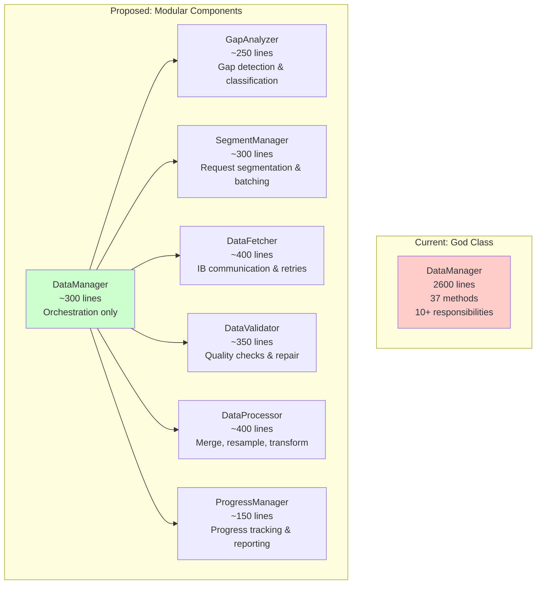

# DataManager Decomposition Strategy

## Executive Summary

You're absolutely right - the 2600-line DataManager is the core problem. It's not about simplifying complexity, it's about **organizing it properly**. By decomposing DataManager into focused components, we can achieve clean async patterns while preserving all functionality.

## The Real Insight

From a high level, DataManager and TrainingManager ARE similar:
- Both orchestrate operations between CLI, backend, and host services
- Both manage async workflows

The key difference is **work distribution**:
- **DataManager**: Backend orchestrates many atomic host service calls
- **TrainingManager**: Backend monitors one complex host service operation

But a 2600-line class makes ANY async pattern difficult. The solution is decomposition.

## Current State: God Class Anti-Pattern

DataManager currently handles **37 methods** across **10+ responsibilities**:

```
DataManager (2600 lines)
├── Gap Analysis (5 methods, ~230 lines)
├── Segment Management (3 methods, ~280 lines)  
├── Data Fetching (5 methods, ~450 lines)
├── Progress Tracking (embedded throughout)
├── Cancellation Handling (embedded throughout)
├── Data Validation (5 methods, ~340 lines)
├── Data Processing (4 methods, ~380 lines)
├── Local Data Management (delegated to LocalDataLoader)
├── IB Communication (delegated to IbDataAdapter)
└── Configuration (ServiceOrchestrator integration)
```

## Proposed Architecture: Single Responsibility Components

### Core Principle: Separation of Concerns



## Benefits of Decomposition

### 1. Clean Async Patterns
With components handling single responsibilities, async boundaries become clear and manageable.

### 2. Testability
- Test each component in isolation
- Mock dependencies easily
- Faster test execution

### 3. Maintainability
- Find bugs faster (smaller search space)
- Add features to specific components
- Onboard developers component by component

### 4. Reusability
- Use GapAnalyzer in other contexts
- Share DataValidator with backtesting
- Reuse ProgressManager across services

### 5. Performance
- Parallelize independent operations
- Cache component results
- Optimize hot paths in isolation

## Migration Path

### Step 1: Start with ProgressManager (Easiest)
- Self-contained, ~150 lines
- Clear interface
- Immediate benefit

### Step 2: Extract GapAnalyzer
- Well-defined responsibility
- ~250 lines
- Used by SegmentManager

### Step 3: Extract SegmentManager
- Depends on GapAnalyzer
- Clear input/output
- ~300 lines

### Step 4: Extract DataFetcher
- Wraps IbDataAdapter
- Handles retries
- ~400 lines

### Step 5: Extract DataValidator & DataProcessor
- Can be done in parallel
- Independent components
- ~750 lines combined

### Step 6: Create New DataManager
- Pure orchestration
- ~300 lines
- Clean async flow

## Comparison with TrainingManager

After decomposition:

```python
# DataManager: Orchestrates multiple components
class DataManager(ServiceOrchestrator):
    async def load_data(self, ...):
        # Orchestrate 6 components
        # Each doing focused work
        
# TrainingManager: Simple delegation
class TrainingManager(ServiceOrchestrator):
    async def train(self, ...):
        # Delegate to adapter
        # Monitor status
```

Both become **clean orchestrators** with the complexity properly organized in components.

## Success Metrics

### Code Quality
- ✅ No class over 500 lines
- ✅ Single responsibility per class
- ✅ Clean async patterns throughout
- ✅ 90%+ test coverage per component

### Performance
- ✅ Same or better performance
- ✅ Parallel operations where possible
- ✅ Efficient resource usage

### Developer Experience
- ✅ Find code in < 30 seconds
- ✅ Understand component in < 10 minutes
- ✅ Add features without touching orchestrator

## Conclusion

You're absolutely right - the problem isn't the complexity, it's the organization. A 2600-line god class makes any pattern difficult. By decomposing into focused components:

1. **Async becomes simple** - Each component has clean async methods
2. **Testing becomes easy** - Test components in isolation
3. **Maintenance becomes manageable** - Find and fix issues quickly
4. **The architecture becomes clear** - Orchestrator + specialized components

This is the refactoring that will actually solve the async issues while preserving all the battle-tested functionality.