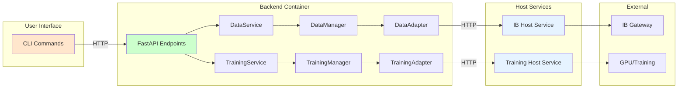

# Unified Async Architecture: CLI to Host Services

## Executive Summary

After analyzing both data and training paths, we've identified that while they have different complexity levels, they follow the same fundamental pattern from CLI to host services. The solution is a unified architecture that provides consistency while respecting their operational differences.

## The Complete System Flow

Both data and training operations follow the same path through the system, but with different levels of complexity at each layer:

## Current State Assessment

### What's Working Well

**ServiceOrchestrator Pattern**: The base class we've implemented provides good configuration management and environment-based adapter initialization. This foundation is solid and should be retained.

**Host Service Architecture**: Both IB and Training host services have proven to be reliable patterns for isolating external dependencies and providing clean HTTP interfaces.

**Adapter Abstraction**: The adapter pattern successfully abstracts whether we're using host services or direct connections, providing flexibility for different deployment scenarios.

### What Needs Improvement

**CLI Layer Inefficiencies**: The CLI creates new event loops for each command and doesn't reuse HTTP connections, leading to unnecessary overhead.

**DataManager Complexity**: At 2600 lines, DataManager has become a god class that mixes orchestration logic with implementation details, making it difficult to maintain and reason about async patterns.

**Pattern Inconsistency**: Each service path has evolved its own patterns for handling progress, cancellation, and error handling, leading to code duplication and maintenance burden.

## The Core Insight: Two Patterns, One Architecture

While data and training operations have different complexity levels, they both follow the same fundamental pattern. The key is recognizing that we need two implementation strategies within one consistent architecture.

### Pattern 1: Simple Delegation (Training Model)

Training operations are conceptually simple from the backend's perspective. The backend receives a training request, delegates it to the training host service, and monitors the status. The complexity lives in the host service itself, which manages GPU resources, training loops, and model optimization.

This pattern is characterized by:
- Single request to initiate operation
- Periodic status checks
- Final result retrieval
- Manager acts as a simple pass-through
- Host service handles all complexity

### Pattern 2: Orchestrated Operations (Data Model)

Data operations require the backend to orchestrate multiple steps and make numerous calls to the host service. The backend must analyze gaps, create segments, manage retries, and coordinate fetching operations.

This pattern is characterized by:
- Multiple coordinated operations
- Complex decision logic in the manager
- Many atomic requests to host service
- Progress tracking across operations
- Cancellation at multiple points

## Unified Architecture Design

### Core Architectural Principles

**Principle 1: Clear Async Boundaries**

Every layer boundary in the system should be consistently async. This means:
- CLI to API calls are always async (HTTP operations)
- API to Service calls are always async (FastAPI requirement)
- Service to Manager calls are always async (consistency)
- Manager to Adapter calls are always async (I/O operations)
- Adapter to Host Service calls are always async (HTTP operations)

This consistency eliminates confusion about when to use async and provides predictable patterns throughout the codebase.

**Principle 2: Appropriate Async Usage**

While boundaries are always async, internal operations should use async only when beneficial:
- Network I/O operations are always async
- File I/O operations are always async
- CPU-bound operations remain synchronous but wrapped in async when needed
- Database operations are async

This approach avoids the overhead of unnecessary async operations while maintaining consistency at boundaries.

**Principle 3: Shared Foundation Components**

Common functionality should be extracted into shared components:
- Progress reporting mechanisms
- Cancellation handling
- Error handling and retry logic
- Configuration management
- Connection pooling

These shared components reduce duplication and ensure consistent behavior across all services.

## Benefits of the Unified Architecture

### Consistency Without Uniformity

The architecture provides consistent patterns and shared components while allowing services to implement patterns appropriate to their complexity. This balance ensures:
- Developers can understand any service quickly
- Common functionality is shared, not duplicated
- Services can evolve independently within the framework

### Performance Optimization

By using async appropriately and implementing connection pooling:
- Reduced latency from connection reuse
- Better resource utilization
- Improved concurrent operation support
- Lower overhead from proper async/sync separation

### Maintainability Improvements

The decomposition and shared components approach provides:
- Smaller, focused components that are easier to understand
- Consistent patterns that reduce cognitive load
- Shared testing utilities and patterns
- Clear separation of concerns

### Scalability Foundation

The architecture provides a foundation for future scaling:
- Services can be deployed independently
- Host services can be scaled horizontally
- Connection pooling supports higher throughput
- Async patterns enable concurrent operations

## Conclusion

The unified architecture respects the fundamental differences between simple and complex operations while providing consistency where it matters. By identifying two implementation patterns within one architectural framework, we can:

1. **Maintain the successful ServiceOrchestrator pattern** as the foundation
2. **Add shared base classes** that provide common functionality
3. **Support both simple and orchestrated patterns** as appropriate
4. **Share components** like progress, errors, and configuration
5. **Establish clear async boundaries** while using sync internally where beneficial

This approach provides the consistency and code reuse we need while respecting the inherent complexity differences between different types of operations. The result is a maintainable, performant, and scalable architecture that can evolve with the system's needs.