# KTRDR Unified Async Architecture Specification

**Version**: 2.0  
**Status**: Target Architecture  
**Last Updated**: 2025-09-08

This specification defines the **ServiceOrchestrator-based unified async architecture** for KTRDR that enables consistent async patterns across all subsystems while respecting domain-specific requirements.

## 🎯 **ARCHITECTURAL PRINCIPLES**

### Foundation Pattern: ServiceOrchestrator Inheritance

All async operations in KTRDR inherit from the ServiceOrchestrator base class, providing:

- **Unified Progress Reporting**: Structured progress context for all operations
- **Consistent Cancellation**: Reliable operation cancellation across all domains
- **Environment Configuration**: Automatic local vs host service routing
- **Generic Operations**: Standardized `execute_with_progress()` and `execute_with_cancellation()` methods

### Domain-Specific Enhancement Pattern

Each domain extends the ServiceOrchestrator foundation with:

- **Progress Rendering**: Domain-specific context formatting for rich user experience
- **Cancellation Integration**: Domain-appropriate cancellation checking patterns
- **Architectural Flexibility**: Complex vs simple operation patterns as needed

## 📐 **SYSTEM ARCHITECTURE**

```mermaid
graph TB
    subgraph "🏗️ ServiceOrchestrator Foundation"
        SO[ServiceOrchestrator<br/>• execute_with_progress<br/>• execute_with_cancellation<br/>• Environment-based configuration]
        PC[ProgressCallback Protocol<br/>Generic progress interface]
        CT[CancellationToken Protocol<br/>Generic cancellation interface]
    end
    
    subgraph "🎨 Progress Enhancement Layer"
        PR[ProgressRenderer<br/>Abstract domain renderer]
        DPR[DataProgressRenderer<br/>Data-specific context]
        TPR[TrainingProgressRenderer<br/>Training-specific context]
    end
    
    subgraph "📊 Data Domain Architecture"
        DM[DataManager<br/>ServiceOrchestrator inheritance<br/>Complex job orchestration]
        DJM[DataJobManager<br/>Job orchestration patterns]
        DLJ[DataLoadingJob<br/>Individual jobs with cancellation]
        IDA[IbDataAdapter<br/>Enhanced with AsyncServiceAdapter]
    end
    
    subgraph "🧠 Training Domain Architecture"
        TM[TrainingManager<br/>ServiceOrchestrator inheritance<br/>Simple delegation pattern]
        TA[TrainingAdapter<br/>Enhanced with AsyncServiceAdapter]
        LT[LocalTrainer<br/>Cancellation-aware training loops]
    end
    
    subgraph "🌐 Shared Infrastructure"
        ASA[AsyncServiceAdapter<br/>Shared HTTP infrastructure<br/>Connection pooling]
        IHS[IB Host Service<br/>Structured progress & cancellation]
        THS[Training Host Service<br/>Structured progress & cancellation]
    end
    
    SO --> PC
    SO --> CT
    SO --> DM
    SO --> TM
    
    PR --> DPR
    PR --> TPR
    PC --> PR
    
    DM --> DPR
    DM --> DJM
    DJM --> DLJ
    DLJ --> IDA
    
    TM --> TPR
    TM --> TA
    TA --> LT
    
    IDA --> ASA
    TA --> ASA
    ASA --> IHS
    ASA --> THS
```



## 🔄 **PROGRESS ARCHITECTURE**

### Progress Flow Pattern

All domains follow the same progress reporting pattern with domain-specific context:


### Progress Context Architecture

Each domain provides rich contextual information:

**Data Operations Context**:

```json
{
  "operation": "data_loading",
  "symbol": "AAPL",
  "timeframe": "1h",
  "mode": "backfill",
  "current_segment": 3,
  "total_segments": 5,
  "bars_processed": 1500
}
```

**Training Operations Context**:

```json
{
  "operation": "model_training",
  "model_type": "mlp",
  "symbols": ["AAPL", "MSFT"],
  "timeframes": ["1h"],
  "current_epoch": 15,
  "total_epochs": 50,
  "current_batch": 342,
  "total_batches": 500
}
```

## 🛑 **CANCELLATION ARCHITECTURE**

### Unified Cancellation Protocol

All operations implement consistent cancellation checking through the CancellationToken protocol:


### Domain-Specific Cancellation Patterns

**Data Operations**:

- Check at segment boundaries (coarse-grained)
- Check every 100 bars within segment (fine-grained)
- Cancel in-flight HTTP requests to host services

**Training Operations**:

- Check at epoch boundaries (coarse-grained, minimal overhead)
- Check every 50 batches (fine-grained, balanced performance)
- Propagate cancellation through training loops

**Host Services**:

- Accept cancellation context in requests
- Check cancellation during long-running operations
- Return early when cancellation detected

## 🏗️ **DOMAIN ARCHITECTURES**

### Data Domain: Complex Operation Pattern

Data operations require complex orchestration with multiple steps:


**Key Characteristics**:

- **Complex Logic**: DataManager handles validation, gap detection, quality checks
- **Multi-Step Operations**: Multiple data segments processed individually
- **Job Orchestration**: DataJobManager coordinates complex data loading workflows
- **Segment-Level Cancellation**: Fine-grained control over data loading operations

### Training Domain: Simple Delegation Pattern

Training operations use straightforward delegation:


**Key Characteristics**:

- **Simple Delegation**: TrainingManager passes parameters directly to adapter
- **Single Block Operations**: Training happens as one atomic operation
- **No Job Orchestration**: Training complexity encapsulated in adapter/service
- **Epoch-Level Cancellation**: Efficient cancellation without performance impact

## 🌐 **HOST SERVICE ARCHITECTURE**

### Unified Host Service Patterns

Both IB and Training host services implement consistent async patterns:

```mermaid
graph TB
    subgraph "Client Adapters"
        IDA[IbDataAdapter<br/>Data requests]
        TA[TrainingAdapter<br/>Training requests]
    end
    
    subgraph "Shared Infrastructure"
        ASA[AsyncServiceAdapter<br/>• HTTP connection pooling<br/>• Unified error handling<br/>• Cancellation integration<br/>• Retry logic]
    end
    
    subgraph "Host Services"
        IHS[IB Host Service<br/>• Structured progress reporting<br/>• Cancellation handling<br/>• Data operation APIs]
        THS[Training Host Service<br/>• Structured progress reporting<br/>• Cancellation handling<br/>• Training operation APIs]
    end
    
    IDA --> ASA
    TA --> ASA
    ASA --> IHS
    ASA --> THS
```



### Connection Pooling Architecture

AsyncServiceAdapter provides performance benefits through shared infrastructure:

- **Connection Reuse**: HTTP connections pooled across requests
- **Configurable Limits**: Maximum connections per service
- **Automatic Cleanup**: Proper connection lifecycle management
- **Performance Monitoring**: Connection pool metrics and health checks

## 📁 **COMPONENT ORGANIZATION**

### Directory Structure

```text
ktrdr/
├── managers/
│   └── base.py                          # ServiceOrchestrator foundation
│
├── async/                               # Generic async infrastructure
│   ├── progress_renderer.py             # ProgressRenderer abstract base
│   ├── service_adapter.py              # AsyncServiceAdapter infrastructure  
│   └── cancellation.py                 # Enhanced CancellationToken system
│
├── data/
│   ├── data_manager.py                 # Inherits ServiceOrchestrator
│   ├── components/
│   │   ├── data_progress_renderer.py    # Data-specific progress rendering
│   │   ├── data_job_manager.py         # Job orchestration
│   │   └── data_loading_job.py         # Individual jobs with cancellation
│   └── adapters/
│       └── ib_data_adapter.py          # Enhanced with AsyncServiceAdapter
│
├── training/
│   ├── training_manager.py             # Inherits ServiceOrchestrator
│   ├── components/
│   │   └── training_progress_renderer.py # Training-specific progress rendering
│   └── training_adapter.py             # Enhanced with AsyncServiceAdapter
│
└── cli/                                # CLI with enhanced progress
    ├── data_commands.py                # Uses structured progress
    └── training_commands.py            # Uses structured progress
```

## 🔀 **OPERATION FLOWS**

### Data Loading Flow

Complete data operation with structured progress and cancellation:


### Training Operation Flow

Training operation with simplified delegation pattern:


## 🚀 **PERFORMANCE CHARACTERISTICS**

### Connection Pooling Benefits

The AsyncServiceAdapter provides significant performance improvements:

- **30%+ Improvement**: Multi-request operations benefit from connection reuse
- **Reduced Latency**: Eliminates connection establishment overhead
- **Resource Efficiency**: Shared connections across all host service communication
- **Scalability**: Configurable connection limits prevent resource exhaustion

### Cancellation Responsiveness

Domain-specific cancellation patterns ensure responsive operation control:

- **Sub-second Response**: Cancellation detected at appropriate boundaries
- **Minimal Overhead**: Efficient checking patterns don't impact performance
- **Clean Resource Cleanup**: Proper resource management on cancellation
- **Consistent Behavior**: Same cancellation patterns across all operations

## 🎯 **BENEFITS**

### Unified Foundation

- **Consistent Patterns**: All async operations follow identical ServiceOrchestrator patterns
- **Proven Architecture**: Built on existing, tested ServiceOrchestrator foundation
- **Environment Flexibility**: Automatic local vs host service configuration
- **Generic Operations**: Standardized async operation methods across domains

### Enhanced User Experience

- **Rich Progress Display**: Structured context eliminates brittle string parsing
- **Responsive Cancellation**: Sub-second cancellation response across all operations
- **Reliable CLI**: Consistent progress display without parsing errors
- **Domain Context**: Meaningful progress information specific to each operation type

### Performance Optimization

- **Connection Pooling**: Shared infrastructure improves all host service communication
- **Efficient Cancellation**: Balanced checking frequency prevents performance degradation
- **Resource Management**: Proper lifecycle management for all async resources
- **Scalable Architecture**: Infrastructure scales with system complexity

### Future Extensibility

- **Easy Domain Addition**: New domains inherit all async benefits automatically
- **Consistent Integration**: Same patterns for all future async operations
- **Shared Infrastructure**: New services benefit from existing connection pooling
- **Clean Separation**: Generic infrastructure separate from domain-specific logic

This architecture provides a robust, scalable foundation for all async operations in KTRDR while maintaining domain-specific flexibility and ensuring consistent user experience across all subsystems.
