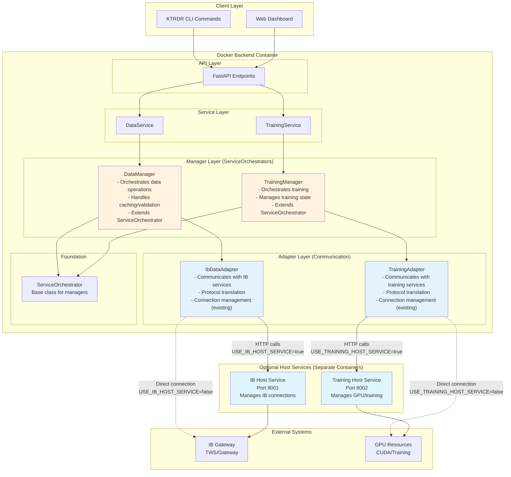
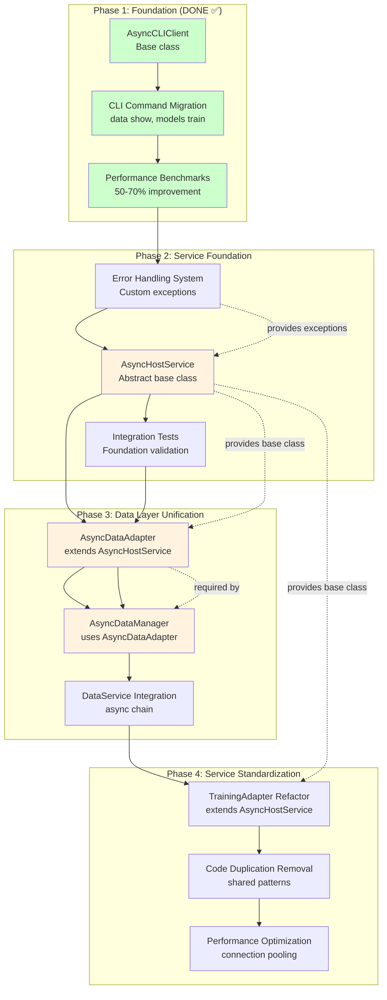

# KTRDR Unified Async Architecture Recommendations

## Executive Summary

Based on the comprehensive analysis of both your IB and Training service paths, I recommend a **unified async service architecture** that takes the best patterns from your Training Host Service and applies them across your entire system. Your Training Host Service already demonstrates the right architectural approach - the solution is to extend this proven pattern to all operations while fixing the CLI layer inefficiencies that affect both paths.

## The Core Problem: Architectural Inconsistency

You currently have **two parallel architectures** that handle similar problems with different approaches:

**IB Path:** Great host service pattern, but broken by DataManager sync bottleneck
**Training Path:** Superior backend async flow, but same CLI inefficiencies

The solution is **architectural unification** around your proven microservice pattern.

## Architecture Overview

### Current State vs Target State

```mermaid
graph TB
    subgraph "CURRENT: Mixed Async/Sync Architecture"
        CLI1["CLI Commands<br/>Sync + asyncio.run()"]
        HTTP1["HTTP Client<br/>New per command"]
        API1["FastAPI Endpoints<br/>Async ✅"]
        
        subgraph "Data Path - BROKEN"
            DS1["DataService<br/>Async ✅"]
            DM1["DataManager<br/>SYNC ❌"]
            DA1["DataAdapter<br/>Mixed patterns"]
        end
        
        subgraph "Training Path - BETTER"
            TS1["TrainingService<br/>Async ✅"]
            TM1["TrainingManager<br/>Async ✅"]
            TA1["TrainingAdapter<br/>Async ✅"]
        end
        
        CLI1 --> HTTP1 --> API1
        API1 --> DS1 --> DM1 --> DA1
        API1 --> TS1 --> TM1 --> TA1
        
        style DM1 fill:#ffcccc
        style DA1 fill:#ffcccc
    end
    
    subgraph "TARGET: Unified Async Architecture"
        CLI2["AsyncCLIClient<br/>Connection reuse ✅"]
        HTTP2["HTTP Client<br/>Persistent connection"]
        API2["FastAPI Endpoints<br/>Async ✅"]
        
        subgraph "Foundation Layer"
            AHS["AsyncHostService<br/>Base class"]
            ERR["Error Handling<br/>Custom exceptions"]
        end
        
        subgraph "ServiceOrchestrator Foundation"
            SO["ServiceOrchestrator<br/>Base class for all managers"]
        end
        
        subgraph "Unified Data Path"
            DS2["DataService<br/>Async ✅"]
            DM2["DataManager<br/>extends ServiceOrchestrator"]
            DA2["IbDataAdapter<br/>Async ✅ (existing)"]
        end
        
        subgraph "Unified Training Path"
            TS2["TrainingService<br/>Async ✅"]
            TM2["TrainingManager<br/>extends ServiceOrchestrator"]
            TA2["TrainingAdapter<br/>Async ✅ (existing)"]
        end
        
        CLI2 --> HTTP2 --> API2
        API2 --> DS2 --> DM2 --> DA2
        API2 --> TS2 --> TM2 --> TA2
        
        DM2 -.-> SO
        TM2 -.-> SO
        SO -.-> ERR
        
        style CLI2 fill:#ccffcc
        style DM2 fill:#ccffcc
        style DA2 fill:#ccffcc
        style TA2 fill:#ccffcc
        style SO fill:#e6f3ff
    end
```



### Component Roles and Deployment

**Key Concept: ServiceOrchestrator Pattern**

- **ServiceOrchestrator** = Base class providing environment-based configuration and common manager patterns
- **Manager** = Business logic orchestrators (DataManager, TrainingManager) extending ServiceOrchestrator
- **Adapter** = Communication interfaces (existing IbDataAdapter, TrainingAdapter)



### Component Responsibilities Explained

| Component | Purpose | Runs Where | Responsibilities |
|-----------|---------|------------|------------------|
| **ServiceOrchestrator** | Base Class | Backend Container | • Environment-based configuration<br/>• Common manager patterns<br/>• Health check interface<br/>• Statistics and info methods |
| **DataManager** | Business Orchestrator | Backend Container | • Data validation and caching<br/>• Business rules (date ranges, symbols)<br/>• Coordinates multiple data sources<br/>• Extends ServiceOrchestrator |
| **IbDataAdapter** | Communication | Backend Container | • HTTP calls to IB Host Service<br/>• Protocol translation (REST ↔ IB)<br/>• Connection management<br/>• Direct IB connections (existing) |
| **TrainingManager** | Business Orchestrator | Backend Container | • Training workflow coordination<br/>• Model lifecycle management<br/>• Training state tracking<br/>• Extends ServiceOrchestrator |
| **TrainingAdapter** | Communication | Backend Container | • HTTP calls to Training Host Service<br/>• Protocol translation (REST ↔ Training)<br/>• GPU resource communication<br/>• Local training (existing) |

**Why This Architecture?**

- **ServiceOrchestrator** = Common patterns for all managers (configuration, health checks, statistics)
- **Manager** = "What to do" (business orchestration, extends ServiceOrchestrator)  
- **Adapter** = "How to communicate" (protocol details, existing implementations)

**Example Flow:**
1. `DataService.load_data()` → calls `DataManager.load_data()`
2. `DataManager` (extends ServiceOrchestrator) validates symbol, checks cache, determines date range
3. `DataManager` calls `IbDataAdapter.fetch_historical_data()` (existing async method)
4. `IbDataAdapter` makes HTTP call to IB Host Service OR direct IB connection
5. `IbDataAdapter` translates response back to standard DataFrame format
6. `DataManager` caches result and applies business rules
7. `DataService` returns final result to API

## Recommended Unified Architecture

### 1. Standardize on the Host Service Pattern

Your Training Host Service proves that the **HTTP microservice pattern works excellently**. Extend this pattern to all external operations:

**Current State:**
- IB Host Service (good, but underutilized)
- Training Host Service (excellent pattern)
- Direct IB connections (problematic)

**Target State:**
- **Unified Host Services** for all external operations
- **Standard HTTP-based communication** for all services
- **Consistent session management** for long-running operations
- **Proper resource isolation** for all external dependencies

### 2. Fix the CLI Foundation Layer

Both IB and Training commands suffer from the **same CLI inefficiencies**. Create a unified CLI foundation that eliminates these problems:

**Current Problem Pattern (Both Paths):**
```python
@command()
def some_command(...):
    asyncio.run(_some_command_async(...))  # Creates new event loop every time
    
async def _some_command_async(...):
    async with httpx.AsyncClient() as client:  # Creates new HTTP client every time
        response = await client.request(...)
```

**Recommended Solution Pattern:**
```python
# New unified CLI foundation
class UnifiedAsyncCLI:
    def __init__(self):
        self._loop = None
        self._http_client = None
        self._api_client = None
    
    async def __aenter__(self):
        # Reusable event loop and HTTP client
        self._http_client = httpx.AsyncClient(timeout=30.0)
        self._api_client = KtrdrApiClient(self._http_client)
        return self
    
    async def __aexit__(self, exc_type, exc_val, exc_tb):
        if self._http_client:
            await self._http_client.aclose()

# Commands use the unified foundation
@command()
def train_model(...):
    async def _train_async():
        async with UnifiedAsyncCLI() as cli:
            return await cli.api_client.start_training(...)
    
    return asyncio.run(_train_async())

@command() 
def show_data(...):
    async def _show_async():
        async with UnifiedAsyncCLI() as cli:
            return await cli.api_client.get_data(...)
    
    return asyncio.run(_show_async())
```

### 3. Unify the Backend Service Layer

Create a standard async service foundation that both data and training operations can use:

**ServiceOrchestrator Base Class:**
```python
from abc import ABC, abstractmethod
from typing import Optional, Dict, Any, TypeVar
import os

T = TypeVar('T')  # For the adapter type

class ServiceOrchestrator(ABC):
    """Base class for all service managers (Data, Training, Backtesting, etc.)."""
    
    def __init__(self):
        """Initialize manager with environment-based configuration."""
        self.adapter = self._initialize_adapter()
    
    @abstractmethod
    def _initialize_adapter(self) -> T:
        """Initialize the appropriate adapter based on environment variables."""
        pass
    
    @abstractmethod
    def _get_service_name(self) -> str:
        """Get the service name for logging and configuration."""
        pass
    
    @abstractmethod
    def _get_default_host_url(self) -> str:
        """Get the default host service URL."""
        pass
    
    @abstractmethod
    def _get_env_var_prefix(self) -> str:
        """Get environment variable prefix (e.g., 'IB', 'TRAINING')."""
        pass
    
    def is_using_host_service(self) -> bool:
        """Check if manager is using host service."""
        return getattr(self.adapter, 'use_host_service', False)
    
    def get_host_service_url(self) -> Optional[str]:
        """Get host service URL if using host service."""
        if self.is_using_host_service():
            return getattr(self.adapter, 'host_service_url', None)
        return None
    
    def get_configuration_info(self) -> Dict[str, Any]:
        """Get current configuration information."""
        prefix = self._get_env_var_prefix()
        return {
            "service": self._get_service_name(),
            "mode": "host_service" if self.is_using_host_service() else "local",
            "host_service_url": self.get_host_service_url(),
            "environment_variables": {
                f"USE_{prefix}_HOST_SERVICE": os.getenv(f"USE_{prefix}_HOST_SERVICE"),
                f"{prefix}_HOST_SERVICE_URL": os.getenv(f"{prefix}_HOST_SERVICE_URL"),
            },
            "statistics": self.get_adapter_statistics(),
        }
    
    def get_adapter_statistics(self) -> Dict[str, Any]:
        """Get adapter usage statistics."""
        if hasattr(self.adapter, 'get_statistics'):
            return self.adapter.get_statistics()
        return {"statistics": "not_available"}
```

### 4. Create Service Managers Using ServiceOrchestrator

Both data and training managers should extend ServiceOrchestrator:

**New Async DataManager:**
```python
class DataManager(ServiceOrchestrator):
    """Async data manager following ServiceOrchestrator pattern."""
    
    def _initialize_adapter(self) -> IbDataAdapter:
        """Initialize IB data adapter based on environment variables."""
        env_enabled = os.getenv("USE_IB_HOST_SERVICE", "").lower()
        use_host_service = env_enabled in ("true", "1", "yes")
        host_service_url = os.getenv("IB_HOST_SERVICE_URL", self._get_default_host_url())
        
        return IbDataAdapter(
            use_host_service=use_host_service,
            host_service_url=host_service_url
        )
    
    def _get_service_name(self) -> str:
        return "Data/IB"
    
    def _get_default_host_url(self) -> str:
        return "http://localhost:8001"
    
    def _get_env_var_prefix(self) -> str:
        return "IB"
    
    async def load_data(
        self, 
        symbol: str, 
        timeframe: str, 
        start_date: str, 
        end_date: str,
        source: str = "ib"
    ) -> pd.DataFrame:
        """Load data asynchronously."""
        if source == "ib":
            return await self.adapter.fetch_historical_data(
                symbol=symbol,
                timeframe=timeframe,
                start_date=start_date,
                end_date=end_date
            )
        elif source == "local":
            # Local file loading (async-safe)
            return await self._load_local_data_async(symbol, timeframe, start_date, end_date)
        else:
            raise ValueError(f"Unknown data source: {source}")
    
    async def health_check(self) -> Dict[str, Any]:
        """Get health status of data services."""
        return await self.adapter.health_check()

**TrainingManager Refactored:**
```python
class TrainingManager(ServiceOrchestrator):
    """Training manager refactored to use ServiceOrchestrator pattern."""
    
    def _initialize_adapter(self) -> TrainingAdapter:
        """Initialize training adapter based on environment variables."""
        env_enabled = os.getenv("USE_TRAINING_HOST_SERVICE", "").lower()
        use_host_service = env_enabled in ("true", "1", "yes")
        host_service_url = os.getenv("TRAINING_HOST_SERVICE_URL", self._get_default_host_url())
        
        return TrainingAdapter(
            use_host_service=use_host_service,
            host_service_url=host_service_url
        )
    
    def _get_service_name(self) -> str:
        return "Training"
    
    def _get_default_host_url(self) -> str:
        return "http://localhost:8002"
    
    def _get_env_var_prefix(self) -> str:
        return "TRAINING"
    
    async def train_multi_symbol_strategy(
        self,
        strategy_config_path: str,
        symbols: list[str],
        # ... other params
    ) -> dict[str, Any]:
        """Train strategy using the adapter."""
        return await self.adapter.train_multi_symbol_strategy(
            strategy_config_path=strategy_config_path,
            symbols=symbols,
            # ... other params
        )
```

### 5. Updated File Structure

The ServiceOrchestrator pattern creates a clean, unified structure:

```
ktrdr/
├── managers/
│   ├── __init__.py              # ServiceOrchestrator base class
│   ├── base.py                 # ServiceOrchestrator implementation
├── data/
│   ├── managers/
│   │   ├── __init__.py
│   │   ├── data_manager.py     # NEW async DataManager extends ServiceOrchestrator
│   ├── ib_data_adapter.py      # EXISTING (already has async methods)
│   ├── legacy_data_manager.py  # OLD sync DataManager (renamed)
├── training/
│   ├── training_manager.py     # REFACTORED to extend ServiceOrchestrator
│   ├── training_adapter.py     # EXISTING (already async)
```

## Implementation Strategy

### Implementation Dependencies



### Phase 1: CLI Foundation (High Impact, Low Risk)

**Week 1-2: Create Unified CLI Base**
1. Implement `UnifiedAsyncCLI` base class
2. Migrate 2-3 high-usage commands (like `ktrdr data show`, `ktrdr models train`)
3. Measure performance improvement (should see 2-3x speedup)
4. Validate no functional regression

**Benefits:** Immediate 2-3x performance improvement for CLI commands, reduced connection overhead

### Phase 2: Backend Unification (Medium Risk, High Long-term Value)

**Week 3-4: Async Service Foundation**
1. Implement `AsyncHostService` base class
2. Create unified error handling and connection patterns
3. Add comprehensive health check infrastructure

**Week 5-6: Data Manager Async Migration**
1. Create `AsyncDataManager` following TrainingManager pattern
2. Update DataService to use async DataManager
3. Migrate IB operations to use host service by default
4. Maintain backward compatibility during transition

**Benefits:** Eliminates sync/async bottleneck, consistent error handling, better resource utilization

### Phase 3: Full Unification (Low Risk, High Maintainability)

**Week 7-8: Adapter Standardization**
1. Refactor both data and training adapters to use `AsyncHostService`
2. Standardize configuration patterns
3. Unify testing approaches

**Benefits:** Single codebase pattern to maintain, shared testing infrastructure, consistent behavior

### Phase 4: Optimization and Polish

**Week 9-10: Performance Optimization**
1. Implement connection pooling
2. Add batching support for multiple operations
3. Optimize host service communication patterns

## Expected Benefits

### Immediate (Phase 1)
- **2-3x faster CLI commands** from connection reuse
- **Reduced resource usage** from eliminated event loop churning
- **Better user experience** with responsive CLI

### Medium-term (Phase 2-3)
- **No more IB Gateway corruption** from proper async handling
- **Consistent error messages** across all operations
- **Single debugging approach** for all async issues
- **Easier testing** with unified patterns

### Long-term (Phase 4+)
- **Maintainable codebase** with one async pattern
- **Scalable architecture** that can handle concurrent operations
- **Reliable operations** without sync/async mixing problems
- **Foundation for new features** following proven patterns

## Risk Assessment

**Low Risk:**
- CLI foundation changes (isolated impact, easy to revert)
- Host service adoption (already proven to work)

**Medium Risk:**
- DataManager async migration (affects many operations, but well-understood change)

**Mitigation Strategies:**
- **Feature flags** for new vs old patterns during transition
- **Parallel implementation** allowing side-by-side comparison
- **Comprehensive testing** at each phase
- **Gradual rollout** starting with low-usage operations

## Success Metrics

**Performance:**
- CLI command latency reduced by 50-70%
- Elimination of IB Gateway restart requirements
- Support for 10+ concurrent training sessions

**Code Quality:**
- Single async pattern across codebase
- 50% reduction in async-related bug reports
- Unified error handling and testing approaches

**Developer Experience:**
- New developers can understand async patterns in 1 day vs 1 week
- Single debugging approach for all async issues
- Consistent behavior across all operations

## Conclusion

Your Training Host Service already proves that the microservice async pattern works excellently. The recommended approach takes this proven success and extends it across your entire architecture, while fixing the CLI inefficiencies that affect both paths.

This isn't about rewriting everything - it's about **standardizing on your successful patterns** and **eliminating the architectural inconsistencies** that create maintenance burden and performance problems.

The result will be a **unified, maintainable, and high-performance** async architecture that leverages the best of both your current implementations while eliminating their individual weaknesses.

---

## LLM Implementation Guide

### Component Implementation Order (Critical Dependencies)

**MUST follow this exact sequence:**

1. **ServiceOrchestrator Base Class** (Independent)
   - Abstract base class for all service managers (Data, Training, etc.)
   - Provides: environment-based configuration, common manager patterns
   - No dependencies - can be implemented first

2. **DataManager** (Depends on: ServiceOrchestrator)
   - NEW async DataManager extending ServiceOrchestrator
   - Uses existing IbDataAdapter (which already has async methods)
   - Replaces synchronous DataManager

3. **TrainingManager Refactor** (Depends on: ServiceOrchestrator) 
   - REFACTOR existing TrainingManager to extend ServiceOrchestrator
   - Remove duplicate configuration code
   - Uses existing TrainingAdapter

### File Locations and Naming

```
ktrdr/
├── managers/
│   ├── __init__.py              # Exports ServiceOrchestrator
│   ├── base.py                 # ServiceOrchestrator abstract base class
├── data/
│   ├── managers/
│   │   ├── __init__.py
│   │   ├── data_manager.py     # NEW DataManager extends ServiceOrchestrator
│   ├── ib_data_adapter.py      # EXISTING (already has async methods)
│   ├── legacy_data_manager.py  # RENAMED old sync DataManager
├── training/
│   ├── training_manager.py     # REFACTORED to extend ServiceOrchestrator
│   ├── training_adapter.py     # EXISTING (already async)
```

### Component Interface Contracts

**ServiceOrchestrator (Abstract Base Class)**
```python
class ServiceOrchestrator(ABC):
    def __init__(self)
    @abstractmethod
    def _initialize_adapter(self) -> T
    @abstractmethod 
    def _get_service_name(self) -> str
    @abstractmethod
    def _get_default_host_url(self) -> str
    @abstractmethod
    def _get_env_var_prefix(self) -> str
    def is_using_host_service(self) -> bool
    def get_host_service_url(self) -> Optional[str]
    def get_configuration_info(self) -> Dict[str, Any]
    def get_adapter_statistics(self) -> Dict[str, Any]
```

**DataManager Interface**
```python
class DataManager(ServiceOrchestrator):
    def _initialize_adapter(self) -> IbDataAdapter
    def _get_service_name(self) -> str  # Returns "Data/IB"
    def _get_default_host_url(self) -> str  # Returns "http://localhost:8001"
    def _get_env_var_prefix(self) -> str  # Returns "IB"
    async def load_data(self, symbol: str, timeframe: str, start_date: str, end_date: str, source: str) -> pd.DataFrame
    async def health_check(self) -> Dict[str, Any]
```

**TrainingManager Interface (Refactored)**
```python
class TrainingManager(ServiceOrchestrator):
    def _initialize_adapter(self) -> TrainingAdapter
    def _get_service_name(self) -> str  # Returns "Training"
    def _get_default_host_url(self) -> str  # Returns "http://localhost:8002"
    def _get_env_var_prefix(self) -> str  # Returns "TRAINING"
    async def train_multi_symbol_strategy(...) -> Dict[str, Any]
```

### Environment Variables and Configuration

| Variable | Purpose | Values | Default |
|----------|---------|--------|---------|
| `USE_IB_HOST_SERVICE` | Route IB calls to host service | `true`/`false` | `true` |
| `IB_HOST_SERVICE_URL` | IB host service endpoint | URL | `http://localhost:8001` |
| `USE_TRAINING_HOST_SERVICE` | Route training to host service | `true`/`false` | `true` |
| `TRAINING_HOST_SERVICE_URL` | Training host service endpoint | URL | `http://localhost:8002` |

### Error Handling Patterns

**Service Communication Errors**
```python
# When host service unavailable
raise ServiceConnectionError(f"{service_name} host service unavailable at {url}")

# When timeout occurs  
raise ServiceTimeoutError(f"{service_name} request timed out after {timeout}s")

# When configuration invalid
raise ServiceConfigurationError(f"Invalid {service_name} configuration: {details}")
```

### Testing Requirements

**Each component MUST have:**
- Unit tests with >95% coverage
- Mock tests for external service calls
- Integration tests with actual services
- Error scenario testing
- Performance benchmarks (where applicable)

**Test file locations:**
```
tests/
├── unit/
│   ├── base/
│   │   ├── test_async_host_service.py
│   ├── data/
│   │   ├── test_async_data_adapter.py
│   │   ├── test_async_data_manager.py
├── integration/
│   ├── test_data_flow_integration.py
│   ├── test_training_flow_integration.py
```

### Code Quality Gates

**Every implementation MUST pass:**
- `pytest` (all tests pass, >95% coverage)
- `mypy --strict` (type checking)
- `black ktrdr tests` (code formatting)
- `ruff ktrdr` (linting)
- Manual testing scenarios documented in tasks

### Implementation Anti-Patterns (DO NOT DO)

❌ **Don't implement AsyncDataManager before AsyncDataAdapter**
❌ **Don't create new event loops in Manager/Adapter classes**  
❌ **Don't add sync methods to async classes**
❌ **Don't bypass AsyncHostService for HTTP calls**
❌ **Don't hardcode URLs - use environment variables**
❌ **Don't ignore error handling - use custom exceptions**

### Success Validation

**How to verify correct implementation:**
1. All CLI commands work with same functionality
2. Performance improvement measurable (50%+ faster)
3. No sync/async mixing in call chains
4. Host service and local modes both work
5. Error messages are clear and actionable
6. All tests pass and coverage >95%