# KTRDR Async Architecture Specification

## Executive Summary

This specification defines the async architecture principles for KTRDR, establishing consistent patterns across all system components. The architecture harmonizes data and training paths through clear async boundaries, appropriate async usage, and shared architectural patterns while preserving existing functionality and performance requirements.

## Architectural Principles

### Principle 1: Clear Async Boundaries

All inter-service communication must follow async patterns to maintain consistency and enable proper resource management.

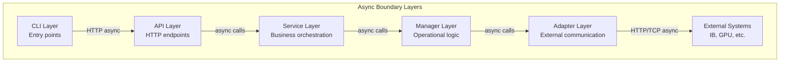

**Async Boundary Rules:**

- **Layer Boundaries**: All calls between layers are async
- **Network I/O**: Any network operation must be async
- **Long Operations**: Operations >1 second must be async with progress
- **Resource Access**: File I/O and database operations are async

### Principle 2: Appropriate Async Usage

Async should be used where it provides benefit, not everywhere by default.

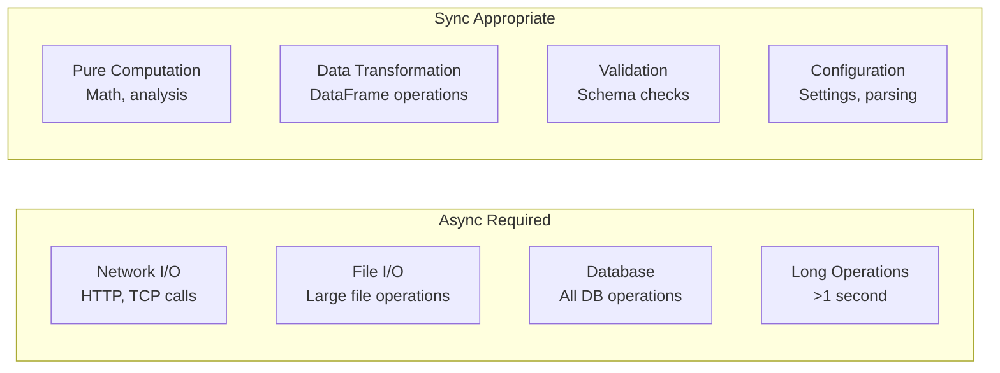

**Usage Guidelines:**

- **Computation**: CPU-bound operations remain synchronous
- **I/O Operations**: Always async for network, file, database
- **Progress Reporting**: Async support but sync-safe interfaces
- **Error Handling**: Sync within components, async across boundaries

### Principle 3: Component Responsibility Separation

Each component has a single, well-defined responsibility with clear async characteristics.

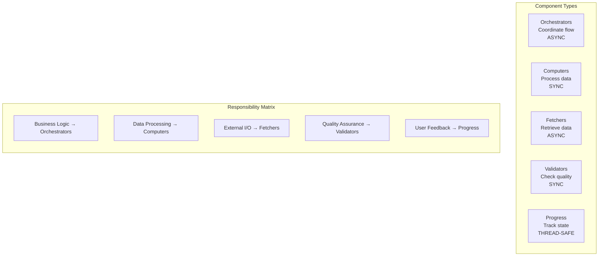

## System-Wide Patterns

### Progress Reporting Pattern

All long-running operations must implement consistent progress reporting.

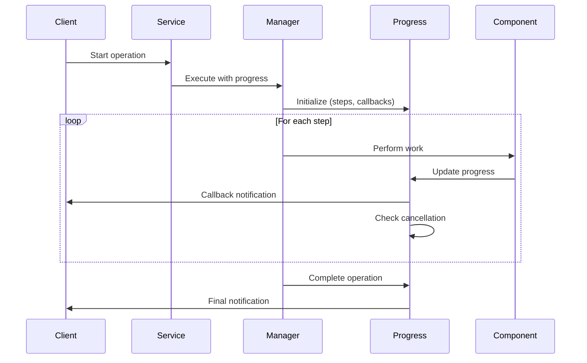

**Progress Specification:**

- **Hierarchical**: Operation → Steps → Sub-steps
- **Thread-safe**: Updates from any thread context
- **Cancellable**: Check cancellation at each level
- **Consistent**: Same interface across all operations

### Error Handling Pattern

Errors flow through consistent exception hierarchy with proper async propagation.

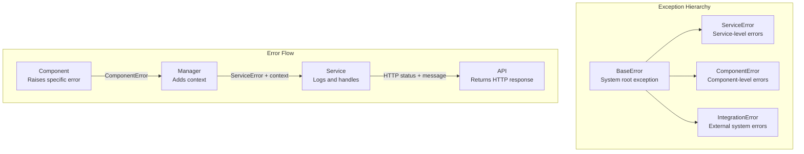

**Error Handling Rules:**

- **Specific Errors**: Components raise specific exceptions
- **Context Addition**: Each layer adds relevant context
- **Logging**: Service layer logs before propagation
- **User-Friendly**: API layer translates to user messages

### Host Service Integration Pattern

External system communication follows consistent host service patterns.

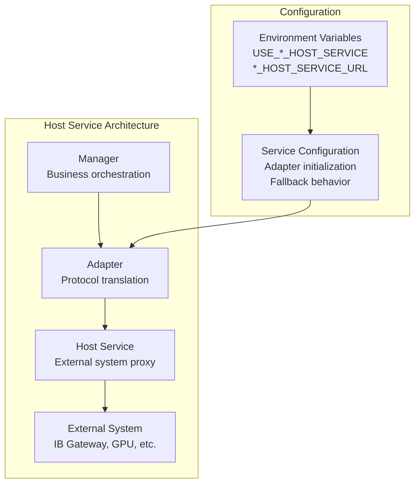

**Host Service Rules:**

- **Environment-Driven**: Configuration via environment variables
- **Fallback Support**: Direct connection when host unavailable
- **Consistent Interface**: Same adapter API regardless of mode
- **Health Monitoring**: Service health checks and recovery

## Data Path Architecture

### Current State Analysis

The data path requires different treatment due to operational complexity.

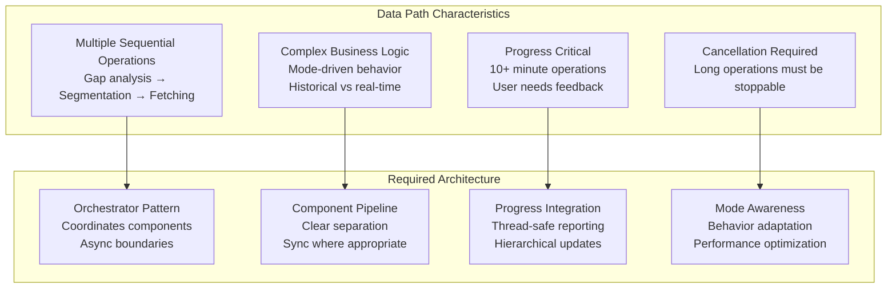

### Data Path Component Specification

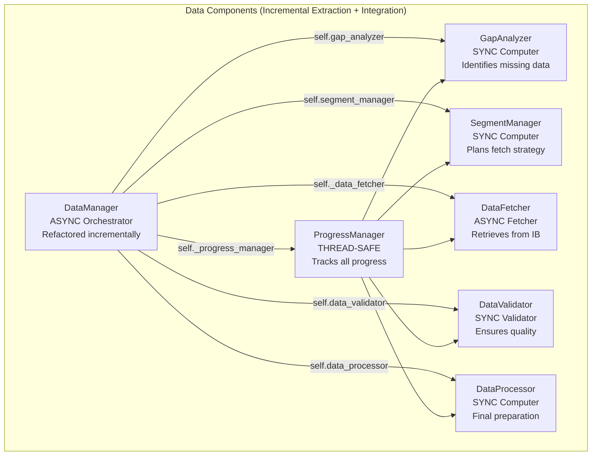

**Component Responsibilities:**

- **DataManager**: Orchestrates pipeline, handles async boundaries
- **GapAnalyzer**: Pure computation to identify missing data ranges
- **SegmentManager**: Pure computation to plan optimal fetch strategy
- **DataFetcher**: Async I/O for external data retrieval
- **DataValidator**: Pure computation for data quality checks
- **DataProcessor**: Pure computation for final data preparation
- **ProgressManager**: Thread-safe progress coordination

### Mode-Driven Behavior Specification

Data loading behavior adapts based on operational mode:

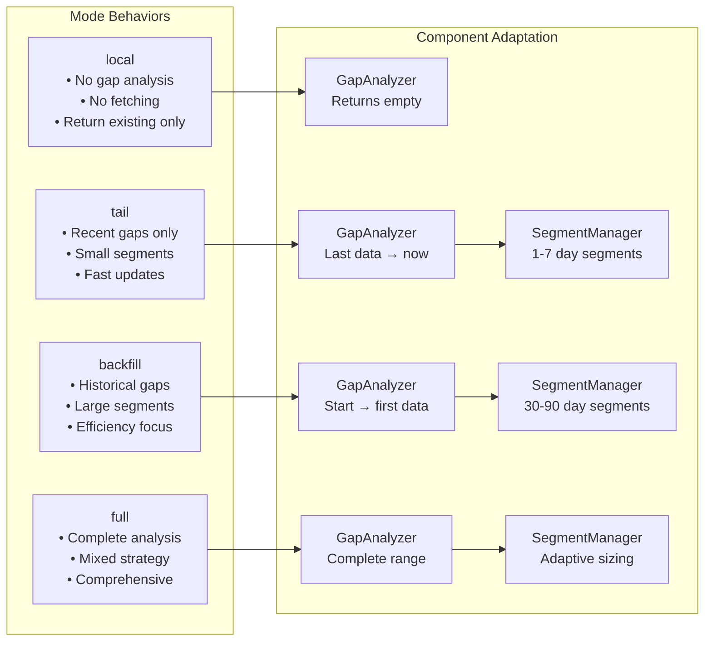

## Training Path Architecture

### Current State Assessment

The training path demonstrates proper async architecture principles.

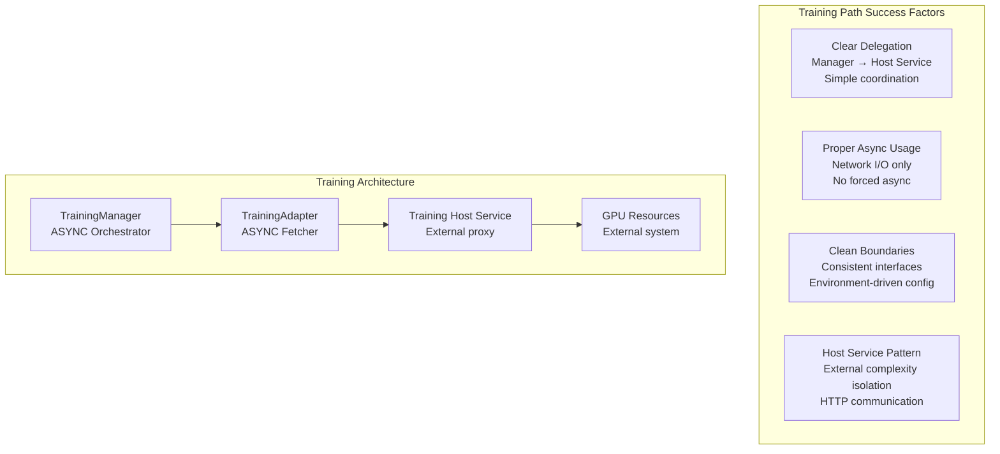

**Training Path Principles (Keep These):**

- **Delegation Model**: Manager delegates complex operations to host service
- **Status Monitoring**: Periodic async checks rather than continuous processing
- **Environment Configuration**: Host service usage controlled by environment
- **Clean Interfaces**: Consistent API regardless of host service vs direct

### Training Path Enhancements

Apply system-wide patterns to training path:

- **Progress Reporting**: Integrate ProgressManager for long training operations
- **Error Standardization**: Use consistent exception hierarchy
- **Cancellation Support**: Enable training operation cancellation
- **Connection Pooling**: Optimize HTTP connections for status polling

## Cross-Path Harmonization

### Shared Infrastructure

Both paths utilize common infrastructure components:

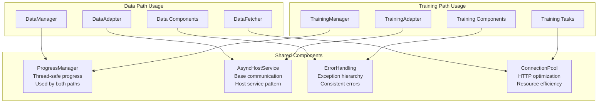

### Pattern Consistency

Both paths follow the same architectural patterns:

| Aspect | Data Path | Training Path | Shared Pattern |
|--------|-----------|---------------|----------------|
| **Orchestration** | DataManager | TrainingManager | Async coordination |
| **External I/O** | DataFetcher | TrainingAdapter | Async communication |
| **Progress** | ProgressManager | ProgressManager | Thread-safe reporting |
| **Errors** | Component → Manager → Service | Component → Manager → Service | Context enrichment |
| **Configuration** | Environment-driven | Environment-driven | Host service pattern |

### Interface Standardization

Common interfaces across both paths:

```python
# Orchestrator Interface
class AsyncOrchestrator:
    async def execute_operation(self, params, progress_callback)
    def get_configuration_info(self) -> dict
    async def health_check(self) -> dict
    
# External Communication Interface  
class AsyncCommunicator:
    async def execute_request(self, request) -> response
    def get_statistics(self) -> dict
    async def health_check(self) -> dict

# Progress Interface
class ProgressReporter:
    def start_operation(self, total_steps, name)
    def update_progress(self, current, total, detail)
    def check_cancelled(self) -> bool
    def complete_operation(self)
```

## Performance Specifications

### Connection Management

All HTTP communication must implement connection pooling:

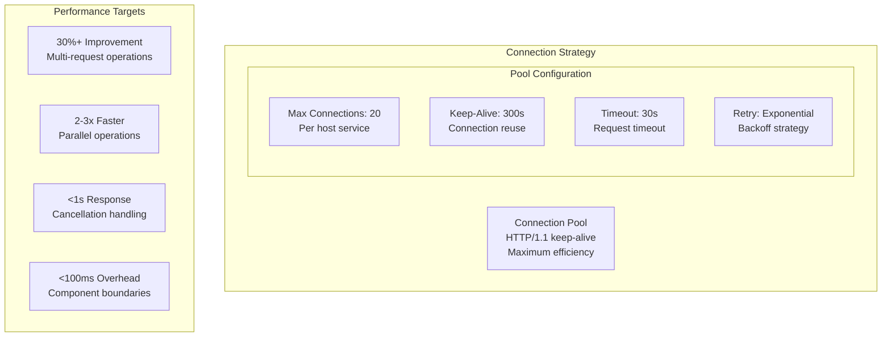

### Cancellation Requirements

All long-running operations must support sub-second cancellation:

- **Check Frequency**: Every I/O operation or 1-second intervals
- **Response Time**: <1 second from cancellation to acknowledgment
- **Clean Shutdown**: Proper resource cleanup on cancellation
- **State Preservation**: Save partial progress where possible

## Quality Requirements

### Testing Specifications

Each component type requires specific testing approaches:

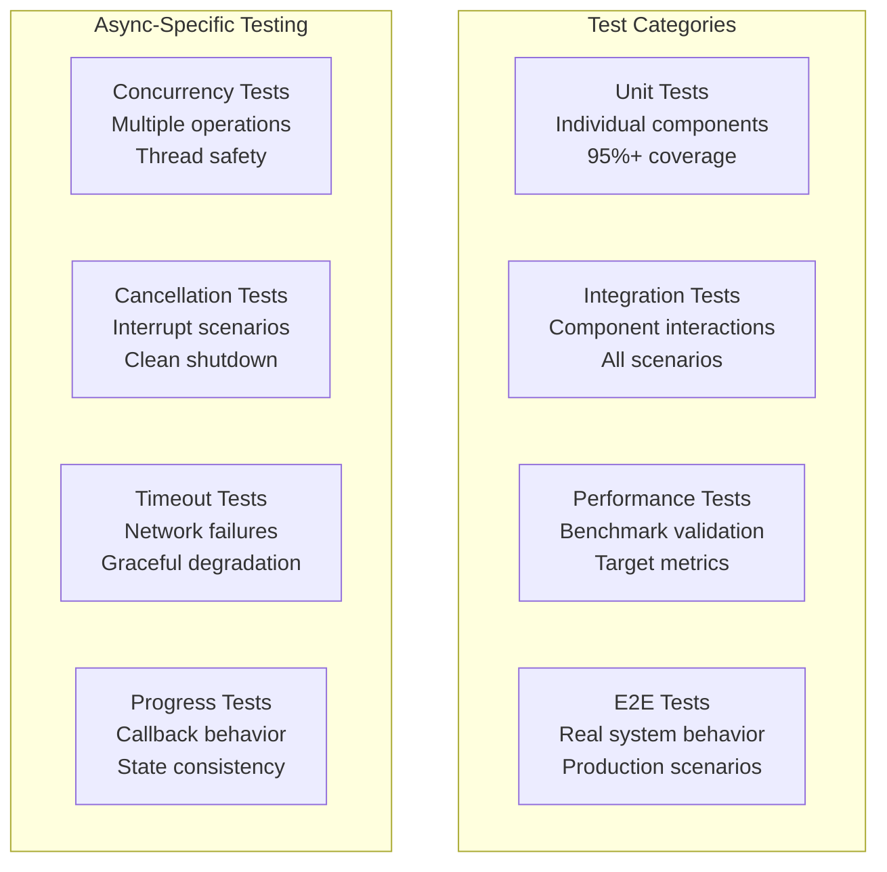

### Code Quality Standards

- **Type Hints**: All async functions must have complete type annotations
- **Documentation**: Async behavior explicitly documented
- **Error Handling**: All async operations must handle cancellation
- **Resource Management**: Proper async context managers for resources

## Migration Specifications

### Compatibility Requirements

During migration, both old and new patterns must coexist:

- **Feature Flags**: Enable/disable new architecture per operation
- **Interface Compatibility**: Existing APIs continue to work
- **Rollback Capability**: Each component can be independently reverted
- **Performance Monitoring**: Continuous comparison of old vs new

### Validation Criteria

Migration success validated through:

- **Functional Parity**: All existing operations work identically
- **Performance Improvement**: Measurable gains in target metrics
- **Error Reduction**: Fewer async-related issues
- **Code Maintainability**: Reduced complexity metrics

## Implementation Guidance for AI

### Component Implementation Patterns

#### ✅ Orchestrator (Async) - Incremental Extraction Pattern

```python
class DataManager(ServiceOrchestrator):
    """GOOD: Incrementally refactored orchestrator with component integration"""
    
    def __init__(self):
        super().__init__()
        # Component extraction + immediate integration
        self.gap_analyzer = GapAnalyzer(gap_classifier=self.gap_classifier)
        self.segment_manager = SegmentManager()
        self._data_fetcher = DataFetcher()  # Lazy initialization
        self.data_validator = DataQualityValidator()
        self._progress_manager = None  # Per-operation initialization
    
    def load_data(self, symbol: str, mode: str, progress_callback=None) -> pd.DataFrame:
        """Delegates to components while maintaining API compatibility"""
        
        # Delegate to _load_with_fallback which uses components
        return self._load_with_fallback(symbol, timeframe, mode=mode, 
                                      progress_callback=progress_callback)
    
    def _load_with_fallback(self, symbol: str, timeframe: str, mode: str, ...) -> pd.DataFrame:
        """Component delegation (already implemented)"""
        
        # 1. Gap analysis delegation (✅ Line 1523 in current code)
        gaps = self.gap_analyzer.analyze_gaps(existing_data, requested_start, 
                                            requested_end, timeframe, symbol, loading_mode)
        
        # 2. Segmentation delegation (✅ Line 1556 in current code)  
        segments = self.segment_manager.create_segments(gaps, DataLoadingMode(mode), timeframe)
        
        # 3. Async fetching delegation (✅ Line 1044 in current code)
        successful_frames = await self._data_fetcher.fetch_segments_async(...)
        
        # 4. Validation delegation (✅ Line 448 in current code)
        df_validated, quality_report = self.data_validator.validate_data(df, symbol, timeframe)
        
        return processed_data
```

#### ❌ Orchestrator Anti-Patterns

```python
class BadDataManager:
    """BAD: Wrong decomposition approaches"""
    
    def __init__(self):
        # ❌ BAD: Creating "new" DataManager instead of refactoring existing
        pass  # Parallel implementation that breaks compatibility
    
    async def load_data(self, symbol: str) -> pd.DataFrame:
        # ❌ BAD: Big-bang replacement instead of incremental extraction
        # ❌ BAD: Not leveraging existing working methods
        # ❌ BAD: Breaking API compatibility during transition
        
        # ❌ BAD: Making sync operation async for no reason
        gaps = await asyncio.to_thread(self.gap_analyzer.analyze_gaps, symbol)
        
        # ❌ BAD: Not integrating components during extraction
        segments = self._old_segmentation_method(gaps)  # God-class method still there
        
        # ❌ BAD: Creating components but not using them
        data = await self.data_fetcher.fetch_segments(segments)
        return self._old_processing_method(data)  # Still using god-class method
```

#### ✅ Async Fetcher - Correct Pattern

```python
class DataFetcher:
    """GOOD: Pure async I/O component with proper error handling"""
    
    def __init__(self):
        self._http_client = None
        self._connection_pool = None
    
    async def fetch_segments(
        self, 
        segments: List[DateSegment], 
        progress: ProgressManager
    ) -> pd.DataFrame:
        """Fetches data with connection pooling and progress"""
        
        results = []
        
        async with self._get_http_client() as client:
            # Process segments with controlled concurrency
            semaphore = asyncio.Semaphore(5)  # Limit concurrent requests
            
            tasks = [
                self._fetch_single_segment(client, segment, progress, semaphore)
                for segment in segments
            ]
            
            # Gather with proper error handling
            segment_results = await asyncio.gather(*tasks, return_exceptions=True)
            
            for i, result in enumerate(segment_results):
                if isinstance(result, Exception):
                    raise DataFetchError(f"Segment {i} failed: {result}") from result
                results.append(result)
        
        return pd.concat(results, ignore_index=True)
    
    async def _fetch_single_segment(
        self, 
        client: httpx.AsyncClient, 
        segment: DateSegment,
        progress: ProgressManager,
        semaphore: asyncio.Semaphore
    ) -> pd.DataFrame:
        """Fetch single segment with retry and cancellation"""
        
        async with semaphore:  # Control concurrency
            for attempt in range(3):  # Retry logic
                try:
                    # Check cancellation before I/O
                    if progress.check_cancelled():
                        raise OperationCancelledError("Fetch cancelled by user")
                    
                    # Actual async I/O operation
                    response = await client.get(
                        f"/data/{segment.symbol}",
                        params=segment.to_params(),
                        timeout=30.0
                    )
                    response.raise_for_status()
                    
                    # Update progress after successful fetch
                    progress.update_step_progress(1, 1, f"Fetched {segment}")
                    
                    return self._parse_response(response)
                    
                except (httpx.TimeoutException, httpx.NetworkError) as e:
                    if attempt == 2:  # Last attempt
                        raise DataFetchError(f"Failed to fetch {segment}") from e
                    
                    # Exponential backoff
                    await asyncio.sleep(2 ** attempt)
```

#### ❌ Fetcher Anti-Patterns

```python
class BadDataFetcher:
    """BAD: Poor async patterns, no error handling"""
    
    async def fetch_segments(self, segments: List[DateSegment]) -> pd.DataFrame:
        # ❌ BAD: No connection pooling, creates client per call
        results = []
        for segment in segments:
            async with httpx.AsyncClient() as client:  # Inefficient!
                response = await client.get(f"/data/{segment}")
                results.append(response.json())  # ❌ No error handling
        
        return pd.DataFrame(results)  # ❌ No validation
```

#### ✅ Sync Computer - Correct Pattern

```python
class GapAnalyzer:
    """GOOD: Pure sync computation with mode awareness"""
    
    def analyze_gaps(
        self, 
        symbol: str, 
        timeframe: str, 
        start_date: str, 
        end_date: str,
        mode: DataLoadingMode
    ) -> List[DateGap]:
        """Pure computation - no I/O, no async needed"""
        
        # Mode-driven behavior
        if mode == DataLoadingMode.LOCAL:
            return []  # No fetching needed
        
        # Get existing data ranges (from local cache/index)
        existing_ranges = self._get_existing_data_ranges(symbol, timeframe)
        
        if mode == DataLoadingMode.TAIL:
            return self._analyze_tail_gaps(existing_ranges, end_date)
        elif mode == DataLoadingMode.BACKFILL:
            return self._analyze_backfill_gaps(existing_ranges, start_date)
        else:  # FULL
            return self._analyze_complete_gaps(existing_ranges, start_date, end_date)
    
    def _analyze_tail_gaps(self, existing: List[DateRange], end_date: str) -> List[DateGap]:
        """Find gaps from last existing data to end_date"""
        if not existing:
            return []  # No existing data, can't determine tail
        
        last_date = max(range.end for range in existing)
        if last_date >= end_date:
            return []  # No gap
        
        return [DateGap(start=last_date, end=end_date, gap_type="tail")]
```

#### ❌ Computer Anti-Patterns

```python
class BadGapAnalyzer:
    """BAD: Unnecessary async, mixed responsibilities"""
    
    async def analyze_gaps(self, symbol: str) -> List[DateGap]:
        # ❌ BAD: Making pure computation async
        await asyncio.sleep(0)  # Pointless async
        
        # ❌ BAD: Doing I/O in computation component
        async with httpx.AsyncClient() as client:
            existing = await client.get(f"/data/{symbol}")  # Wrong layer!
        
        # ❌ BAD: No mode awareness, hardcoded behavior
        return self._find_all_gaps(existing.json())
```

### Decision Tree for Async Usage

```mermaid
flowchart TD
    START[Component Decision] --> IO{Does it perform I/O?}
    
    IO -->|Yes| NETWORK{Network I/O?}
    IO -->|No| COMPUTE[Keep Sync<br/>Pure computation]
    
    NETWORK -->|Yes| ASYNC1[Make Async<br/>Use connection pooling]
    NETWORK -->|No| FILE{File I/O?}
    
    FILE -->|Yes| SIZE{Large files or<br/>slow operations?}
    FILE -->|No| COMPUTE
    
    SIZE -->|Yes| ASYNC2[Make Async<br/>Use aiofiles]
    SIZE -->|No| SYNC1[Keep Sync<br/>Small/fast files OK]
    
    COMPUTE --> TIME{Long computation<br/>>1 second?}
    
    TIME -->|Yes| THREAD[Keep Sync<br/>Wrap in asyncio.to_thread()]
    TIME -->|No| SYNC2[Keep Sync<br/>Direct call]
    
    ASYNC1 --> PROGRESS1[Add Progress Reporting]
    ASYNC2 --> PROGRESS2[Add Progress Reporting] 
    THREAD --> PROGRESS3[Add Progress Reporting]
```

### Validation Checklist for AI Implementation

#### Component Validation

**Orchestrator Components Must:**
- [ ] Have async `execute_*` methods for main operations
- [ ] Use sync initialization (`__init__`)
- [ ] Coordinate other components, not implement business logic
- [ ] Include progress reporting for operations >1 second
- [ ] Handle cancellation gracefully
- [ ] Follow error propagation patterns

**Computer Components Must:**
- [ ] Be purely synchronous (no async/await)
- [ ] Perform single, well-defined computation
- [ ] Have no I/O operations (network, file, database)
- [ ] Be deterministic given same inputs
- [ ] Include mode awareness where applicable
- [ ] Have comprehensive unit tests

**Fetcher Components Must:**
- [ ] Be purely async with proper connection management
- [ ] Use connection pooling for HTTP operations
- [ ] Include retry logic with exponential backoff
- [ ] Report progress for long operations
- [ ] Handle cancellation at I/O boundaries
- [ ] Raise specific exceptions with context

#### Architecture Validation

**Async Boundary Validation:**
```python
# ✅ GOOD: Clear async boundaries
async def service_method(self):
    result = await self.manager.async_operation()  # Async boundary
    return result

def sync_computation(self, data):
    return self.computer.process(data)  # Sync boundary

# ❌ BAD: Mixed boundaries
def mixed_method(self):
    result = asyncio.run(self.manager.async_operation())  # Wrong!
    return result
```

**Progress Integration Validation:**
```python
# ✅ GOOD: Hierarchical progress
async def orchestrator_method(self, callback=None):
    progress = ProgressManager(callback)
    progress.start_operation(total_steps=3, name="Data Loading")
    
    # Each major step reports progress
    progress.start_step("Analyzing", step=1)
    gaps = self.analyzer.analyze()  # Component updates progress
    
    progress.start_step("Fetching", step=2) 
    data = await self.fetcher.fetch(segments, progress)  # Passes progress
    
    progress.complete_operation()
    return data

# ❌ BAD: No progress or inconsistent progress
async def bad_method(self):
    gaps = self.analyzer.analyze()  # No progress
    data = await self.fetcher.fetch(segments)  # No progress
    return data
```

### Common Implementation Mistakes

#### Mistake 1: Over-Async
```python
# ❌ BAD: Making everything async
class BadComponent:
    async def __init__(self):  # Wrong! Init should be sync
        self.value = await self.compute_value()
    
    async def simple_getter(self):  # Wrong! Property access
        return await asyncio.to_thread(lambda: self._value)

# ✅ GOOD: Async only where needed
class GoodComponent:
    def __init__(self):  # Sync initialization
        self.value = self._compute_value()
    
    def simple_getter(self):  # Sync property access
        return self._value
    
    async def fetch_external_data(self):  # Async for I/O
        return await self.http_client.get("/data")
```

#### Mistake 2: Blocking the Event Loop
```python
# ❌ BAD: Sync I/O in async context
async def bad_fetch(self):
    response = requests.get("http://api.com/data")  # Blocks event loop!
    return response.json()

# ✅ GOOD: Proper async I/O
async def good_fetch(self):
    async with self.http_client.get("http://api.com/data") as response:
        return await response.json()
```

#### Mistake 3: Poor Error Context
```python
# ❌ BAD: Lost error context
async def bad_operation(self):
    try:
        return await self.external_call()
    except Exception:
        return None  # Lost all error information

# ✅ GOOD: Preserved error context
async def good_operation(self):
    try:
        return await self.external_call()
    except httpx.TimeoutException as e:
        raise ServiceConnectionError(
            f"Timeout connecting to external service: {e}"
        ) from e
    except Exception as e:
        raise ServiceError(
            f"Unexpected error in operation: {e}"
        ) from e
```

## Conclusion

This specification establishes the architectural foundation for consistent async patterns across KTRDR. By defining clear principles, component responsibilities, and cross-path harmonization, the architecture enables:

- **Consistency**: Both data and training paths follow the same patterns
- **Performance**: Appropriate async usage with connection optimization
- **Maintainability**: Clear separation of concerns and shared infrastructure
- **Scalability**: Foundation for concurrent operations and future growth

The implementation guidance provides concrete examples and anti-patterns to ensure AI systems can build components that follow these architectural principles correctly.