# KTRDR Unified Async Architecture Specification

## Executive Summary

This specification defines a **generic, reusable async orchestration system** for KTRDR that enables consistent async patterns across ALL subsystems. The architecture separates generic async infrastructure from domain-specific logic, allowing both data and training systems to benefit from shared async capabilities while maintaining their unique requirements.

## 🎯 **CORE ARCHITECTURAL PRINCIPLE**

**Generic Infrastructure + Domain-Specific Integration Points**

The async system provides generic capabilities (progress tracking, cancellation, host service communication) with minimal, well-defined integration points for domain-specific needs.

## System Architecture Overview


## 🏛️ **GENERIC ASYNC INFRASTRUCTURE**

### 1. AsyncOrchestrationFramework

**Location**: `ktrdr/async/orchestration.py`

The central orchestrator that manages async operations across all domains.

```python
@dataclass
class AsyncOperation:
    """Generic async operation definition."""
    operation_id: str
    operation_type: str  # "data_load", "model_train", etc.
    total_steps: int
    estimated_duration: Optional[timedelta] = None
    context: dict[str, Any] = field(default_factory=dict)
    
class AsyncOrchestrationFramework:
    """Generic async task orchestration for all KTRDR subsystems."""
    
    def __init__(self, 
                 progress_manager: GenericProgressManager,
                 cancellation_system: CancellationSystem,
                 host_service: Optional[AsyncHostService] = None):
        self.progress_manager = progress_manager
        self.cancellation_system = cancellation_system
        self.host_service = host_service
        
    async def execute_operation(self,
                              operation: AsyncOperation,
                              operation_func: Callable,
                              progress_renderer: Optional[ProgressRenderer] = None) -> Any:
        """Execute any async operation with full orchestration support."""
        # Setup cancellation
        # Setup progress tracking with custom renderer
        # Execute with error handling and cleanup
        # Return results
```

### 2. GenericProgressManager

**Location**: `ktrdr/async/progress.py`

Domain-agnostic progress tracking with customizable rendering.

```python
@dataclass
class GenericProgressState:
    """Generic progress state - no domain knowledge."""
    operation_id: str
    current_step: int
    total_steps: int
    percentage: float
    message: str
    start_time: datetime
    estimated_remaining: Optional[timedelta] = None
    
    # Generic item tracking
    items_processed: int = 0
    total_items: Optional[int] = None
    
    # Generic context - domain defines content
    context: dict[str, Any] = field(default_factory=dict)

class ProgressRenderer(ABC):
    """Abstract progress renderer for domain-specific display."""
    
    @abstractmethod
    def render_progress_message(self, state: GenericProgressState) -> str:
        """Render progress message for this domain."""
        pass
    
    @abstractmethod
    def render_step_detail(self, state: GenericProgressState) -> str:
        """Render step-specific detail for this domain."""
        pass

class GenericProgressManager:
    """Domain-agnostic progress manager."""
    
    def __init__(self, 
                 callback: Optional[Callable[[GenericProgressState], None]] = None,
                 renderer: Optional[ProgressRenderer] = None):
        self.callback = callback
        self.renderer = renderer
        
    def start_operation(self, operation: AsyncOperation) -> None:
        """Start tracking any operation type."""
        pass
        
    def update_progress(self, 
                       current_step: int, 
                       message: str,
                       items_processed: int = 0,
                       context: dict[str, Any] = None) -> None:
        """Update progress with domain-agnostic information."""
        # Update internal state
        # Use renderer to create display message if provided
        # Trigger callback
```

### 3. CancellationSystem

**Location**: `ktrdr/async/cancellation.py`

Universal cancellation system for all async operations.

```python
class CancellationSystem:
    """Universal cancellation for all async operations."""
    
    def create_cancellation_token(self) -> CancellationToken:
        """Create a new cancellation token."""
        
    def cancel_operation(self, operation_id: str) -> bool:
        """Cancel a specific operation."""
        
    def cancel_all_operations(self) -> int:
        """Cancel all active operations."""

class CancellationToken:
    """Generic cancellation token."""
    
    def is_cancelled(self) -> bool:
        """Check if cancellation was requested."""
        
    def check_cancellation_point(self, operation_name: str = "operation") -> None:
        """Check for cancellation and raise if needed."""
```

### 4. AsyncHostService (Enhanced)

**Location**: `ktrdr/async/host_service.py`

Generic host service communication without domain coupling.

```python
class AsyncHostService(ABC):
    """Generic host service base - no domain knowledge."""
    
    @abstractmethod
    def get_service_name(self) -> str:
        """Service identifier."""
        
    @abstractmethod
    def get_base_url(self) -> str:
        """Service base URL."""
        
    # Remove all domain-specific cancellation token integration
    # Cancellation handled by CancellationSystem
```

## 🔗 **DOMAIN INTEGRATION LAYER**

### Data Domain Integration

**Location**: `ktrdr/data/async/`

```python
class DataProgressRenderer(ProgressRenderer):
    """Renders progress for data operations."""
    
    def render_progress_message(self, state: GenericProgressState) -> str:
        context = state.context
        symbol = context.get('symbol', 'Unknown')
        timeframe = context.get('timeframe', 'Unknown')
        mode = context.get('mode', 'Unknown')
        
        return f"{state.message} ({symbol} {timeframe}, {mode} mode)"
    
    def render_step_detail(self, state: GenericProgressState) -> str:
        # Data-specific step detail rendering
        pass

class DataDomainInterface:
    """Bridges data operations to generic async framework."""
    
    def __init__(self, orchestrator: AsyncOrchestrationFramework):
        self.orchestrator = orchestrator
        self.progress_renderer = DataProgressRenderer()
        
    async def execute_data_load(self, 
                               symbol: str,
                               timeframe: str,
                               mode: str,
                               progress_callback: Optional[Callable] = None) -> pd.DataFrame:
        """Execute data load using generic async framework."""
        
        operation = AsyncOperation(
            operation_id=f"data_load_{symbol}_{timeframe}",
            operation_type="data_load",
            total_steps=5,  # Data-specific knowledge
            context={
                'symbol': symbol,
                'timeframe': timeframe,
                'mode': mode
            }
        )
        
        return await self.orchestrator.execute_operation(
            operation=operation,
            operation_func=self._perform_data_load,
            progress_renderer=self.progress_renderer
        )
    
    async def _perform_data_load(self, operation: AsyncOperation, progress_manager: GenericProgressManager) -> pd.DataFrame:
        """Actual data loading logic using generic progress manager."""
        # Use progress_manager.update_progress() with data-specific context
        # All domain logic here, no generic contamination
```

### Training Domain Integration

**Location**: `ktrdr/training/async/`

```python
class TrainingProgressRenderer(ProgressRenderer):
    """Renders progress for training operations."""
    
    def render_progress_message(self, state: GenericProgressState) -> str:
        context = state.context
        model_type = context.get('model_type', 'Unknown')
        symbols = context.get('symbols', [])
        
        symbol_str = ', '.join(symbols[:2]) + ('...' if len(symbols) > 2 else '')
        return f"{state.message} ({model_type} on {symbol_str})"

class TrainingDomainInterface:
    """Bridges training operations to generic async framework."""
    
    def __init__(self, orchestrator: AsyncOrchestrationFramework):
        self.orchestrator = orchestrator
        self.progress_renderer = TrainingProgressRenderer()
        
    async def execute_training(self,
                              config: TrainingConfig,
                              progress_callback: Optional[Callable] = None) -> TrainingResult:
        """Execute training using generic async framework."""
        
        operation = AsyncOperation(
            operation_id=f"train_{config.model_type}_{len(config.symbols)}",
            operation_type="model_train", 
            total_steps=4,  # Training-specific knowledge
            context={
                'model_type': config.model_type,
                'symbols': config.symbols,
                'timeframes': config.timeframes
            }
        )
        
        return await self.orchestrator.execute_operation(
            operation=operation,
            operation_func=self._perform_training,
            progress_renderer=self.progress_renderer
        )
```

## 🎯 **KEY DESIGN PRINCIPLES**

### 1. **Generic Infrastructure**
- No domain knowledge in core async components
- Reusable across data, training, and future subsystems
- Clean separation of concerns

### 2. **Domain Integration Points**
- Each domain provides its own `ProgressRenderer`
- Domain-specific context passed through generic `context` dict
- Domain logic isolated in integration layer

### 3. **Consistent Patterns**
- Same async patterns across all subsystems
- Shared cancellation and progress tracking
- Common host service communication

### 4. **Easy Extension**
- New domains can be added without changing core infrastructure
- Domain-specific needs met through integration layer
- No breaking changes to existing systems

## 🔄 **VERTICAL SLICE MIGRATION STRATEGY**

### **Core Principle: Build Small, Test Immediately, Integrate Continuously**

This migration uses **complete vertical slices** that build one piece of infrastructure while integrating it immediately with working functionality.

### Slice 1: Generic Progress Foundation (Week 1)
1. Build minimal `GenericProgressManager` with `ProgressRenderer` abstraction
2. Create `DataProgressRenderer` for data-specific message formatting
3. Integrate with **one DataManager method** (`load_data()`)
4. **Deliverable**: Working generic progress with enhanced data operation messages

### Slice 2: Cancellation System Integration (Week 2)  
1. Build minimal `CancellationSystem` and `CancellationToken`
2. Integrate cancellation with `GenericProgressManager`
3. Add cancellation support to **same DataManager method**
4. **Deliverable**: Cancellable data operations with sub-second response

### Slice 3: Orchestration Framework (Week 3)
1. Build minimal `AsyncOrchestrationFramework`
2. Create `AsyncOperation` definitions for operation coordination
3. Update **same DataManager method** to use orchestration
4. **Deliverable**: Complete orchestrated execution for data operations

### Slice 4: Training System Integration (Week 4)
1. Create `TrainingProgressRenderer` using same patterns as data
2. Build `TrainingDomainInterface` using existing orchestration
3. Integrate with **one TrainingManager method**
4. **Deliverable**: Training system automatically gets all async benefits

### Slice 5: Host Service Integration (Week 5)
1. Extract generic parts from current `AsyncHostService`
2. Remove domain coupling, use `CancellationSystem`
3. Both data and training benefit from shared connection pooling
4. **Deliverable**: Complete generic async infrastructure serving both systems

### **Vertical Slice Benefits**
- **Working code every week** - each slice delivers immediate value
- **Continuous testing** - never break existing functionality  
- **Early validation** - catch architectural issues when small
- **Flexible timeline** - can pause after any slice with improved system
- **Risk reduction** - small changes, immediate feedback

## ✅ **SUCCESS CRITERIA**

### Generic Infrastructure Success
- [ ] No domain knowledge in core async components
- [ ] Both data and training systems use same infrastructure
- [ ] Easy to add new domains without core changes
- [ ] Consistent async patterns across all systems

### Data System Success
- [ ] All existing data functionality preserved
- [ ] Better progress reporting through domain renderer
- [ ] Improved async performance
- [ ] Clean separation from generic infrastructure

### Training System Success  
- [ ] Training operations use same async patterns as data
- [ ] Training-specific progress reporting
- [ ] Benefits from connection pooling and cancellation
- [ ] No duplicate async infrastructure

### Performance Success
- [ ] 30%+ improvement in multi-request operations
- [ ] Sub-second cancellation response
- [ ] Consistent connection pooling benefits
- [ ] Reduced memory usage from shared infrastructure

## 🔧 **IMPLEMENTATION GUIDELINES**

### DO: Generic Infrastructure
```python
# ✅ Generic progress manager
class GenericProgressManager:
    def update_progress(self, step: int, message: str, context: dict[str, Any] = None):
        # No domain knowledge, uses renderer for display
        
# ✅ Domain-specific renderer
class DataProgressRenderer(ProgressRenderer):
    def render_progress_message(self, state: GenericProgressState) -> str:
        return f"Loading {state.context['symbol']} data: {state.message}"
```

### DON'T: Domain Coupling
```python
# ❌ Domain knowledge in generic component
class GenericProgressManager:
    def update_data_progress(self, symbol: str, timeframe: str):
        # Domain knowledge contamination!
        
# ❌ Duplicate infrastructure per domain
class DataProgressManager:  # Separate from TrainingProgressManager
    # Duplicated async patterns
```

## 📁 **DIRECTORY STRUCTURE**

```
ktrdr/
├── async/                          # 🏗️ Generic async infrastructure
│   ├── orchestration.py            # AsyncOrchestrationFramework
│   ├── progress.py                  # GenericProgressManager, ProgressRenderer
│   ├── cancellation.py             # CancellationSystem, CancellationToken  
│   ├── host_service.py             # Enhanced AsyncHostService
│   └── task_manager.py             # AsyncTaskManager
│
├── data/
│   ├── async/                      # 📊 Data domain async integration
│   │   ├── data_domain_interface.py  # DataDomainInterface
│   │   ├── data_progress_renderer.py # DataProgressRenderer
│   │   └── data_system_connector.py  # DataManager integration
│   ├── components/                 # Data-specific components (no async infrastructure)
│   └── data_manager.py            # Uses DataDomainInterface
│
├── training/
│   ├── async/                      # 🧠 Training domain async integration  
│   │   ├── training_domain_interface.py  # TrainingDomainInterface
│   │   ├── training_progress_renderer.py # TrainingProgressRenderer
│   │   └── training_system_connector.py  # TrainingManager integration
│   └── training_manager.py        # Uses TrainingDomainInterface
│
└── interfaces/                     # 🖥️ CLI/API async patterns
    ├── cli_async_patterns.py       # CLI async integration
    └── api_async_patterns.py       # API async integration
```

## 🎉 **BENEFITS OF NEW ARCHITECTURE**

### 1. **True Reusability**
- One async infrastructure serves all systems
- No duplicate code or patterns
- Easy to add new domains

### 2. **Clean Separation**  
- Generic infrastructure has zero domain knowledge
- Domain logic cleanly separated
- Easy to understand and maintain

### 3. **Consistent User Experience**
- Same progress patterns across data and training
- Consistent cancellation behavior  
- Unified CLI/API async patterns

### 4. **Performance Gains**
- Shared connection pooling
- Optimized async patterns
- Reduced memory footprint

### 5. **Future-Proof Design**
- Easy to add new subsystems
- Generic patterns scale to any domain
- No architectural refactoring needed for expansion

This architecture transforms the current tightly-coupled system into a properly layered, reusable async infrastructure that serves all of KTRDR's needs while maintaining clean separation of concerns.

## 🌊 **END-TO-END INTEGRATION FLOWS**

### Complete Data Operation Flow: CLI → DataManager → IB Host Service


### Complete Training Operation Flow: CLI → TrainingManager → Training Host Service


### Unified Connection Pooling Flow


### Cancellation Propagation Flow


### Multi-System Progress Rendering

```mermaid
graph LR
    subgraph "📊 Generic Progress State"
        GPS[GenericProgressState<br/>• operation_id<br/>• current_step<br/>• percentage<br/>• context dict<br/>• message]
    end
    
    subgraph "🎨 Domain Renderers"
        DPR[DataProgressRenderer<br/>render_message()]
        TPR[TrainingProgressRenderer<br/>render_message()]
        CPR[CustomProgressRenderer<br/>render_message()]
    end
    
    subgraph "📱 Display Outputs"
        DC[Data Context<br/>"Loading AAPL 1h data<br/>(backfill mode) [3/5]"]
        TC[Training Context<br/>"Training MLP on AAPL, GOOGL<br/>[1h, 4h] epoch 15/50"]
        CC[Custom Context<br/>"Processing indicators<br/>RSI, MACD, Bollinger"]
    end
    
    GPS --> DPR
    GPS --> TPR
    GPS --> CPR
    
    DPR --> DC
    TPR --> TC
    CPR --> CC
    
    GPS -.->|context: symbol, timeframe, mode| DPR
    GPS -.->|context: model_type, symbols, epochs| TPR
    GPS -.->|context: indicators, timeframes| CPR
```

### Connection Pool Optimization Flow

```mermaid
graph TB
    subgraph "🚀 Performance Benefits"
        PB1[30%+ Faster Operations<br/>Connection reuse eliminates<br/>TCP handshake overhead]
        PB2[2-3x Better Concurrency<br/>Parallel requests share<br/>connection pool efficiently]
        PB3[<1s Cancellation Response<br/>Shared cancellation system<br/>propagates instantly]
    end
    
    subgraph "🔄 Connection Lifecycle"
        CC[Connection Creation<br/>HTTP/1.1 with keep-alive<br/>Max 20 connections per host]
        CR[Connection Reuse<br/>Multiple requests share<br/>established connections]
        CM[Connection Management<br/>Auto-cleanup after 300s idle<br/>Health monitoring]
    end
    
    subgraph "📈 Scaling Benefits"
        SB1[Horizontal Scaling<br/>Same patterns work for<br/>any number of operations]
        SB2[Resource Efficiency<br/>Shared infrastructure<br/>reduces memory footprint]
        SB3[Future Extensibility<br/>New systems automatically<br/>benefit from optimizations]
    end
    
    CC --> CR
    CR --> CM
    CM --> CC
    
    CR --> PB1
    CM --> PB2
    CC --> PB3
    
    PB1 --> SB1
    PB2 --> SB2
    PB3 --> SB3
```



### Error Propagation and Recovery Flow


### Integration Validation Flow


These diagrams demonstrate how the new generic async infrastructure creates a unified system where:

1. **CLI commands** route through the same orchestration framework
2. **Progress reporting** is enhanced but consistent across domains  
3. **Cancellation** propagates cleanly through all layers
4. **Connection pooling** benefits all external service communication
5. **Error handling** provides rich context while maintaining clean separation
6. **Integration validation** ensures each slice works before moving to the next

The key insight is that both data and training operations flow through the **exact same infrastructure** but with **domain-specific rendering and context**, achieving true reusability while maintaining domain expertise.