# DataService → ServiceOrchestrator Transformation Plan

## 🎯 Overview

This document outlines the complete transformation to eliminate 315+ lines of redundant async orchestration from the DataService layer by properly leveraging the existing ServiceOrchestrator infrastructure in DataManager.

## 🏗️ TARGET ARCHITECTURE

### Current Architecture (Problems)


### Target Architecture (Solution)

```mermaid
graph TD
    A["API Endpoint<br/>ktrdr/api/endpoints/data.py"] --> B["DataService<br/>~400 lines (60% reduction)"]
    B --> C["Thin API adapter methods:"]
    C --> D["load_data() → delegates"]
    C --> E["get_available_symbols() → metadata"]
    C --> F["_convert_df_to_api_format() → helper"]
    
    B --> G["DataManager<br/>Enhanced ServiceOrchestrator"]
    G --> H["load_data_async()<br/>uses start_managed_operation()"]
    G --> I["_run_data_load_async()<br/>pure domain logic"]
    G --> J["DataProgressRenderer<br/>Perfect progress through ServiceOrchestrator"]
    
    K["SOLUTION: Single orchestration layer<br/>in DataManager (like DummyService)"] --> G
```



## 📋 **EXECUTIVE SUMMARY OF CHANGES**

### **What We're Transforming:**

1. **DataManager Enhancement (ktrdr/data/data_manager.py)**: 
   - Add `load_data_async()` method using `start_managed_operation()` (like DummyService)
   - Add `_run_data_load_async()` method containing pure domain logic
   - Add `_format_api_response()` method for consistent API formatting
   
2. **DataService Simplification (ktrdr/api/services/data_service.py)**: 
   - Remove 315+ lines of redundant orchestration methods
   - Transform remaining methods into simple delegates to DataManager
   - Keep API-specific helpers like `_convert_df_to_api_format()`
   
3. **API Endpoints (ktrdr/api/endpoints/data.py)**: 
   - Update to use consistent enhanced DataManager patterns
   - Eliminate direct bypass patterns like `data_service.data_manager.load_data()`

### **Files That Will Change:**

- **`ktrdr/data/data_manager.py`**: Add 2 new methods (~50 lines)
  - `load_data_async()`: ServiceOrchestrator entry point
  - `_run_data_load_async()`: Domain logic implementation
  - `_format_api_response()`: API formatting helper
  
- **`ktrdr/api/services/data_service.py`**: Remove 3 complex methods (315+ lines), simplify remaining methods
  - **DELETE**: `start_data_loading_operation()` (62 lines)
  - **DELETE**: `_run_data_loading_operation()` (76 lines)
  - **DELETE**: `_cancellable_data_load()` (177 lines)
  - **SIMPLIFY**: `load_data()` becomes simple delegate
  
- **`ktrdr/api/endpoints/data.py`**: Update calls to use consistent patterns (minimal changes)
  - Replace direct bypass patterns with proper delegation
  - Standardize all data loading calls

### **Benefits:**

- **60% code reduction** in DataService (1001 → ~400 lines)
- **Unified orchestration** - only DataManager handles async complexity
- **Perfect progress display** - DataProgressRenderer through ServiceOrchestrator
- **Consistent patterns** - DataManager follows same pattern as DummyService

## 🔍 CRITICAL FINDINGS FROM COMPREHENSIVE RESEARCH

### The Real Problem: Layer Redundancy, Not Missing ServiceOrchestrator

**DISCOVERY**: DataManager **ALREADY inherits from ServiceOrchestrator** (line 56) and has:
- ✅ DataProgressRenderer integration (397 lines of sophisticated progress handling)  
- ✅ ServiceOrchestrator cancellation with `execute_with_cancellation()`
- ✅ Sophisticated async patterns with `_run_async_method()`
- ❌ BUT uses lower-level patterns instead of `start_managed_operation()`

**THE REAL ISSUE**: DataService class has 315+ lines of **REDUNDANT orchestration**:

- **`DataService.start_data_loading_operation()`** (62 lines) - Manual operations service integration
- **`DataService._run_data_loading_operation()`** (76 lines) - ThreadPoolExecutor orchestration
- **`DataService._cancellable_data_load()`** (177 lines) - Custom progress polling and cancellation

**All these methods just to call `self.data_manager.load_data()`!** This is exactly what `ServiceOrchestrator.start_managed_operation()` provides automatically.

## 📊 Architecture Analysis

### Current Redundant Flow:
```
API Request → DataService (315+ lines orchestration) → DataManager (ServiceOrchestrator)
```

### Target Efficient Flow:
```
API Request → DataService (thin adapter) → DataManager (enhanced ServiceOrchestrator)
```

## 🚨 Current State Analysis

### DataService Class: Redundant Orchestration (315+ lines)

**What needs to be eliminated from DataService class:**

#### Manual ThreadPoolExecutor Management (in `_cancellable_data_load()`):
```python
with concurrent.futures.ThreadPoolExecutor(max_workers=1) as executor:
    future = executor.submit(run_data_load)
    result = await asyncio.wrap_future(future)
```

#### Custom Progress Callback System (in `_cancellable_data_load()`):
```python
def progress_callback_fn(progress_state):
    operation_progress = OperationProgress(...)
    last_progress[0] = (operation_progress, [], [])

async def update_progress_periodically():
    while not (cancellation_token and cancellation_token.is_cancelled()):
        # Manual progress polling...
```

#### Manual Operations Service Integration (in `start_data_loading_operation()`):
```python
operation = await self.operations_service.create_operation(...)
task = asyncio.create_task(self._run_data_loading_operation(...))
await self.operations_service.start_operation(operation_id, task)
```

**ALL OF THIS is what ServiceOrchestrator.start_managed_operation() provides automatically!**

### DataManager Class: Already Has ServiceOrchestrator

**What DataManager class already has (GOOD foundation):**
```python
class DataManager(ServiceOrchestrator):  # ✅ Already inherits!
    
    async def _load_data_with_cancellation_async(self, ...):
        return await self.execute_with_cancellation(  # ✅ Uses ServiceOrchestrator
            operation=data_loading_operation(),
            cancellation_token=effective_token,
            operation_name=f"Loading {symbol} {timeframe} data",
        )
```

**What DataManager class should do** (following DummyService pattern):
```python
async def load_data_async(self, symbol: str, timeframe: str, ...):
    return await self.start_managed_operation(  # ✅ Like DummyService!
        operation_name="data_load",
        operation_type="DATA_LOAD", 
        operation_func=self._run_data_load_async,
        symbol=symbol, timeframe=timeframe, ...
    )
```  

## 🎯 Comprehensive Transformation Strategy

### Phase 1: Enhance DataManager ServiceOrchestrator Patterns

**Goal**: Upgrade DataManager class to use `start_managed_operation()` like DummyService

**What needs to be changed:** DataManager class currently uses lower-level ServiceOrchestrator patterns that need to be upgraded to the higher-level `start_managed_operation()` pattern.

**Current DataManager Pattern (Good but not optimal):**
```python
# Uses lower-level ServiceOrchestrator patterns
return await self.execute_with_cancellation(
    operation=data_loading_operation(),
    cancellation_token=effective_token,
    operation_name=f"Loading {symbol} {timeframe} data",
)
```

**Enhanced Pattern (Following DummyService):**

This shows what we'll add to DataManager class:
```python
async def load_data_async(self, symbol: str, timeframe: str, ...):
    """Load data using start_managed_operation like DummyService."""
    return await self.start_managed_operation(
        operation_name="data_load",
        operation_type="DATA_LOAD", 
        operation_func=self._run_data_load_async,
        symbol=symbol, timeframe=timeframe, ...
    )

async def _run_data_load_async(self, symbol: str, timeframe: str, ...):
    """Pure domain logic - orchestrate DataManager components."""
    # Use existing DataManager components but with ServiceOrchestrator progress
    # Current _load_data_core_logic becomes this method
    return self._load_data_core_logic(...)
```

### Phase 2: Eliminate DataService Orchestration Complexity

**Goal**: Remove 315+ lines of redundant orchestration from DataService class

**What needs to be done:** Transform DataService from complex orchestrator to thin API adapter.

**ELIMINATE These DataService Class Methods (315+ lines):**

- ❌ **`DataService.start_data_loading_operation()`** (62 lines)
  - *Why eliminate:* Manually creates operations and manages async tasks - ServiceOrchestrator does this
  - *What it does:* Creates operation metadata, starts background tasks, registers with operations service
  
- ❌ **`DataService._run_data_loading_operation()`** (76 lines)
  - *Why eliminate:* Manual ThreadPoolExecutor orchestration - ServiceOrchestrator handles this
  - *What it does:* Wraps sync DataManager calls in executor, handles results
  
- ❌ **`DataService._cancellable_data_load()`** (177 lines)
  - *Why eliminate:* Custom cancellation and progress polling - ServiceOrchestrator provides this
  - *What it does:* Manual progress callbacks, cancellation token coordination, error handling

**KEEP These DataService Class Methods (simplified):**

- ✅ **`DataService.load_data()`** → Transform to simple delegation to DataManager
  - *Why keep:* API entry point, but simplify from 70+ lines to ~5 lines
  - *What changes:* Remove orchestration, just call `self.data_manager.load_data_async()`
  
- ✅ **`DataService._convert_df_to_api_format()`** → API formatting helper
  - *Why keep:* API-specific DataFrame to JSON conversion logic
  - *What changes:* No changes needed, pure API helper
  
- ✅ **`DataService.get_available_symbols()`**, etc. → Metadata methods
  - *Why keep:* API-specific metadata aggregation
  - *What changes:* Simplify to delegate to DataManager
  
- ✅ **`DataService.health_check()`** → Service interface
  - *Why keep:* API service interface requirement
  - *What changes:* No changes needed

### Phase 3: Transform DataService to Thin API Adapter

**What needs to be done:** Transform DataService class methods from complex orchestration to simple delegation.

**Before (Complex - 1001 lines):**

This shows the current DataService.load_data() method complexity:
```python
class DataService(BaseService):  # ❌ Complex orchestration
    async def load_data(self, ...):
        # 70+ lines of setup
        return await self._cancellable_data_load(...)
    
    async def _cancellable_data_load(self, ...):
        # 177 lines of ThreadPoolExecutor orchestration
        return self.data_manager.load_data(...)
```

**After (Simple - ~400 lines):**

This shows the transformed DataService.load_data() method simplicity:
```python
class DataService(BaseService):  # ✅ Thin API adapter
    async def load_data(self, ...):
        """Delegate to DataManager's ServiceOrchestrator."""
        # Convert API parameters to DataManager parameters
        result = await self.data_manager.load_data_async(
            symbol=symbol, timeframe=timeframe, ...
        )
        # Convert DataManager result to API format
        return self._format_api_response(result)
```

### Phase 4: Update API Endpoints Integration

**What needs to be done:** Standardize all API endpoint calls to use consistent DataService delegation patterns.

**Current Inconsistent Calls in ktrdr/api/endpoints/data.py:**

- Sometimes: `data_service.data_manager.load_data()` (direct bypass - violates layering)
- Sometimes: `data_service.start_data_loading_operation()` (complex async - will be eliminated)
- Sometimes: `data_service.load_data()` (sync with manual orchestration - will be simplified)

**After Transformation:**

- Always: `data_service.load_data_async()` → Delegates to DataManager ServiceOrchestrator
- Result: Clean API layer separation, consistent patterns

## 📋 Detailed Implementation Plan

### Phase 1: Enhance DataManager with start_managed_operation()

#### 1.1 Add load_data_async() Method to DataManager Class

**What needs to be done:** Add new public method to DataManager class that uses ServiceOrchestrator's `start_managed_operation()` pattern exactly like DummyService.

**Implementation location:** Add this method to `ktrdr/data/data_manager.py` in the DataManager class.
```python
# Add to DataManager class
async def load_data_async(
    self,
    symbol: str,
    timeframe: str,
    start_date: Optional[Union[str, datetime]] = None,
    end_date: Optional[Union[str, datetime]] = None,
    mode: str = "local",
    filters: Optional[dict[str, Any]] = None,
) -> dict[str, Any]:
    """Load data with ServiceOrchestrator management like DummyService."""
    
    return await self.start_managed_operation(
        operation_name="data_load",
        operation_type="DATA_LOAD",
        operation_func=self._run_data_load_async,
        # Pass parameters to the operation function
        symbol=symbol,
        timeframe=timeframe,
        start_date=start_date,
        end_date=end_date,
        mode=mode,
        filters=filters
    )
```

#### 1.2 Refactor Core Logic into _run_data_load_async() Method

**What needs to be done:** Extract existing DataManager core logic into a new private method that can be called by `start_managed_operation()`.

**Implementation location:** Add this method to `ktrdr/data/data_manager.py` in the DataManager class.
```python
async def _run_data_load_async(
    self,
    symbol: str,
    timeframe: str,
    start_date: Optional[Union[str, datetime]],
    end_date: Optional[Union[str, datetime]],
    mode: str,
    filters: Optional[dict[str, Any]],
) -> dict[str, Any]:
    """Pure domain logic - orchestrate DataManager components."""
    
    # Get cancellation token and progress callback from ServiceOrchestrator
    cancellation_token = self.get_current_cancellation_token()
    progress_callback = self._create_progress_callback()
    
    # Call existing core logic but return API-formatted result
    df = self._load_data_core_logic(
        symbol, timeframe, start_date, end_date, mode,
        validate=True, repair=False, repair_outliers=True, strict=False,
        cancellation_token=cancellation_token,
        progress_callback=progress_callback
    )
    
    # Format result for API consistency
    return self._format_api_response(df, symbol, timeframe, mode)
```

#### 1.3 Create API Response Formatter Method

**What needs to be done:** Add method to DataManager class to format results consistently for API responses.

**Implementation location:** Add this method to `ktrdr/data/data_manager.py` in the DataManager class.
```python
def _format_api_response(self, result: pd.DataFrame, symbol: str, timeframe: str, mode: str) -> dict[str, Any]:
    """Format DataManager result for API response."""
    if result is None or result.empty:
        return {
            "status": "success", 
            "fetched_bars": 0,
            "cached_before": False,
            "merged_file": "",
            "gaps_analyzed": 0,
            "segments_fetched": 0,
            "ib_requests_made": 0,
            "execution_time_seconds": 0.0,
        }
    
    return {
        "status": "success",
        "fetched_bars": len(result),
        "cached_before": True,  # TODO: Get from components
        "merged_file": f"{symbol}_{timeframe}.csv",
        "gaps_analyzed": 1,  # TODO: Get from gap analyzer
        "segments_fetched": 1,  # TODO: Get from segment manager
        "ib_requests_made": 1 if mode != "local" else 0,
        "execution_time_seconds": 0.0,  # ServiceOrchestrator tracks this
    }
```

### Phase 2: Simplify DataService to Thin API Adapter

#### 2.1 Transform DataService.load_data() Method

**What needs to be done:** Replace the complex 70+ line implementation in DataService class with simple delegation to DataManager.

**File location:** `ktrdr/api/services/data_service.py`
**Class:** DataService
**Method:** load_data()
```python
# BEFORE: Complex method with manual orchestration (70+ lines)
async def load_data(self, symbol: str, timeframe: str, ...):
    # Complex setup, manual orchestration...
    return await self._cancellable_data_load(...)

# AFTER: Simple delegation to DataManager (5-10 lines)
async def load_data(self, symbol: str, timeframe: str, ...):
    """Delegate to DataManager's ServiceOrchestrator."""
    result = await self.data_manager.load_data_async(
        symbol=symbol, timeframe=timeframe, 
        start_date=start_date, end_date=end_date,
        mode=mode, filters=filters
    )
    return result  # Already API-formatted by DataManager
```

#### 2.2 Eliminate Complex Async Operations Methods

**What needs to be done:** Remove or greatly simplify these DataService class methods that contain redundant orchestration.

**File location:** `ktrdr/api/services/data_service.py`
**Class:** DataService
```python
# BEFORE: start_data_loading_operation (62 lines) + _run_data_loading_operation (76 lines)
async def start_data_loading_operation(...):
    # Create operation metadata...
    # Create operation via operations service...
    # Start background task...
    # Register with operations service...

# AFTER: Simple delegation (5 lines)
async def start_data_loading_operation(...):
    """Start async data loading operation."""
    return await self.data_manager.load_data_async(...)  # ServiceOrchestrator handles it
```

### Phase 3: Remove Redundant Complexity (315+ lines eliminated)

#### 3.1 Delete These Complex Methods from DataService Class

**What needs to be done:** Completely remove these methods from `ktrdr/api/services/data_service.py` DataService class.

- ❌ **`DataService._cancellable_data_load()`** (177 lines)
  - *Why delete:* DataManager ServiceOrchestrator handles cancellation automatically
  - *What it does:* Manual ThreadPoolExecutor, progress polling, cancellation coordination
  
- ❌ **`DataService._run_data_loading_operation()`** (76 lines)
  - *Why delete:* DataManager ServiceOrchestrator handles async operations automatically
  - *What it does:* ThreadPoolExecutor wrapper, result handling, error management
  
- ❌ **Custom `progress_callback_fn` functions** within DataService methods
  - *Why delete:* DataProgressRenderer handles progress automatically through ServiceOrchestrator
  - *What they do:* Manual progress state updates, callback coordination
  
- ❌ **`update_progress_periodically()` async functions** within DataService methods
  - *Why delete:* ServiceOrchestrator handles progress updates automatically
  - *What they do:* Periodic progress polling loops, manual state management
  
- ❌ **ThreadPoolExecutor management code** within DataService methods
  - *Why delete:* ServiceOrchestrator handles executor management automatically
  - *What it does:* Manual executor creation, task submission, future handling
  
- ❌ **Manual operations service integration code** within DataService methods
  - *Why delete:* ServiceOrchestrator integrates with operations service automatically
  - *What it does:* Manual operation creation, task registration, lifecycle management

#### 3.2 Preserve These API-Specific Methods in DataService Class

**What needs to be done:** Keep these methods in `ktrdr/api/services/data_service.py` DataService class but simplify them to delegate to DataManager.

- ✅ **`DataService.get_available_symbols()`** → API metadata
  - *Why keep:* API-specific symbol metadata aggregation
  - *What changes:* Simplify to delegate to DataManager equivalent
  
- ✅ **`DataService.get_available_timeframes()`** → API metadata
  - *Why keep:* API-specific timeframe metadata aggregation
  - *What changes:* Simplify to delegate to DataManager equivalent
  
- ✅ **`DataService._convert_df_to_api_format()`** → API formatting helper
  - *Why keep:* API-specific DataFrame to JSON conversion logic
  - *What changes:* No changes needed, pure API formatting helper
  
- ✅ **`DataService._filter_trading_hours()`** → API filtering helper
  - *Why keep:* API-specific data filtering based on trading hours
  - *What changes:* No changes needed, pure API filtering helper
  
- ✅ **`DataService.health_check()`** → API service interface
  - *Why keep:* Required by BaseService interface for API health monitoring
  - *What changes:* No changes needed

### Phase 4: Update API Endpoints

#### 4.1 Update Endpoint Patterns in API Endpoints

**What needs to be done:** Update all data loading calls in `ktrdr/api/endpoints/data.py` to use consistent DataService delegation patterns.

**File location:** `ktrdr/api/endpoints/data.py`
```python
# BEFORE: Inconsistent calls to data service
# Sometimes direct bypass:
df = data_service.data_manager.load_data(...)
# Sometimes complex async:
operation_id = await data_service.start_data_loading_operation(...)
# Sometimes manual orchestration:
result = await data_service.load_data(...)

# AFTER: Consistent delegation to enhanced DataManager
result = await data_service.load_data_async(...)  # Always use ServiceOrchestrator
```

#### 4.2 Maintain Endpoint Compatibility

**What needs to be done:** Ensure API endpoints maintain backward compatibility while using simplified DataService patterns.

**File location:** `ktrdr/api/endpoints/data.py`
```python
# Maintain backward compatibility in API endpoints
@router.post("/data/load")
async def load_data(request: DataLoadRequest, async_mode: bool = False):
    if async_mode:
        # Return operation ID for tracking
        result = await data_service.load_data_async(...)
        return DataLoadApiResponse(success=True, data={"operation_id": "...", "status": "started"})
    else:
        # Return immediate result
        result = await data_service.load_data_async(...)
        return DataLoadApiResponse(success=True, data=result)
```

### Phase 5: Testing Strategy

#### 5.1 DataManager Enhancement Tests

**What needs to be done:** Create tests for the new DataManager ServiceOrchestrator methods.

**Test location:** Create/update tests in appropriate test files for DataManager
```python
class TestDataManagerServiceOrchestrator:
    def test_load_data_async_uses_start_managed_operation(self):
        """Verify DataManager uses start_managed_operation like DummyService."""
        
    def test_progress_renderer_integration(self):
        """Verify DataProgressRenderer works with ServiceOrchestrator."""
        
    def test_api_response_formatting(self):
        """Verify _format_api_response creates correct API format."""
```

#### 5.2 DataService Simplification Tests

**What needs to be done:** Update existing DataService tests to verify delegation patterns and remove tests for eliminated methods.

**Test location:** Update existing DataService test files
```python
class TestDataServiceTransformation:
    def test_load_data_delegates_to_datamanager(self):
        """Verify DataService.load_data delegates to DataManager.load_data_async."""
        
    def test_no_more_complex_orchestration(self):
        """Verify no ThreadPoolExecutor or manual operations service calls."""
        
    def test_backward_compatibility(self):
        """Verify all API endpoints still work with simplified DataService."""
```

#### 5.3 Integration Testing

**What needs to be done:** Comprehensive integration testing to ensure all components work together after transformation.

- **Progress Display Testing:** Verify progress display works correctly through DataManager → DataProgressRenderer integration with ServiceOrchestrator
- **Cancellation Testing:** Validate cancellation flows work through ServiceOrchestrator in DataManager class
- **Operations Service Testing:** Confirm operations service integration works with enhanced ServiceOrchestrator patterns
- **API Endpoint Testing:** Test all API endpoint modes (sync, async) work correctly with simplified DataService

## 📊 Transformation Benefits

### Code Reduction Analysis

**Before Transformation:**

- **`DataService` class**: 1001 lines (complex API layer with redundant orchestration)
  - Contains 315+ lines of manual async orchestration
  - Has ThreadPoolExecutor management, progress polling, operations service integration
  - Duplicates functionality that ServiceOrchestrator already provides
  
- **`DataManager` class**: Already inherits ServiceOrchestrator but uses lower-level patterns
  - Has sophisticated progress handling through DataProgressRenderer
  - Uses `execute_with_cancellation()` instead of `start_managed_operation()`
  
- **Layer confusion**: Both API layer (DataService) and core layer (DataManager) doing orchestration

**After Transformation:**

- **`DataService` class**: ~400 lines (60% reduction - thin API adapter)
  - Zero manual orchestration - all methods delegate to DataManager
  - Keeps only API-specific helpers: formatting, metadata, health checks
  - Clean separation of concerns: API formatting vs core orchestration
  
- **`DataManager` class**: Enhanced with `start_managed_operation()` like DummyService
  - Upgraded to use higher-level ServiceOrchestrator patterns
  - Perfect integration with DataProgressRenderer through ServiceOrchestrator
  - Single orchestration layer eliminates redundancy

### Architectural Benefits Analysis

**Layer Separation Achieved:**
- **DataService class**: Becomes pure API adapter responsible only for API formatting and metadata
- **DataManager class**: Becomes sole orchestration layer using ServiceOrchestrator patterns
- **Clear boundaries**: API concerns (JSON formatting, HTTP responses) vs domain concerns (data loading, progress, cancellation)

**Consistency with Existing Patterns:**
- **DataManager**: Uses same `start_managed_operation()` pattern as DummyService class
- **ServiceOrchestrator**: Unified async pattern across all service classes
- **Progress Handling**: Consistent DataProgressRenderer integration through ServiceOrchestrator

**Maintainability Improvements:**
- **Single orchestration layer**: Only DataManager handles async complexity
- **Reduced duplication**: Eliminates 315+ lines of redundant orchestration code
- **Clearer responsibilities**: Each class has single, well-defined purpose

**Testability Enhancements:**
- **API layer tests**: Simple delegation testing, no complex async mocking required
- **Core layer tests**: Focus on orchestration logic, progress handling, cancellation
- **Integration tests**: Clear boundaries make integration testing more focused

**Reliability Improvements:**
- **ServiceOrchestrator**: Battle-tested async patterns handle all complexity
- **DataProgressRenderer**: Proven progress handling through ServiceOrchestrator
- **Error handling**: Consistent error patterns through single orchestration layer

**Performance Benefits:**
- **No redundant orchestration**: Eliminates duplicate ThreadPoolExecutor management
- **Streamlined execution**: Direct delegation instead of multi-layer orchestration
- **Efficient progress**: DataProgressRenderer optimized for ServiceOrchestrator

### User Experience Benefits Analysis

**Perfect Progress Display:**
- **DataProgressRenderer**: 397 lines of sophisticated progress handling work perfectly through ServiceOrchestrator
- **Real-time updates**: ServiceOrchestrator provides optimal progress callback integration
- **Consistent UI**: Same progress patterns as DummyService and other ServiceOrchestrator implementations

**Instant Cancellation:**
- **Unified cancellation**: DataManager ServiceOrchestrator provides single cancellation system
- **Immediate response**: No more complex cancellation coordination across multiple layers
- **Reliable cleanup**: ServiceOrchestrator handles proper resource cleanup on cancellation

**Better Error Handling:**
- **Consistent errors**: Single orchestration layer provides consistent error responses
- **Proper error context**: ServiceOrchestrator preserves error context and stack traces
- **API-friendly errors**: DataService formats ServiceOrchestrator errors for API responses

**API Consistency:**
- **Standardized patterns**: All endpoints use same enhanced DataManager delegation
- **Predictable behavior**: No more inconsistent direct bypass vs complex async patterns
- **Unified interface**: Same async patterns across all data loading operations

## 🎯 Expected Outcome

### Enhanced DataManager Class (follows DummyService pattern):

This shows the final state of the enhanced DataManager class in `ktrdr/data/data_manager.py`:
```python
class DataManager(ServiceOrchestrator):  # ✅ Already inherits!
    """Enhanced data management with ServiceOrchestrator patterns."""
    
    async def load_data_async(self, symbol: str, timeframe: str, ...) -> dict[str, Any]:
        """Load data using ServiceOrchestrator like DummyService."""
        return await self.start_managed_operation(
            operation_name="data_load",
            operation_type="DATA_LOAD",
            operation_func=self._run_data_load_async,
            symbol=symbol, timeframe=timeframe, ...
        )
    
    async def _run_data_load_async(self, ...) -> dict[str, Any]:
        """Pure domain logic - orchestrate DataManager components."""
        # Use existing components with ServiceOrchestrator progress integration
        # DataProgressRenderer handles all sophisticated progress display
        return self._load_data_core_logic(...)
```

### Simplified DataService Class (thin API adapter):

This shows the final state of the simplified DataService class in `ktrdr/api/services/data_service.py`:
```python
class DataService(BaseService):  # ✅ Stays as API service
    """Thin API adapter - delegates to enhanced DataManager."""
    
    async def load_data(self, symbol: str, timeframe: str, ...) -> dict[str, Any]:
        """Simple delegation to DataManager ServiceOrchestrator."""
        return await self.data_manager.load_data_async(
            symbol=symbol, timeframe=timeframe, ...
        )
    
    # All other methods: simple helpers for API formatting and metadata
```

**Result**: Perfect layer separation with DataManager handling all orchestration through ServiceOrchestrator (like DummyService) while DataService becomes a clean API adapter.

## 🚀 Implementation Timeline

**Phase 1**: Enhance DataManager with `start_managed_operation()` patterns

- **Task 1.1**: Add `load_data_async()` method to DataManager class using ServiceOrchestrator
- **Task 1.2**: Create `_run_data_load_async()` domain logic method in DataManager class
- **Task 1.3**: Add API response formatting method to DataManager class
- **Goal**: DataManager class uses same pattern as DummyService class

**Phase 2**: Simplify DataService to thin API adapter

- **Task 2.1**: Transform DataService class methods to delegate to DataManager
- **Task 2.2**: Remove 315+ lines of redundant orchestration from DataService class
- **Task 2.3**: Preserve API-specific helpers in DataService class (formatting, metadata)
- **Goal**: DataService class becomes thin API adapter (~400 lines, 60% reduction)

**Phase 3**: Update API endpoints for consistency

- **Task 3.1**: Update all endpoints in `ktrdr/api/endpoints/data.py` to use enhanced DataManager patterns
- **Task 3.2**: Maintain backward compatibility for all API endpoint responses
- **Task 3.3**: Test all sync/async modes work with simplified DataService
- **Goal**: Consistent API endpoint patterns, no direct bypass calls

**Phase 4**: Comprehensive testing and validation

- **Task 4.1**: Test DataManager ServiceOrchestrator enhancement matches DummyService patterns
- **Task 4.2**: Test DataService simplification maintains all functionality
- **Task 4.3**: Integration testing across DataManager, DataService, and API endpoint components
- **Goal**: Full system validation with enhanced architecture

**Success Criteria:**

- **Pattern Consistency**: DataManager follows DummyService pattern exactly (`start_managed_operation()` usage)
- **Code Reduction**: DataService reduces from 1001 to ~400 lines (60% reduction achieved)
- **Progress Integration**: Perfect progress display through DataProgressRenderer + ServiceOrchestrator
- **Architecture**: Single orchestration layer in DataManager eliminates redundancy
- **API Compatibility**: All existing API endpoints work with simplified DataService