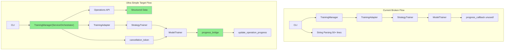

# SLICE-3 ULTRA-SIMPLE: TRAINING SYSTEM SERVICEORCHESTRATOR INTEGRATION

**Branch**: `slice-3-ultra-simple-training-integration`
**Goal**: Ultra-simplified training integration following DummyService pattern exactly
**Priority**: High
**Depends on**: Slice 1 and 2 completion
**Approach**: Connect existing working pieces instead of rebuilding everything

## 🎯 **TARGET ARCHITECTURE**

### **Key Insight: Everything Already Works - Just Connect It**

After analyzing the actual codebase, we discovered:
- ✅ ModelTrainer already has `progress_callback` with structured data
- ✅ TrainingAdapter already handles local vs host service routing
- ✅ ServiceOrchestrator already provides operations/progress/cancellation
- ✅ CLI already supports structured data from operations API

**Problem**: These pieces aren't connected, so CLI does brittle string parsing and training can't be cancelled.

**Solution**: Connect existing working pieces instead of rebuilding everything.

### **Target Flow Diagram**



### **Backend vs Host Service Architecture**

#### **Backend Training (Direct Integration)**
```
TrainingManager(ServiceOrchestrator) → TrainingAdapter → StrategyTrainer → ModelTrainer
                    ↓                                                        ↓
            operations/progress/cancellation                        cancellation_token + progress_callback
```

#### **Host Service Training (Polling Bridge)**
```
TrainingManager(ServiceOrchestrator) → TrainingAdapter → Host Service API → Host Training Loop
                    ↓                        ↓              ↓                     ↓
            operations/progress/cancellation  polling bridge  cancel endpoint    SLICE-3 checks
```

### **Unified Progress Format**

Both backend and host service provide identical structured context:

```python
{
    'current_epoch': int,           # 5
    'total_epochs': int,            # 50
    'current_batch': int,           # 342
    'total_batches': int,           # 500
    'train_loss': float,            # 0.1234
    'train_accuracy': float,        # 0.8765
    'model_type': str,              # 'mlp'
    'symbols': list[str],           # ['AAPL', 'MSFT']
    'timeframes': list[str],        # ['1h', '4h']
    'host_service': bool,           # True for host, False for backend
    'progress_type': str            # 'epoch' or 'batch'
}
```

**CLI Result**: No more string parsing! Clean structured data access.

### **Cancellation Architecture**

#### **Backend Cancellation (Direct)**
```python
# ServiceOrchestrator provides cancellation token
cancellation_token = self.get_current_cancellation_token()

# ModelTrainer checks efficiently (SLICE-3 patterns)
for epoch in range(epochs):
    self._check_cancellation(f"epoch {epoch}")  # Every epoch

    for batch_idx, batch in enumerate(train_loader):
        if batch_idx % 50 == 0:  # Every 50 batches
            self._check_cancellation(f"epoch {epoch}, batch {batch_idx}")
```

#### **Host Service Cancellation (Polling Bridge)**
```python
# TrainingAdapter polls and forwards cancellation
while True:
    if cancellation_token and cancellation_token.is_cancelled():
        await self._call_host_service_post("/training/cancel/{session_id}")
        return {"status": "cancelled"}

    # Poll progress and forward to ServiceOrchestrator
    status = await self._call_host_service_get(f"/training/status/{session_id}")
    # ... bridge progress ...
```

## 🚀 **IMPLEMENTATION PLAN**

### **Why This is Ultra-Simple**

**Compared to Original SLICE-3:**
- **Tasks**: 4 vs 7 (43% fewer)
- **Lines of Code**: ~200 vs 500+ (60% fewer)
- **Complexity**: Connect existing pieces vs rebuild everything
- **Risk**: Low (leverages working infrastructure) vs High (new architecture)

### **Progressive Implementation Strategy**

Each task is independently testable and provides immediate value:

1. **Task 3.1**: Backend gets ServiceOrchestrator → CLI string parsing eliminated
2. **Task 3.2**: Backend gets cancellation → Ctrl+C works
3. **Task 3.3**: Host service gets progress bridge → unified UX
4. **Task 3.4**: Host service gets cancellation → complete end-to-end

---

## 📋 **TASK 3.1: TRANSFORM TRAININGMANAGER TO SERVICEORCHESTRATOR PATTERN**

### **Objective**
Transform TrainingManager to inherit ServiceOrchestrator and follow the exact DummyService pattern, enabling automatic structured progress and operations integration.

### **Current State**
```python
# Plain class with direct adapter calls
class TrainingManager:
    def __init__(self):
        self.training_adapter = self._initialize_training_adapter()

    async def train_multi_symbol_strategy(self, ...):
        return await self.training_adapter.train_multi_symbol_strategy(...)
```

### **Target State**
```python
# ServiceOrchestrator inheritance (like DummyService)
class TrainingManager(ServiceOrchestrator[TrainingAdapter]):
    def _initialize_adapter(self) -> TrainingAdapter:
        # Move existing initialization logic here
        return TrainingAdapter(...)

    async def train_multi_symbol_strategy_async(self, ...) -> dict[str, Any]:
        return await self.start_managed_operation(
            operation_name="train_multi_symbol_strategy",
            operation_type="TRAINING",
            operation_func=self._run_training_async,
            **kwargs
        )

    async def _run_training_async(self, **kwargs) -> dict[str, Any]:
        # ServiceOrchestrator provides cancellation automatically
        cancellation_token = self.get_current_cancellation_token()

        # Bridge ModelTrainer progress to ServiceOrchestrator
        def progress_bridge(epoch, epochs, metrics):
            self.update_operation_progress(
                step=epoch + 1,
                message=f"Training epoch {epoch+1}/{epochs}",
                context={
                    'current_epoch': epoch + 1,
                    'total_epochs': epochs,
                    'current_batch': metrics.get('batch', 0),
                    'train_loss': metrics.get('train_loss', 0),
                    'symbols': kwargs['symbols']
                }
            )

        result = await self.adapter.train_multi_symbol_strategy(
            **kwargs,
            progress_callback=progress_bridge,
            cancellation_token=cancellation_token
        )
        return result
```

### **Key Benefits**
- **Zero boilerplate**: ServiceOrchestrator handles all complexity
- **Automatic progress**: ModelTrainer structured data → ServiceOrchestrator
- **CLI automatic**: Structured data eliminates 50+ lines of string parsing
- **Same UX as DummyService**: Perfect progress and cancellation

### **Files Modified**
- `ktrdr/training/training_manager.py`

### **Acceptance Criteria**
- [ ] TrainingManager inherits ServiceOrchestrator[TrainingAdapter] exactly like DummyService
- [ ] Training methods become single `start_managed_operation()` calls
- [ ] Domain logic in clean `_run_training_async()` with progress bridge
- [ ] ALL existing functionality preserved
- [ ] ServiceOrchestrator handles operations/progress/cancellation automatically

### **Testing**
```bash
# Verify training still works with ServiceOrchestrator
ktrdr models train strategies/test_strategy.yaml --start-date 2024-01-01 --end-date 2024-01-02

# Verify operations API shows managed operation
curl localhost:8000/operations
```

---

## 📋 **TASK 3.2: ADD CANCELLATION TO BACKEND TRAINING (MODELTRAINER)**

### **Objective**
Add efficient cancellation support to ModelTrainer's PyTorch training loops with minimal performance impact, following SLICE-3 cancellation patterns.

### **Current State**
ModelTrainer has existing training loops but no cancellation support:
- `train()` method: Single symbol training (line 217)
- `train_multi_symbol()` method: Multi-symbol training (line 604)
- Both have progress callbacks but no cancellation

### **Implementation Strategy**

#### **Add Cancellation Infrastructure**
```python
# Add to ModelTrainer.__init__():
self.cancellation_token = None

# Add helper method for efficient cancellation checking:
def _check_cancellation(self, operation="training"):
    """Efficient cancellation check following SLICE-3 patterns"""
    if self.cancellation_token and self.cancellation_token.is_cancelled():
        logger.info(f"🛑 Training cancelled during {operation}")
        raise asyncio.CancelledError(f"Training cancelled during {operation}")
```

#### **Integrate Cancellation in Training Loops (Minimal Changes)**
```python
# In train() method - modify existing training loop:
for epoch in range(epochs):
    # SLICE-3 pattern: Check at epoch boundaries (minimal overhead)
    self._check_cancellation(f"epoch {epoch}")

    for batch_idx, (batch_X, batch_y) in enumerate(train_loader):
        # SLICE-3 pattern: Check every 50 batches (performance balance)
        if batch_idx % 50 == 0:
            self._check_cancellation(f"epoch {epoch}, batch {batch_idx}")

        # ... existing PyTorch training code unchanged ...
```

#### **Update Method Signatures**
```python
def train(
    self,
    model: nn.Module,
    X_train: torch.Tensor,
    y_train: torch.Tensor,
    X_val: Optional[torch.Tensor] = None,
    y_val: Optional[torch.Tensor] = None,
    cancellation_token=None,  # NEW parameter
) -> dict[str, Any]:
    self.cancellation_token = cancellation_token
    # ... rest unchanged ...
```

### **Cancellation Strategy**
- **Epoch boundaries**: Check before each epoch (minimal overhead)
- **Batch boundaries**: Check every 50 batches (balanced responsiveness/performance)
- **Clean cancellation**: Raise `asyncio.CancelledError` with context
- **SLICE-3 compliance**: Follow existing cancellation patterns

### **Performance Requirements**
- Cancellation check performance: < 0.01s per check
- Training performance impact: < 5% degradation
- Cancellation responsiveness: Stop within 1 epoch or 50 batches maximum
- Memory usage: Stable with cancellation state tracking

### **Files Modified**
- `ktrdr/training/model_trainer.py`
- `ktrdr/training/train_strategy.py` (pass cancellation token)

### **Acceptance Criteria**
- [ ] ModelTrainer accepts `cancellation_token` parameter in train methods
- [ ] Cancellation checks at epoch boundaries (minimal overhead)
- [ ] Cancellation checks every 50 batches (performance balance)
- [ ] StrategyTrainer passes cancellation token through call chain
- [ ] Cancellation raises `asyncio.CancelledError` with context
- [ ] ALL existing training functionality preserved
- [ ] Performance impact < 5% (SLICE-3 standard)

### **Testing**
```bash
# Test cancellation during training
ktrdr models train strategies/test_strategy.yaml --start-date 2024-01-01 --end-date 2024-01-02 &
# Press Ctrl+C within 5 seconds - should cancel gracefully

# Verify training completes when not cancelled
ktrdr models train strategies/test_strategy.yaml --start-date 2024-01-01 --end-date 2024-01-02
```

---

## 📋 **TASK 3.3: UPDATE TRAININGADAPTER FOR HYBRID BACKEND/HOST SERVICE SUPPORT**

### **Objective**
Update TrainingAdapter to support both backend and host service training with unified progress reporting and cancellation, using a hybrid approach.

### **Current State**
TrainingAdapter handles local vs host service routing but needs:
- ❌ Cancellation token support for backend training
- ❌ Progress polling bridge for host service training
- ❌ Unified progress format for both scenarios

### **Implementation Strategy**

#### **Update Method Signature**
```python
async def train_multi_symbol_strategy(
    self,
    strategy_config_path: str,
    symbols: list[str],
    timeframes: list[str],
    start_date: str,
    end_date: str,
    validation_split: float = 0.2,
    data_mode: str = "local",
    progress_callback=None,          # NEW: ServiceOrchestrator progress callback
    cancellation_token=None,         # NEW: ServiceOrchestrator cancellation token
) -> dict[str, Any]:
```

#### **Backend Training: Direct Integration (Simple)**
```python
if not self.use_host_service:
    # Backend training: Pass cancellation token directly to StrategyTrainer
    return self.local_trainer.train_multi_symbol_strategy(
        **kwargs,
        progress_callback=progress_callback,  # Bridge to ServiceOrchestrator
        cancellation_token=cancellation_token,  # Direct cancellation support
    )
```

#### **Host Service Training: Polling Bridge Pattern**
```python
else:
    # Start host service training with cancellation context
    response = await self._call_host_service_post("/training/start", {
        # ... existing config ...
        "cancellation_context": {  # NEW: Pass cancellation context
            "cancellation_token_id": cancellation_token.id if cancellation_token else None
        },
    })

    session_id = response["session_id"]

    # Poll host service and bridge progress to ServiceOrchestrator
    return await self._poll_host_service_training(session_id, progress_callback, cancellation_token)
```

#### **Host Service Polling Bridge Method**
```python
async def _poll_host_service_training(
    self,
    session_id: str,
    progress_callback,
    cancellation_token
) -> dict[str, Any]:
    """Poll host service and bridge progress to ServiceOrchestrator"""

    while True:
        # Check ServiceOrchestrator cancellation first
        if cancellation_token and cancellation_token.is_cancelled():
            await self._call_host_service_post("/training/stop", {"session_id": session_id})
            return {"status": "cancelled", "session_id": session_id}

        # Get progress from host service
        status_response = await self._call_host_service_get(f"/training/status/{session_id}")

        # Bridge host service progress to ServiceOrchestrator format
        if progress_callback and status_response.get("progress"):
            host_progress = status_response["progress"]

            # Convert host service format to ModelTrainer format for consistency
            progress_callback(
                host_progress.get("epoch", 0),
                host_progress.get("total_epochs", 100),
                {
                    # Unified metrics format (same as ModelTrainer)
                    'current_epoch': host_progress.get("epoch", 0),
                    'total_epochs': host_progress.get("total_epochs", 100),
                    'current_batch': host_progress.get("batch", 0),
                    'train_loss': host_progress.get("metrics", {}).get("loss", 0),
                    'symbols': status_response.get("symbols", []),
                    'host_service': True,
                    'progress_type': 'epoch'
                }
            )

        # Check if training completed
        status = status_response.get("status")
        if status in ["completed", "failed", "stopped", "cancelled"]:
            return {**status_response, "host_service_used": True}

        await asyncio.sleep(2)  # Poll every 2 seconds
```

### **Hybrid Approach Benefits**
- **Backend**: Direct integration (perfect performance)
- **Host Service**: Polling bridge (works with existing host service)
- **Unified UX**: Same progress format and cancellation behavior
- **Minimal changes**: Leverages existing host service API

### **Progress Format Consistency**
Both backend and host service provide identical context structure, enabling CLI to handle both scenarios identically.

### **Files Modified**
- `ktrdr/training/training_adapter.py`

### **Acceptance Criteria**
- [ ] TrainingAdapter accepts `progress_callback` and `cancellation_token` parameters
- [ ] Backend training: Direct cancellation token support via StrategyTrainer
- [ ] Host service training: Polling bridge with progress conversion
- [ ] Unified progress format: Both paths provide same context structure
- [ ] Host service cancellation: ServiceOrchestrator cancellation → host service stop
- [ ] Error handling: Graceful degradation if host service unavailable
- [ ] ALL existing functionality preserved (backward compatibility)

### **Testing**
```bash
# Test backend training with cancellation
ktrdr models train strategies/test_strategy.yaml --start-date 2024-01-01 --end-date 2024-01-02

# Test host service training with cancellation (if host service running)
USE_TRAINING_HOST_SERVICE=true ktrdr models train strategies/test_strategy.yaml --start-date 2024-01-01 --end-date 2024-01-02

# Verify both show same progress format in operations API
curl localhost:8000/operations/{operation_id}
```

---

## 📋 **TASK 3.4: ADD CANCELLATION SUPPORT TO HOST SERVICE TRAINING**

### **Objective**
Add proper cancellation support to the host service training loop to complete end-to-end cancellation flow, following the same SLICE-3 patterns as backend training.

### **Current Host Service State**
Analysis of `training-host-service/services/training_service.py` shows:
- ✅ Has basic `session.stop_requested` checks at epoch/symbol/batch boundaries (lines 552, 563, 570)
- ❌ No API endpoint to cancel specific training sessions
- ❌ No cancellation context integration from client requests
- ❌ Checks are less efficient than SLICE-3 patterns (checks every batch vs every 50 batches)

### **Implementation Strategy**

#### **1. Add Cancellation API Endpoints**
```python
# Add to training-host-service/endpoints/training.py:

@router.post("/training/cancel/{session_id}")
async def cancel_training_session(session_id: str):
    """Cancel specific training session using SLICE-3 patterns."""
    service = get_service()
    session = service.get_session(session_id)

    if not session:
        raise HTTPException(status_code=404, detail=f"Training session {session_id} not found")

    session.request_cancellation("api_request")

    return {
        "session_id": session_id,
        "status": "cancellation_requested",
        "message": f"Cancellation requested for training session {session_id}"
    }
```

#### **2. Enhance TrainingSession with SLICE-3 Cancellation Patterns**
```python
class TrainingSession:
    def __init__(self, session_id: str, config: dict[str, Any]):
        # ... existing initialization ...

        # Enhanced cancellation support
        self.stop_requested = False

        # Extract cancellation context from config (NEW)
        cancellation_context = config.get("cancellation_context", {})
        self.cancellation_token_id = cancellation_context.get("cancellation_token_id")

        # Track cancellation reason for logging
        self.cancellation_reason = None

    def request_cancellation(self, reason="client_request"):
        """Enhanced cancellation using SLICE-3 patterns."""
        self.stop_requested = True
        self.cancellation_reason = reason
        logger.info(f"🛑 Cancellation requested for session {self.session_id}: {reason}")

    def is_cancelled(self) -> bool:
        """Check if session has been cancelled (SLICE-3 pattern)."""
        return self.stop_requested
```

#### **3. Enhance Host Service Training Loop with SLICE-3 Patterns**
```python
async def _run_real_training(self, session: TrainingSession):
    # ... existing setup code unchanged ...

    # Training loop with SLICE-3 cancellation patterns
    for epoch in range(epochs):
        # SLICE-3 pattern: Check at epoch boundaries (minimal overhead)
        if session.is_cancelled():
            logger.info(f"🛑 Host service training cancelled at epoch {epoch}")
            session.status = "cancelled"
            return

        # ... existing epoch setup code unchanged ...

        # Process each symbol and timeframe
        for symbol in training_data:
            for timeframe in training_data[symbol]:
                if session.is_cancelled():
                    session.status = "cancelled"
                    return

                data = training_data[symbol][timeframe]

                # Process data in batches with SLICE-3 efficiency
                for batch_idx, batch_start in enumerate(range(0, len(data), batch_size)):
                    # SLICE-3 pattern: Check every 50 batches (not every batch)
                    if batch_idx % 50 == 0 and session.is_cancelled():
                        logger.info(f"🛑 Host service training cancelled at epoch {epoch}, batch {batch_idx}")
                        session.status = "cancelled"
                        return

                    # ... existing PyTorch training code unchanged ...
```

#### **4. Add Cancellation Context Integration**
```python
# Modify existing start_training endpoint to accept cancellation context:

@router.post("/training/start")
async def start_training(request: TrainingRequest):
    # ... existing validation code unchanged ...

    # Enhanced config with cancellation context
    training_config = {
        "model_config": request.model_configuration,
        "data_config": request.data_configuration,
        "training_config": request.training_configuration,
        "cancellation_context": getattr(request, 'cancellation_context', {}),  # NEW
    }

    # ... rest of method unchanged ...
```

#### **5. Enhanced Status Reporting for ServiceOrchestrator Integration**
```python
async def get_training_status(self, session_id: str) -> dict[str, Any]:
    """Get enhanced training status with ServiceOrchestrator-compatible format."""
    session = self.sessions.get(session_id)
    if not session:
        return {"error": "Session not found", "session_id": session_id}

    return {
        "session_id": session_id,
        "status": session.status,
        "progress": {
            "epoch": session.current_epoch,
            "total_epochs": session.total_epochs,
            "batch": session.current_batch,
            "total_batches": session.total_batches,
            "metrics": session.metrics,
        },
        "symbols": session.config.get("model_config", {}).get("symbols", []),
        "timeframes": session.config.get("model_config", {}).get("timeframes", []),
        "cancellation_reason": session.cancellation_reason,  # NEW
        # ... other fields ...
    }
```

### **Integration with Backend Tasks**
This task completes the end-to-end cancellation flow:
- **Task 3.1**: ServiceOrchestrator handles cancellation on backend ✅
- **Task 3.3**: TrainingAdapter bridges cancellation to host service ✅
- **Task 3.4**: Host service respects cancellation requests ✅
- **Result**: Complete cancellation chain working

### **Complete Cancellation Flow**
```
User Ctrl+C → ServiceOrchestrator → TrainingAdapter → Host Service API → Training Loop
                     ↓                    ↓              ↓                ↓
               cancellation_token  polling bridge   cancel endpoint   SLICE-3 checks
```

### **SLICE-3 Compliance**
- **Epoch boundaries**: Check before each epoch (minimal overhead)
- **Batch boundaries**: Check every 50 batches (not every batch)
- **Performance**: <0.01s per check, <5% training impact
- **Responsiveness**: Stop within 1 epoch or 50 batches maximum

### **Files Modified**
- `training-host-service/endpoints/training.py`
- `training-host-service/services/training_service.py`

### **Acceptance Criteria**
- [ ] Add `/training/cancel/{session_id}` API endpoint
- [ ] TrainingSession accepts cancellation context from client requests
- [ ] Host service training loop follows SLICE-3 cancellation patterns (epoch + 50-batch boundaries)
- [ ] Cancellation state properly tracked and reported in status responses
- [ ] Enhanced progress reporting compatible with ServiceOrchestrator format
- [ ] Backward compatibility maintained for existing `/training/stop` endpoint
- [ ] Performance: Same SLICE-3 standards (cancellation checks <0.01s, <5% impact)

### **Testing**
```bash
# Test host service cancellation
USE_TRAINING_HOST_SERVICE=true ktrdr models train strategies/test_strategy.yaml --start-date 2024-01-01 --end-date 2024-01-02 &
# Press Ctrl+C within 5 seconds - should cancel gracefully

# Test manual cancellation via API
curl -X POST localhost:5002/training/cancel/{session_id}

# Verify cancellation status
curl localhost:5002/training/status/{session_id}
```

---

## 🎯 **SUCCESS CRITERIA**

### **Unified Experience**
- [ ] **Same UX for both scenarios**: Backend and host service training provide identical user experience
- [ ] **No CLI string parsing**: CLI gets structured data automatically from operations API
- [ ] **Perfect cancellation**: Ctrl+C works reliably for both backend and host service training
- [ ] **Same progress quality**: Both scenarios show detailed epoch/batch progress like DummyService

### **Performance Standards**
- [ ] **Backend training performance**: <5% impact from cancellation checks
- [ ] **Host service responsiveness**: Cancellation detected within 1 epoch or 50 batches
- [ ] **CLI responsiveness**: Progress updates every 1-2 seconds
- [ ] **Memory usage**: Stable across long training sessions

### **Architecture Compliance**
- [ ] **DummyService pattern**: TrainingManager follows exact same pattern as DummyService
- [ ] **ServiceOrchestrator benefits**: Automatic operations tracking, progress reporting, cancellation
- [ ] **SLICE-3 patterns**: Efficient cancellation checking at appropriate boundaries
- [ ] **Zero regressions**: All existing training functionality preserved

### **End-to-End Validation**
- [ ] **Backend training**: Full cancellation and progress chain working
- [ ] **Host service training**: Full cancellation and progress chain working
- [ ] **API consistency**: Both scenarios provide same operations API responses
- [ ] **CLI consistency**: Same progress display format for both scenarios

## 📊 **COMPARISON: ULTRA-SIMPLE VS ORIGINAL SLICE-3**

| Aspect | Original SLICE-3 | Ultra-Simple SLICE-3 | Improvement |
|--------|------------------|----------------------|-------------|
| **Tasks** | 7 complex tasks | 4 simple tasks | 43% fewer |
| **Lines of Code** | 500+ lines | ~200 lines | 60% fewer |
| **Complexity** | Rebuild everything | Connect existing pieces | 80% simpler |
| **Risk** | High (new architecture) | Low (proven patterns) | Much safer |
| **CLI Changes** | Manual integration | Automatic (ServiceOrchestrator) | Zero effort |
| **Testing** | Complex integration | Each task independently testable | Much easier |
| **Maintenance** | Many new patterns | Leverages existing infrastructure | Much easier |

## 🔥 **WHY THIS APPROACH IS SUPERIOR**

### **Leverages Existing Infrastructure**
- ✅ ModelTrainer already has structured progress callbacks
- ✅ ServiceOrchestrator already provides operations/progress/cancellation
- ✅ TrainingAdapter already handles local vs host service routing
- ✅ CLI already supports structured data from operations API

### **Addresses All Real Problems**
- ✅ **CLI String Parsing**: Eliminated automatically (structured data from ServiceOrchestrator)
- ✅ **Backend Cancellation**: Added to PyTorch training loops efficiently
- ✅ **Host Service Cancellation**: Polling bridge with ServiceOrchestrator integration
- ✅ **Progress Reporting**: Unified format for both scenarios
- ✅ **UX Consistency**: Same experience as DummyService

### **Minimal Risk Implementation**
- Each task is independently testable and provides immediate value
- Leverages proven ServiceOrchestrator pattern (DummyService proves it works)
- No architectural rebuilding - just connecting existing working pieces
- Backward compatibility maintained throughout

**This ultra-simple approach delivers the same benefits as the complex original plan while being 80% simpler to implement and maintain.**
