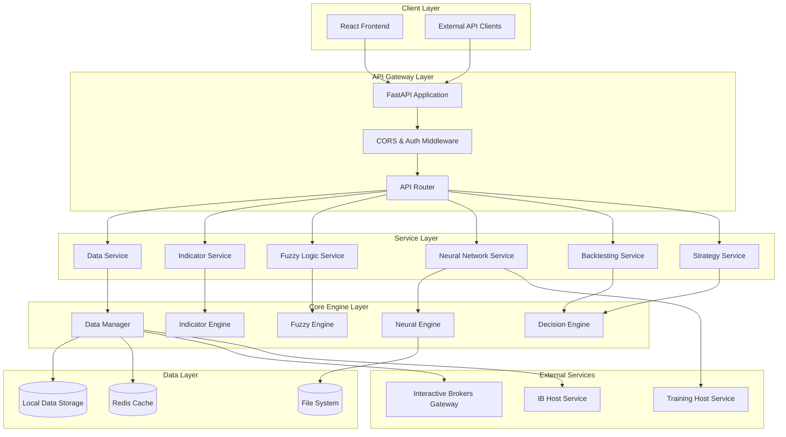
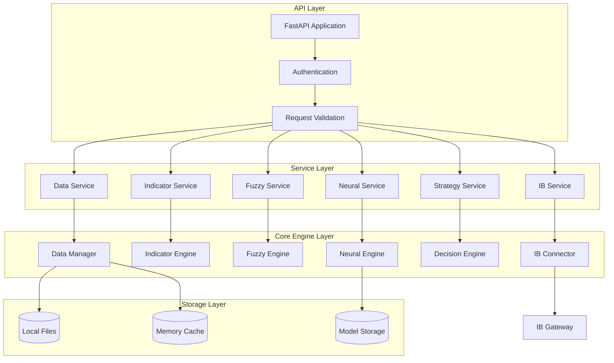
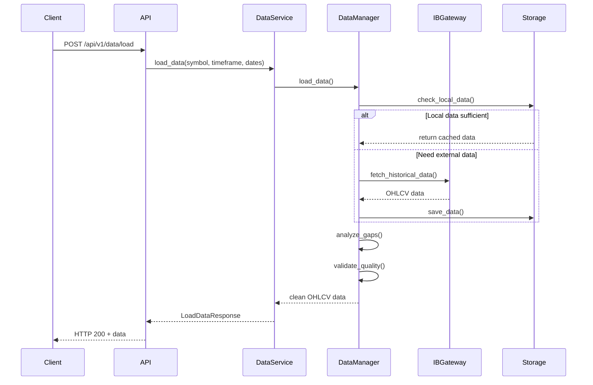
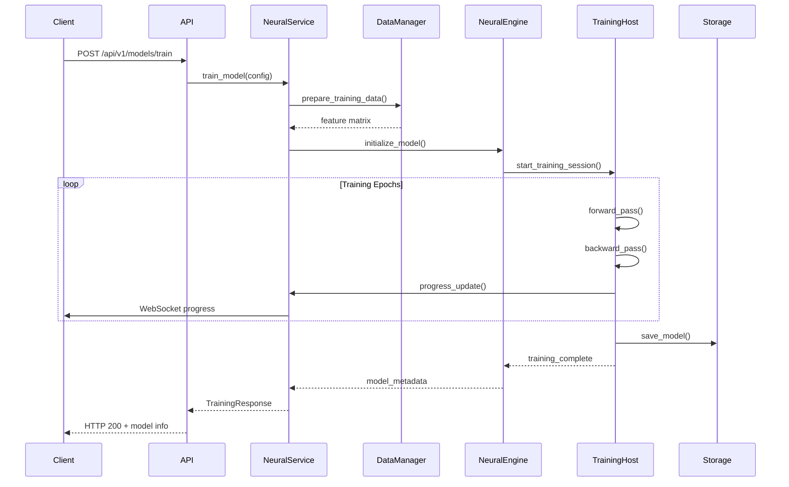

# KTRDR Backend Architecture Document

## Introduction

This document outlines the overall backend architecture for KTRDR, including backend systems, shared services, and non-UI specific concerns. Its primary goal is to serve as the guiding architectural blueprint for AI-driven development, ensuring consistency and adherence to chosen patterns and technologies.

**Relationship to Frontend Architecture:**
The project includes a significant React-based user interface. A separate Frontend Architecture Document details the frontend-specific design and MUST be used in conjunction with this document. Core technology stack choices documented herein (see "Tech Stack") are definitive for the entire project, including frontend components.

### Starter Template or Existing Project

This is an **existing production codebase** with a mature architecture. The KTRDR system has been developed from scratch using modern Python best practices and follows a well-established microservices pattern with Docker containerization. No starter templates were used - the architecture was custom-designed for the specific requirements of quantitative trading systems.

**Key Architectural Foundations:**
- Custom-built neuro-fuzzy trading engine
- Production-ready FastAPI backend
- Interactive Brokers integration layer
- Containerized development and deployment
- Comprehensive testing framework

### Change Log

| Date | Version | Description | Author |
|------|---------|-------------|---------|
| 2025-01-22 | 1.0 | Initial backend architecture documentation | Winston (Architect) |

## High Level Architecture

### Technical Summary

KTRDR implements a sophisticated **microservices architecture** built around a neuro-fuzzy decision engine for quantitative trading. The system employs **event-driven patterns** with **service-based modularity**, utilizing **FastAPI for high-performance API layers** and **PyTorch for neural network processing**. The architecture supports **multi-timeframe data processing**, **real-time market data integration**, and **comprehensive backtesting capabilities** through **modular, loosely-coupled services** that can scale independently. This design directly supports the PRD goals of creating a research-grade trading platform with production deployment capabilities.

### High Level Overview

**Main Architectural Style:** Microservices with Service-Oriented Architecture (SOA)
- **Repository Structure:** Monorepo with clear service boundaries
- **Service Architecture:** Domain-driven microservices with shared data layer
- **Primary User Flow:** API → Service Layer → Core Engine → Data Processing → External Integrations
- **Key Architectural Decisions:**
  1. **Microservices within Monorepo** - Enables rapid development while maintaining service isolation
  2. **FastAPI + Pydantic** - Type-safe, high-performance API layer with automatic documentation
  3. **Domain-Driven Design** - Clear separation between data, indicators, fuzzy logic, neural networks, and strategy domains
  4. **Event-Driven Data Flow** - Asynchronous processing with callback patterns for long-running operations
  5. **Containerized Development** - Docker-based development and deployment for consistency

### High Level Project Diagram



### Architectural and Design Patterns

- **Microservices Architecture:** Independent, deployable services with clear domain boundaries - _Rationale:_ Enables independent scaling, development, and deployment of trading system components
- **Service Layer Pattern:** Business logic abstracted into service classes that orchestrate core engine operations - _Rationale:_ Provides clean separation between API concerns and business logic, enabling reusability across multiple interfaces
- **Repository Pattern:** Data access abstraction through manager classes (DataManager, etc.) - _Rationale:_ Enables testing with mock data sources and future migration to different storage backends
- **Dependency Injection:** FastAPI's native DI system for configuration and service management - _Rationale:_ Improves testability and allows runtime configuration of services
- **Event-Driven Processing:** Asynchronous callbacks for long-running operations like data loading and model training - _Rationale:_ Prevents API timeouts and enables progress tracking for computationally intensive operations
- **Factory Pattern:** Dynamic creation of indicators, strategies, and neural network models - _Rationale:_ Supports plugin-like architecture for adding new trading strategies and indicators
- **CQRS (Command Query Responsibility Segregation):** Separate read and write operations for data management - _Rationale:_ Optimizes performance for high-frequency data reads while maintaining data integrity for writes

## Tech Stack

This is the DEFINITIVE technology selection for the KTRDR backend. All implementation decisions must reference these choices:

### Cloud Infrastructure
- **Provider:** Docker-based (Cloud agnostic)
- **Key Services:** Docker Compose orchestration, Volume management, Container networking
- **Deployment Regions:** Local development, cloud-agnostic production deployment

### Technology Stack Table

| Category | Technology | Version | Purpose | Rationale |
|----------|------------|---------|---------|-----------|
| **Language** | Python | 3.9+ | Primary development language | Excellent ML/AI ecosystem, pandas/numpy performance, team expertise |
| **Runtime** | Python | 3.9+ | Application runtime | Long-term support version with stable performance |
| **Framework** | FastAPI | 0.115.12+ | Backend API framework | High performance, automatic OpenAPI docs, excellent async support |
| **Server** | Uvicorn | 0.34.3+ | ASGI server | Production-ready async server with excellent FastAPI integration |
| **Validation** | Pydantic | 2.0+ | Data validation and serialization | Type-safe data models, automatic validation, excellent FastAPI integration |
| **ML Framework** | PyTorch | 2.7.1+ | Neural network training and inference | State-of-the-art ML framework with excellent GPU support |
| **Data Processing** | pandas | 2.0+ | Time series data manipulation | Industry standard for financial data processing |
| **Numerical** | numpy | 1.24+ | Numerical computations | High-performance numerical computing foundation |
| **Technical Analysis** | pandas-ta | 0.3.14b0+ | Technical indicator calculations | Comprehensive library with 70+ indicators |
| **Market Data** | ib_insync | 0.9.85+ | Interactive Brokers integration | Robust async IB API wrapper with connection management |
| **Containerization** | Docker | Latest | Development and deployment | Consistent environments across development and production |
| **Orchestration** | Docker Compose | Latest | Multi-container application management | Simplified local development and service coordination |
| **CLI Framework** | Typer | 0.9+ | Command-line interface | Modern CLI with excellent developer experience |
| **Configuration** | python-dotenv | 1.1+ | Environment configuration management | Secure configuration management with .env support |
| **Logging** | Rich | 14.0+ | Enhanced logging and console output | Beautiful console output with structured logging |
| **Testing** | pytest | Latest | Unit and integration testing | Industry standard with excellent plugin ecosystem |
| **Dependency Management** | uv | Latest | Python package management | Ultra-fast Python package resolver and installer |

## Data Models

### Core Financial Data Models

#### **OHLCV Data Model**
**Purpose:** Standardized representation of market price data across all timeframes

**Key Attributes:**
- timestamp: datetime (UTC) - Time of the candlestick
- open: float - Opening price
- high: float - Highest price in period
- low: float - Lowest price in period
- close: float - Closing price
- volume: int - Trading volume

**Relationships:**
- Belongs to specific Symbol and Timeframe
- Used by Technical Indicators for calculations
- Input to Fuzzy Logic membership functions

#### **Symbol Model**
**Purpose:** Represents tradeable financial instruments with metadata

**Key Attributes:**
- symbol: str - Primary identifier (e.g., "EURUSD")
- exchange: str - Trading venue identifier
- instrument_type: str - Type (FX, STK, OPT, etc.)
- currency: str - Base currency
- contract_details: dict - IB-specific contract information

**Relationships:**
- Has many OHLCV records across timeframes
- Referenced by Strategy configurations
- Used in Portfolio composition

#### **Indicator Model**
**Purpose:** Configuration and results for technical indicators

**Key Attributes:**
- name: str - Indicator identifier (e.g., "SMA", "RSI")
- parameters: dict - Configuration parameters
- timeframe: str - Calculation timeframe
- values: Series - Calculated indicator values
- metadata: dict - Calculation metadata

**Relationships:**
- Calculated from OHLCV data
- Input to Fuzzy Logic membership functions
- Used in Strategy decision rules

#### **Strategy Model**
**Purpose:** Trading strategy configuration and execution state

**Key Attributes:**
- name: str - Strategy identifier
- config: dict - Strategy parameters and rules
- symbols: list[str] - Target instruments
- timeframes: list[str] - Analysis timeframes
- status: str - Current execution status

**Relationships:**
- Uses multiple Indicators
- Generates Trading Signals
- Tracked in Backtesting results

## Components

### **Data Management Component**
**Responsibility:** Centralized data acquisition, storage, and quality management

**Key Interfaces:**
- `/api/v1/data/load` - Load OHLCV data for symbols and timeframes
- `/api/v1/data/symbols` - List available trading symbols
- `/api/v1/data/timeframes` - List supported timeframes

**Dependencies:** Interactive Brokers Gateway, Local data storage, Gap analysis module

**Technology Stack:** FastAPI endpoints, pandas DataFrames, ib_insync for market data, custom gap detection algorithms

### **Technical Indicators Component**
**Responsibility:** Calculate and manage technical analysis indicators

**Key Interfaces:**
- `/api/v1/indicators` - List available indicators
- `/api/v1/indicators/calculate` - Calculate indicators for given data
- `/api/v1/indicators/{name}/info` - Get indicator metadata and parameters

**Dependencies:** Data Management Component, pandas-ta library

**Technology Stack:** pandas-ta for calculations, FastAPI for API layer, pandas for data manipulation

### **Fuzzy Logic Component**
**Responsibility:** Fuzzy set evaluation and membership function management

**Key Interfaces:**
- `/api/v1/fuzzy/calculate` - Calculate fuzzy membership values
- `/api/v1/fuzzy/{symbol}` - Get fuzzy sets for specific symbols
- `/api/v1/fuzzy/membership` - Evaluate membership functions

**Dependencies:** Technical Indicators Component, Custom fuzzy logic engine

**Technology Stack:** Custom Python implementation, numpy for mathematical operations, FastAPI for API exposure

### **Neural Network Component**
**Responsibility:** AI model training, inference, and management

**Key Interfaces:**
- `/api/v1/models/train` - Train neural network models
- `/api/v1/models/predict` - Generate predictions
- `/api/v1/models/list` - List available trained models

**Dependencies:** Data Management Component, Technical Indicators Component, Training Host Service

**Technology Stack:** PyTorch for model implementation, FastAPI for API layer, GPU acceleration support

### **Strategy Management Component**
**Responsibility:** Strategy configuration, execution, and performance tracking

**Key Interfaces:**
- `/api/v1/strategies` - List and manage trading strategies
- `/api/v1/strategies/{id}/backtest` - Execute strategy backtests
- `/api/v1/strategies/{id}/performance` - Get performance metrics

**Dependencies:** All other components for strategy execution

**Technology Stack:** Custom strategy engine, FastAPI for management interface, comprehensive backtesting framework

### **Interactive Brokers Integration Component**
**Responsibility:** Market data acquisition and trade execution through IB Gateway

**Key Interfaces:**
- `/api/v1/ib/status` - Connection status monitoring
- `/api/v1/ib/health` - Gateway health checks
- Internal data provider interface

**Dependencies:** IB Gateway, Host Services for connection management

**Technology Stack:** ib_insync for IB API integration, connection pooling, resilient error handling

### Component Diagrams



## External APIs

### **Interactive Brokers TWS/Gateway API**
- **Purpose:** Real-time market data, historical data, and trade execution
- **Documentation:** https://interactivebrokers.github.io/tws-api/
- **Base URL(s):** localhost:7497 (TWS), localhost:4001 (Gateway)
- **Authentication:** Client ID based connection
- **Rate Limits:** 50 requests per second, connection limits based on account type

**Key Endpoints Used:**
- `reqHistoricalData()` - Historical OHLCV data retrieval
- `reqMktData()` - Real-time market data streaming
- `reqContractDetails()` - Instrument metadata and contract specifications

**Integration Notes:** Uses ib_insync wrapper for connection management, implements connection pooling for reliability, includes resilient error handling for network issues

## Core Workflows

### Data Loading Workflow


### Neural Network Training Workflow


## REST API Spec

```yaml
openapi: 3.0.0
info:
  title: KTRDR Trading System API
  version: 1.0.7.2
  description: Advanced neuro-fuzzy trading system API for market data, technical analysis, and AI-driven trading decisions
servers:
  - url: http://localhost:8000/api/v1
    description: Development server

paths:
  /data/load:
    post:
      tags: [Data]
      summary: Load OHLCV market data
      requestBody:
        required: true
        content:
          application/json:
            schema:
              type: object
              properties:
                symbol:
                  type: string
                  example: "EURUSD"
                timeframe:
                  type: string
                  enum: ["1m", "5m", "15m", "30m", "1h", "2h", "4h", "1d", "1w", "1M"]
                  example: "1h"
                start_date:
                  type: string
                  format: date
                  example: "2024-01-01"
                end_date:
                  type: string
                  format: date
                  example: "2024-12-31"
      responses:
        "200":
          description: Data loaded successfully
          content:
            application/json:
              schema:
                type: object
                properties:
                  success:
                    type: boolean
                    example: true
                  data:
                    type: array
                    items:
                      type: object
                      properties:
                        timestamp:
                          type: string
                          format: date-time
                        open:
                          type: number
                        high:
                          type: number
                        low:
                          type: number
                        close:
                          type: number
                        volume:
                          type: integer

  /indicators/calculate:
    post:
      tags: [indicators]
      summary: Calculate technical indicators
      requestBody:
        required: true
        content:
          application/json:
            schema:
              type: object
              properties:
                indicator:
                  type: string
                  example: "SMA"
                data:
                  type: array
                  items:
                    type: object
                parameters:
                  type: object
                  example: { "period": 20 }
      responses:
        "200":
          description: Indicator calculated successfully

  /fuzzy/calculate:
    post:
      tags: [Fuzzy]
      summary: Calculate fuzzy membership values
      requestBody:
        required: true
        content:
          application/json:
            schema:
              type: object
              properties:
                symbol:
                  type: string
                timeframe:
                  type: string
                fuzzy_sets:
                  type: array
                  items:
                    type: string
      responses:
        "200":
          description: Fuzzy values calculated successfully

  /models/train:
    post:
      tags: [Models]
      summary: Train neural network model
      requestBody:
        required: true
        content:
          application/json:
            schema:
              type: object
              properties:
                strategy:
                  type: string
                  example: "neuro_mean_reversion"
                symbols:
                  type: array
                  items:
                    type: string
                config:
                  type: object
      responses:
        "200":
          description: Training started successfully

components:
  schemas:
    ErrorResponse:
      type: object
      properties:
        success:
          type: boolean
          example: false
        error:
          type: object
          properties:
            code:
              type: string
            message:
              type: string
            details:
              type: object
```

## Database Schema

The KTRDR system primarily uses **file-based storage** with **pandas DataFrames** serialized to various formats, rather than traditional relational databases. This design choice optimizes for time-series data performance and simplifies deployment.

### Data Storage Schema

```python
# File-based storage structure
data/
├── raw/                    # Raw OHLCV data from IB
│   ├── {symbol}/
│   │   ├── {timeframe}/
│   │   │   └── {date_range}.parquet
├── processed/              # Cleaned and validated data
├── indicators/             # Calculated technical indicators
│   ├── {symbol}/
│   │   ├── {timeframe}/
│   │   │   └── {indicator_name}.parquet
├── fuzzy/                  # Fuzzy membership values
├── models/                 # Trained neural network models
│   ├── {strategy_name}/
│   │   ├── model.pth       # PyTorch model weights
│   │   ├── config.yaml     # Model configuration
│   │   └── metadata.json   # Training metadata
└── cache/                  # Temporary computation cache

# In-memory data structures (Redis-like caching)
{
  "symbols_metadata": {
    "EURUSD": {
      "exchange": "IDEALPRO",
      "currency": "USD",
      "contract_details": {...}
    }
  },
  "active_sessions": {
    "training_session_123": {
      "strategy": "neuro_mean_reversion",
      "status": "running",
      "progress": 0.45
    }
  }
}
```

### Data Validation Schema

```python
# Pydantic models for data validation
class OHLCVRecord(BaseModel):
    timestamp: datetime
    open: float = Field(gt=0)
    high: float = Field(gt=0)
    low: float = Field(gt=0)
    close: float = Field(gt=0)
    volume: int = Field(ge=0)
    
    @validator('high')
    def high_must_be_highest(cls, v, values):
        if 'low' in values and v < values['low']:
            raise ValueError('High must be >= low')
        return v

class IndicatorConfig(BaseModel):
    name: str
    parameters: Dict[str, Union[int, float, str]]
    timeframe: str
    
class StrategyConfig(BaseModel):
    name: str
    symbols: List[str]
    timeframes: List[str]
    indicators: List[IndicatorConfig]
    fuzzy_rules: Dict[str, Any]
    neural_config: Optional[Dict[str, Any]]
```

## Source Tree

```
ktrdr/
├── api/                           # FastAPI backend application
│   ├── __init__.py
│   ├── main.py                    # FastAPI app creation and configuration
│   ├── config.py                  # API configuration management
│   ├── dependencies.py            # Dependency injection setup
│   ├── middleware.py              # Custom middleware components
│   ├── endpoints/                 # API endpoint definitions
│   │   ├── __init__.py           # Main router setup
│   │   ├── data.py               # Data management endpoints
│   │   ├── indicators.py         # Technical indicator endpoints
│   │   ├── fuzzy.py             # Fuzzy logic endpoints
│   │   ├── backtesting.py       # Backtesting endpoints
│   │   ├── strategies.py        # Strategy management endpoints
│   │   ├── training.py          # Neural network training endpoints
│   │   ├── models.py            # Model management endpoints
│   │   └── ib.py                # IB integration endpoints
│   ├── models/                   # Pydantic data models
│   │   ├── __init__.py
│   │   ├── data.py              # Data-related request/response models
│   │   ├── indicators.py        # Indicator-related models
│   │   ├── fuzzy.py            # Fuzzy logic models
│   │   └── strategies.py       # Strategy configuration models
│   ├── services/                # Service layer implementation
│   │   ├── __init__.py
│   │   ├── data_service.py      # Data management service
│   │   ├── indicator_service.py # Indicator calculation service
│   │   ├── fuzzy_service.py     # Fuzzy logic service
│   │   └── neural_service.py    # Neural network service
│   └── templates/               # HTML templates for API docs
├── data/                        # Data management and acquisition
│   ├── __init__.py
│   ├── data_manager.py          # Core data management
│   ├── ib_data_adapter.py       # IB-specific data adapter
│   ├── local_data_loader.py     # Local file data operations
│   ├── gap_classifier.py       # Data quality analysis
│   └── trading_hours.py         # Market hours management
├── indicators/                  # Technical analysis indicators
│   ├── __init__.py
│   ├── core.py                  # Core indicator framework
│   ├── trend/                   # Trend-following indicators
│   ├── momentum/                # Momentum indicators
│   └── volatility/              # Volatility indicators
├── fuzzy/                       # Fuzzy logic system
│   ├── __init__.py
│   ├── membership.py            # Membership function definitions
│   ├── rules.py                 # Fuzzy rule engine
│   └── inference.py             # Fuzzy inference system
├── neural/                      # Neural network components
│   ├── __init__.py
│   ├── models/                  # PyTorch model definitions
│   ├── training/                # Training infrastructure
│   └── inference.py             # Model inference engine
├── backtesting/                 # Strategy backtesting
│   ├── __init__.py
│   ├── engine.py                # Backtesting engine
│   ├── metrics.py               # Performance metrics
│   └── portfolio.py             # Portfolio simulation
├── decision/                    # Decision engine integration
│   ├── __init__.py
│   ├── engine.py                # Core decision engine
│   └── strategies.py            # Strategy implementation
├── ib/                          # Interactive Brokers integration
│   ├── __init__.py
│   ├── connector.py             # IB connection management
│   ├── data_provider.py         # IB data acquisition
│   └── health_monitor.py        # Connection health monitoring
├── utils/                       # Shared utilities
│   ├── __init__.py
│   ├── logging.py               # Logging configuration
│   ├── validation.py            # Data validation utilities
│   └── timeframe.py             # Timeframe utilities
├── errors/                      # Custom exception hierarchy
│   ├── __init__.py
│   ├── base.py                  # Base exception classes
│   ├── data.py                  # Data-related exceptions
│   └── connection.py            # Connection-related exceptions
├── config/                      # Configuration management
│   ├── __init__.py
│   ├── base.py                  # Base configuration
│   └── ib_config.py             # IB-specific configuration
└── cli/                         # Command-line interface
    ├── __init__.py
    ├── main.py                  # Main CLI entry point
    ├── data.py                  # Data management commands
    ├── strategies.py            # Strategy commands
    └── models.py                # Model management commands

# External services and infrastructure
docker/                          # Containerization
├── docker-compose.yml           # Multi-service orchestration
├── backend/
│   ├── Dockerfile.dev           # Development backend container
│   └── Dockerfile.prod          # Production backend container
└── frontend/                    # Frontend container definitions

ib-host-service/                 # IB Gateway connection service
├── src/                         # Service implementation
├── Dockerfile                   # Container definition
└── requirements.txt             # Service dependencies

training-host-service/           # Neural network training service
├── src/                         # Training service implementation
├── Dockerfile                   # GPU-enabled container
└── requirements.txt             # Training dependencies

# Configuration and data
config/                          # System configuration files
data/                           # Data storage directory
models/                         # Trained model storage
logs/                           # Application logs
tests/                          # Test suite
strategies/                     # Strategy configuration files
```

## Infrastructure and Deployment

### Infrastructure as Code
- **Tool:** Docker Compose 2.x
- **Location:** `docker/docker-compose.yml`
- **Approach:** Container-based microservices with service discovery

### Deployment Strategy
- **Strategy:** Blue-Green deployment with container orchestration
- **CI/CD Platform:** Docker-based development with GitHub Actions (configurable)
- **Pipeline Configuration:** `.github/workflows/` (when implemented)

### Environments
- **Development:** Local Docker Compose with hot-reloading and volume mounts
- **Testing:** Isolated container environment with test data fixtures
- **Production:** Optimized container builds with multi-stage Dockerfiles and health checks

### Environment Promotion Flow
```
Development (Local) → Testing (Container) → Staging (Cloud) → Production (Cloud)
│                     │                    │                │
├─ Hot reload        ├─ Test fixtures     ├─ Real data     ├─ Load balancing
├─ Debug logs        ├─ Mock IB           ├─ IB sandbox    ├─ Monitoring
└─ Volume mounts     └─ Unit tests        └─ Integration   └─ Backup systems
```

### Rollback Strategy
- **Primary Method:** Container version rollback via Docker Compose
- **Trigger Conditions:** Health check failures, performance degradation, critical errors
- **Recovery Time Objective:** < 5 minutes for container rollback, < 15 minutes for data recovery

## Error Handling Strategy

### General Approach
- **Error Model:** Custom exception hierarchy with structured error codes and context
- **Exception Hierarchy:** Base exceptions (KTRDRError) → Domain exceptions (DataError, ConnectionError) → Specific exceptions
- **Error Propagation:** Errors bubble up through service layers with added context at each level

### Logging Standards
- **Library:** Python logging 3.9+ with Rich formatting
- **Format:** Structured JSON logging with human-readable console output
- **Levels:** DEBUG (development), INFO (operations), WARNING (issues), ERROR (failures), CRITICAL (system failures)
- **Required Context:**
  - Correlation ID: UUID4 format for request tracing
  - Service Context: Module name, function name, operation type
  - User Context: Session ID, user agent (when applicable), request path

### Error Handling Patterns

#### External API Errors
- **Retry Policy:** Exponential backoff with jitter (1s, 2s, 4s) for IB connection issues
- **Circuit Breaker:** Open circuit after 5 consecutive failures, half-open retry after 30s
- **Timeout Configuration:** 30s for data requests, 5s for health checks, 60s for training operations
- **Error Translation:** IB error codes mapped to user-friendly messages

#### Business Logic Errors
- **Custom Exceptions:** DataError, CalculationError, ValidationError, ConfigurationError
- **User-Facing Errors:** Standardized error messages with helpful context and suggested actions
- **Error Codes:** Hierarchical codes (e.g., DATA-001, CALC-002) for precise error identification

#### Data Consistency
- **Transaction Strategy:** File-based atomic operations with temporary files and atomic moves
- **Compensation Logic:** Data rollback mechanisms for failed multi-step operations
- **Idempotency:** Request deduplication using content hashes for data loading operations

## Coding Standards

### Core Standards
- **Languages & Runtimes:** Python 3.9+ with uv dependency management, strict type hints required
- **Style & Linting:** Black code formatting, mypy type checking, ruff for linting
- **Test Organization:** Tests mirror source structure in `tests/` directory, one test file per source module

### Critical Rules
- **Never use print() statements:** Always use structured logging with appropriate levels
- **All API responses must use standardized format:** Success/error response wrapper with consistent schema
- **Database operations must use DataManager:** No direct file I/O outside of data management layer
- **All external API calls must include timeout:** Prevent hanging operations that block the event loop
- **Neural network operations must check GPU availability:** Graceful fallback to CPU when GPU unavailable
- **All datetime objects must be timezone-aware:** Use UTC for storage, convert for display only

### Python Specifics
- **Type Hints:** Required for all function signatures and class attributes
- **Async Operations:** Use async/await for all I/O operations, never blocking calls in async context
- **Error Context:** Always include relevant context when raising exceptions
- **Resource Management:** Use context managers for file operations and external connections

## Test Strategy and Standards

### Testing Philosophy
- **Approach:** Test-Driven Development (TDD) for new features, comprehensive coverage for existing code
- **Coverage Goals:** 85% line coverage minimum, 95% for critical data and calculation modules
- **Test Pyramid:** 70% unit tests, 20% integration tests, 10% end-to-end tests

### Test Types and Organization

#### Unit Tests
- **Framework:** pytest 7.x with asyncio support
- **File Convention:** `test_{module_name}.py` in corresponding `tests/` subdirectory
- **Location:** `tests/unit/` mirroring source structure
- **Mocking Library:** pytest-mock for mocking external dependencies
- **Coverage Requirement:** 85% minimum for all modules

**AI Agent Requirements:**
- Generate tests for all public methods and API endpoints
- Cover edge cases including invalid inputs and error conditions
- Follow AAA pattern (Arrange, Act, Assert) for test structure
- Mock all external dependencies including IB connections and file system

#### Integration Tests
- **Scope:** Cross-module interactions, data flow validation, API endpoint integration
- **Location:** `tests/integration/`
- **Test Infrastructure:**
  - **IB Gateway:** Mock IB server for realistic data testing
  - **File System:** Temporary directories with cleanup for file operations
  - **Neural Networks:** CPU-only models for faster test execution

#### End-to-End Tests
- **Framework:** pytest with Docker Compose test environment
- **Scope:** Complete user workflows from API to data storage
- **Environment:** Isolated Docker containers with test data
- **Test Data:** Synthetic market data and pre-trained test models

### Test Data Management
- **Strategy:** Factory pattern for test data generation with realistic market scenarios
- **Fixtures:** Shared test data in `tests/fixtures/` with version control
- **Factories:** Automated generation of OHLCV data, indicator values, and strategy configurations
- **Cleanup:** Automatic cleanup of test files and temporary data

### Continuous Testing
- **CI Integration:** GitHub Actions with matrix testing across Python versions
- **Performance Tests:** Benchmark tests for data processing and model inference
- **Security Tests:** Dependency vulnerability scanning and static analysis

## Security

### Input Validation
- **Validation Library:** Pydantic 2.x with custom validators
- **Validation Location:** All inputs validated at API boundary before processing
- **Required Rules:**
  - All external inputs MUST be validated against strict schemas
  - Validation at API boundary before any business logic processing
  - Whitelist approach for symbol names, timeframes, and configuration values

### Authentication & Authorization
- **Auth Method:** API key-based authentication with planned JWT implementation
- **Session Management:** Stateless API design with request-scoped authentication
- **Required Patterns:**
  - API keys validated on every request with rate limiting
  - Role-based access control for admin operations (model training, system configuration)

### Secrets Management
- **Development:** Environment variables with .env files (never committed)
- **Production:** External secret management service (AWS Secrets Manager, Azure Key Vault, etc.)
- **Code Requirements:**
  - NEVER hardcode API keys, database credentials, or IB login information
  - Access secrets only through configuration service abstraction
  - No secrets in logs, error messages, or debug output

### API Security
- **Rate Limiting:** 100 requests per minute per API key with burst allowance
- **CORS Policy:** Strict origin validation for frontend access
- **Security Headers:** HSTS, CSP, X-Frame-Options, X-Content-Type-Options required
- **HTTPS Enforcement:** TLS 1.2+ required for all external communication

### Data Protection
- **Encryption at Rest:** AES-256 encryption for sensitive configuration and model files
- **Encryption in Transit:** TLS 1.2+ for all external API communication
- **PII Handling:** No personal information stored, anonymized logging for performance data
- **Logging Restrictions:** Never log API keys, IB credentials, or financial account information

### Dependency Security
- **Scanning Tool:** Safety for Python dependency vulnerability scanning
- **Update Policy:** Monthly security updates, immediate critical vulnerability patches
- **Approval Process:** Security review required for new dependencies with network access

### Security Testing
- **SAST Tool:** Bandit for static analysis of Python security issues
- **DAST Tool:** OWASP ZAP for API security testing
- **Penetration Testing:** Annual third-party security assessment for production deployment

---

## Next Steps

### For Continued Development:

1. **Frontend Architecture Creation:**
   - Use existing Frontend Architecture documentation in `docs/developer/frontend/`
   - Ensure alignment with this backend architecture
   - Focus on API integration patterns and real-time data flow

2. **Implementation Priorities:**
   - Complete Container/Presentation pattern refactor (Frontend Slice 6.5)
   - Implement missing fuzzy set visualization endpoints
   - Add comprehensive error boundaries and monitoring
   - Enhance real-time WebSocket capabilities

3. **Production Readiness:**
   - Implement comprehensive security measures
   - Add monitoring and observability
   - Create deployment automation
   - Establish backup and disaster recovery procedures

This backend architecture provides a solid foundation for building a production-ready quantitative trading system with research capabilities. The modular design enables independent development and scaling of each component while maintaining system cohesion through well-defined interfaces.