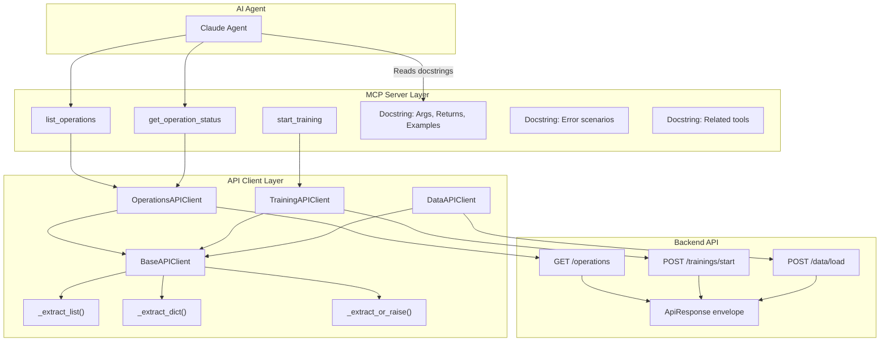
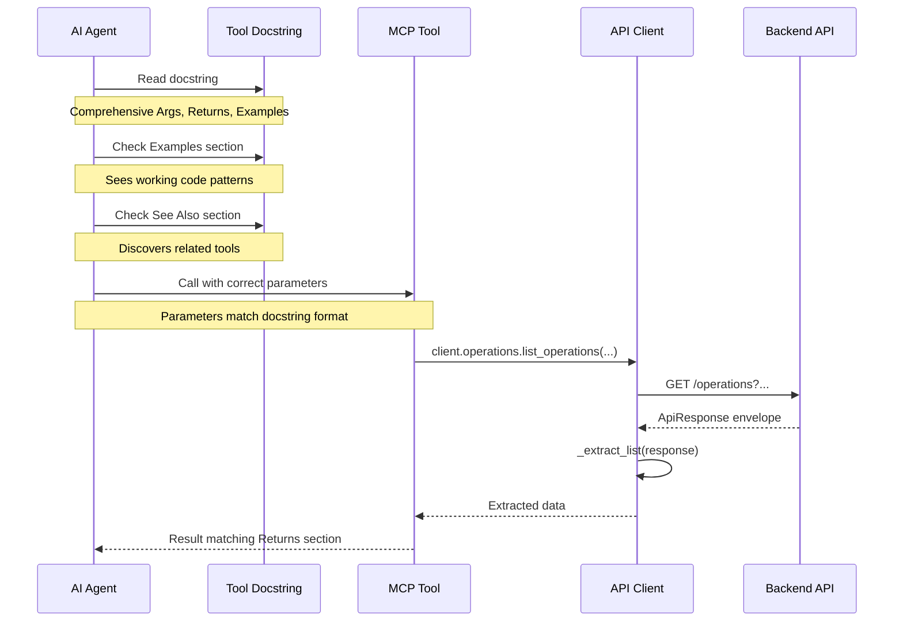
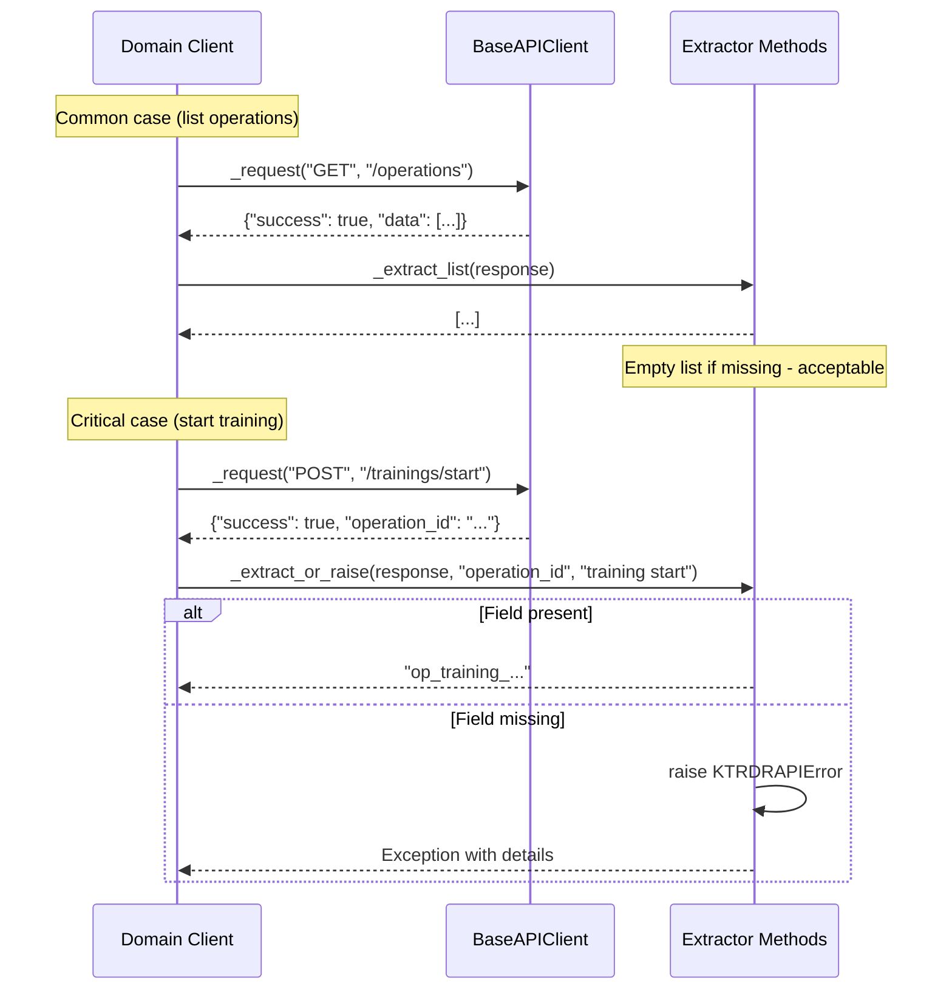

# MCP Response Handling & Documentation - Architecture Document

**Version**: 1.0
**Status**: Draft - In Review
**Last Updated**: 2025-10-05
**Phase**: Response Handling Standardization
**Related**: [Implementation Document](./IMPLEMENTATION.md)

---

## 🎯 Architecture Principles

1. **Backward Compatibility** - No breaking changes to existing tools or clients
2. **Gradual Migration** - Incremental improvements, not big-bang refactor
3. **Type Safety** - Strong typing for response extraction and error handling
4. **Production Ready** - Error handling for critical operations, simple extraction for common cases
5. **LLM-Friendly** - Comprehensive docstrings are the primary interface for AI agents

---

## System Architecture Overview



---

## Component Architecture

### 1. Response Handling Pattern (Hybrid Approach)

**Current Issue**: Inconsistent response extraction across domain clients
- Some use `response.get("data", [])`
- Some return full response dict
- Some use different field names (`models`, `data`, etc.)
- Error handling scattered and inconsistent

**Proposed Solution**: Hybrid approach with extraction helpers in BaseAPIClient

**Location**: [mcp/src/clients/base.py](../../mcp/src/clients/base.py)

**What We're Adding** 🆕:

#### Simple Extractors (90% of cases)

For common patterns where errors are acceptable (list empty, dict empty):

```python
class BaseAPIClient:
    """Shared HTTP client functionality"""

    def _extract_list(
        self,
        response: dict[str, Any],
        field: str = "data",
        default: Optional[list] = None
    ) -> list[dict[str, Any]]:
        """
        Extract list from response envelope.

        For non-critical operations where empty list is acceptable.

        Args:
            response: API response dict
            field: Field name to extract (default "data")
            default: Default value if field missing (default [])

        Returns:
            Extracted list or default

        Example:
            response = {"success": true, "data": [...]}
            items = self._extract_list(response)
        """
        if default is None:
            default = []
        return response.get(field, default)

    def _extract_dict(
        self,
        response: dict[str, Any],
        field: str = "data",
        default: Optional[dict] = None
    ) -> dict[str, Any]:
        """
        Extract dict from response envelope.

        For non-critical operations where empty dict is acceptable.

        Args:
            response: API response dict
            field: Field name to extract (default "data")
            default: Default value if field missing (default {})

        Returns:
            Extracted dict or default

        Example:
            response = {"success": true, "data": {...}}
            item = self._extract_dict(response)
        """
        if default is None:
            default = {}
        return response.get(field, default)
```

#### Power Tool (10% of cases)

For critical operations that MUST succeed:

```python
    def _extract_or_raise(
        self,
        response: dict[str, Any],
        field: str = "data",
        operation: str = "operation"
    ) -> Any:
        """
        Extract field from response or raise detailed error.

        For critical operations that MUST succeed (training start, data loading).

        Args:
            response: API response dict
            field: Field name to extract
            operation: Operation name for error message

        Returns:
            Extracted value

        Raises:
            KTRDRAPIError: If field missing or response indicates error

        Example:
            response = {"success": true, "data": {...}}
            data = self._extract_or_raise(response, operation="training start")
        """
        # Check explicit error flag
        if not response.get("success", True):
            error_msg = response.get("error", "Unknown error")
            raise KTRDRAPIError(
                f"{operation.capitalize()} failed: {error_msg}",
                details=response
            )

        # Extract field
        if field not in response:
            raise KTRDRAPIError(
                f"{operation.capitalize()} response missing '{field}' field",
                details=response
            )

        return response[field]
```

---

### 2. Domain Client Updates

Each domain client will adopt the hybrid pattern:

#### DataAPIClient Pattern

**File**: [mcp/src/clients/data_client.py](../../mcp/src/clients/data_client.py)

**Common Case** (simple extractor):
```python
async def get_symbols(self) -> list[dict[str, Any]]:
    """Get available symbols"""
    response = await self._request("GET", "/symbols")
    return self._extract_list(response)  # Empty list acceptable
```

**Critical Case** (power tool):
```python
async def load_data_operation(
    self,
    symbol: str,
    timeframe: str,
    mode: str,
    start_date: Optional[str] = None,
    end_date: Optional[str] = None,
) -> dict[str, Any]:
    """Trigger data loading (MUST return operation_id)"""
    payload = {"symbol": symbol, "timeframe": timeframe, "mode": mode}
    if start_date:
        payload["start_date"] = start_date
    if end_date:
        payload["end_date"] = end_date

    response = await self._request("POST", "/api/v1/data/load", json=payload)

    # CRITICAL: Must have operation_id
    return self._extract_or_raise(response, operation="data loading")
```

#### TrainingAPIClient Pattern

**File**: [mcp/src/clients/training_client.py](../../mcp/src/clients/training_client.py)

```python
async def list_trained_models(self) -> list[dict[str, Any]]:
    """List trained models"""
    response = await self._request("GET", "/api/v1/models")
    # Backend returns {models: [...]} instead of {data: [...]}
    return self._extract_list(response, field="models")  # Simple

async def start_neural_training(...) -> dict[str, Any]:
    """Start training (MUST return operation_id)"""
    payload = {...}
    response = await self._request("POST", "/api/v1/trainings/start", json=payload)

    # CRITICAL: Must succeed
    return self._extract_or_raise(response, operation="training start")
```

#### OperationsAPIClient Pattern

**File**: [mcp/src/clients/operations_client.py](../../mcp/src/clients/operations_client.py)

```python
async def list_operations(...) -> dict[str, Any]:
    """List operations"""
    params = {...}
    response = await self._request("GET", "/api/v1/operations", params=params)
    # Return full response (includes data, total_count, active_count)
    return response

async def get_operation_status(self, operation_id: str) -> dict[str, Any]:
    """Get operation status"""
    response = await self._request("GET", f"/api/v1/operations/{operation_id}")
    return self._extract_dict(response)  # Simple extraction
```

---

### 3. MCP Tool Docstring Standards

**The Primary Interface**: LLMs interact with tools through docstrings, not code.

**Current Issue**: Docstrings vary in quality and completeness
- Some lack parameter format examples
- Return structures not fully documented
- Error scenarios not explained
- No references to related tools

**Proposed Standard** (Google Style with enhancements):

```python
@mcp.tool()
async def list_operations(
    operation_type: Optional[str] = None,
    status: Optional[str] = None,
    active_only: bool = False,
    limit: int = 10,
    offset: int = 0,
) -> dict[str, Any]:
    """
    List operations with optional filters.

    Discover operations without prior knowledge. Filter by type, status,
    or show only active operations. Returns most recent operations first.

    Args:
        operation_type: Filter by type. Valid values:
            - "data_load": Data loading operations
            - "training": Neural network training
            - "backtesting": Strategy backtesting
            - None: All types
        status: Filter by status. Valid values:
            - "pending": Queued, not started
            - "running": Currently executing
            - "completed": Finished successfully
            - "failed": Finished with errors
            - "cancelled": Manually cancelled
            - None: All statuses
        active_only: Only show pending + running operations
        limit: Maximum operations to return (default 10, max 100)
        offset: Number of operations to skip for pagination

    Returns:
        Dict with structure:
        {
            "success": bool,
            "data": [
                {
                    "operation_id": str,
                    "operation_type": str,
                    "status": str,
                    "created_at": str (ISO timestamp),
                    "progress_percentage": float,
                    "current_step": str,
                    "symbol": Optional[str],
                    "duration_seconds": float
                },
                ...
            ],
            "total_count": int,     # Total matching operations
            "active_count": int,    # Currently running operations
            "returned_count": int   # Number in this response
        }

    Raises:
        KTRDRAPIError: If backend communication fails

    Examples:
        # Get all active operations
        result = await list_operations(active_only=True)
        # Returns: {"data": [...], "active_count": 2}

        # Get recent training operations
        result = await list_operations(
            operation_type="training",
            status="completed",
            limit=5
        )
        # Returns last 5 completed training operations

        # Pagination example
        page1 = await list_operations(limit=10, offset=0)
        page2 = await list_operations(limit=10, offset=10)

    See Also:
        - get_operation_status(): Get detailed progress for specific operation
        - cancel_operation(): Cancel running operation
        - get_operation_results(): Get results after completion

    Notes:
        - Operations sorted by created_at DESC (most recent first)
        - Default limit is 10 to minimize token usage
        - Use active_only=True to find currently running operations
        - Pagination uses offset/limit pattern
    """
    # Implementation...
```

**Key Sections**:
1. **One-line summary** - What the tool does
2. **Extended description** - Context and behavior
3. **Args** - Parameter formats with valid values and examples
4. **Returns** - Complete structure with field descriptions
5. **Raises** - Error scenarios
6. **Examples** - Working code showing common use cases
7. **See Also** - Related tools for agent discovery
8. **Notes** - Important behavioral details

---

## Data Flow Diagrams

### Flow 1: LLM Tool Selection



### Flow 2: Response Extraction (Hybrid Pattern)



---

## Error Handling Architecture

### Extraction Method Error Patterns

**Simple Extractors** - Graceful degradation:
```python
# Backend returns {data: []}
items = self._extract_list(response)  # → []

# Backend returns {}
items = self._extract_list(response)  # → []

# Backend returns {models: [...]}
items = self._extract_list(response, field="models")  # → [...]
```

**Power Tool** - Strict validation:
```python
# Backend returns {success: false, error: "Not found"}
self._extract_or_raise(response)
# → KTRDRAPIError: "Operation failed: Not found"

# Backend returns {success: true} (missing field)
self._extract_or_raise(response, field="operation_id")
# → KTRDRAPIError: "Operation response missing 'operation_id' field"

# Backend returns {success: true, operation_id: "..."}
operation_id = self._extract_or_raise(response, field="operation_id")
# → "op_training_..."
```

### MCP Layer Error Responses

All MCP tools follow consistent error pattern:

```python
@mcp.tool()
async def some_tool(...) -> dict[str, Any]:
    """Tool docstring..."""
    try:
        async with get_api_client() as client:
            result = await client.domain.method(...)
            return result
    except KTRDRAPIError as e:
        logger.error(f"API error: {e.message}", error=str(e))
        return {
            "success": False,
            "error": e.message,
            "status_code": e.status_code,
            "details": e.details
        }
    except Exception as e:
        logger.error(f"Unexpected error: {str(e)}")
        return {
            "success": False,
            "error": f"Unexpected error: {str(e)}"
        }
```

---

## Migration Strategy

### Phase 1: Add Extraction Methods

**Scope**: BaseAPIClient only
**Risk**: None - new methods, no existing code affected
**Testing**: Unit tests for extraction logic

### Phase 2: Update Domain Clients

**Scope**: DataAPIClient, TrainingAPIClient, OperationsAPIClient, IndicatorsAPIClient, StrategiesAPIClient, SystemAPIClient
**Risk**: Low - methods still return same types, just using extractors
**Testing**: Existing unit tests should pass unchanged

**Migration Pattern** (per client):
1. Identify critical operations (MUST succeed) → use `_extract_or_raise`
2. Identify common operations (empty acceptable) → use `_extract_list` / `_extract_dict`
3. Keep full response returns where entire envelope needed

### Phase 3: Enhance All Docstrings

**Scope**: All 12 MCP tools
**Risk**: None - documentation only
**Impact**: HIGH - Primary LLM interface improvement

**Standard Sections**:
1. One-line summary
2. Extended description
3. Args with valid values and formats
4. Returns with complete structure
5. Raises with error scenarios
6. Examples with working code
7. See Also with related tools
8. Notes with behavioral details

---

## Performance Characteristics

### Extraction Overhead

| Method | Overhead | Use Case |
|--------|----------|----------|
| `_extract_list()` | ~1μs | List operations, get symbols, list models |
| `_extract_dict()` | ~1μs | Get operation status, get data info |
| `_extract_or_raise()` | ~2μs | Start training, load data operation |

**Negligible Impact**: Extraction adds <2μs per API call (API calls are ~50-500ms)

### Docstring Impact on LLM Performance

**Token Reduction** (better structured prompts):
- Before: Agent makes 2-3 attempts due to unclear parameter formats (~1500 tokens wasted)
- After: Agent gets it right first time (~1500 tokens saved per interaction)

**Improved Discovery**:
- Before: Agent doesn't know `get_operation_status` exists after `start_training`
- After: "See Also" section guides agent to next logical tool

---

## Architecture Decisions

### Decision 1: Why Hybrid Approach?

**Alternatives Considered**:
1. Always unwrap to `data` field
2. Always return full response
3. Custom response classes
4. Hybrid (selected)

**Why Hybrid**:
- ✅ Backward compatible (existing code unchanged)
- ✅ Flexibility for different patterns
- ✅ Type-safe extraction for critical operations
- ✅ Simple extraction for common cases
- ✅ No breaking changes required

### Decision 2: Why Not Custom Response Classes?

**Considered**:
```python
class OperationListResponse(BaseModel):
    data: list[OperationInfo]
    total_count: int
    active_count: int
```

**Why Not**:
- ❌ Breaking change (returns Pydantic model instead of dict)
- ❌ Complex migration (all callers need updates)
- ❌ Overkill for stateless MCP layer
- ❌ Doesn't improve LLM interface (docstrings do)

### Decision 3: Why Focus on Docstrings?

**Key Insight**: LLMs interact with tools through **signatures and docstrings**, not implementation.

**Impact Comparison**:
- Response handling standardization: 90% internal, 10% LLM-facing
- Docstring quality: 100% LLM-facing, direct impact on agent behavior

**Therefore**: Massive docstring improvements are the highest ROI change.

---

## Implementation Checklist

### BaseAPIClient Changes
- [ ] Add `_extract_list()` method
- [ ] Add `_extract_dict()` method
- [ ] Add `_extract_or_raise()` method
- [ ] Unit tests for all extractors
- [ ] Test error scenarios

### Domain Client Updates
- [ ] DataAPIClient: Apply hybrid pattern
- [ ] TrainingAPIClient: Apply hybrid pattern
- [ ] OperationsAPIClient: Apply hybrid pattern
- [ ] IndicatorsAPIClient: Apply hybrid pattern
- [ ] StrategiesAPIClient: Apply hybrid pattern
- [ ] SystemAPIClient: Apply hybrid pattern

### MCP Tool Docstring Enhancements
- [ ] list_operations: Full standard docstring
- [ ] get_operation_status: Full standard docstring
- [ ] cancel_operation: Full standard docstring
- [ ] get_operation_results: Full standard docstring
- [ ] trigger_data_loading: Full standard docstring
- [ ] start_training: Full standard docstring
- [ ] get_market_data: Full standard docstring
- [ ] get_symbols: Full standard docstring
- [ ] get_indicators: Full standard docstring
- [ ] get_strategies: Full standard docstring
- [ ] list_trained_models: Full standard docstring
- [ ] health_check: Full standard docstring

### Testing
- [ ] All unit tests pass
- [ ] New extraction method tests pass
- [ ] Code coverage >80%
- [ ] All quality checks pass (make quality)

### Documentation
- [ ] Update MCP_TOOLS.md with new docstring standards
- [ ] Update README with response handling pattern
- [ ] Add migration guide for future client additions

---

**Next**: See [Implementation Plan](./IMPLEMENTATION.md) for detailed task breakdown and TDD workflow.
