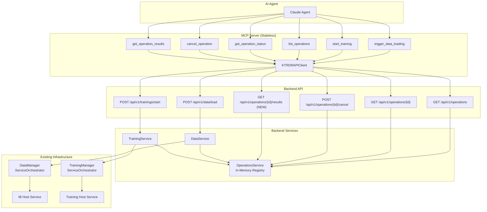
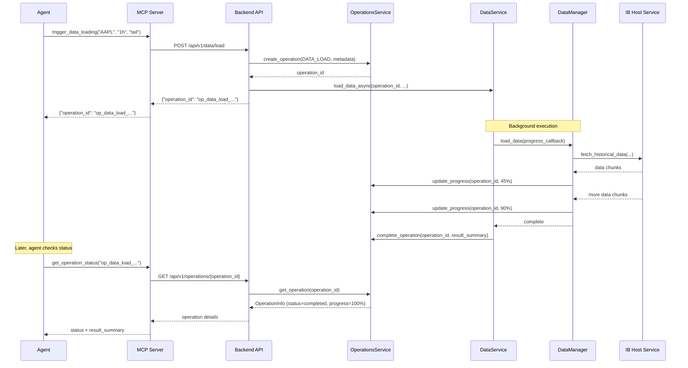
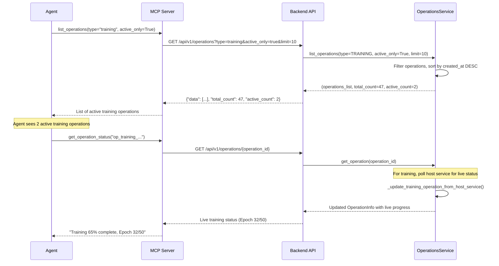
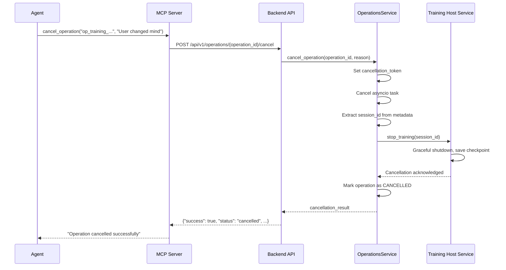

# MCP Async Operations Integration - Architecture Document

**Version**: 1.0
**Status**: Draft - In Review
**Last Updated**: 2025-10-04
**Phase**: 1 (MCP Integration Layer)
**Related**: [Requirements Document](./mcp-async-operations-requirements.md)

---

## 🎯 Architecture Principles

1. **Stateless MCP Layer** - MCP server is a pure pass-through, no state storage
2. **Leverage Existing Backend** - Use OperationsService as-is, minimal changes
3. **Simple HTTP Integration** - MCP → Backend API → OperationsService
4. **Type Safety** - Strong typing for operation states and responses
5. **Backward Compatibility** - Existing MCP tools continue to work

---

## System Architecture Overview



---

## Component Architecture

### 1. MCP Server Layer

**Location**: [mcp/src/server.py](../../mcp/src/server.py)

**Responsibility**: Expose MCP tools that call backend APIs

**What Already Exists** ✅:
- Basic tool structure and error handling pattern
- Tools like `get_market_data()`, `start_model_training()`, etc.
- API client integration

**What We're Adding** 🆕:
- 4 new tools: `list_operations()`, `get_operation_status()`, `cancel_operation()`, `get_operation_results()`
- 2 renamed/updated tools: `trigger_data_loading()` (was `load_data_from_source()`), `start_training()` (update to ensure returns operation_id)

**Tool Pattern** (Already Established ✅):
```python
@mcp.tool()
async def tool_name(...) -> dict[str, Any]:
    """Tool description for agent"""
    try:
        async with get_api_client() as client:
            result = await client.backend_method(...)
            return result
    except KTRDRAPIError as e:
        return {
            "success": False,
            "error": e.message,
            "details": e.details
        }
```

**Key Point**: This section describes the PATTERN we'll follow when adding new tools. The pattern itself already exists - we're just applying it to new operations management tools.

---

### 2. API Client Layer

**Current Issue**: `KTRDRAPIClient` is already 321 lines and growing. Adding more methods creates a monolithic class.

**Proposed Architecture** (Scalable):

#### Option A: Domain-Specific Client Classes (Recommended)
```python
# mcp/src/clients/base.py
class BaseAPIClient:
    """Shared HTTP client functionality"""
    def __init__(self, base_url: str, timeout: float):
        self.base_url = base_url
        self.timeout = timeout
        self.client: Optional[httpx.AsyncClient] = None

    async def _request(self, method: str, endpoint: str, **kwargs) -> dict[str, Any]:
        """Shared request logic with error handling"""
        # ... existing implementation

# mcp/src/clients/data_client.py
class DataAPIClient(BaseAPIClient):
    """Data-specific API operations"""
    async def get_cached_data(...) -> dict[str, Any]: ...
    async def load_data_operation(...) -> dict[str, Any]: ...
    async def get_data_info(...) -> dict[str, Any]: ...

# mcp/src/clients/training_client.py
class TrainingAPIClient(BaseAPIClient):
    """Training-specific API operations"""
    async def start_training(...) -> dict[str, Any]: ...
    async def get_training_status(...) -> dict[str, Any]: ...
    async def get_model_performance(...) -> dict[str, Any]: ...

# mcp/src/clients/operations_client.py
class OperationsAPIClient(BaseAPIClient):
    """Operations management API"""
    async def list_operations(...) -> dict[str, Any]: ...
    async def get_operation_status(...) -> dict[str, Any]: ...
    async def cancel_operation(...) -> dict[str, Any]: ...
    async def get_operation_results(...) -> dict[str, Any]: ...

# mcp/src/clients/__init__.py
class KTRDRAPIClient:
    """Facade combining all domain clients"""
    def __init__(self, base_url: str = KTRDR_API_URL, timeout: float = API_TIMEOUT):
        self.data = DataAPIClient(base_url, timeout)
        self.training = TrainingAPIClient(base_url, timeout)
        self.operations = OperationsAPIClient(base_url, timeout)
        # ... other domains

# Usage in MCP tools:
async with get_api_client() as client:
    result = await client.operations.list_operations(...)
    # or
    result = await client.training.start_training(...)
```

**Benefits**:
- ✅ Separation of concerns by domain
- ✅ Each client class is <100 lines
- ✅ Easy to test individual domains
- ✅ Clear ownership and navigation
- ✅ Backward compatible (facade pattern)

#### Option B: Keep Monolithic (Current Approach)
Add 4 new methods to existing `KTRDRAPIClient` (~30 lines total):
```python
class KTRDRAPIClient:
    # ... existing 321 lines ...

    # NEW: Operations methods
    async def list_operations(...) -> dict[str, Any]: ...
    async def get_operation_status(...) -> dict[str, Any]: ...
    async def cancel_operation(...) -> dict[str, Any]: ...
    async def get_operation_results(...) -> dict[str, Any]: ...
```

**Decision**: ✅ **Option A** - Domain-Specific Client Classes (better long-term scalability)

**Rationale**: Better separation of concerns, easier testing, clearer ownership, prevents monolithic growth

---

### 3. Backend API Layer

**Location**: [ktrdr/api/endpoints/](../../ktrdr/api/endpoints/)

#### 3.1 Existing Endpoints (Minimal Changes)

##### Data Endpoint
**File**: [ktrdr/api/endpoints/data.py](../../ktrdr/api/endpoints/data.py)

**Existing** (No Changes):
```python
@router.get("/data/{symbol}/{timeframe}")
async def get_data(...) -> dict[str, Any]:
    """Get cached data - synchronous, no operation_id"""
    # Returns OHLCV data immediately
```

```python
@router.post("/data/load")
async def load_data(...) -> dict[str, Any]:
    """Trigger data loading - async, returns operation_id"""
    # Already returns operation_id from OperationsService ✅
```

##### Training Endpoint
**File**: [ktrdr/api/endpoints/training.py](../../ktrdr/api/endpoints/training.py)

**Minor Update Needed**:
```python
@router.post("/trainings/start")
async def start_training(
    request: TrainingStartRequest,
    background_tasks: BackgroundTasks,
    training_service: TrainingService = Depends(get_training_service),
    operations_service: OperationsService = Depends(get_operations_service)
) -> dict[str, Any]:
    """Start training - returns operation_id"""

    # CHANGE: Ensure operation_id is returned in response
    result = await training_service.start_training(...)

    return {
        "success": True,
        "operation_id": result["operation_id"],  # ← Ensure this is present
        "session_id": result.get("session_id"),
        "message": "Training started"
    }
```

**Change Required**: ~5 lines - ensure `operation_id` is in response body

##### Operations Endpoints
**File**: [ktrdr/api/endpoints/operations.py](../../ktrdr/api/endpoints/operations.py)

**Existing** (No Changes):
```python
@router.get("/operations")
async def list_operations(...) -> OperationListResponse:
    """List operations with filters - already exists ✅"""

@router.get("/operations/{operation_id}")
async def get_operation(...) -> OperationStatusResponse:
    """Get operation status - already exists ✅"""

@router.post("/operations/{operation_id}/cancel")
async def cancel_operation(...) -> OperationCancelResponse:
    """Cancel operation - already exists ✅"""
```

**New Endpoint** (Phase 1):
```python
@router.get("/operations/{operation_id}/results")
async def get_operation_results(
    operation_id: str,
    operations_service: OperationsService = Depends(get_operations_service)
) -> dict[str, Any]:
    """Get operation results from result_summary"""

    operation = await operations_service.get_operation(operation_id)

    if not operation:
        raise HTTPException(status_code=404, detail="Operation not found")

    if operation.status not in [OperationStatus.COMPLETED, OperationStatus.FAILED]:
        raise HTTPException(
            status_code=400,
            detail=f"Operation not finished (status: {operation.status})"
        )

    return {
        "success": True,
        "operation_id": operation_id,
        "operation_type": operation.operation_type.value,
        "status": operation.status.value,
        "results": operation.result_summary or {}
    }
```

**Change Required**: ~20 lines - new endpoint

#### 3.2 API Endpoint Default Parameters

**File**: [ktrdr/api/endpoints/operations.py](../../ktrdr/api/endpoints/operations.py)

**Minor Update**:
```python
@router.get("/operations")
async def list_operations(
    operation_type: Optional[OperationType] = None,
    status: Optional[OperationStatus] = None,
    active_only: bool = False,
    limit: int = Query(10, ge=1, le=100),  # ← Change default from 100 to 10
    offset: int = Query(0, ge=0),
    operations_service: OperationsService = Depends(get_operations_service)
) -> OperationListResponse:
    """List operations"""
    # ... existing implementation
```

**Change Required**: 1 line - change default limit

---

### 4. Operations Service Layer

**Location**: [ktrdr/api/services/operations_service.py](../../ktrdr/api/services/operations_service.py)

**Status**: ✅ Already Exists - No Changes Needed

**Current Capabilities**:
```python
class OperationsService:
    # In-memory registry
    _operations: dict[str, OperationInfo] = {}
    _operation_tasks: dict[str, asyncio.Task] = {}
    _cancellation_coordinator: CancellationCoordinator

    # Already implemented methods ✅
    async def create_operation(...) -> OperationInfo
    async def start_operation(...) -> None
    async def update_progress(...) -> None
    async def complete_operation(...) -> None
    async def fail_operation(...) -> None
    async def cancel_operation(...) -> dict[str, Any]
    async def get_operation(...) -> Optional[OperationInfo]
    async def list_operations(...) -> tuple[list[OperationInfo], int, int]
    async def retry_operation(...) -> OperationInfo
    async def cleanup_old_operations(...) -> int
```

**Key Features Already Present**:
- ✅ In-memory operation tracking
- ✅ Progress updates (lock-free for performance)
- ✅ Cancellation with propagation to host services
- ✅ Live status updates for training (polls host service)
- ✅ Pagination with sorting (most recent first)
- ✅ Filtering by type, status, active_only

**No Changes Required** - This is the core that already works!

---

### 5. Service Layer Integration

#### 5.1 Data Service
**Location**: [ktrdr/api/services/data_service.py](../../ktrdr/api/services/data_service.py)

**Current Flow** (Already Correct ✅):
```
API Endpoint → DataService → OperationsService.create_operation()
                           → DataManager.load_data(...)
                           → OperationsService.update_progress()
                           → OperationsService.complete_operation()
```

**No Changes Needed** - Already integrates with OperationsService

#### 5.2 Training Service
**Location**: [ktrdr/api/services/training_service.py](../../ktrdr/api/services/training_service.py)

**Current Flow**:
```
API Endpoint → TrainingService → OperationsService.create_operation()
                               → TrainingManager.train_multi_symbol_strategy(...)
                               → OperationsService.update_progress()
                               → OperationsService.complete_operation()
```

**Minor Update Needed**: Ensure `operation_id` is returned in `start_training()` response

**Verification Question for Karl**: Does `TrainingService.start_training()` already integrate with OperationsService? If so, we just need to ensure the API endpoint returns the `operation_id`.

---

## Data Flow Diagrams

### Flow 1: Agent Triggers Data Loading



### Flow 2: Agent Lists Operations



### Flow 3: Agent Cancels Operation



---

## Error Handling Architecture

### MCP Layer Error Handling

```python
@mcp.tool()
async def mcp_tool(...) -> dict[str, Any]:
    """MCP tool with error handling"""
    try:
        async with get_api_client() as client:
            result = await client.backend_method(...)
            return result

    except KTRDRAPIError as e:
        # Backend returned structured error
        logger.error(f"API error: {e.message}", error=str(e))
        return {
            "success": False,
            "error": e.message,
            "status_code": e.status_code,
            "details": e.details
        }

    except Exception as e:
        # Unexpected error
        logger.error(f"Unexpected error: {str(e)}")
        return {
            "success": False,
            "error": f"Unexpected error: {str(e)}"
        }
```

### Backend Error Responses

**Operation Not Found**:
```json
{
  "success": false,
  "error": "Operation not found: op_training_20251004_999999_invalid",
  "status_code": 404
}
```

**Operation Not Complete**:
```json
{
  "success": false,
  "error": "Operation not finished (status: running)",
  "operation_status": "running",
  "progress_percentage": 45.2
}
```

**Operation Failed**:
```json
{
  "success": true,
  "data": {
    "operation_id": "op_training_...",
    "status": "failed",
    "error_message": "Training failed: CUDA out of memory at epoch 6/50",
    "progress": {"percentage": 12.5, "current_step": "Epoch 6/50 (failed)"}
  }
}
```

---

## Security Considerations

### Phase 1 (No Authentication)
- MCP server runs locally on user's machine
- Backend API is localhost-only (Docker network)
- No external access → No authentication needed

### Phase 2 (Future)
- If exposing backend externally → Add API key authentication
- If multi-user → Add user-based operation isolation
- Consider rate limiting for operation creation

---

## Performance Characteristics

### Expected Response Times (Phase 1)

| Operation | Expected Time | Notes |
|-----------|---------------|-------|
| `trigger_data_loading()` | <1s | Returns operation_id immediately |
| `start_training()` | <2s | Returns operation_id immediately |
| `list_operations()` | <500ms | In-memory lookup, up to 1000 ops |
| `get_operation_status()` | <500ms | In-memory + optional host service poll |
| `cancel_operation()` | <1s | Includes host service cancellation |
| `get_operation_results()` | <200ms | In-memory result_summary |

### Scalability Limits (Phase 1)

| Metric | Limit | Notes |
|--------|-------|-------|
| Concurrent operations | 100+ | Limited by backend resources |
| Total tracked operations | 10,000+ | In-memory dict, ~100MB RAM |
| Concurrent agents | 10+ | HTTP connection pooling |
| Operations per agent per hour | 100+ | No rate limiting |

### Phase 2 Improvements
- PostgreSQL persistence → Unlimited operation history
- Configurable retention policies
- Better query performance for large datasets

---

## Architecture Findings (Research Complete ✅)

### Finding 1: Training Service Already Integrated ✅
**Status**: `TrainingService` ALREADY integrates with `OperationsService` via `ServiceOrchestrator.start_managed_operation()`

**How it works**:
1. `TrainingService.start_training()` calls `self.start_managed_operation()` ([training_service.py:103](../../ktrdr/api/services/training_service.py#L103))
2. `start_managed_operation()` creates operation via `OperationsService.create_operation()` ([service_orchestrator.py:996](../../ktrdr/async_infrastructure/service_orchestrator.py#L996))
3. Returns `{"operation_id": "...", "status": "started", "message": "..."}`
4. `start_training()` receives this and adds `task_id` field (same as operation_id)

**Current Response** ([training_service.py:123-133](../../ktrdr/api/services/training_service.py#L123-L133)):
```python
return {
    "success": True,
    "task_id": operation_id,  # ← Already has operation_id, just named task_id
    "status": "training_started",
    "message": message,
    # ... other fields
}
```

**What We Need**: Add `"operation_id": operation_id` to response (keep `task_id` for backward compat)

**Change Required**: 1 line - add to return dict

### Finding 2: Result Summary Structure ✅
**Current Structure** (already correct, no changes needed):

**Data Loading** - Populated in DataService:
- `bars_loaded`, `date_range`, `gaps_filled`, `data_source`, `storage_location`

**Training** - Populated in TrainingService:
- `training_metrics`, `validation_metrics`, `artifacts` (model_path, analytics_directory)

**Verdict**: Structure is already correct ✅

### Finding 3: Progress Context Structure ✅
**Current Implementation** (from ProgressRenderer classes):

Each service has its own ProgressRenderer that defines domain-specific context:
- **Training**: `epoch_index`, `total_epochs`, `batch_number`, `batch_total`, `epoch_metrics`, `gpu_usage` (optional)
- **Data Loading**: `symbol`, `timeframe`, `mode`, `segment_index`, `total_segments`

**Verdict**: Already standardized per domain ✅ Progress context is defined by each ProgressRenderer implementation.

---

## Implementation Checklist

### MCP Server Changes
- [ ] Add `trigger_data_loading()` tool (rename existing `load_data_from_source()`)
- [ ] Update `start_training()` tool (ensure returns operation_id)
- [ ] Add `list_operations()` tool (new)
- [ ] Add `get_operation_status()` tool (new)
- [ ] Add `cancel_operation()` tool (new)
- [ ] Add `get_operation_results()` tool (new)

### API Client Changes
- [ ] Add `list_operations()` method
- [ ] Add `get_operation_status()` method
- [ ] Add `cancel_operation()` method
- [ ] Add `get_operation_results()` method

### Backend API Changes
- [ ] Verify training endpoint returns `operation_id`
- [ ] Add `/operations/{operation_id}/results` endpoint
- [ ] Change default `limit=10` in operations list endpoint

### Backend Service Changes
- [ ] Verify `TrainingService` integrates with `OperationsService`
- [ ] Ensure `result_summary` is populated correctly for all operation types

### Testing
- [ ] Test all MCP tools with agent
- [ ] Test pagination (limit, offset)
- [ ] Test filtering (type, status, active_only)
- [ ] Test cancellation propagation
- [ ] Test error scenarios (not found, not complete, etc.)
- [ ] Test backward compatibility (existing tools still work)

---

**Next Steps**: Address open questions, then move to implementation plan.
