# MCP OpenAPI Validation - Architecture Document

**Version**: 1.0
**Status**: Draft - In Review
**Last Updated**: 2025-10-05
**Phase**: API Contract Validation
**Related**: [Implementation Document](./IMPLEMENTATION.md)

---

## 🎯 Architecture Principles

1. **Prevention Over Detection** - Catch signature mismatches before they reach production
2. **CI Integration** - Automated validation in pre-commit and GitHub Actions
3. **Type Safety** - Validate MCP tool signatures against backend OpenAPI spec
4. **Developer Experience** - Clear error messages showing exact mismatches
5. **Fail Fast** - Block commits/PRs when contracts don't match

---

## Problem Statement

### Current Issue

MCP tool signatures can drift from backend API contracts without detection:

**Example from PR #74**:
```python
# MCP Tool (WRONG)
async def start_training(
    timeframe: str,        # ❌ Backend expects list[str]
    config: dict,          # ❌ Backend expects strategy_name: str
    ...
)

# Backend API Contract (CORRECT)
POST /api/v1/trainings/start
{
    "timeframes": ["1h", "4h"],     # Plural, list
    "strategy_name": "mlp_basic",   # Top-level string, not nested config
    ...
}
```

**Result**: Runtime errors (HTTP 422) that could have been caught at development time.

### Why OpenAPI Validation?

**OpenAPI Specification** is auto-generated by FastAPI from backend code:
- **Source of Truth**: Reflects actual API contracts
- **Always Up-to-Date**: Generated from Pydantic models
- **Machine-Readable**: Can be programmatically compared

**Validation Script** compares MCP tool signatures against OpenAPI spec:
- **Detects Mismatches**: Parameter names, types, required/optional
- **Prevents Drift**: Fails CI when contracts don't align
- **Clear Errors**: Shows exactly what's wrong and how to fix it

---

## System Architecture Overview


---

## Component Architecture

### 1. OpenAPI Spec Source

**Backend**: FastAPI automatically generates OpenAPI spec from Pydantic models

**Endpoint**: `GET /openapi.json`

**Example Structure**:
```json
{
  "openapi": "3.1.0",
  "paths": {
    "/api/v1/trainings/start": {
      "post": {
        "operationId": "start_training_api_v1_trainings_start_post",
        "requestBody": {
          "content": {
            "application/json": {
              "schema": {
                "$ref": "#/components/schemas/TrainingStartRequest"
              }
            }
          }
        }
      }
    }
  },
  "components": {
    "schemas": {
      "TrainingStartRequest": {
        "type": "object",
        "properties": {
          "symbols": {
            "type": "array",
            "items": {"type": "string"}
          },
          "timeframes": {
            "type": "array",
            "items": {"type": "string"}
          },
          "strategy_name": {
            "type": "string"
          },
          "start_date": {
            "type": "string",
            "format": "date"
          }
        },
        "required": ["symbols", "timeframes", "strategy_name"]
      }
    }
  }
}
```

---

### 2. MCP Tool Signature Parser

**Location**: `scripts/validate_mcp_signatures.py`

**Responsibility**: Parse Python MCP tool signatures into comparable format

**What It Does**:
```python
import ast
import inspect
from typing import Any, Optional

class MCPToolParser:
    """Parse MCP tool signatures from server.py"""

    def parse_tools(self, server_file: str) -> dict[str, ToolSignature]:
        """
        Extract all @mcp.tool() decorated functions.

        Returns:
            Dict mapping tool names to their signatures
        """
        with open(server_file) as f:
            tree = ast.parse(f.read())

        tools = {}
        for node in ast.walk(tree):
            if isinstance(node, ast.FunctionDef):
                # Check for @mcp.tool() decorator
                if self._has_mcp_decorator(node):
                    sig = self._extract_signature(node)
                    tools[node.name] = sig

        return tools

    def _extract_signature(self, func_node: ast.FunctionDef) -> ToolSignature:
        """
        Extract parameter names, types, and defaults.

        Returns:
            ToolSignature with:
            - name: str
            - parameters: dict[str, ParameterInfo]
            - return_type: Optional[str]
        """
        params = {}
        for arg in func_node.args.args:
            if arg.arg == "self":
                continue

            param_info = ParameterInfo(
                name=arg.arg,
                type=self._get_type_annotation(arg.annotation),
                required=self._is_required(arg, func_node.args.defaults),
                default=self._get_default_value(arg, func_node.args.defaults)
            )
            params[arg.arg] = param_info

        return ToolSignature(
            name=func_node.name,
            parameters=params,
            return_type=self._get_type_annotation(func_node.returns)
        )
```

**Output Example**:
```python
{
    "start_training": ToolSignature(
        name="start_training",
        parameters={
            "symbols": ParameterInfo(
                name="symbols",
                type="list[str]",
                required=True,
                default=None
            ),
            "timeframes": ParameterInfo(
                name="timeframes",
                type="list[str]",
                required=False,
                default=["1h"]
            ),
            "strategy_name": ParameterInfo(
                name="strategy_name",
                type="str",
                required=True,
                default=None
            )
        },
        return_type="dict[str, Any]"
    )
}
```

---

### 3. Signature Comparator

**Location**: `scripts/validate_mcp_signatures.py`

**Responsibility**: Compare MCP signatures against OpenAPI spec

**What It Does**:

```python
class SignatureComparator:
    """Compare MCP tool signatures against OpenAPI spec"""

    def __init__(self, openapi_spec: dict):
        self.spec = openapi_spec
        self.endpoint_map = self._build_endpoint_mapping()

    def _build_endpoint_mapping(self) -> dict[str, str]:
        """
        Map MCP tool names to backend endpoints.

        Returns:
            {
                "start_training": "/api/v1/trainings/start",
                "trigger_data_loading": "/api/v1/data/load",
                "list_operations": "/api/v1/operations",
                ...
            }
        """
        # Could be config file or convention-based mapping
        return {
            "start_training": "/api/v1/trainings/start",
            "trigger_data_loading": "/api/v1/data/load",
            "list_operations": "/api/v1/operations",
            "get_operation_status": "/api/v1/operations/{operation_id}",
            "cancel_operation": "/api/v1/operations/{operation_id}/cancel",
            "get_operation_results": "/api/v1/operations/{operation_id}/results",
        }

    def compare(
        self,
        tool_name: str,
        tool_sig: ToolSignature
    ) -> list[ValidationError]:
        """
        Compare tool signature against OpenAPI spec.

        Returns:
            List of validation errors (empty if valid)
        """
        errors = []

        # Get endpoint from mapping
        endpoint = self.endpoint_map.get(tool_name)
        if not endpoint:
            return [ValidationError(
                tool=tool_name,
                error_type="no_mapping",
                message=f"No endpoint mapping found for tool '{tool_name}'"
            )]

        # Get schema from OpenAPI spec
        schema = self._get_request_schema(endpoint)
        if not schema:
            return [ValidationError(
                tool=tool_name,
                error_type="no_schema",
                message=f"No schema found for endpoint '{endpoint}'"
            )]

        # Compare parameters
        errors.extend(self._compare_parameters(tool_sig, schema))

        return errors

    def _compare_parameters(
        self,
        tool_sig: ToolSignature,
        schema: dict
    ) -> list[ValidationError]:
        """
        Compare tool parameters against schema properties.

        Checks:
        1. Required parameters match
        2. Parameter types match
        3. No extra required parameters in tool
        4. Optional parameters compatible
        """
        errors = []

        # Get required fields from schema
        required_fields = set(schema.get("required", []))
        tool_required = {
            name for name, param in tool_sig.parameters.items()
            if param.required
        }

        # Check for missing required parameters
        missing = required_fields - tool_required
        if missing:
            errors.append(ValidationError(
                tool=tool_sig.name,
                error_type="missing_required",
                message=f"Missing required parameters: {missing}",
                details={
                    "schema_requires": list(required_fields),
                    "tool_has": list(tool_required),
                    "missing": list(missing)
                }
            ))

        # Check for type mismatches
        for param_name, param_info in tool_sig.parameters.items():
            if param_name not in schema["properties"]:
                continue  # Extra params OK if optional

            schema_type = self._openapi_to_python_type(
                schema["properties"][param_name]
            )
            if param_info.type != schema_type:
                errors.append(ValidationError(
                    tool=tool_sig.name,
                    error_type="type_mismatch",
                    message=f"Parameter '{param_name}' type mismatch",
                    details={
                        "parameter": param_name,
                        "schema_expects": schema_type,
                        "tool_has": param_info.type
                    }
                ))

        return errors

    def _openapi_to_python_type(self, schema: dict) -> str:
        """
        Convert OpenAPI type to Python type annotation.

        Examples:
            {"type": "string"} → "str"
            {"type": "array", "items": {"type": "string"}} → "list[str]"
            {"type": "integer"} → "int"
            {"type": "boolean"} → "bool"
        """
        if schema["type"] == "array":
            item_type = self._openapi_to_python_type(schema["items"])
            return f"list[{item_type}]"
        elif schema["type"] == "object":
            return "dict[str, Any]"
        else:
            return {
                "string": "str",
                "integer": "int",
                "number": "float",
                "boolean": "bool"
            }[schema["type"]]
```

---

### 4. Validation Report Generator

**Responsibility**: Generate human-readable validation reports

**Error Report Example**:

```
━━━━━━━━━━━━━━━━━━━━━━━━━━━━━━━━━━━━━━━━━━━━━━━━━━━━━━━━━━━━━━━━━━
MCP TOOL SIGNATURE VALIDATION FAILED
━━━━━━━━━━━━━━━━━━━━━━━━━━━━━━━━━━━━━━━━━━━━━━━━━━━━━━━━━━━━━━━━━━

❌ start_training (mcp/src/server.py:L142)
   Endpoint: POST /api/v1/trainings/start

   ERROR: Type mismatch for parameter 'timeframes'
   ├─ Backend expects: list[str]
   └─ Tool has:        str

   ERROR: Missing required parameter 'strategy_name'
   ├─ Backend requires: strategy_name (str)
   └─ Tool has:         config (dict[str, Any])

   FIX:
   Change tool signature from:
       async def start_training(
           timeframe: str,
           config: dict[str, Any],
           ...
       )

   To:
       async def start_training(
           timeframes: list[str],
           strategy_name: str,
           ...
       )

━━━━━━━━━━━━━━━━━━━━━━━━━━━━━━━━━━━━━━━━━━━━━━━━━━━━━━━━━━━━━━━━━━

❌ trigger_data_loading (mcp/src/server.py:L89)
   Endpoint: POST /api/v1/data/load

   ERROR: Parameter name mismatch
   ├─ Backend expects: 'timeframe' (singular)
   └─ Tool has:        'timeframes' (plural)

   FIX:
   Change parameter name from 'timeframes' to 'timeframe'

━━━━━━━━━━━━━━━━━━━━━━━━━━━━━━━━━━━━━━━━━━━━━━━━━━━━━━━━━━━━━━━━━━

SUMMARY:
  Total tools validated: 12
  ✅ Valid tools:         10
  ❌ Invalid tools:       2

VALIDATION FAILED - Fix errors above before committing.
━━━━━━━━━━━━━━━━━━━━━━━━━━━━━━━━━━━━━━━━━━━━━━━━━━━━━━━━━━━━━━━━━━
```

**Success Report Example**:

```
━━━━━━━━━━━━━━━━━━━━━━━━━━━━━━━━━━━━━━━━━━━━━━━━━━━━━━━━━━━━━━━━━━
MCP TOOL SIGNATURE VALIDATION PASSED
━━━━━━━━━━━━━━━━━━━━━━━━━━━━━━━━━━━━━━━━━━━━━━━━━━━━━━━━━━━━━━━━━━

✅ All 12 MCP tools match backend API contracts

Validated tools:
  ✅ start_training
  ✅ trigger_data_loading
  ✅ list_operations
  ✅ get_operation_status
  ✅ cancel_operation
  ✅ get_operation_results
  ✅ get_market_data
  ✅ get_symbols
  ✅ get_indicators
  ✅ get_strategies
  ✅ list_trained_models
  ✅ health_check

━━━━━━━━━━━━━━━━━━━━━━━━━━━━━━━━━━━━━━━━━━━━━━━━━━━━━━━━━━━━━━━━━━
```

---

### 5. CI Integration

#### Pre-Commit Hook

**Location**: `.pre-commit-config.yaml`

```yaml
repos:
  - repo: local
    hooks:
      - id: validate-mcp-signatures
        name: Validate MCP Tool Signatures
        entry: uv run python scripts/validate_mcp_signatures.py
        language: system
        files: ^mcp/src/server\.py$
        pass_filenames: false
        stages: [commit]
```

**Behavior**:
- Runs automatically on `git commit` if `mcp/src/server.py` modified
- Requires backend running at `http://localhost:8000`
- Blocks commit if validation fails
- Can skip with `git commit --no-verify` (not recommended)

#### GitHub Actions

**Location**: `.github/workflows/mcp-validation.yml`

```yaml
name: MCP Signature Validation

on:
  pull_request:
    paths:
      - 'mcp/src/server.py'
      - 'mcp/src/clients/**'
      - 'ktrdr/api/**'
  push:
    branches: [main]

jobs:
  validate:
    runs-on: ubuntu-latest

    services:
      backend:
        image: ktrdr-backend:latest
        ports:
          - 8000:8000
        options: >-
          --health-cmd "curl -f http://localhost:8000/health || exit 1"
          --health-interval 10s
          --health-timeout 5s
          --health-retries 5

    steps:
      - uses: actions/checkout@v4

      - name: Set up Python
        uses: actions/setup-python@v5
        with:
          python-version: '3.12'

      - name: Install uv
        run: pip install uv

      - name: Install dependencies
        run: uv sync

      - name: Wait for backend
        run: |
          timeout 60 bash -c 'until curl -f http://localhost:8000/health; do sleep 2; done'

      - name: Validate MCP signatures
        run: |
          uv run python scripts/validate_mcp_signatures.py --strict

      - name: Upload validation report
        if: failure()
        uses: actions/upload-artifact@v4
        with:
          name: mcp-validation-report
          path: validation-report.txt
```

**Behavior**:
- Runs on PRs affecting MCP tools or backend APIs
- Starts backend in Docker service
- Validates signatures against running backend
- Blocks merge if validation fails
- Uploads detailed report as artifact

---

## Data Flow Diagrams

### Flow 1: Development Workflow

```mermaid
sequenceDiagram
    participant Dev as Developer
    participant Git as Git
    participant Hook as Pre-commit Hook
    participant Script as Validation Script
    participant Backend as Backend API
    participant Report as Terminal

    Dev->>Git: git commit -m "Update MCP tool"
    Git->>Hook: Trigger pre-commit hook
    Hook->>Script: Run validate_mcp_signatures.py

    Script->>Backend: GET /openapi.json
    Backend-->>Script: OpenAPI specification

    Script->>Script: Parse mcp/src/server.py
    Script->>Script: Compare signatures vs spec

    alt Validation passes
        Script-->>Report: ✅ All tools valid
        Report-->>Hook: Exit 0
        Hook-->>Git: Allow commit
        Git-->>Dev: Commit created
    else Validation fails
        Script-->>Report: ❌ Detailed error report
        Report-->>Hook: Exit 1
        Hook-->>Git: Block commit
        Git-->>Dev: Commit rejected - fix errors
    end
```



### Flow 2: CI Validation

```mermaid
sequenceDiagram
    participant Dev as Developer
    participant GH as GitHub
    participant CI as GitHub Actions
    participant Docker as Backend Service
    participant Script as Validation Script

    Dev->>GH: Push to PR
    GH->>CI: Trigger workflow

    CI->>Docker: Start backend service
    Docker->>Docker: Health check
    Docker-->>CI: Ready

    CI->>Script: Run validation
    Script->>Docker: GET /openapi.json
    Docker-->>Script: OpenAPI spec

    Script->>Script: Validate all tools

    alt All valid
        Script-->>CI: Exit 0
        CI-->>GH: ✅ Check passed
        GH-->>Dev: PR can be merged
    else Validation failed
        Script-->>CI: Exit 1 + report
        CI->>CI: Upload artifact
        CI-->>GH: ❌ Check failed
        GH-->>Dev: PR blocked - see report
    end
```



---

## Configuration

### Endpoint Mapping File

**Location**: `mcp/endpoint_mapping.json`

```json
{
  "start_training": {
    "endpoint": "/api/v1/trainings/start",
    "method": "POST",
    "critical": true
  },
  "trigger_data_loading": {
    "endpoint": "/api/v1/data/load",
    "method": "POST",
    "critical": true
  },
  "list_operations": {
    "endpoint": "/api/v1/operations",
    "method": "GET",
    "critical": false
  },
  "get_operation_status": {
    "endpoint": "/api/v1/operations/{operation_id}",
    "method": "GET",
    "critical": false,
    "path_params": ["operation_id"]
  },
  "get_market_data": {
    "endpoint": "/api/v1/data/{symbol}/{timeframe}",
    "method": "GET",
    "critical": false,
    "path_params": ["symbol", "timeframe"]
  }
}
```

**Why Explicit Mapping**:
- MCP tool names may differ from endpoint names
- Path parameters need special handling
- Criticality flag for prioritizing errors
- Easier to maintain than convention-based mapping

---

## Error Handling Architecture

### Error Types

| Error Type | Severity | Description |
|------------|----------|-------------|
| `missing_required` | CRITICAL | Backend requires param not in tool |
| `type_mismatch` | CRITICAL | Parameter type doesn't match |
| `name_mismatch` | HIGH | Parameter name differs (e.g., singular vs plural) |
| `no_mapping` | MEDIUM | Tool not in endpoint_mapping.json |
| `no_schema` | MEDIUM | Endpoint not in OpenAPI spec |
| `extra_param` | LOW | Tool has optional param not in backend |

### Error Prioritization

**CRITICAL errors** (block commit/merge):
- Missing required parameters
- Type mismatches for required parameters
- Type mismatches for critical operations (training, data loading)

**HIGH errors** (warn but allow):
- Parameter name differences
- Type mismatches for optional parameters

**MEDIUM/LOW errors** (informational):
- Missing endpoint mappings
- Extra optional parameters

---

## Performance Characteristics

### Validation Speed

| Component | Time | Notes |
|-----------|------|-------|
| Fetch OpenAPI spec | ~50ms | Local backend, cached HTTP |
| Parse MCP tools | ~100ms | AST parsing of server.py |
| Compare signatures | ~20ms | All 12 tools |
| Generate report | ~10ms | Terminal formatting |
| **Total** | **~180ms** | Acceptable for pre-commit hook |

### CI Overhead

| Step | Time | Notes |
|------|------|-------|
| Backend startup | ~15s | Docker service health check |
| Validation | ~200ms | Same as local |
| Report upload | ~2s | If validation fails |
| **Total** | **~17s** | Minimal CI overhead |

---

## Architecture Decisions

### Decision 1: Why Not Manual Testing?

**Alternative**: Manually test MCP tools against backend

**Why Not**:
- ❌ Error-prone (humans miss things)
- ❌ Time-consuming (20+ minutes per change)
- ❌ No enforcement (devs can skip)
- ❌ Doesn't prevent drift

**Why Automated**:
- ✅ Fast (<1 second validation)
- ✅ Consistent (same checks every time)
- ✅ Enforced (CI blocks bad PRs)
- ✅ Prevents drift automatically

### Decision 2: Why OpenAPI vs Manual Config?

**Alternative**: Maintain manual mapping config

**Why OpenAPI**:
- ✅ Single source of truth (backend code)
- ✅ Always up-to-date (auto-generated)
- ✅ No manual maintenance
- ✅ Catches backend changes automatically

### Decision 3: Why Pre-Commit Hook?

**Alternative**: Only validate in CI

**Why Pre-Commit**:
- ✅ Faster feedback (seconds vs minutes)
- ✅ Prevents bad commits locally
- ✅ Reduces CI failures
- ✅ Better developer experience

**CI Still Needed**:
- Validates PRs from other contributors
- Catches issues if pre-commit skipped
- Required for merge protection

---

## Implementation Checklist

### Validation Script
- [ ] AST parser for MCP tool signatures
- [ ] OpenAPI spec fetcher
- [ ] Type mapping (OpenAPI → Python)
- [ ] Signature comparator
- [ ] Error report generator
- [ ] CLI interface with --strict flag

### Configuration
- [ ] endpoint_mapping.json file
- [ ] Critical operation flags
- [ ] Path parameter handling

### CI Integration
- [ ] Pre-commit hook configuration
- [ ] GitHub Actions workflow
- [ ] Backend service setup in CI
- [ ] Artifact upload for reports

### Testing
- [ ] Unit tests for parser
- [ ] Unit tests for comparator
- [ ] Integration test with real backend
- [ ] Test error reporting

### Documentation
- [ ] README with usage instructions
- [ ] Example error reports
- [ ] Troubleshooting guide

---

**Next**: See [Implementation Plan](./IMPLEMENTATION.md) for detailed task breakdown.
