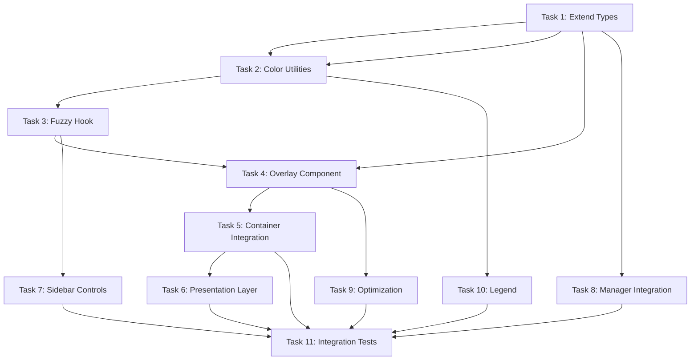

# KTRDR v3 Slice 4.5: Fuzzy Overlay Rendering - UPDATED Task Breakdown

## Overview
This task breakdown implements fuzzy set visualization as overlays on indicator charts using our **React hooks + Context architecture**. Each task is atomic, testable, and results in a committable unit of work. The implementation focuses on performant, user-controllable overlays with smooth rendering that follows our existing Container/Presentation pattern.

## Prerequisites
- Completed Slice 4 with fuzzy data available via `/api/v1/fuzzy/data` API
- Working indicator charts (RSI via OscillatorChart)
- TradingView Lightweight Charts v5 with AreaSeries support
- TypeScript/React frontend with Container/Presentation architecture
- Existing `useIndicatorManager` and custom hooks patterns

---

## Task 1: Extend IndicatorInfo Type
**File**: `frontend/src/store/indicatorRegistry.ts`
**Commit**: "feat: Add fuzzy properties to IndicatorInfo type"

```
1. Extend IndicatorInfo interface:
   - Add fuzzyVisible?: boolean (default: false)
   - Add fuzzyOpacity?: number (0.0-1.0, default: 0.3)
   - Add fuzzyColorScheme?: string (default: 'default')
2. Update createIndicatorInstance to include fuzzy defaults
3. Update type references in existing components
4. Add JSDoc comments for fuzzy properties
5. Update indicator config creation helpers
6. Add type tests for fuzzy properties
7. Update mock indicator generators
```

**Test**: `indicatorRegistry.test.ts` - Verify type extensions and defaults

---

## Task 2: Fuzzy Color Utility System
**File**: `frontend/src/utils/fuzzyColors.ts`
**Commit**: "feat: Create fuzzy color utility system"

```
1. Create fuzzy color schemes:
   - default: { low: 'blue', neutral: 'gray', high: 'red' }
   - monochrome: grayscale variations
   - trading: green/red for bullish/bearish
2. Create getFuzzyColor(setName: string, scheme: string) function
3. Add opacity calculation helpers
4. Support light/dark theme detection
5. Add color accessibility utilities
6. Create hexToRgba conversion helpers
7. Add comprehensive color tests
```

**Test**: `fuzzyColors.test.ts` - Test color calculations and themes

---

## Task 3: Custom Fuzzy Overlay Hook
**File**: `frontend/src/hooks/useFuzzyOverlay.ts`
**Commit**: "feat: Add useFuzzyOverlay hook following React patterns"

```
1. Create useFuzzyOverlay hook signature:
   - Parameters: (indicatorId: string, symbol: string, timeframe: string)
   - Returns: { fuzzyData, isLoading, error, isVisible, toggleVisibility, opacity, setOpacity }
2. Implement data fetching:
   - Use existing getFuzzyOverlay API client
   - Manage loading/error states with useState
   - Cache responses to prevent duplicate requests
3. Add local visibility controls:
   - Local useState for fuzzyVisible (not global store)
   - Local useState for opacity (0.0-1.0)
   - Local useState for color scheme
4. Handle data transformation:
   - Convert API response to chart-ready format
   - Add proper TypeScript typing
   - Handle empty/missing data gracefully
5. Add cleanup and optimization:
   - useEffect cleanup on unmount
   - useMemo for expensive transformations
   - useCallback for stable function references
6. Follow existing hook patterns in codebase
7. Add comprehensive hook tests
```

**Test**: `useFuzzyOverlay.test.tsx` - Test hook behavior, state management

---

## Task 4: Reusable Fuzzy Overlay Component
**File**: `frontend/src/components/presentation/charts/FuzzyOverlay.tsx`
**Commit**: "feat: Create FuzzyOverlay presentation component"

```
1. Create FuzzyOverlay component following Presentation pattern:
   - Props: data, colorScheme, opacity, visible, chartInstance
   - Pure component - no internal state or side effects
   - Receives all data via props from container
2. Implement TradingView Lightweight Charts integration:
   - Use AreaSeries for fuzzy bands
   - Apply proper z-index (behind indicator lines)
   - Handle series creation/removal cleanly
3. Add rendering logic:
   - Convert membership data to AreaSeries data
   - Apply colors from fuzzyColors utility
   - Handle multiple fuzzy sets per indicator
4. Optimize performance:
   - React.memo for re-render prevention
   - Use refs for chart series management
   - Efficient series update logic
5. Handle edge cases:
   - Missing chart instance
   - Empty fuzzy data
   - Series cleanup on unmount
6. Add comprehensive component tests
7. Follow existing chart component patterns
```

**Test**: `FuzzyOverlay.test.tsx` - Test rendering, chart integration

---

## Task 5: Container Integration - OscillatorChartContainer
**File**: `frontend/src/components/containers/OscillatorChartContainer.tsx`
**Commit**: "feat: Add fuzzy overlay integration to oscillator container"

```
1. Import and use useFuzzyOverlay hook:
   - Call hook for each oscillator indicator
   - Pass symbol, timeframe from container props
   - Manage fuzzy data state in container
2. Extend data flow to presentation component:
   - Pass fuzzyData, fuzzyVisible, fuzzyOpacity as props
   - Follow existing Container/Presentation pattern
   - No changes to presentation component interface
3. Add fuzzy data fetching:
   - Fetch fuzzy data when indicators change
   - Handle loading states appropriately
   - Integrate with existing error handling
4. Update chart data calculation:
   - Fetch indicator data and fuzzy data in parallel
   - Optimize for performance with useMemo
   - Prevent unnecessary re-fetches
5. Follow existing container patterns:
   - Use same useCallback patterns
   - Same error handling approach
   - Same loading state management
6. Add container-level tests
7. Maintain backward compatibility
```

**Test**: `OscillatorChartContainer.test.tsx` - Test fuzzy integration

---

## Task 6: Presentation Layer - OscillatorChart Integration
**File**: `frontend/src/components/presentation/charts/OscillatorChart.tsx`
**Commit**: "feat: Add fuzzy overlay rendering to OscillatorChart"

```
1. Add fuzzy props to OscillatorChart interface:
   - fuzzyData?: FuzzyOverlayData | null
   - fuzzyVisible?: boolean
   - fuzzyOpacity?: number
   - fuzzyColorScheme?: string
2. Import and render FuzzyOverlay component:
   - Conditionally render when fuzzyData exists and fuzzyVisible is true
   - Pass chart instance and fuzzy data as props
   - Position with proper z-index (behind indicator lines)
3. Follow presentation component pattern:
   - No internal state - all data from props
   - No API calls or side effects
   - Pure rendering logic only
4. Add proper chart lifecycle management:
   - Render overlay after chart is created
   - Clean up on chart destruction
   - Handle chart resize events
5. Maintain existing chart features:
   - Time synchronization works seamlessly
   - Crosshair interactions preserved
   - Chart performance maintained
6. Add conditional rendering logic
7. Test rendering with/without fuzzy data
```

**Test**: `OscillatorChart.test.tsx` - Test overlay rendering, props handling

---

## Task 7: Indicator Controls UI Enhancement
**File**: `frontend/src/components/presentation/sidebar/IndicatorItem.tsx`
**Commit**: "feat: Add fuzzy toggle controls to indicator sidebar"

```
1. Add fuzzy controls to existing IndicatorItem:
   - Fuzzy visibility toggle (icon button)
   - Opacity slider (collapsible)
   - Visual indicators when fuzzy is active
2. Follow existing IndicatorItem patterns:
   - Use same styling approach
   - Same callback prop pattern
   - Same responsive design
3. Add new callback props:
   - onToggleFuzzy?: (indicatorId: string) => void
   - onFuzzyOpacityChange?: (indicatorId: string, opacity: number) => void
4. Integrate with existing parameter controls:
   - Add fuzzy section to parameter panel
   - Use same expand/collapse behavior
   - Same visual hierarchy
5. Add accessibility features:
   - Proper ARIA labels
   - Keyboard navigation
   - Screen reader support
6. Maintain existing functionality
7. Add UI interaction tests
```

**Test**: `IndicatorItem.test.tsx` - Test fuzzy controls, callbacks

---

## Task 8: Integration with useIndicatorManager
**File**: `frontend/src/hooks/useIndicatorManager.ts`
**Commit**: "feat: Add fuzzy state management to useIndicatorManager"

```
1. Add fuzzy methods to useIndicatorManager:
   - toggleFuzzyVisibility(indicatorId: string)
   - setFuzzyOpacity(indicatorId: string, opacity: number)
   - setFuzzyColorScheme(indicatorId: string, scheme: string)
2. Update indicator state management:
   - Include fuzzy properties when creating indicators
   - Preserve fuzzy state during updates
   - Handle fuzzy state in indicator removal
3. Add fuzzy state helpers:
   - getFuzzyState(indicatorId: string)
   - getAllFuzzyVisibleIndicators()
4. Follow existing hook patterns:
   - Use same useCallback patterns
   - Same state update approaches
   - Same error handling
5. Maintain backward compatibility:
   - Default fuzzy properties to safe values
   - Don't break existing indicator functionality
6. Add hook integration tests
7. Update hook documentation
```

**Test**: `useIndicatorManager.test.tsx` - Test fuzzy state management

---

## Task 9: Performance Optimization
**File**: `frontend/src/components/charts/FuzzyOverlayOptimized.tsx`
**Commit**: "feat: Create optimized fuzzy overlay renderer"

```
1. Implement data decimation:
   - Reduce points for large datasets
   - Maintain visual accuracy
2. Add WebGL rendering option:
   - Detect WebGL support
   - Fall back to Canvas/SVG
3. Implement viewport culling:
   - Only render visible time range
   - Update on pan/zoom
4. Add level-of-detail system:
   - Simplify on zoom out
   - Full detail on zoom in
5. Create render queue:
   - Prioritize visible indicators
   - Lazy-load off-screen data
6. Add FPS monitoring
7. Create performance benchmarks
```

**Test**: `FuzzyOverlayOptimized.test.tsx` - Test performance optimizations

---

## Task 10: Fuzzy Legend Component
**File**: `frontend/src/components/charts/FuzzyLegend.tsx`
**Commit**: "feat: Add fuzzy set legend for chart overlays"

```
1. Create FuzzyLegend component:
   - Show active fuzzy sets
   - Display current membership values
   - Color-coded by set
2. Add interactive features:
   - Click to toggle set visibility
   - Hover for details
   - Drag to reorder
3. Implement compact/expanded modes
4. Add value formatting (percentage/decimal)
5. Support multiple indicators
6. Include export functionality
7. Create responsive design
```

**Test**: `FuzzyLegend.test.tsx` - Test legend functionality

---

## Task 11: Integration Tests & Documentation
**File**: `frontend/src/tests/integration/fuzzy-rendering.test.tsx`
**Commit**: "test: Add fuzzy overlay rendering integration tests"

```
1. Create end-to-end rendering tests:
   - Load indicator with fuzzy data
   - Toggle visibility
   - Verify overlay appears
   - Check performance metrics
2. Test multiple indicators:
   - RSI + MACD overlays
   - Performance with 5+ indicators
3. Test edge cases:
   - Missing fuzzy data
   - Partial data
   - Real-time updates
4. Create visual regression tests
5. Add accessibility tests
6. Document rendering architecture
7. Create troubleshooting guide
8. Add performance tuning guide
```

**Test**: Full integration test suite with visual regression

---

## Execution Order and Dependencies



## Success Criteria

Each task must:
1. Pass all unit tests
2. Maintain 60+ FPS with overlays active
3. Include TypeScript types
4. Follow accessibility guidelines
5. Work across all chart types
6. Result in a working git commit

## Performance Targets

- Initial render < 100ms
- Toggle latency < 50ms
- Support 10+ simultaneous overlays
- Memory usage < 50MB for typical session
- Smooth pan/zoom at 60 FPS

## Visual Design Guidelines

- Overlays should be subtle (30% opacity default)
- Colors should work in light/dark themes
- Transitions should be smooth (200ms)
- Z-order: Grid → Overlays → Indicators → Crosshair
- Mobile touch interactions supported

## Notes for Claude Code

- Start with types and state (Tasks 1-2) before UI
- Use React.memo for performance-critical components
- Test with production build for performance
- Consider using React 18 features (transitions)
- Each task should take 45-90 minutes
- Use Storybook for component development
- Profile rendering with React DevTools
- Consider WebWorkers for heavy calculations