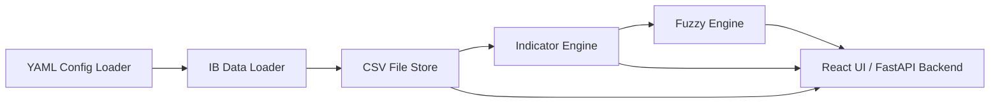

# **ktrdr Architecture Blueprint -- Phase 1 (Development)**

## **Scope**

This architecture covers the initial implementation phase focused on
development, experimentation, and validation. It emphasizes simplicity,
fast feedback, and modular construction with local-only deployment.

## **Core Goals**
- Validate data ingestion, indicator computation, and fuzzy input
  generation
- Enable visual inspection of each module's behavior
- Prepare the foundation for backtesting and neural network integration

## **Development Strategy**

### Vertical Slice Approach

KTRDR will be developed using a vertical slice approach, where each development increment:

1. **Delivers demonstrable value** rather than horizontal layers
2. **Crosses architectural boundaries** to provide end-to-end functionality
3. **Results in working software** that can be tested and validated
4. **Maintains architectural integrity** while building the system incrementally

### Version Strategy

The versioning strategy follows semantic versioning with these additional guidelines:
- Each completed vertical slice increments the minor version (1.0.X → 1.0.[X+1])
- Each completed task within a slice increments the patch version (1.0.X.Y → 1.0.X.[Y+1])
- Bug fixes increment the build version (1.0.X.Y.Z → 1.0.X.Y.[Z+1])
- Major architectural changes would increment the major version (1.X.Y → [1+1].0.0)

### Quality Gates

Each vertical slice must pass these quality gates before being considered complete:
- All tests passing (unit, integration, and relevant acceptance tests)
- Code meets style and documentation standards
- Functionality can be demonstrated working end-to-end
- New capabilities are properly documented

### Slice Sequence

The development will proceed through these major slices:
1. Project Foundation & Basic Data Loading
2. Data Management & Basic Indicators
3. Basic Visualization
4. Fuzzy Logic Foundation
5. Visualization Enhancement & UI Foundation
6. Interactive Brokers Integration
7. Neural Network Foundation 
8. Decision Logic & Backtesting Foundation

This sequence allows for early validation of core components before building more complex features.

## Cross-Cutting Concerns

### Implementation Priority Approach

Given that KTRDR is developed by a small team with AI assistance, cross-cutting concerns are prioritized based on their immediate value and implementation complexity:

- **High Priority**: Implement early with full functionality
- **Medium Priority**: Implement simplified versions focused on immediate needs
- **Low Priority**: Defer to later versions or implement minimal versions

### Error Handling Framework (High Priority)

KTRDR implements a centralized error handling framework that ensures consistent error management across all components:

#### Error Classification

Errors are classified into the following categories:
1. **DataErrors**: Related to missing, corrupt, or invalid data
2. **ConnectionErrors**: Network issues, API timeouts, or service unavailability
3. **ConfigurationErrors**: Invalid settings or configuration problems
4. **ProcessingErrors**: Calculation failures or unexpected results
5. **SystemErrors**: Resource limitations, unexpected crashes, or environment issues

#### Logging Architecture

The logging system follows these design principles:
- **Centralized Configuration**: Single logging configuration for consistent behavior
- **Multiple Outputs**: Console and rotating file handlers with independent configuration
- **Context Enrichment**: Automatic inclusion of module, function, timestamp, and thread info
- **Filterable Severity**: Standard levels (DEBUG, INFO, WARNING, ERROR, CRITICAL)
- **Format Control**: Configurable formatting for different outputs (detailed for files, concise for console)

#### Error Handling Patterns

The system implements these error handling patterns:
- **Retry with Backoff** (Initial Implementation): For recoverable errors like network issues
- **Graceful Degradation** (Simplified): Fall back to alternative implementations when possible
- **Circuit Breakers** (Deferred): Prevent cascading failures under sustained error conditions
- **Transaction Boundaries** (Simplified): Ensure operations are atomic when appropriate
- **State Recovery** (Initial Implementation): Save checkpoints for long-running operations

#### User Feedback

Error reporting to users follows these principles:
- **Actionable Messages**: Clear information on what went wrong and possible actions
- **Appropriate Detail**: Balance between technical accuracy and understandable language
- **Consistent Format**: Uniform presentation of errors across interfaces
- **Error Codes** (Simplified): Reference codes for documentation and support
- **Recovery Guidance** (Simplified): Steps to resolve the issue when applicable

### Testing Strategy (Medium Priority)

A pragmatic testing approach that balances coverage with development velocity:

#### Testing Priorities
1. **Critical Algorithms**: Full unit test coverage for core calculations
2. **Integration Points**: Tests for key component interactions
3. **End-to-End Flows**: Smoke tests for common use cases

#### Implementation Approach
- Use pytest for all testing levels
- Leverage fixtures for reusable test data and configurations
- Focus on behavior testing rather than implementation details
- Include reference data tests for indicator calculations

### Security Basics (Medium Priority)

A simplified security approach focused on essential protections:

#### Key Security Measures
1. **API Key Management**: Secure storage using environment variables or local secrets file
2. **Input Validation**: Basic validation to prevent common issues
3. **Data Protection**: Ensure sensitive data (like account credentials) is stored securely

### Observability & Monitoring (Low Priority - Deferred)

Initial implementation will rely on logging for observability. Future versions may include:
- **Performance Metrics**: Collection of execution times and resource usage
- **Health Monitoring**: System health checks and dashboards
- **Alerting**: Threshold-based alerts for critical conditions

### Dependency Management (Low Priority - Simplified)

The UV-based approach already provides good dependency management:
- Use lockfiles to ensure reproducibility
- Periodically review and update dependencies
- Minimize third-party dependencies to reduce complexity

### CI/CD & Containerization (Medium Priority)

The CI/CD and containerization strategy follows a progressive implementation approach that aligns with the vertical slice methodology:

#### CI/CD Implementation (After Slice 5)

After completing the UI Foundation slice, a basic CI/CD pipeline will be implemented to:

- **Enforce Quality Gates**: Automatically run tests, linting, and style checks
- **Validate PRs**: Ensure all changes meet project standards before merge
- **Manage Versioning**: Support the semantic versioning strategy
- **Generate Documentation**: Build and publish documentation artifacts

The initial CI implementation will use GitHub Actions with these workflows:
1. **Test & Validate**: Run pytest, linting, and type checking
2. **Build & Package**: Create distributable packages when needed
3. **Version Management**: Tag releases according to versioning strategy

#### Docker Containerization (After Slice 6)

Following the Interactive Brokers Integration slice, Docker containerization will be implemented to:

- **Isolate Components**: Package backend services in separate containers
- **Simplify Development**: Provide consistent development environments
- **Enable Scalability**: Support independent scaling of components
- **Facilitate Testing**: Create reproducible environments for testing IB integration

The Docker implementation will include:
1. **Development Environment**: `docker-compose.yml` for local development
2. **Backend API Container**: Python backend with API endpoints
3. **Database Container**: For persistent data when needed
4. **CI Integration**: Building and testing containers in CI pipeline

This phased approach ensures infrastructure evolves alongside application capabilities, rather than being implemented all at once late in development.

## Development Environment

### Package Management

KTRDR uses UV (https://github.com/astral-sh/uv) for dependency management and virtual environment handling. UV was chosen for the following benefits:

1. **Performance**: UV installs packages significantly faster than pip
2. **Reliable Resolution**: Deterministic dependency resolution 
3. **Lockfile Support**: Better reproducibility across environments
4. **Rust-based Implementation**: Improved security and performance

### Environment Setup

The development environment is configured using:

- **UV**: For package installation and virtual environment management
- **pyproject.toml**: For package metadata and build configuration
- **requirements.txt**: For explicit dependencies with UV-compatible pinning

### Project Structure

```
ktrdr2/
├── .uv/                   # UV virtual environment directory
├── pyproject.toml         # Package metadata and build configuration
├── requirements.txt       # Project dependencies
├── requirements-dev.txt   # Development dependencies
├── ktrdr/                 # Main package directory
│   ├── __init__.py
│   ├── data/              # Data management modules
│   ├── indicators/        # Indicator computation modules
│   ├── fuzzy/             # Fuzzy logic engine modules
│   ├── neural/            # Neural network modules
│   ├── visualization/     # Visualization components
│   └── ui/                # UI components with FastAPI backend
├── tests/                 # Test suite
├── scripts/               # Utility scripts
└── docs/                  # Documentation
```

### Installation Process

```bash
# Install UV (if not already installed)
pip install uv

# Create virtual environment with UV
uv venv

# Activate environment
source .venv/bin/activate  # Unix/Mac
# OR
.venv\Scripts\activate     # Windows

# Install dependencies with UV
uv pip install -r requirements.txt
```

## **Modules**

### 1.  **Configuration Module**

The configuration module is responsible for loading, validating, and providing structured access to system-wide and strategy-specific configurations. This includes general paths, system options, and flexible definitions for strategies.

#### **Responsibilities:**
- Load YAML config files:

  - `config/general.yaml`: General system settings (data paths,
environment)

  - `config/fuzzy.yaml`: Default fuzzy set definitions per indicator

  - `strategies/<strategy_name>.yaml`: Complete strategy configuration
including:

    - List of indicators

    - Fuzzy set overrides

    - Neural model structure

    - Reference to model weight files (if pre-trained)
- Provide a structured interface for:

  - General application config

  - Strategy config loading and validation
- Support environment overrides (e.g., dev vs. paper) 

#### **Example Strategy Config Structure:**
```yaml
name: basic_rsi_trend
indicators:
  - name: rsi
    period: 14
    source: close
  - name: ema
    period: 20
    source: close
fuzzy_sets:
  rsi:
    low: [0, 30, 45]
    neutral: [40, 50, 60]
    high: [55, 70, 100]
model:
  type: mlp
  input_size: 3
  hidden_layers: [10, 10]
  output_size: 2
  weights: weights/basic_rsi_trend.pt
  ```
#### **Example Interface:**

```python
class StrategyConfig(BaseModel):
    name: str
    indicators: list[IndicatorConfig]
    fuzzy_sets: dict[str, dict[str, list[float]]]
    model: dict[str, Any]

class ConfigLoader:
    def __init__(self, config_dir: str): ...
    def load_general_config(self) -> dict: ...
    def load_strategy_config(self, name: str) -> StrategyConfig: ...
    def load_fuzzy_defaults(self) -> dict: ...
```
#### **Config Structure Philosophy:**
- Default fuzzy.yaml provides global templates for fuzzy logic levels
  (e.g., low/neutral/high per indicator)
- Each strategy.yaml file encapsulates a complete, runnable
  configuration, including indicator definitions, fuzzy overrides, model
  structure, and references to pre-trained weights
- This abstraction allows you to treat a strategy file as an atomic unit
  of trading logic (like a "strategy profile") --- easy to swap,
  version, and track
- While currently implemented as a flat YAML file, this structure can evolve in later phases into a folder-based manifest (e.g strategy.yaml + weights + fuzzy.yaml), if modularity becomes a concern

  **Configuration Scalability Note:** As the number of strategies, model weights, and configuration variants grows, managing flat YAML files may become complex. Future phases might explore strategies like structured directories, versioning conventions, or a dedicated configuration database/registry.

#### **Naming Consideration:**
- While "strategy" is currently the working name, future alternatives
  might include profile, experiment, or trading setup --- depending on
  whether the emphasis is execution, research, or operational reuse.
- For now, "strategy" is retained as it cleanly communicates intent.

#### **Future Metadata (V2+ Note):**
- We may later want to track strategy creation timestamps, last run
  statistics, or evaluation outcomes
- These can be stored in a database or log system rather than hardcoding
  into the YAML, preserving file stability and readability

### 2.  **Data Access Layer**

The data access layer handles historical data retrieval, caching, and lightweight storage. It is designed to gracefully handle unavailable brokers, avoid redundant downloads, and support flexible configuration of financial instruments (e.g., forex vs. stocks).

#### **Submodules:**
- **IBDataLoader**:

  - Connects to Interactive Brokers via ib_insync

  - Accepts metadata for each instrument (e.g., symbol, asset type,
    exchange)

  - Requests historical OHLCV data (1 symbol, 1 timeframe)

  - Handles rate limit pacing and batching logic

  - Returns a pandas DataFrame with timestamps as index

  - Emits clear errors if connection fails, with retries disabled by
    default in Phase 1
- **LocalDataLoader**:

  - Reads previously downloaded data from CSV

  - Supports partial reads via date filters

  - Parses into standard OHLCV DataFrame format

  - Extracts min/max dates by reading headers and footers when needed
- **DataManager** (previously "DataCoordinator"):

  - Orchestrates data access for any instrument

  - Accepts request: symbol, timeframe, date range, asset type

  - Delegates local access to LocalDataLoader

  - Checks for gaps in requested range

  - Uses IBDataLoader to fill gaps if IB is available

  - Writes new data to CSV

  - Logs all actions and decisions (e.g., cache hit, fetched 3-day gap)

  - Returns final combined DataFrame

#### **Flow Example:**
```python
 manager = DataManager(config)

 df = manager.load("EURUSD", asset_type="forex", interval="1h", start="2018-01-01", end="2019-01-01")
```
#### **Error Handling Philosophy:**
- Fail fast if IB is unreachable and no local data exists
- If partial data is found locally, return what is available with
  warning
- No separate index file in Phase 1 --- CSV headers are parsed directly
- Indexing may be revisited in later phases if large-scale data
  introduces performance concerns

#### **Goals for Phase 1:**
- Minimize complexity by avoiding redundant metadata files
- Ensure stable fallback when broker is disconnected
- Simplify interface for developers
- Avoid overengineering early-stage workflows
- Move metadata tracking (e.g., last fetch time) into a DB or JSON index
  file
- Extend caching to support multiple timeframes per symbol
- Upgrade FileStore to DB-backed persistence for large-scale backtests

### 3.  **Indicator Engine**

The Indicator Engine transforms OHLCV data into computed technical indicators used as inputs for fuzzy logic and model training. Indicators are modular and designed for easy experimentation.

#### **Responsibilities:**
- Compute indicator values for a given OHLCV DataFrame
- Normalize or scale values where necessary (for fuzzy input
  compatibility)
- Support configurable parameters per indicator
- Register indicators via plug-in pattern for extensibility

#### **Indicator Interface Example:**
```python
class RSIIndicator:
  def __init__(self, period: int, source: str = 'close'):
    self.period = period
    self.source = source

  def compute(self, df: pd.DataFrame) -> pd.Series:
    return ta.rsi(df[self.source], length=self.period)
```

#### **Engine Usage Example:**
```python
engine = IndicatorEngine(config.indicators)
df = engine.apply(df) # Appends indicator columns to raw OHLCV DataFrame
```

#### **Design Notes:**
- Indicators typically consume one or more columns (e.g., close price,
  volume)
- They produce one or more output columns (e.g., `rsi_14`, or `macd_line`, `macd_signal`, `macd_hist`)
  - Output column names should follow a standard convention (e.g.,`rsi_14`)
  - Parameters (e.g., period, smoothing) are defined in the strategy YAML **Indicator Class Independence:**
- Indicator classes should be standalone and reusable without any dependency on strategy YAML or system state
- They should accept only their required parameters directly (e.g., period, source column) and compute outputs from a provided DataFrame

#### **Simple Example:**
```python
rsi = RSIIndicator(period=14, source='close')
series = rsi.compute(ohlcv_df)
```
This ensures indicators are easy to test, reuse, and debug in isolation.

#### **Construction via Factory Pattern:**
- Indicators are not coupled directly to the strategy config
- An IndicatorFactory parses the strategy YAML and instantiates appropriate indicators
  ```python
  class IndicatorFactory:
    def __init__(self, strategy_cfg): ...
    def build() -> list[Indicator]: ...
  ```
This ensures indicator logic remains isolated and testable.

#### **Pluggability:**
- Indicator modules are imported dynamically based on config
- Enables experimentation with both built-in and custom indicators
- Avoids hardcoding indicator types in core engine logic

### 4.  **Fuzzy Logic Engine**

The Fuzzy Logic Engine converts numerical indicator values into fuzzy membership vectors. These soft-coded representations of linguistic states (e.g., low, high) provide discrete yet nuanced inputs for neural inference.

**Phase 1 Note:** While the architecture is designed to support multiple membership function types (triangular, trapezoidal, sigmoid, gaussian), **only the triangular membership function will be implemented in Phase 1**. This simplifies development and ensures a stable foundation. Other types may be introduced in later phases as needed.

#### **Responsibilities:**
- Parse fuzzy set definitions from YAML
- Construct membership functions (triangular, trapezoidal, sigmoid,
  gaussian)
- Evaluate indicator values into fuzzy membership scores
- Return soft membership vectors (not one-hot, not normalized)

#### **Membership Function Types:**
- **Triangular**: 3 parameters --- `[a, b, c]` (start, peak, end)
- **Trapezoidal**: 4 parameters --- `[a, b, c, d]` (start,
  shoulder-left, shoulder-right, end)
- **Sigmoid**: 2 parameters --- `[a, c]` (slope, center)
- **Gaussian** (optional): 2 parameters --- `[c, sigma]` (mean, standard
  deviation)

#### **YAML Configuration Format:**
```yaml
fuzzy_sets:
  rsi:
    low:
      type: triangular
      parameters: [0, 30, 45]
    neutral:
      type: trapezoidal
      parameters: [40, 50, 60, 70]
    high:
      type: sigmoid
      parameters: [1, 55]
    macd:
      negative:
        type: gaussian
        parameters: [0, 1]
      positive:
        type: gaussian
        parameters: [0, 1]
```

#### **Evaluation Behavior:**
- Each fuzzy set evaluates a given scalar value x and returns a score in
  [0, 1]
- The result is a dictionary of {set_name: score} per indicator
- Outputs are soft (partial memberships allowed)

####  **No Normalization:**

- Membership vectors are **not normalized** --- this preserves magnitude and allows model to learn weighting

#### **References & Suggested Reading:**
- [[Fuzzy Logic Membership Functions -- MATLAB
  Docs]{.underline}](https://www.mathworks.com/help/fuzzy/membership-functions.html)
- [[An Introduction to Fuzzy
  Logic]{.underline}](https://towardsdatascience.com/an-introduction-to-fuzzy-logic-c1bbeddb16a2)
- [[Types of Membership Functions in Fuzzy Logic --
  GeeksforGeeks]{.underline}](https://www.geeksforgeeks.org/types-of-membership-functions-in-fuzzy-logic/)

### 5.  **Visualization Subsystem**

The visualization subsystem enables rich, interactive insight into price data, indicators, fuzzy logic, and trade decisions. It supports validation during development and experimentation by rendering incremental outputs from each module.

#### **Core Goals:**
- Visual validation of each module (e.g., indicators, fuzzy logic)
- Correlate multiple signals visually (e.g., RSI + trades + fuzzy bands)
- Inspect behaviors over time with interactivity (e.g., zoom, pan, hover)

#### **Design Approach:**
- Use **TradingView's lightweight-charts** for interactive financial charts
- Implement a layered architecture with clean separation between Python and JS
- Easily integrate with FastAPI backend for API-driven visualization
- Build reusable Visualizer module with a clean, intuitive API

#### **Architecture Layers:**
1. **Python API Layer** (Visualizer, ChartBuilder)
   - Provides an intuitive, high-level interface for chart creation
   - Manages chart layouts and component relationships

2. **Data Transformation Layer** (DataAdapter, IndicatorTransformer)
   - Converts pandas DataFrames to lightweight-charts compatible JSON format
   - Handles indicator-specific data transformations

3. **Chart Configuration Generator** (TemplateManager, ConfigBuilder)
   - Creates chart-specific configuration objects
   - Manages chart templates and layouts

4. **HTML/JS Output Generator** (Renderer, ThemeManager)
   - Produces self-contained HTML files with embedded JavaScript
   - Manages theming and styling options

#### **Key Visual Components:**
- **Candlestick Chart**: Main OHLC price display with customizable styling
- **Indicator Overlays**: EMA, SMA, and other overlays on price charts
- **Separate Panels**: RSI, MACD, Volume in properly spaced panels
- **Fuzzy Highlight Bands**: Shade regions where fuzzy sets are activated (e.g., high RSI zone)
- **Trade Markers**: Clear entry/exit signals with customizable markers and annotations
- **Range Slider**: Compact slider for navigating large datasets
- **Interactive Features**: Zoom, pan, and tooltips built-in
- **Custom Annotations**: Support for additional markers, lines, and labels

#### **Structure:**

```python
class Visualizer:
    def __init__(self, theme="dark"):
        """Initialize the visualizer with theme settings."""
        
    def create_chart(self, data, title=None, chart_type="candlestick"):
        """Create a new base chart with the specified data."""
        
    def add_indicator_overlay(self, chart, indicator_data, type, **options):
        """Add an indicator as an overlay on the price chart."""
        
    def add_indicator_panel(self, chart, indicator_data, type, **options):
        """Add a separate panel for an indicator below the main chart."""
        
    def configure_range_slider(self, chart, height=40, show=True):
        """Configure the range slider for the chart."""
        
    def save(self, chart, filename):
        """Save the chart to an HTML file."""
        
    def show(self, chart):
        """Display the chart (in Jupyter or return HTML for Streamlit)."""
```

#### **Extension Points:**
- Plugin system for custom indicator visualization
- Custom chart types beyond standard candlestick/OHLC
- Layout templates for different visualization needs

#### **Architectural Note:**
- The visualization module is completely independent of data sources
- Chart panels are properly aligned and sized with appropriate spacing
- Interactive features are built-in by default

#### **Looking Ahead:**
- Phase 1 visualizer will be focused on local development use
- The architecture separates rendering logic from UI to support future web integration
- Later phases can expose visualization as a service with a REST API

### 6.  **UI Interface**

The user interface layer provides a modern, responsive, and maintainable interface for interacting with KTRDR's core functionality. A comprehensive dedicated architecture is outlined in [`specification/ui_architecture_blueprint.md`](./ui_architecture_blueprint.md).

#### **Key Architectural Highlights:**

1. **Frontend-Backend Separation**: 
   - Modern React/TypeScript frontend application
   - FastAPI-based REST backend
   - Well-defined API contract between layers

2. **Core Components**:
   - **Backend API Layer**: Structured endpoints using FastAPI and Pydantic models
   - **Frontend Application**: Component-based SPA with TypeScript and Redux
   - **Service Adapters**: Bridge existing KTRDR modules with API interfaces

3. **Implementation Approach**:
   - Phased migration strategy (infrastructure, feature parity, enhancements)
   - Reuse of core KTRDR modules via service adapter pattern
   - Emphasis on performance for financial visualization

4. **Technical Stack**:
   - **Backend**: FastAPI, Pydantic, Python 3.11+
   - **Frontend**: React, TypeScript, Redux Toolkit, TradingView Lightweight Charts
   - **Development**: Vite, Modern ESLint, TypeScript strict mode

The UI architecture complements this main architecture blueprint by providing specific guidance for the presentation layer, while ensuring it integrates properly with the core system components described in other sections.

For complete details on the UI architecture including component structure, state management, API contract, and implementation roadmap, refer to the dedicated [UI Architecture Blueprint](./ui_architecture_blueprint.md).

### 7.  **Test Suite & CLI Entrypoints**
The testing and CLI infrastructure supports validation, rapiditeration, and modular confidence.
#### **Test Philosophy:**
- Prioritize clarity and maintainability
- Each unit test should clearly document:

  - The assumptions being made about input data

  - The expected output or behavior being validated
- Tests should be simple to debug and act as living documentation for
  each module
#### **Test Suite Design:**
- Use pytest (preferred for readability and fixtures)
- Focus on strong unit test coverage for core components:

  - DataManager, LocalDataLoader, IBDataLoader

  - Each indicator class

  - Membership functions in the Fuzzy Engine
- Avoid excessive mocking; tests should remain simple and transparent
- Emphasize integration tests for validating flows across modules (e.g.,
  data → indicator → fuzzy)
- Include end-to-end tests for CLI operations (e.g., fetching and
  visualizing data)
#### **Integration Test Examples:**
- Data loading through `DataManager` returns expected OHLCV DataFrame
- Indicator values are correctly appended to loaded data
- Fuzzy logic converts indicators to expected membership vectors
- Visualizer generates a valid Plotly figure for composed inputs
#### **End-to-End Test Examples:**
- Running `ktrdr fetch EURUSD` successfully loads and stores historical data
- Running `ktrdr plot-indicator EURUSD --indicator rsi` visualizes the indicator on the price chart
- Running `ktrdr plot-fuzzy EURUSD` overlays fuzzy sets correctly
#### **CLI Entrypoints Philosophy:**
- CLI mirrors the building blocks of the UI and serves as a scriptable interface for all capabilities
- Emphasize CLI- and API-first design, UI layers are orchestrators only
- Commands expose full control over config and inputs
#### **Planned Commands:**
```sh
ktrdr fetch <symbol> [--start DATE --end DATE] [--local-only]
ktrdr plot-indicator <symbol> --strategy path/to/strategy.yaml
ktrdr plot-fuzzy <symbol> --strategy path/to/strategy.yaml
ktrdr visualize <symbol> --strategy path/to/strategy.yaml[--include-trades]
```
#### **CLI Implementation:**
- Use `argparse` or `typer` (preferred for modern DX)
- Delegate execution to internal modules (DataManager, IndicatorEngine,
  Visualizer, etc.)
#### **Structured Output:**
- Phase 1: CLI output will be human-readable only
- Later phases may introduce `--json` or `--quiet` flags for CI/test automation

### 8.  **Neural Engine**
The Neural Engine handles training, inference, and evaluation ofneural models based on fuzzy logic inputs.
#### **Phase 1 Scope:**
- Build a small feedforward neural network (MLP) using PyTorch
- Train it on fuzzy input vectors with labels derived from ZigZag logic (to be defined later)
- Save the trained model as a .pt file
- Load and reuse trained model weights for inference
#### **Key Responsibilities:**
- Dynamically build network architecture from strategy.yaml
- Accept flattened fuzzy membership vector as input
- Output raw logits (or softmax), leaving interpretation to a separate
  trade decision layer
- Evaluate model on both training and test splits with simple metrics
  (accuracy, precision, etc.)
#### **Implementation Notes:**
- Phase 1 will use a unified NeuralEngine class that supports both
  training and inference

  - Pros: Easier reuse of shared code (data preparation, input
    formatting)

  - Cons: May mix concerns if training becomes complex

  - Future Phase: split into Trainer and InferenceEngine as complexity
    grows
- Neural architecture is defined by the strategy:
  ```yaml
  model:
  type: mlp
  input_size: 12
  hidden_layers: [16, 16]
  output_size: 2
  weights: weights/my_strategy.pt
  ```

  - The engine will parse this YAML and build an nn.Sequential model
    accordingly
- The engine includes an `evaluate()` method to test the model on labeled
  data:
  - Computes metrics like accuracy, precision, recall
  - Returns results as a structured `dict`
  - Output can be logged, displayed in CLI, or rendered in the UI later
- Input format is a **flattened vector** of fuzzy memberships (e.g., `rsi_low`, `rsi_high`, `macd_positive`, ...)
- Output is left uninterpreted --- logits or softmax passed to a
  downstream decision logic module (to be defined separately)
- Model weights are saved separately, not embedded in YAML
#### **Design Goal:**
- Keep training simple and debuggable
- Make neural models interchangeable by changing strategy YAML and model file
- Facilitate reproducibility and tuning experiments

### 9.  **Decision Interpreter**
The Decision Interpreter module translates raw neural outputs (e.g.,logits or softmax) into discrete trading decisions. It acts as thebridge between model predictions and trade logic.
#### **Responsibilities:**
- Interpret neural output into actions: buy, sell, or hold
- Evaluate decision based on model confidence and current position
- Support potential future filtering (e.g., thresholding, smoothing)
#### **Current Interpretation Logic:**
- Neural engine outputs softmax vector [`buy_score`, `sell_score`] (or similar logits).
- A simple threshold or comparison determines the intended action (e.g., if `buy_score > sell_score + threshold -> potential_buy`).
- This intended action is passed to the TradeManager for state update simulation.

#### **Open Questions for Future Refinement:**

1.  Should interpretation logic be configurable in YAML?

2.  Should outputs include confidence metrics or scoring info?

3.  Should we debounce signal switching to avoid frequent position
    changes?
#### **Architect Recommendation:**
- Defer these refinements to Phase 2+ when real signal behavior can be
  evaluated visually and in backtests
- Maintain this logic as a standalone function or class (e.g., DecisionInterpreter) to isolate it from neural inference and trade execution

### 10. **Trade Lifecycle Management**

Although trade decisions are interpreted in Module 9, the lifecycle of
trades --- including position tracking, execution timing, and paper/live
order management --- is not yet explicitly handled.

#### **Phase 1 Scope:**
- Track current simulated position state in memory (e.g., neutral, long, short - if shorting is considered).
- On receiving an intended action (e.g., potential_buy) from the DecisionInterpreter:
  - If current position is neutral, update state to long and record a simulated entry (timestamp, price from data).
  - If current position is long and action is potential_sell, update state to neutral and record a simulated exit.
  - (Add logic for short positions if applicable).
- Maintain a simple list or log (in-memory or CSV) of these simulated trades for visualization.

#### **Future Phase Support:**
- Add a TradeManager class to manage entry, exit, and state tracking
- Hook into broker APIs or simulation engine for paper/live trading

#### **Example:**
```python
class TradeManager:
  def __init__(self):
    self.position = 'neutral' # e.g., neutral, long, short
    self.trades = [] # List to store simulated trades
  def update(self, decision_signal, timestamp, price):
    # Logic to update self.position based on signal
    # and current position (as described above).
    # If position changes, append trade details to self.trades.
    ...
  def get_position(self): ...
  def get_trade_history(self): ...
```

### 11. **System Flow Overview**

To clarify how the modules interact in sequence during a full run, here
is the default data pipeline:

1.  Load strategy.yaml

2.  Load OHLCV data via DataManager

3.  Compute indicators with IndicatorEngine

4.  Convert indicator outputs to fuzzy vectors with FuzzyEngine

5.  Feed fuzzy inputs into NeuralEngine for prediction

6.  Use DecisionInterpreter to translate prediction to action

7.  Update TradeManager state (if needed)

8.  Visualize price, signals, indicators, and fuzzy sets

This will help clarify how CLI commands, backtests, or Streamlit
orchestrate system components.

#### **Data Flow**


### **Technical Notes**
- Language: Python 3.11+
- Broker SDK: ib_insync
- Visualization: Plotly, Streamlit (or notebook fallback)
- Indicator libs: TA-Lib, pandas-ta, or custom wrappers
- Configs: YAML with Pydantic validation

### Phase 1 Error Handling Philosophy:
- Prioritize fail-fast for critical setup errors (e.g., invalid config, failed initial data load).
- Modules should return clear error indicators or raise specific exceptions on failure (e.g., data fetch failure, indicator computation error).
- Error propagation: Initially, errors might halt the current run (CLI/script). The UI should display errors clearly. Cross-module error recovery is out of scope for Phase 1 but the foundation (specific exceptions) should be laid.

### State Management (Phase 1)
State is primarily managed in memory (e.g., `TradeManager`'s position) or implicitly via file outputs (e.g., CSV data cache). This is sufficient for initial development and backtesting simulation. Later phases involving live trading or longer processes will require more robust state management strategies (e.g., database persistence, dedicated state service).

### **Long-Term Architectural Reflection**

While this document describes Phase 1 implementation focused on local validation and modular simplicity, several architectural decisions have been made with the explicit goal of evolving into a full system.

  ------------------------------------------------------------------------
  **Phase**   **Role of Visualizer** **Output Format**   **Hosted via**
  ----------- ---------------------- ------------------- -----------------
  **Phase 1** Internal plotting      In-process visuals  CLI / Local Dev
              (Plotly objects)                           Environment

  **Phase 2** Exposed as callable    JSON data for       FastAPI Backend
              module                 frontend rendering  

  **Phase 3+  API-driven             REST API endpoints  FastAPI + React
  (web)**     visualization service                      Frontend
  ------------------------------------------------------------------------

  ------------------------------------------------------------------------------
  **Component**   **Replace?**   **With what?**
  --------------- -------------- -----------------------------------------------
  CLI UI          ✅             A React/TypeScript frontend application

  Jupyter         ✅             Discarded in production
  notebooks                      

  Visualizer      ❌             Retained and extended as API service
  logic                          

  Plotly          ❓             TradingView Lightweight Charts (client-side)
                                 for interactive visualization
  ------------------------------------------------------------------------------

This table reflects our architectural intent: most core logic (data loading, indicators, fuzzy engine, and visualization logic) will carry forward. Temporary tools like CLI and Jupyter are only stepping stones.

→ Because our Visualizer is modular and stateless, we can evolve it into:
- A **backend visualization API** (e.g., GET /api/v1/charts/render)
- Or just serve **structured data** to let the React frontend do the rendering

We're not locked in. ✅

1.  ✅ **Keep the visualization logic cleanly separated** from UI frameworks.

2.  ✅ **Structure data for frontend consumption** rather than rendering directly.

3.  🛠 In the future, refactor Visualizer to:

    - Provide JSON data through FastAPI endpoints
    - Support React frontend with TradingView Lightweight Charts

## **Summary**

Phase 1 architecture is intentionally local, testable, and
introspectable. It creates the core pipeline from IB to indicator to
fuzzy logic, building both tooling confidence and visual verification.

Follow-up phases will refactor this into modular services and introduce
persistence, APIs, and live broker connectivity.
