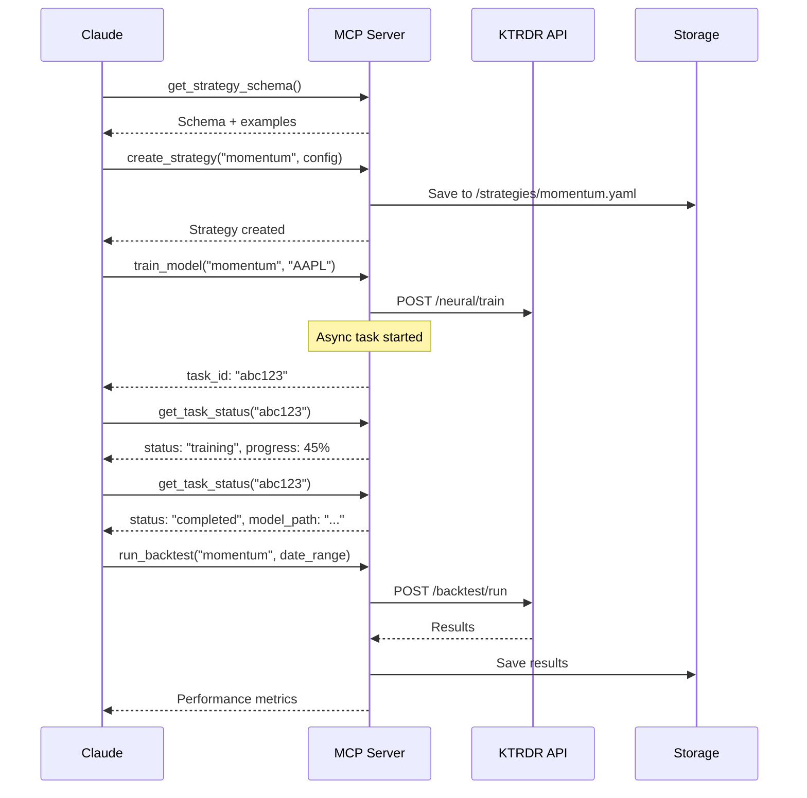
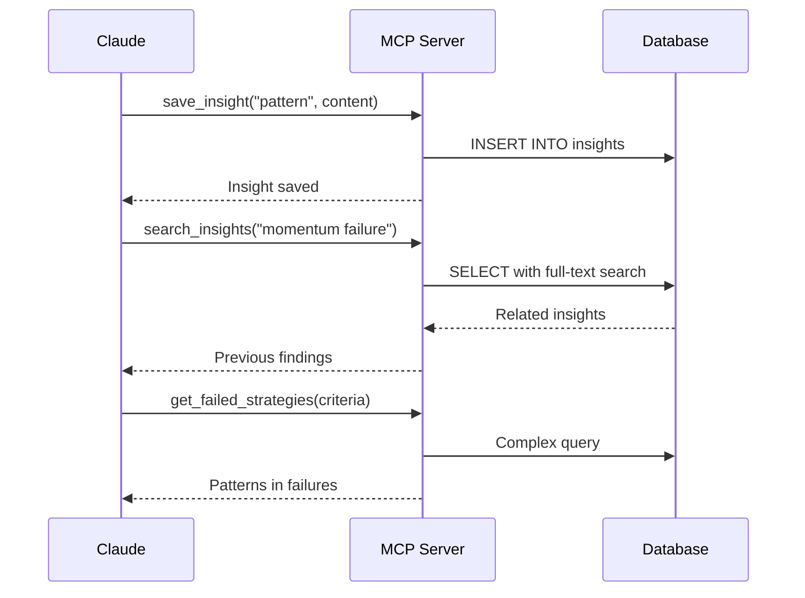

# KTRDR MCP Server Architecture Document

## 1. Introduction

### 1.1 Purpose
This document defines the architecture for the KTRDR MCP (Model Context Protocol) Server, which enables Claude to conduct autonomous research on neuro-fuzzy trading strategies by providing programmatic access to KTRDR's capabilities.

### 1.2 Scope
The architecture covers:
- System components and their interactions
- Data flow and storage patterns
- Security and isolation boundaries
- Integration with existing KTRDR systems
- Extensibility and evolution paths

### 1.3 Key Architectural Drivers
- **Safety First**: Prevent any possibility of unintended trading or system damage
- **Research Velocity**: Enable rapid experimentation and iteration
- **System Evolution**: Support extending capabilities as research demands
- **Knowledge Preservation**: Capture and learn from all research activities

## 2. System Context

### 2.1 High-Level Architecture

```
┌─────────────────────────────────────────────────────────────────┐
│                        Claude (MCP Client)                       │
│  - Research Intelligence    - Hypothesis Generation              │
│  - Strategy Design         - Pattern Recognition                 │
│  - Decision Making         - Result Interpretation               │
└────────────────────┬───────────────────────────┬────────────────┘
                     │                           │
                     │      MCP Protocol         │
                     │    (Tool Invocation)      │
                     │                           │
┌────────────────────▼───────────────────────────▼────────────────┐
│                      MCP Server Container                        │
│  ┌─────────────────────────────────────────────────────────┐   │
│  │                   MCP Protocol Handler                    │   │
│  │              (Using Anthropic Python SDK)                │   │
│  └─────────────────────┬───────────────────┬───────────────┘   │
│                        │                   │                     │
│  ┌─────────────────────▼────────┐ ┌───────▼────────────────┐   │
│  │      Tool Execution Layer     │ │  Experiment Storage    │   │
│  │  - Data Operations           │ │  - SQLite Database     │   │
│  │  - Model Training            │ │  - File Artifacts      │   │
│  │  - Backtesting               │ │  - Knowledge Base       │   │
│  │  - Strategy Management       │ └────────────────────────┘   │
│  └─────────────┬────────────────┘                              │
│                │                                                │
│  ┌─────────────▼────────────────┐ ┌────────────────────────┐   │
│  │   KTRDR API Client          │ │   Direct Module Access  │   │
│  │  (Initial Implementation)    │ │   (Future Evolution)    │   │
│  └─────────────┬────────────────┘ └────────────────────────┘   │
└────────────────┼────────────────────────────────────────────────┘
                 │
                 │  HTTP/REST
                 │
┌────────────────▼────────────────────────────────────────────────┐
│                    KTRDR Backend (Existing)                      │
│  - Data Management      - Indicator Engine                      │
│  - Fuzzy Logic         - Neural Networks                        │
│  - IB Integration      - Strategy Configs                       │
└─────────────────────────────────────────────────────────────────┘
```

### 2.2 Component Relationships

```
Claude ──uses──> MCP Server ──calls──> KTRDR Backend
                      │
                      ├──reads──> Market Data (Read-Only)
                      ├──writes──> Strategy Configs
                      ├──writes──> Trained Models
                      └──writes──> Experiment Database
```

## 3. Architectural Decisions

### 3.1 Container Isolation Strategy

**Decision**: Run MCP Server in isolated Docker container
**Rationale**: 
- Complete isolation from production trading systems
- Ability to crash/restart without affecting main system
- Resource limits and monitoring
- Easy deployment and scaling

**Implications**:
- Need to expose MCP port from container
- Shared volumes for data access
- Network configuration for API access

### 3.2 Data Access Pattern

**Decision**: Hybrid approach - API first, direct module access later
**Rationale**:
- API provides immediate functionality with safety
- Direct access enables performance optimization later
- Gradual evolution based on research needs

**Trade-offs**:
- API approach has network overhead
- Direct access requires more careful isolation
- Migration path needed between approaches

### 3.3 State Management

**Decision**: Centralized experiment database with distributed artifacts
**Rationale**:
- Database for queryable research history
- File system for large artifacts (models, results)
- Git for version control of strategies

**⚠️ OPEN QUESTION**: Exact storage model is discussed in section 4.3

**Implementation**:
```
/data
  /market_data/     (read-only mount)
  /experiments/     (experiment DB)
  /models/          (trained neural networks)
  /results/         (backtest outputs)
/strategies/        (YAML configurations)
```

### 3.4 Security Boundaries

**Decision**: Principle of least privilege with explicit boundaries
**Rationale**:
- No access to order execution
- Read-only market data
- Write only to designated areas
- No production code modification

**Enforcement**:
- Docker volume mounts with permissions
- API client with restricted endpoints
- Environment-based configuration

## 4. Component Design

### 4.1 MCP Protocol Handler

**Technology Choice**: Anthropic's official Python SDK ([python-sdk](https://github.com/modelcontextprotocol/python-sdk))
**Rationale**: Official implementation, maintained compatibility, proven stability

**Implementation Approach**:
```python
from mcp import Server, Tool
from mcp.server.stdio import stdio_server

class KTRDRMCPServer:
    def __init__(self):
        self.server = Server("ktrdr-mcp")
        self.api_client = KTRDRAPIClient()
        self.setup_tools()
    
    def setup_tools(self):
        # Register all tools with the MCP server
        self.server.add_tool(self.create_load_data_tool())
        self.server.add_tool(self.create_train_model_tool())
        self.server.add_tool(self.create_backtest_tool())
        # ... more tools
    
    def create_load_data_tool(self) -> Tool:
        return Tool(
            name="load_market_data",
            description="Load historical market data for analysis",
            input_schema={
                "type": "object",
                "properties": {
                    "symbol": {"type": "string"},
                    "timeframe": {"type": "string"},
                    "start_date": {"type": "string", "format": "date"},
                    "end_date": {"type": "string", "format": "date"}
                },
                "required": ["symbol", "timeframe"]
            },
            handler=self.handle_load_data
        )
    
    async def run(self):
        async with stdio_server() as streams:
            await self.server.run(
                streams[0],  # stdin
                streams[1],  # stdout
                self.setup_tools()
            )
```

### 4.2 Tool Execution Layer

**Responsibilities**:
- Implement individual tool functions
- Manage tool state and context
- Handle retries and failures
- Track tool usage metrics

**Base Tool Pattern**:
```python
from dataclasses import dataclass
from typing import Dict, Any, Optional
import structlog

logger = structlog.get_logger()

@dataclass
class ToolContext:
    experiment_id: Optional[str]
    request_id: str
    timestamp: datetime

class BaseToolHandler:
    def __init__(self, api_client: KTRDRAPIClient, db: Database):
        self.api_client = api_client
        self.db = db
    
    async def execute_with_logging(self, tool_name: str, params: Dict, handler_func):
        start_time = time.time()
        context = ToolContext(
            experiment_id=params.get('experiment_id'),
            request_id=str(uuid.uuid4()),
            timestamp=datetime.utcnow()
        )
        
        try:
            result = await handler_func(params, context)
            duration = time.time() - start_time
            
            logger.info("tool_executed",
                tool_name=tool_name,
                success=True,
                duration_seconds=duration,
                experiment_id=context.experiment_id
            )
            
            return result
            
        except Exception as e:
            logger.error("tool_failed",
                tool_name=tool_name,
                error=str(e),
                params=params
            )
            raise
```

### 4.3 Experiment Storage Design

**⚠️ OPEN QUESTION**: The exact storage architecture for experiments needs further design work.

**Current Understanding**:
- Need to track experiment metadata (hypotheses, parameters, status)
- Need to store large artifacts (models, detailed results)
- Need to accumulate knowledge over time
- Need to query across experiments

**Options Under Consideration**:

1. **Hybrid Approach**: SQLite for metadata + filesystem for artifacts
   - Pros: Efficient, queryable, proven pattern
   - Cons: Coordination complexity

2. **Document Database**: MongoDB or similar
   - Pros: Flexible, single system
   - Cons: Not ideal for large binaries

3. **File-based + Index**: Pure filesystem with search index
   - Pros: Simple, portable
   - Cons: Limited query capabilities

**Decision Deferred**: We'll make this decision based on early usage patterns in Phase 1. For MVP, we'll start with the simplest approach (likely SQLite + files) and evolve based on actual needs.

**Preliminary Schema (SQLite)**:
```sql
-- Experiments tracking
CREATE TABLE experiments (
    id TEXT PRIMARY KEY,
    name TEXT NOT NULL,
    hypothesis TEXT,
    status TEXT DEFAULT 'active',
    started_at TIMESTAMP DEFAULT CURRENT_TIMESTAMP,
    ended_at TIMESTAMP,
    metadata JSON
);

-- Tool execution log
CREATE TABLE tool_executions (
    id TEXT PRIMARY KEY,
    experiment_id TEXT,
    tool_name TEXT NOT NULL,
    parameters JSON,
    result JSON,
    error TEXT,
    duration_ms INTEGER,
    executed_at TIMESTAMP DEFAULT CURRENT_TIMESTAMP,
    FOREIGN KEY (experiment_id) REFERENCES experiments(id)
);

-- Knowledge accumulation
CREATE TABLE insights (
    id TEXT PRIMARY KEY,
    experiment_id TEXT,
    category TEXT,
    content TEXT,
    tags JSON,
    importance INTEGER DEFAULT 5,
    created_at TIMESTAMP DEFAULT CURRENT_TIMESTAMP,
    FOREIGN KEY (experiment_id) REFERENCES experiments(id)
);
```

## 5. Tool Specifications

### 5.1 Core Tool Categories

1. **Data Tools**: Market data access, indicator calculation
2. **Strategy Tools**: Configuration, validation, mutation
3. **Model Tools**: Training, loading, versioning
4. **Analysis Tools**: Backtesting, metrics, comparison
5. **Knowledge Tools**: Notes, patterns, insights

### 5.2 Tool Prompts and Descriptions

**Critical Design Decision**: Each tool must include comprehensive prompts that guide proper usage.

The MCP SDK supports rich prompting through tool descriptions. Here's how we'll structure them:

```python
def create_load_data_tool(self) -> Tool:
    return Tool(
        name="load_market_data",
        description="""Load historical market data for a symbol and timeframe.
        
        This tool fetches OHLCV (Open, High, Low, Close, Volume) data from the KTRDR data cache
        or Interactive Brokers if not cached. Use this before any analysis or backtesting.
        
        Common timeframes: 1m, 5m, 15m, 30m, 1h, 4h, 1d
        Date format: YYYY-MM-DD
        
        Example usage:
        - Recent data: load_market_data("AAPL", "1h") 
        - Specific range: load_market_data("AAPL", "1h", "2023-01-01", "2023-12-31")
        
        The tool automatically handles:
        - Market hours and holidays
        - Data quality validation
        - Caching for performance
        
        Returns: Data summary with point count and actual date range""",
        
        input_schema={
            "type": "object",
            "properties": {
                "symbol": {
                    "type": "string",
                    "description": "Trading symbol (e.g., AAPL, MSFT, SPY)"
                },
                "timeframe": {
                    "type": "string", 
                    "enum": ["1m", "5m", "15m", "30m", "1h", "4h", "1d"],
                    "description": "Bar size for the data"
                },
                "start_date": {
                    "type": "string",
                    "format": "date",
                    "description": "Start date (optional, defaults to 1 year ago)"
                },
                "end_date": {
                    "type": "string",
                    "format": "date", 
                    "description": "End date (optional, defaults to today)"
                }
            },
            "required": ["symbol", "timeframe"]
        },
        handler=self.handle_load_data
    )
```

### 5.3 Prompt Design Principles

**1. Context Setting**: Explain what the tool does and when to use it
```python
description="""Create a new trading strategy configuration.

Use this tool when you want to define a new neuro-fuzzy trading strategy. 
The strategy will specify indicators, fuzzy membership functions, and neural network architecture.

Before using this tool:
1. Analyze market data to understand patterns
2. Choose appropriate indicators
3. Design fuzzy sets that capture market regimes
4. Plan the neural network architecture
"""
```

**2. Parameter Guidance**: Explain each parameter's purpose and constraints
```python
"parameters": {
    "epochs": {
        "type": "integer",
        "minimum": 10,
        "maximum": 1000,
        "default": 100,
        "description": "Training epochs. More epochs = better fit but risk of overfitting. Start with 100."
    }
}
```

**3. Usage Examples**: Show concrete examples
```python
description="""...
Examples:
- Momentum strategy: Use RSI + MACD with fuzzy sets for overbought/oversold
- Mean reversion: Use Bollinger Bands + volume with fuzzy sets for extremes
- Trend following: Use moving average crossovers with fuzzy trend strength
"""
```

**4. Workflow Integration**: Explain how tools work together
```python
description="""Train a neural network model for a strategy.

Workflow:
1. First create strategy with 'create_strategy'
2. Load market data with 'load_market_data'  
3. Use this tool to train the model
4. Check training progress with 'get_task_status'
5. Once complete, run backtest with 'run_backtest'

This is a long-running operation (5-15 minutes typically).
"""
```

### 5.4 Complex Tool Prompts

**Strategy Creation Tool**:
```python
def create_strategy_tool(self) -> Tool:
    return Tool(
        name="create_strategy",
        description="""Create a new neuro-fuzzy trading strategy configuration.

        This tool generates a YAML configuration file that defines:
        - Technical indicators to calculate
        - Fuzzy membership functions for each indicator
        - Neural network architecture
        - Training parameters
        
        Strategy Design Guidelines:
        - Start simple: 2-3 indicators maximum
        - Each indicator should capture different market aspects (trend, momentum, volume)
        - Fuzzy sets should be meaningful (e.g., RSI: oversold/neutral/overbought)
        - Neural network: start with 2 hidden layers [20, 10] neurons
        
        Common Patterns:
        1. Trend Following: SMA + ADX with fuzzy trend strength
        2. Mean Reversion: RSI + Bollinger Bands with extreme levels
        3. Momentum: MACD + Volume with fuzzy momentum states
        
        The tool validates:
        - Indicator parameters are valid
        - Fuzzy sets cover the full range
        - Neural architecture is reasonable
        
        After creation, use 'train_model' to train the neural network.""",
        
        input_schema={
            "type": "object",
            "properties": {
                "name": {
                    "type": "string",
                    "pattern": "^[a-z_]+$",
                    "description": "Strategy identifier (lowercase, underscores only)"
                },
                "description": {
                    "type": "string",
                    "description": "Human-readable strategy description"
                },
                "config": {
                    "type": "object",
                    "description": "Full strategy configuration (see get_strategy_schema for structure)"
                }
            }
        }
    )
```

**Research Insight Tool**:
```python
def save_insight_tool(self) -> Tool:
    return Tool(
        name="save_insight",
        description="""Save a research insight, pattern, or learning.

        Use this tool to build a knowledge base of what works and what doesn't.
        Future research can search these insights to avoid repeating mistakes
        and build on successes.
        
        Categories:
        - 'pattern': Recurring market patterns discovered
        - 'success': What worked well and why
        - 'failure': What didn't work and lessons learned  
        - 'hypothesis': Ideas to test in future research
        - 'technique': Useful analysis or modeling techniques
        
        Good insights are:
        - Specific: "RSI > 70 in uptrends often continues up" not "RSI is useful"
        - Actionable: Can be applied to future strategies
        - Tagged: Use tags for easy retrieval
        
        Examples:
        - Pattern: "Gap-and-go setups work best in first 30 minutes"
        - Failure: "Pure RSI strategies fail in trending markets - need trend filter"
        - Success: "Combining volume + price fuzzy sets improves win rate 15%"
        - Hypothesis: "Options flow might predict stock direction - test this"
        
        Tags suggestions: indicator names, market conditions, timeframes, strategy types""",
        
        input_schema={
            "type": "object",
            "properties": {
                "category": {
                    "type": "string",
                    "enum": ["pattern", "success", "failure", "hypothesis", "technique"],
                    "description": "Type of insight"
                },
                "content": {
                    "type": "string",
                    "description": "The insight itself - be specific and detailed"
                },
                "tags": {
                    "type": "array",
                    "items": {"type": "string"},
                    "description": "Tags for categorization and search"
                },
                "importance": {
                    "type": "integer",
                    "minimum": 1,
                    "maximum": 10,
                    "default": 5,
                    "description": "How important is this insight? 10 = groundbreaking"
                }
            }
        }
    )
```

### 5.5 Prompt Templates for Common Workflows

**Research Session Prompt**:
```python
RESEARCH_SESSION_PROMPT = """
You are conducting research on neuro-fuzzy trading strategies using the KTRDR system.

Available tools allow you to:
1. Load and analyze market data
2. Create strategy configurations  
3. Train neural networks on fuzzy indicators
4. Backtest strategies
5. Save insights and patterns

Effective research workflow:
1. Start with a hypothesis (e.g., "momentum strategies work in trending markets")
2. Load relevant market data across different time periods
3. Design indicators and fuzzy sets that capture your hypothesis
4. Train models and run backtests
5. Analyze results - what worked? what didn't?
6. Save insights for future reference
7. Iterate with variations

Remember:
- Start simple, add complexity only if needed
- Test across different market conditions
- Document both successes AND failures
- Look for patterns across multiple experiments
"""
```

**Strategy Optimization Prompt**:
```python
OPTIMIZATION_PROMPT = """
When optimizing strategies:

1. Baseline First: Always establish baseline performance before optimizing
2. One Change at a Time: Modify one element to understand its impact
3. Parameter Ranges: Test reasonable ranges (e.g., RSI period 10-20, not 1-100)
4. Market Conditions: Test in trending AND ranging markets
5. Overfitting Check: Performance should hold on out-of-sample data

Common optimizations:
- Indicator parameters (periods, thresholds)
- Fuzzy set boundaries (where are the transitions?)
- Neural network architecture (layers, neurons)
- Training hyperparameters (learning rate, epochs)

Track what you try with save_insight() to avoid repeating experiments.
"""
```

### 5.6 Strategy Schema Communication

**Challenge**: How does Claude know the YAML schema for strategies?

**Solution**: Provide schema discovery tools with examples
```python
async def get_strategy_schema(self, params: Dict) -> Dict:
    """Return the expected schema for strategy configurations"""
    return {
        "schema": {
            "type": "object",
            "properties": {
                "name": {"type": "string", "description": "Strategy identifier"},
                "description": {"type": "string"},
                "indicators": {
                    "type": "array",
                    "items": {
                        "type": "object",
                        "properties": {
                            "name": {"type": "string", "enum": ["rsi", "macd", "sma", "ema"]},
                            "parameters": {"type": "object"}
                        }
                    }
                },
                "fuzzy_sets": {
                    "type": "object",
                    "description": "Fuzzy membership functions per indicator"
                },
                "model": {
                    "type": "object",
                    "properties": {
                        "type": {"type": "string", "enum": ["mlp", "lstm"]},
                        "architecture": {"type": "object"}
                    }
                }
            }
        },
        "examples": [
            {
                "name": "rsi_mean_reversion",
                "description": "Mean reversion using RSI extremes",
                "indicators": [
                    {"name": "rsi", "parameters": {"period": 14}}
                ],
                "fuzzy_sets": {
                    "rsi": {
                        "oversold": [0, 20, 30],
                        "neutral": [25, 50, 75],
                        "overbought": [70, 80, 100]
                    }
                },
                "model": {
                    "type": "mlp",
                    "architecture": {
                        "hidden_layers": [20, 10],
                        "activation": "relu"
                    }
                }
            }
        ]
    }
```

### 5.7 Example Tool Implementations

**Load Market Data Tool** (with KTRDR modes):
```python
async def handle_load_data(self, params: Dict, context: ToolContext) -> Dict:
    """Load historical market data via KTRDR API
    
    KTRDR supports multiple loading modes:
    - 'tail': Load most recent data compared to cache
    - 'backfill': Load from start date up to cached data
    - 'full': Both tail and backfill, plus fill gaps
    - 'local': Return only cached data
    """
    mode = params.get('mode', 'tail')  # Default to tail for efficiency
    
    try:
        response = await self.api_client.post(
            "/data/load",  # Note: Actual endpoint may differ
            json={
                "symbol": params['symbol'],
                "timeframe": params['timeframe'],
                "mode": mode,
                "start_date": params.get('start_date'),
                "end_date": params.get('end_date')
            }
        )
        
        return {
            "success": True,
            "symbol": params['symbol'],
            "timeframe": params['timeframe'],
            "mode": mode,
            "data_points": len(response['data']['ohlcv']),
            "date_range": {
                "start": response['data']['dates'][0],
                "end": response['data']['dates'][-1]
            }
        }
        
    except Exception as e:
        logger.error("Failed to load market data", error=str(e))
        return {
            "success": False,
            "error": str(e)
        }
```

**⚠️ Implementation Note**: All code examples in this document are **directional** and illustrate the intended design patterns. Actual implementation will need to:
- Integrate with existing KTRDR API endpoints (not documented here)
- Adapt to the actual backend interfaces and data structures
- Follow established KTRDR code patterns and conventions

The code serves to communicate architectural intent rather than be copy-paste ready.

**Train Model Tool**:
```python
async def handle_train_model(self, params: Dict, context: ToolContext) -> Dict:
    """Train a neural network model for a strategy"""
    strategy_name = params['strategy_name']
    
    # Load strategy configuration
    strategy_path = f"/app/strategies/{strategy_name}.yaml"
    if not os.path.exists(strategy_path):
        return {"success": False, "error": "Strategy not found"}
    
    with open(strategy_path, 'r') as f:
        strategy_config = yaml.safe_load(f)
    
    # Prepare training request
    training_request = {
        "strategy_config": strategy_config,
        "symbol": params['symbol'],
        "timeframe": params.get('timeframe', '1h'),
        "training_params": {
            "epochs": params.get('epochs', 100),
            "batch_size": params.get('batch_size', 32)
        }
    }
    
    # For long-running operations, we'll use task tracking
    task_id = str(uuid.uuid4())
    
    # Start async training
    asyncio.create_task(
        self._execute_training(task_id, training_request, context)
    )
    
    return {
        "success": True,
        "task_id": task_id,
        "status": "training_started",
        "check_status_tool": "get_task_status"
    }
```

## 6. Data Flow Scenarios

### 6.1 Strategy Research Flow



### 6.2 Knowledge Accumulation Flow



## 7. Deployment Architecture

### 7.1 Docker Integration

Building on the existing KTRDR Docker setup, we'll add the MCP server as a new service:

```yaml
services:
  # Existing backend service
  backend:
    # ... existing configuration ...
    
  # New MCP server service
  mcp-server:
    build:
      context: ../mcp
      dockerfile: Dockerfile
    image: ktrdr-mcp:latest
    container_name: ktrdr-mcp
    restart: unless-stopped
    
    # MCP typically uses stdio, but we'll expose HTTP health check
    ports:
      - "3100:3100"  # Health check / metrics port
    
    volumes:
      # Read-only access to market data
      - ../data:/data/market_data:ro
      # Write access to research areas
      - ../strategies:/app/strategies:rw
      - ../models:/app/models:rw
      - mcp-experiments:/app/experiments:rw
      - mcp-results:/app/results:rw
      
    environment:
      - ENVIRONMENT=development
      - LOG_LEVEL=INFO
      - PYTHONPATH=/app
      # API connection
      - KTRDR_API_URL=http://backend:8000/api/v1
      - KTRDR_API_KEY=${KTRDR_API_KEY}
      # Storage paths
      - EXPERIMENT_DB_PATH=/app/experiments/experiments.db
      - MODEL_STORAGE_PATH=/app/models
      - RESULT_STORAGE_PATH=/app/results
      
    depends_on:
      backend:
        condition: service_healthy
        
    healthcheck:
      test: ["CMD", "curl", "-f", "http://localhost:3100/health"]
      interval: 30s
      timeout: 10s
      retries: 3
      
    networks:
      - ktrdr-network
      
    # Run as non-root user (matching backend pattern)
    user: "1000:1000"

volumes:
  mcp-experiments:
  mcp-results:
```

### 7.2 MCP Server Dockerfile

```dockerfile
# Following the same pattern as the backend Dockerfile
FROM python:3.11-slim AS builder

ENV PYTHONDONTWRITEBYTECODE=1 \
    PYTHONUNBUFFERED=1

WORKDIR /app

# Install build dependencies
RUN apt-get update && apt-get install -y --no-install-recommends \
    build-essential \
    gcc \
    && rm -rf /var/lib/apt/lists/*

# Install UV for fast dependency management
RUN pip install --no-cache-dir uv

# Copy requirements
COPY requirements.txt ./
RUN uv pip install --system --no-cache-dir -r requirements.txt

# Copy application
COPY . .

# Runtime stage
FROM python:3.11-slim AS runtime

ENV PYTHONDONTWRITEBYTECODE=1 \
    PYTHONUNBUFFERED=1 \
    APP_USER=ktrdr \
    APP_HOME=/home/ktrdr/app

# Create user (matching backend)
RUN groupadd -r $APP_USER && \
    useradd -r -g $APP_USER -d $APP_HOME -s /bin/bash $APP_USER && \
    mkdir -p $APP_HOME/experiments $APP_HOME/models $APP_HOME/results

WORKDIR $APP_HOME

# Install runtime dependencies
RUN apt-get update && apt-get install -y --no-install-recommends \
    tini \
    curl \
    && rm -rf /var/lib/apt/lists/*

# Copy from builder
COPY --from=builder /usr/local/lib/python3.11/site-packages /usr/local/lib/python3.11/site-packages
COPY --from=builder /app $APP_HOME

# Set ownership
RUN chown -R $APP_USER:$APP_USER $APP_HOME

# Volume for persistence
VOLUME ["$APP_HOME/experiments", "$APP_HOME/models", "$APP_HOME/results"]

# Health check endpoint
EXPOSE 3100

USER $APP_USER

# Use tini for signal handling
ENTRYPOINT ["/usr/bin/tini", "--"]

# MCP server typically uses stdio
CMD ["python", "-m", "mcp_server.main"]
```

## 8. Technical Implementation Details

### 8.1 Connection Management

**MCP Connection via stdio**:
```python
# mcp_server/main.py
import asyncio
from mcp.server.stdio import stdio_server
from .server import KTRDRMCPServer

async def main():
    server = KTRDRMCPServer()
    
    # MCP uses stdio for communication
    async with stdio_server() as streams:
        await server.run(streams[0], streams[1])

if __name__ == "__main__":
    asyncio.run(main())
```

**Health Check Server** (for Docker):
```python
from aiohttp import web

class HealthCheckServer:
    def __init__(self, mcp_server):
        self.mcp_server = mcp_server
        self.app = web.Application()
        self.app.router.add_get('/health', self.health_check)
        self.app.router.add_get('/metrics', self.metrics)
    
    async def health_check(self, request):
        health = {
            'status': 'healthy',
            'api_connected': await self.mcp_server.check_api_connection(),
            'db_connected': await self.mcp_server.check_db_connection(),
            'version': '1.0.0'
        }
        return web.json_response(health)
    
    async def run(self, port=3100):
        runner = web.AppRunner(self.app)
        await runner.setup()
        site = web.TCPSite(runner, '0.0.0.0', port)
        await site.start()
```

### 8.2 Error Handling Strategy

```python
class MCPErrorHandler:
    @staticmethod
    def format_error(error: Exception) -> Dict:
        """Format errors for MCP protocol"""
        if isinstance(error, ValidationError):
            return {
                "code": -32602,
                "message": "Invalid params",
                "data": {"validation_errors": error.errors}
            }
        elif isinstance(error, ResourceNotFoundError):
            return {
                "code": -32001,
                "message": "Resource not found",
                "data": {"resource": error.resource_type, "id": error.resource_id}
            }
        else:
            # Generic error
            return {
                "code": -32603,
                "message": "Internal error",
                "data": {"error": str(error)}
            }
```

### 8.3 Performance Optimizations

**Connection Pooling**:
```python
class APIConnectionPool:
    def __init__(self, base_url: str, max_connections: int = 20):
        self.connector = aiohttp.TCPConnector(
            limit=max_connections,
            limit_per_host=max_connections
        )
        self.session = aiohttp.ClientSession(
            connector=self.connector,
            timeout=aiohttp.ClientTimeout(total=30)
        )
```

**Caching Layer**:
```python
from functools import lru_cache
from aiocache import Cache

class CacheManager:
    def __init__(self):
        self.cache = Cache(Cache.MEMORY)
        self.ttl = {
            'market_data': 3600,  # 1 hour
            'strategy_list': 300,  # 5 minutes
            'model_metadata': 600  # 10 minutes
        }
    
    async def get_or_fetch(self, key: str, fetch_func, ttl: int = None):
        value = await self.cache.get(key)
        if value is None:
            value = await fetch_func()
            await self.cache.set(key, value, ttl=ttl or self.ttl.get(key, 300))
        return value
```

## 9. Monitoring and Observability

### 9.1 Structured Logging

```python
import structlog

# Configure structured logging
structlog.configure(
    processors=[
        structlog.stdlib.filter_by_level,
        structlog.stdlib.add_logger_name,
        structlog.stdlib.add_log_level,
        structlog.stdlib.PositionalArgumentsFormatter(),
        structlog.processors.TimeStamper(fmt="iso"),
        structlog.processors.StackInfoRenderer(),
        structlog.processors.format_exc_info,
        structlog.processors.UnicodeDecoder(),
        structlog.processors.JSONRenderer()
    ],
    context_class=dict,
    logger_factory=structlog.stdlib.LoggerFactory(),
    cache_logger_on_first_use=True,
)
```

### 9.2 Metrics Collection

```python
class MetricsCollector:
    def __init__(self):
        self.tool_calls = defaultdict(int)
        self.tool_errors = defaultdict(int)
        self.tool_durations = defaultdict(list)
        
    def record_tool_call(self, tool_name: str, duration: float, success: bool):
        self.tool_calls[tool_name] += 1
        self.tool_durations[tool_name].append(duration)
        if not success:
            self.tool_errors[tool_name] += 1
    
    def get_metrics(self) -> Dict:
        metrics = {}
        for tool_name in self.tool_calls:
            metrics[tool_name] = {
                'total_calls': self.tool_calls[tool_name],
                'error_count': self.tool_errors[tool_name],
                'avg_duration': statistics.mean(self.tool_durations[tool_name]),
                'p95_duration': statistics.quantiles(self.tool_durations[tool_name], n=20)[18]
            }
        return metrics
```

## 10. Security Considerations

### 10.1 Input Validation

```python
import re
from pathlib import Path

class SecurityValidator:
    @staticmethod
    def validate_symbol(symbol: str) -> bool:
        """Ensure symbol is alphanumeric with limited special chars"""
        return bool(re.match(r'^[A-Z0-9._-]{1,10}$', symbol))
    
    @staticmethod
    def validate_path(path: str, base_path: str) -> bool:
        """Prevent path traversal attacks"""
        try:
            resolved = Path(base_path).joinpath(path).resolve()
            return str(resolved).startswith(str(Path(base_path).resolve()))
        except:
            return False
    
    @staticmethod
    def sanitize_yaml_content(content: Dict) -> Dict:
        """Remove potentially dangerous YAML constructs"""
        # Remove any keys that could execute code
        dangerous_keys = ['!!python/', '!!python/object']
        sanitized = json.loads(json.dumps(content))  # Deep copy
        # Recursive sanitization would go here
        return sanitized
```

### 10.2 Resource Limits

```python
class ResourceLimiter:
    def __init__(self):
        self.semaphore = asyncio.Semaphore(10)  # Max concurrent operations
        self.rate_limiter = RateLimiter(max_calls=100, period=60)  # 100 calls/minute
        
    async def check_limits(self, tool_name: str, user_id: str):
        if not await self.rate_limiter.is_allowed(f"{user_id}:{tool_name}"):
            raise RateLimitExceeded("Too many requests")
        
        # Check resource usage
        memory_percent = psutil.virtual_memory().percent
        if memory_percent > 90:
            raise ResourceExhausted("System memory critically low")
```

## 11. Evolution Path

### 11.1 Phase 1: MVP (Current)
- API passthrough for all operations
- Basic tool set
- SQLite + filesystem storage
- Simple metrics

### 11.2 Phase 2: Performance
- Direct module imports for hot paths
- Advanced caching
- Connection pooling optimizations
- Batch operations

### 11.3 Phase 3: Scale
- PostgreSQL for concurrent access
- Distributed task processing
- Multi-container research
- Advanced monitoring

## 12. Risk Analysis

### 12.1 Technical Risks

| Risk | Mitigation |
|## 14. Repository Structure and Development Workflow

### 14.1 Repository Organization

The MCP server will be integrated into the main KTRDR repository with the following structure:

```
ktrdr2/
├── ktrdr/              # Backend FastAPI application
├── frontend/           # React/TypeScript web UI
├── mcp/               # NEW: MCP server implementation
│   ├── src/           # MCP server source code
│   │   ├── __init__.py
│   │   ├── server.py  # Main MCP server
│   │   ├── tools/     # Tool implementations
│   │   └── storage/   # Experiment storage
│   ├── tests/         # MCP-specific tests
│   ├── Dockerfile     # MCP container definition
│   └── requirements.txt
├── docker/            # Docker configurations
│   └── docker-compose.yml  # Updated with MCP service
├── data/              # Shared market data
├── models/            # Trained neural networks
├── strategies/        # Strategy YAML files
├── scripts/           # Utility scripts
├── specification/     # Project documentation
└── tests/             # Integration tests
```

**Rationale**: 
- Keeps MCP code organized but separate from backend
- Shares common resources (data, models, strategies)
- Enables integrated testing and deployment

### 14.2 Development Workflow

**Parallel Development Strategy**:

```
main branch
    │
    ├─── feature/backend-improvements (your ongoing work)
    │
    └─── feature/mcp-server (MCP development)
              │
              ├─── feature/mcp-phase-0-foundation
              ├─── feature/mcp-phase-1-tools
              └─── feature/mcp-phase-2-knowledge
```

**Workflow**:
1. **Initial Setup**:
   ```bash
   # Clone to separate development location
   cd ~/Documents/dev/ktrdr2-mcp
   git clone [repo] .
   git checkout -b feature/mcp-server
   ```

2. **Regular Synchronization**:
   ```bash
   # Weekly sync from main
   git checkout main
   git pull origin main
   git checkout feature/mcp-server
   git merge main
   
   # After completing MCP phases
   git checkout main
   git merge feature/mcp-server
   ```

3. **Phase Development**:
   ```bash
   # For each phase
   git checkout -b feature/mcp-phase-0-foundation
   # ... development ...
   git commit -m "feat(mcp): complete phase 0 foundation"
   git checkout feature/mcp-server
   git merge feature/mcp-phase-0-foundation
   ```

**Benefits**:
- Independent development paths
- No interference between improvements
- Clear integration points
- Easy rollback if needed

### 14.3 Docker Compose Updates

The `docker/docker-compose.yml` will be updated to include the MCP service while maintaining backward compatibility:

```yaml
services:
  backend:
    # ... existing configuration ...
    
  frontend:
    # ... existing configuration ...
    
  # New MCP service (only started when needed)
  mcp:
    profiles: ["research"]  # Optional profile
    build:
      context: ../mcp
      dockerfile: Dockerfile
    # ... rest of MCP configuration ...
```

**Usage**:
```bash
# Normal development (no MCP)
docker-compose up

# With MCP for research
docker-compose --profile research up
```

------|------------|
| MCP protocol changes | Use official SDK, stay updated |
| API rate limits | Implement caching, request queuing |
| Storage growth | Automatic cleanup, archival policies |
| Container crashes | Health checks, automatic restart |

### 12.2 Operational Risks

| Risk | Mitigation |
|------|------------|
| Lost research data | Regular backups, persistent volumes |
| Concurrent access conflicts | Database transactions, file locking |
| Resource exhaustion | Container limits, monitoring alerts |

## 13. Success Criteria

### 13.1 Technical Metrics
- Tool response time < 500ms (excluding training/backtest)
- System availability > 99% during research sessions
- Zero data loss incidents
- Successful integration with Claude desktop

### 13.2 Research Metrics
- 100+ strategies tested per week
- Knowledge base growing continuously
- Successful strategy discovery rate > 5%
- Iteration velocity increasing over time

---

**Document Version**: 1.0  
**Last Updated**: December 2024  
**Status**: Approved for Implementation Planning

**Note**: This architecture document provides the conceptual design and architectural patterns for the KTRDR MCP Server. Code examples are directional and will be adapted during implementation to match the actual KTRDR backend APIs and established patterns.