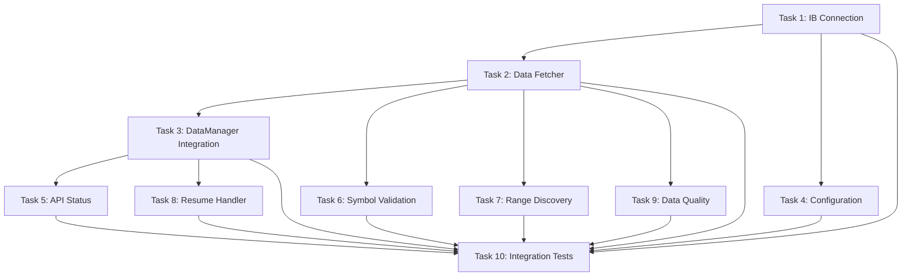

# KTRDR v3 Slice 1: IB Loader - Detailed Task Breakdown

## Overview
This task breakdown implements IB (Interactive Brokers) data loading functionality to close the critical gap identified in the backend status audit. Each task is atomic, testable, and results in a committable unit of work.

## Prerequisites
- Python environment with UV configured
- Access to IB Gateway/TWS credentials for testing
- Existing KTRDR codebase with working local CSV loader

---

## Task 1: IB Connection Infrastructure
**File**: `backend/data/ib_connection.py`
**Commit**: "feat: Add IB connection manager with retry logic"

```
1. Create IbConnectionManager class
2. Implement connect() with configurable host/port/client_id
3. Add disconnect() with cleanup
4. Implement is_connected() health check
5. Add connection retry logic (3 attempts, exponential backoff)
6. Create unit tests mocking ib_insync
7. Add connection status logging
```

**Test**: `test_ib_connection.py` - Mock connection scenarios, verify retry behavior

---

## Task 2: IB Data Fetcher Core
**File**: `backend/data/ib_data_fetcher.py`
**Commit**: "feat: Implement IB historical data fetcher with rate limiting"

```
1. Create IbDataFetcher class inheriting from DataLoaderBase
2. Implement fetch_historical_data(symbol, timeframe, start, end)
3. Add timeframe mapping (1m->1 min, 5m->5 mins, etc.)
4. Implement rate limiting (50 requests/minute)
5. Add chunking for large date ranges (30 days per request)
6. Convert IB bars to OHLCV DataFrame format
7. Add error handling for symbol not found, no data
8. Create unit tests with mocked IB responses
```

**Test**: `test_ib_data_fetcher.py` - Verify data format, rate limiting, chunking

---

## Task 3: Integration with DataManager
**File**: `backend/data/data_manager.py` (modification)
**Commit**: "feat: Integrate IB loader into DataManager with fallback logic"

```
1. Import IbDataFetcher in data_manager.py
2. Add ib_fetcher instance to DataManager.__init__
3. Modify load() to attempt IB fetch before local CSV
4. Implement gap-filling logic:
   - Try IB first for requested range
   - If partial data, merge with local CSV
   - Save merged data to CSV
5. Add IB connection status check before fetch
6. Update error handling to fallback gracefully
7. Add integration tests for IB->CSV fallback
```

**Test**: `test_data_manager_ib.py` - Test fallback scenarios, gap detection

---

## Task 4: Configuration Management
**File**: `backend/config/ib_config.py`
**Commit**: "feat: Add IB configuration with environment variables"

```
1. Create IbConfig dataclass with:
   - host (default: 127.0.0.1)
   - port (default: 7497 for paper, 7496 for live)
   - client_id (default: 1)
   - rate_limit (default: 50)
   - chunk_days (default: 30)
2. Load from environment variables (IB_HOST, IB_PORT, etc.)
3. Add validation for port ranges
4. Create config loader in settings.py
5. Add example .env.template with IB settings
6. Write config tests
```

**Test**: `test_ib_config.py` - Verify env loading, defaults, validation

---

## Task 5: API Endpoint for IB Status
**File**: `backend/api/data.py` (modification)
**Commit**: "feat: Add IB connection status endpoint"

```
1. Add GET /data/ib/status endpoint
2. Return JSON with:
   - connected: bool
   - host: str
   - port: int
   - last_fetch: datetime (optional)
   - error: str (if disconnected)
3. Add connection test button endpoint POST /data/ib/test
4. Update OpenAPI schema
5. Add endpoint tests
```

**Test**: `test_data_api_ib.py` - Test status responses, connection testing

---

## Task 6: Batch Symbol Validation
**File**: `backend/data/ib_symbol_validator.py`
**Commit**: "feat: Add IB symbol validation and contract lookup"

```
1. Create IbSymbolValidator class
2. Implement validate_symbol(symbol) -> bool
3. Add get_contract_details(symbol) for futures/stocks
4. Cache validated symbols in memory
5. Implement batch validation for multiple symbols
6. Add symbol type detection (STK, FUT, etc.)
7. Create unit tests with common symbols
```

**Test**: `test_ib_symbol_validator.py` - Test various symbol formats

---

## Task 7: Historical Data Range Discovery
**File**: `backend/data/ib_data_fetcher.py` (modification)
**Commit**: "feat: Add available data range discovery for symbols"

```
1. Add get_earliest_data_point(symbol, timeframe) method
2. Implement binary search for finding earliest available date
3. Cache results per symbol/timeframe combo
4. Add GET /data/ranges/{symbol} API endpoint
5. Return {timeframe: {start: date, end: date}} format
6. Handle IB's data availability limits
7. Add integration tests
```

**Test**: `test_ib_data_ranges.py` - Verify range detection logic

---

## Task 8: Error Recovery and Resumption
**File**: `backend/data/ib_resume_handler.py`
**Commit**: "feat: Add resumable downloads for interrupted IB fetches"

```
1. Create download state tracker
2. Save progress to .ktrdr/downloads/progress.json
3. Implement resume_download(symbol, timeframe, start, end)
4. Track successful chunks per request
5. Add cleanup for completed downloads
6. Implement progress callback for UI updates
7. Add tests for interruption scenarios
```

**Test**: `test_ib_resume.py` - Test resume after simulated failures

---

## Task 9: IB Data Quality Checks
**File**: `backend/data/ib_data_validator.py`
**Commit**: "feat: Add data quality validation for IB responses"

```
1. Create IbDataValidator class
2. Check for:
   - Gaps in timestamps
   - Invalid OHLC relationships (H<L, etc.)
   - Duplicate bars
   - Weekend/holiday gaps (expected)
3. Add auto-correction for minor issues
4. Log quality issues for review
5. Add quality report generation
6. Create comprehensive test suite
```

**Test**: `test_ib_data_quality.py` - Test various data quality scenarios

---

## Task 10: Integration Tests and Documentation
**File**: `tests/integration/test_ib_full_flow.py`
**Commit**: "test: Add end-to-end IB integration tests and docs"

```
1. Create full flow test:
   - Connect to IB
   - Fetch data for multiple symbols
   - Validate data quality
   - Save to CSV
   - Verify gap-fill works
2. Add performance benchmarks
3. Create IB setup guide in docs/
4. Add troubleshooting section
5. Document rate limits and best practices
6. Add example scripts for common tasks
```

**Test**: Full integration test suite with IB paper account

---

## Execution Order and Dependencies



## Success Criteria

Each task must:
1. Pass all unit tests
2. Include docstrings and type hints
3. Follow existing code patterns
4. Add appropriate logging
5. Update relevant documentation
6. Result in a working git commit

## Notes for Claude Code

- Start with Task 1 and proceed sequentially where possible
- Tasks 1, 2, and 4 can be done in parallel
- Use `ib_insync` library for IB integration
- Mock IB connections in tests to avoid dependencies
- Each task should take 20-45 minutes to implement
- Commit after each task with descriptive message
- Run tests before committing
- Update requirements.txt with new dependencies