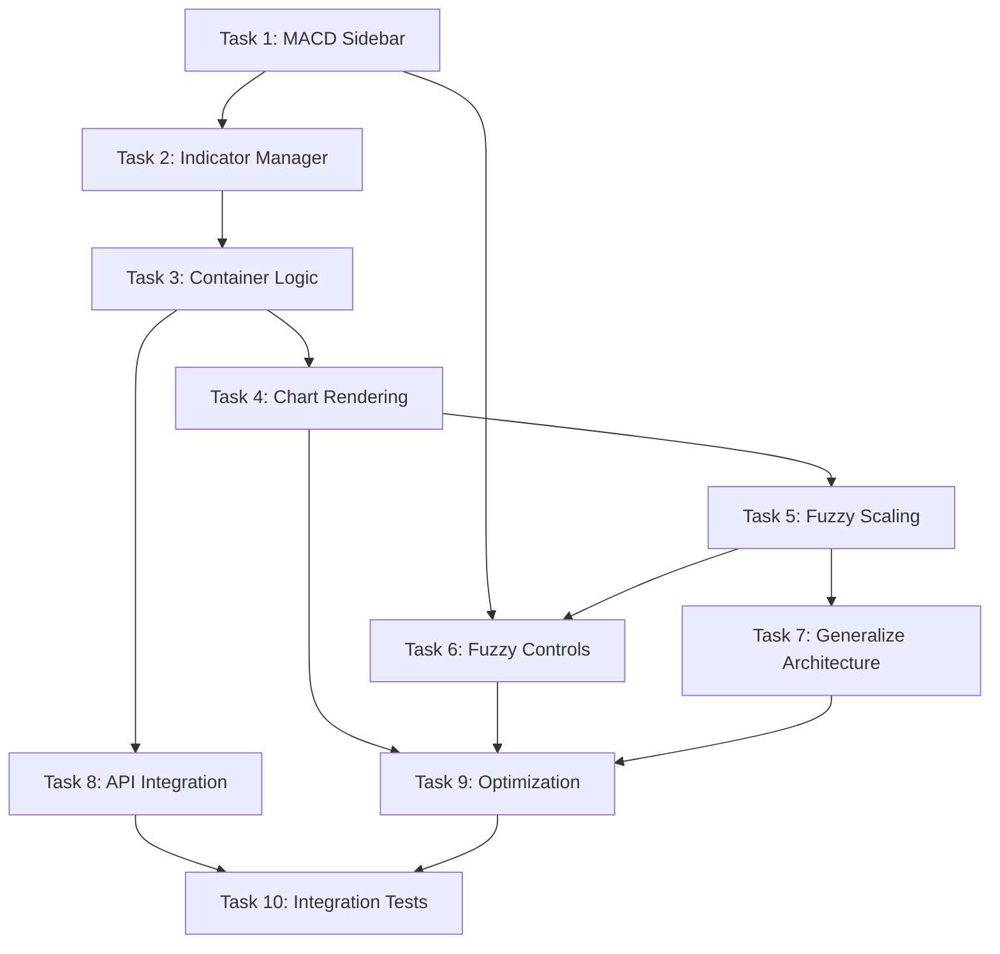

# KTRDR v3 Slice 4.6: MACD Indicator Implementation with Fuzzy Overlays - Task Breakdown

## Overview
This task breakdown implements MACD (Moving Average Convergence Divergence) indicator support with fuzzy membership overlays, building on the successful Slice 4.5 fuzzy overlay system. MACD presents unique challenges with its multi-series rendering (MACD line, Signal line, Histogram) and dynamic value ranges, making it an excellent test of our architecture's scalability and generalization capabilities.

**🧪 User Testing Approach**: This specification includes strategic user testing checkpoints (🧪) that allow validation at key milestones. Each checkpoint builds incrementally, enabling early issue detection before problems cascade to subsequent tasks.

**🔄 MAJOR ARCHITECTURE REVISION** (Updated post-implementation): After completing Tasks 1-7, user testing revealed critical issues that require a fundamental architecture change:
1. **Single Panel Limitation**: RSI and MACD are mutually exclusive in current single-panel design
2. **Chart Instability**: Fuzzy overlay changes cause unwanted chart jumping and range modifications
3. **Multi-Indicator Conflicts**: Multiple MACD instances create unreadable overlapping charts
4. **Scalability Issues**: Current architecture doesn't scale to professional trading interface needs

**NEW APPROACH**: Multi-panel architecture with individual panels per indicator type, solving all identified issues while providing a foundation for future scalability.

---

## ARCHITECTURE REVISION: Multi-Panel System

### Current Status (Tasks 1-7 ✅ COMPLETED)
- ✅ **Task 1-2**: MACD sidebar controls and state management
- ✅ **Task 3-4**: Multi-series MACD rendering (line + signal + histogram)  
- ✅ **Task 5**: Dynamic fuzzy scaling for MACD overlays
- ✅ **Task 6**: MACD fuzzy controls in sidebar
- ✅ **Task 7**: Generalized fuzzy architecture with registry-based configuration

### Critical Issues Discovered During Testing
1. **Panel Mutual Exclusivity**: Only one oscillator type can display at a time
2. **Chart Instability**: Fuzzy overlay changes trigger unwanted chart range modifications
3. **Multi-Instance Conflicts**: Multiple MACD indicators overlap unreadably
4. **Professional Interface Gap**: Single panel doesn't match trading platform standards

### NEW TASKS: Architecture Foundation

#### **Task 8 (REVISED): Multi-Panel Architecture Foundation**
**Priority**: IMMEDIATE (replaces original Task 8)
**Files**: New architecture components
**Commit**: "feat: Implement multi-panel oscillator architecture foundation"

```
1. Create BaseOscillatorPanel component:
   - Generic panel with chart, fuzzy overlays, synchronization
   - Reusable across all oscillator types
   - Independent scaling and state management
   - Standard lifecycle management (create/destroy/update)

2. Create OscillatorPanelManager:
   - Manages multiple panel instances
   - Handles panel registration and layout
   - Coordinates synchronization across panels
   - Provides panel lifecycle services

3. Design component hierarchy:
   App
   ├── MainChart (price data)
   └── OscillatorPanelManager
       ├── BaseOscillatorPanel (generic)
       │   ├── RSIPanel (extends Base)
       │   ├── MACDPanel (extends Base)
       │   └── [Future]Panel (extends Base)
       └── PanelSynchronization

4. Implement core abstractions:
   - IPanelComponent interface for type safety
   - Standard panel props and lifecycle hooks
   - Generic fuzzy overlay integration
   - Panel-specific configuration system

5. Add panel management features:
   - Individual panel collapse/expand
   - Panel reordering capabilities
   - Dynamic panel creation/removal
   - Panel-specific error boundaries
```

#### **Task 9 (REVISED): Individual Panel Implementation**
**Priority**: HIGH (replaces original Task 9)
**Files**: Specific panel components
**Commit**: "feat: Implement RSI and MACD panel components"

```
1. Implement RSIPanel extending BaseOscillatorPanel:
   - RSI-specific chart configuration (0-100 range, reference lines)
   - Fixed scaling fuzzy overlay integration
   - RSI-specific error handling and edge cases
   - Support for multiple RSI instances

2. Implement MACDPanel extending BaseOscillatorPanel:
   - MACD multi-series rendering (line + signal + histogram)
   - Dynamic scaling fuzzy overlay integration
   - Zero-line reference and auto-scaling
   - Support for multiple MACD instances

3. Panel-specific features:
   - Type-safe props for indicator-specific data
   - Custom chart configurations per panel type
   - Indicator-specific fuzzy overlay behavior
   - Independent error states and loading

4. Panel lifecycle management:
   - Efficient panel creation/destruction
   - Proper chart cleanup on panel removal
   - Memory leak prevention
   - Performance optimization for multiple panels

5. Add panel UI enhancements:
   - Panel headers with indicator names and controls
   - Individual panel collapse/expand
   - Visual separation between panels
   - Responsive design for different screen sizes
```

#### **Task 10 (REVISED): Chart Stability and Multi-Panel Integration**
**Priority**: HIGH (new task)
**Files**: Chart synchronization and stability
**Commit**: "feat: Fix chart stability and implement multi-panel synchronization"

```
1. Fix chart stability issues:
   - Prevent fuzzy overlay changes from affecting chart scaling
   - Implement stable Y-axis scaling per panel
   - Fix time scale preservation during overlay updates
   - Add debouncing for rapid overlay changes

2. Implement multi-panel synchronization:
   - Time scale synchronization across all panels
   - Crosshair synchronization (optional)
   - Zoom/pan coordination between panels
   - Independent Y-axis scaling per panel

3. Enhance chart lifecycle management:
   - Proper chart cleanup on panel removal
   - Efficient chart updates for multiple panels
   - Memory optimization for panel instances
   - Prevention of chart jumping during updates

4. Add advanced panel features:
   - Panel height management (auto-sizing)
   - Panel splitter controls for user adjustment
   - Panel persistence (remember collapsed state)
   - Panel-specific context menus

5. Performance optimization:
   - Lazy loading of panel charts
   - Efficient rendering of multiple overlays
   - Optimized synchronization algorithms
   - Memory pooling for chart instances
```

#### **Task 11 (NEW): Integration Testing and Polish**
**Priority**: MEDIUM (replaces original Task 10)
**Files**: Integration tests and final polish
**Commit**: "feat: Complete multi-panel integration with comprehensive testing"

```
1. Comprehensive integration testing:
   - Test multiple RSI + MACD panels simultaneously
   - Verify fuzzy overlays work independently per panel
   - Test panel management (create/remove/reorder)
   - Validate synchronization across all panels

2. User experience enhancements:
   - Smooth panel animations (collapse/expand)
   - Professional panel styling and spacing
   - Intuitive panel management controls
   - Responsive design validation

3. Performance validation:
   - Test with 5+ panels (mixed RSI/MACD)
   - Memory usage profiling
   - Rendering performance benchmarks
   - Synchronization latency testing

4. Documentation updates:
   - Multi-panel architecture guide
   - Panel development guidelines
   - Performance best practices
   - Troubleshooting guide

5. Final polish:
   - Code cleanup and optimization
   - Remove deprecated single-panel code
   - Update TypeScript types
   - Accessibility improvements
```

## Prerequisites
- ✅ Completed Slice 4.5 with working fuzzy overlay system for RSI
- ✅ Generic fuzzy infrastructure (`useFuzzyOverlay`, `FuzzyOverlay`, color system)
- ✅ MACD already registered in `indicatorRegistry.ts` with proper configuration
- ✅ MACD fuzzy sets defined in `config/fuzzy.yaml` (negative/neutral/positive)
- ✅ OscillatorChart supports multiple series and histogram rendering
- ✅ Backend MACD calculation endpoints available

---

## Task 1: Add MACD Sidebar Controls
**File**: `frontend/src/components/presentation/sidebar/IndicatorSidebar.tsx`
**Commit**: "feat: Add MACD indicator controls to sidebar"

```
1. Add MACD section to Add Indicator area:
   - Create newMACDParams state (fast_period: 12, slow_period: 26, signal_period: 9)
   - Add three number inputs with proper validation ranges
   - Add "Add MACD(12,26,9)" button with purple theme color
   - Follow existing SMA/RSI patterns for form layout

2. Update IndicatorAddSection pattern:
   - Extend component to support multiple parameters
   - Add parameter group layout for complex indicators
   - Maintain responsive design for mobile devices

3. Add MACD parameter displays:
   - Show current parameter values in button label
   - Validate parameter relationships (fast < slow)
   - Proper error states and user feedback

4. Integrate with existing form state:
   - Follow same validation patterns as SMA/RSI
   - Same loading state management
   - Same success/error handling

5. Add accessibility features:
   - Proper tab order for multiple inputs
   - ARIA labels for parameter relationships
   - Screen reader support for complex controls

6. Style integration:
   - Use MACD theme color (#9C27B0) consistently
   - Match existing indicator section layout
   - Responsive parameter group design
```

**Test**: `IndicatorSidebar.test.tsx` - Test MACD form validation and submission

🧪 **USER TESTING CHECKPOINT 1**: Test MACD sidebar form
- Verify MACD section appears in "Add Indicator" area
- Test all three parameter inputs (fast=12, slow=26, signal=9)
- Validate parameter relationships (fast < slow)
- Check button shows "Add MACD(12,26,9)" with proper styling
- Confirm form validation prevents invalid combinations

---

## Task 2: Extend useIndicatorManager for MACD
**File**: `frontend/src/hooks/useIndicatorManager.ts`
**Commit**: "feat: Add MACD support to indicator manager"

```
1. Add MACD form state management:
   - newMACDFastPeriod: number (default: 12)
   - newMACDSlowPeriod: number (default: 26)  
   - newMACDSignalPeriod: number (default: 9)
   - setters for each parameter

2. Add MACD validation logic:
   - Ensure fast_period < slow_period
   - Validate all periods within acceptable ranges
   - Check for duplicate MACD instances with same parameters

3. Implement handleAddMACD function:
   - Create MACD indicator with three-parameter validation
   - Use existing addIndicator with customParameters
   - Handle MACD-specific error cases
   - Reset form state on successful add

4. Add MACD parameter update handling:
   - Support updating complex multi-parameter indicators
   - Maintain parameter relationship validation
   - Handle parameter dependency chains

5. Extend duplicate detection:
   - Compare all three MACD parameters for duplicates
   - Handle JSON comparison of complex parameter objects
   - Provide meaningful error messages

6. Follow existing hook patterns:
   - Same useCallback optimization strategies
   - Same error handling approach
   - Same state update patterns
```

**Test**: `useIndicatorManager.test.tsx` - Test MACD parameter management and validation

🧪 **USER TESTING CHECKPOINT 2**: Test MACD indicator creation
- Click "Add MACD(12,26,9)" button and verify it creates an indicator
- Check MACD appears in "Active Indicators" list with correct parameters
- Verify MACD indicator can be toggled on/off
- Test parameter controls expand/collapse functionality
- Confirm duplicate MACD prevention works (try adding same MACD twice)

---

## Task 3: Multi-Series MACD Container Logic
**File**: `frontend/src/components/containers/OscillatorChartContainer.tsx`
**Commit**: "feat: Add MACD multi-series rendering support"

```
1. Extend calculateOscillatorData for MACD:
   - Handle MACD API response with multiple columns
   - Parse MACD_12_26 (main line), MACD_Signal_9, MACD_Histogram columns
   - Transform data for LineSeries and HistogramSeries appropriately

2. Create MACD series generation logic:
   - Generate three separate OscillatorIndicatorSeries objects
   - MACD Line: LineSeries with primary color
   - Signal Line: LineSeries with secondary color (darker shade)
   - Histogram: HistogramSeries with tertiary color (semi-transparent)

3. Add MACD configuration handling:
   - Detect MACD indicators and apply special configuration
   - Set appropriate y-axis range (auto-scale for dynamic values)
   - Add zero-line reference for MACD charts
   - Handle negative values properly

4. Implement MACD fuzzy integration:
   - Get fuzzy data for MACD indicators using existing useFuzzyOverlay
   - Handle MACD value range detection for proper fuzzy scaling
   - Apply fuzzy overlays to MACD main line (not signal or histogram)

5. Add MACD-specific error handling:
   - Handle cases where MACD calculation fails
   - Graceful fallback when some MACD columns are missing
   - User-friendly error messages for MACD issues

6. Performance optimization:
   - Parallel calculation of MACD and RSI when both present
   - Efficient data transformation for multiple series
   - Proper memoization of MACD series data
```

**Test**: `OscillatorChartContainer.test.tsx` - Test MACD multi-series data handling

🧪 **USER TESTING CHECKPOINT 3**: Test basic MACD chart appearance
- Verify MACD indicator appears in oscillator chart panel (below main chart)
- Check that some kind of line/data appears (even if not perfect yet)
- Confirm no console errors or crashes when MACD is added
- Test that chart title shows "MACD" or similar indicator
- Verify basic chart interactions work (pan/zoom)

---

## Task 4: Enhanced OscillatorChart Multi-Series Rendering
**File**: `frontend/src/components/presentation/charts/OscillatorChart.tsx`
**Commit**: "feat: Enhance OscillatorChart for MACD multi-series support"

```
1. Extend indicator series management:
   - Support multiple series per logical indicator
   - Handle LineSeries and HistogramSeries in same chart
   - Manage series creation/removal for complex indicators

2. Add MACD-specific rendering logic:
   - Render MACD line with solid line style
   - Render Signal line with different line style/width
   - Render Histogram with proper bar styling and transparency
   - Ensure proper z-order: Histogram → MACD Line → Signal Line

3. Enhance oscillator configuration:
   - Auto-detect MACD indicators and adjust configuration
   - Add zero-line reference for MACD charts
   - Dynamic y-axis scaling for MACD value ranges
   - Proper chart titles and labels

4. Update series lifecycle management:
   - Handle addition/removal of complex multi-series indicators
   - Proper cleanup when MACD indicators are removed
   - Efficient updates when MACD parameters change

5. Add MACD visual enhancements:
   - Color coordination between related series
   - Proper line weights and transparency
   - Histogram positive/negative color coding
   - Crosshair interaction for all series

6. Maintain existing functionality:
   - Preserve RSI and other oscillator rendering
   - Keep fuzzy overlay integration working
   - Maintain chart synchronization features
```

**Test**: `OscillatorChart.test.tsx` - Test multi-series rendering and MACD-specific features

🧪 **USER TESTING CHECKPOINT 4**: Test complete MACD multi-series rendering
- Verify all three MACD components render: MACD line (solid), Signal line (dashed), Histogram (bars)
- Check proper color coordination (purple theme family)
- Test zero-line reference appears at y=0
- Verify chart auto-scales to MACD value range
- Confirm all series respond to indicator visibility toggle
- Test crosshair interactions work with all series

---

## Task 5: MACD Fuzzy Scaling and Integration
**File**: `frontend/src/hooks/useFuzzyOverlay.ts`
**Commit**: "feat: Add dynamic scaling for MACD fuzzy overlays"

```
1. Implement dynamic value range detection:
   - Detect indicator type from indicatorId pattern
   - For MACD: analyze actual data values to determine range
   - For RSI: continue using fixed 0-100 scaling
   - Cache range calculations for performance

2. Add MACD-specific scaling logic:
   - Detect min/max values from MACD data
   - Calculate appropriate scaling factor for fuzzy overlays
   - Apply scaling in transformFuzzyDataForChart function
   - Handle edge cases (all zero values, extreme ranges)

3. Extend fuzzy data transformation:
   - Make scaling factor configurable per indicator type
   - Support different fuzzy set names (negative/neutral/positive vs low/neutral/high)
   - Maintain backward compatibility with RSI

4. Add fuzzy set mapping logic:
   - Map MACD fuzzy sets (negative/neutral/positive) to appropriate colors
   - Use existing fuzzy color schemes with proper semantic mapping
   - Handle different fuzzy set counts per indicator

5. Implement range caching:
   - Cache calculated ranges to avoid recalculation
   - Invalidate cache when indicator data changes
   - Optimize for real-time data updates

6. Add error handling:
   - Handle cases where range detection fails
   - Fallback scaling strategies
   - User feedback for scaling issues
```

**Test**: `useFuzzyOverlay.test.tsx` - Test dynamic scaling and MACD fuzzy integration

🧪 **USER TESTING CHECKPOINT 5**: Test MACD fuzzy overlays
- Verify fuzzy overlays can be enabled for MACD indicators  
- Check that colored areas appear over MACD chart (negative/neutral/positive)
- Confirm overlays scale properly to MACD value range (not fixed 0-100 like RSI)
- Test that fuzzy areas render behind MACD lines (proper z-order)
- Verify performance remains smooth with fuzzy overlays active

---

## Task 6: MACD Fuzzy Controls in Sidebar
**File**: `frontend/src/components/presentation/sidebar/IndicatorSidebar.tsx`
**Commit**: "feat: Add MACD fuzzy controls to indicator parameters"

```
1. Extend fuzzy controls support detection:
   - Update supportsFuzzy check to include MACD (indicator.name === 'macd')
   - Maintain existing RSI fuzzy control functionality
   - Add indicator-specific fuzzy control variations

2. Add MACD-specific fuzzy controls:
   - Same fuzzy visibility toggle as RSI
   - Same opacity slider with proper event handling
   - MACD-appropriate color scheme options
   - Label adjustments for MACD context (e.g., "Show MACD fuzzy membership")

3. Implement fuzzy set labeling:
   - Display appropriate labels for MACD fuzzy sets
   - Show "Negative/Neutral/Positive" instead of "Low/Neutral/High"
   - Update tooltips and help text for MACD context

4. Add MACD fuzzy preview:
   - Visual preview of fuzzy colors in sidebar
   - Show current membership values if available
   - Interactive preview that updates with color scheme changes

5. Maintain design consistency:
   - Use same styling patterns as RSI fuzzy controls
   - Same responsive behavior for mobile devices
   - Same accessibility features

6. Add validation and feedback:
   - Validate MACD fuzzy parameters
   - Provide feedback when fuzzy data is loading
   - Handle error states gracefully
```

**Test**: `IndicatorSidebar.test.tsx` - Test MACD fuzzy controls and interactions

🧪 **USER TESTING CHECKPOINT 6**: Test MACD fuzzy controls in sidebar
- Verify fuzzy controls appear in MACD parameter panel (toggle, opacity, color scheme)
- Test fuzzy visibility checkbox enables/disables overlays in real-time
- Check opacity slider changes overlay transparency smoothly
- Verify color scheme dropdown changes overlay colors (test different schemes)
- Confirm control labels are appropriate for MACD ("negative/neutral/positive" context)

---

## Task 7: Generalize Fuzzy Architecture
**File**: `frontend/src/utils/fuzzyScaling.ts` (new file)
**Commit**: "feat: Create generalized fuzzy scaling utilities"

```
1. Create scaling utility functions:
   - detectIndicatorValueRange(indicatorType: string, data: number[])
   - calculateScalingFactor(range: {min: number, max: number}, targetRange?: {min: number, max: number})
   - applyScaling(fuzzyValue: number, scalingFactor: number, offset?: number)

2. Add indicator type detection:
   - createIndicatorTypeDetector() function
   - Support for RSI (fixed 0-100), MACD (dynamic), future indicators
   - Configuration-driven approach for easy extension

3. Implement fuzzy set mapping:
   - mapFuzzySetToColorScheme(setName: string, indicatorType: string, colorScheme: string)
   - Support different set names per indicator type
   - Semantic color mapping (negative=red, positive=green)

4. Add caching and optimization:
   - LRU cache for range calculations
   - Memoization for expensive scaling operations
   - Efficient batch operations for multiple indicators

5. Create configuration system:
   - Indicator-specific scaling configurations
   - Default scaling strategies
   - Override mechanisms for special cases

6. Add comprehensive testing:
   - Unit tests for all scaling functions
   - Edge case testing (zero ranges, negative values)
   - Performance benchmarks for scaling operations
```

**Test**: `fuzzyScaling.test.ts` - Test scaling utilities and edge cases

---

## Task 8: MACD Backend Integration Testing
**File**: `frontend/src/api/endpoints/macd.ts` (new file)
**Commit**: "feat: Add MACD-specific API integration and testing"

```
1. Create MACD API integration:
   - Type definitions for MACD API responses
   - Helper functions for MACD parameter validation
   - MACD-specific error handling

2. Add MACD calculation request builders:
   - buildMACDCalculationRequest(symbol, timeframe, parameters, dateRange)
   - Proper parameter mapping to backend format
   - Validation of MACD parameter relationships

3. Implement MACD response parsing:
   - Parse MACD line, Signal line, and Histogram data
   - Handle missing columns gracefully
   - Transform data to chart-ready format

4. Add MACD fuzzy data integration:
   - Combine MACD calculation with fuzzy overlay requests
   - Parallel API calls for optimal performance
   - Error handling when fuzzy data unavailable

5. Create MACD-specific caching:
   - Cache MACD calculations separately from simple indicators
   - Cache invalidation when parameters change
   - Performance optimization for real-time updates

6. Add integration tests:
   - End-to-end MACD calculation and rendering
   - Test with real market data
   - Performance testing with multiple MACD instances
```

**Test**: `macd.test.ts` - Test MACD API integration and data transformation

---

## Task 9: Code Refactoring and Optimization
**File**: Multiple files (refactoring task)
**Commit**: "refactor: Extract shared oscillator patterns and optimize performance"

```
1. Extract shared oscillator container logic:
   - Create BaseOscillatorContainer with common functionality
   - Move shared API calling patterns to utilities
   - Reduce code duplication between RSI and MACD handling

2. Optimize fuzzy overlay performance:
   - Implement data decimation for large datasets
   - Add fuzzy overlay visibility culling
   - Optimize series creation/destruction

3. Create oscillator configuration system:
   - Centralized oscillator chart configurations
   - Per-indicator chart customization
   - Scalable approach for future oscillators

4. Add shared utilities:
   - Common data transformation functions
   - Shared error handling patterns
   - Reusable validation logic

5. Implement performance monitoring:
   - Add performance metrics for complex indicators
   - Monitor memory usage with multiple overlays
   - Optimize for production builds

6. Clean up technical debt:
   - Remove any duplicated code
   - Standardize naming conventions
   - Update documentation and comments
```

**Test**: Performance regression tests and refactoring validation

🧪 **USER TESTING CHECKPOINT 7**: Test performance and optimization
- Add multiple MACD indicators (2-3 instances) and verify smooth performance
- Test with both RSI and MACD indicators active simultaneously
- Check memory usage stays reasonable with multiple fuzzy overlays
- Verify chart interactions (pan/zoom) remain smooth at 60 FPS
- Confirm no performance regressions compared to RSI-only baseline

---

## Task 10: Integration Testing and Documentation
**File**: `frontend/src/tests/integration/macd-integration.test.tsx`
**Commit**: "test: Add comprehensive MACD integration tests and documentation"

```
1. Create MACD end-to-end tests:
   - Add MACD from sidebar → verify chart rendering
   - Toggle MACD fuzzy overlays → verify overlay appearance
   - Adjust MACD parameters → verify chart updates
   - Multiple MACD instances → verify performance

2. Test MACD multi-series functionality:
   - Verify all three series render correctly
   - Test series visibility toggles
   - Validate color coordination

3. Add MACD fuzzy overlay tests:
   - Test negative/neutral/positive overlays
   - Verify dynamic scaling accuracy
   - Test color scheme changes

4. Create performance benchmarks:
   - Measure MACD rendering performance
   - Compare with RSI baseline performance
   - Validate memory usage with multiple indicators

5. Add accessibility testing:
   - MACD controls keyboard navigation
   - Screen reader compatibility
   - Color contrast validation

6. Update documentation:
   - MACD implementation guide
   - Fuzzy overlay scaling documentation
   - Architecture decision records
   - Troubleshooting guide for MACD issues
```

**Test**: Complete integration test suite with visual regression testing

🧪 **USER TESTING CHECKPOINT 8**: Final integration validation
- Comprehensive test of complete MACD workflow (add → configure → view → fuzzy overlays)
- Test edge cases: remove indicators, change symbols, adjust timeframes
- Verify all existing RSI functionality still works perfectly
- Confirm MACD and RSI can coexist with independent fuzzy controls
- Validate accessibility (keyboard navigation, screen reader compatibility)
- Final performance and visual quality check

---

## Execution Order and Dependencies



## User Testing Checkpoint Summary

For efficient validation during development, test at these key milestones:

1. **After Task 1**: 🧪 MACD sidebar form appears and validates correctly
2. **After Task 2**: 🧪 "Add MACD" button creates indicators in Active list  
3. **After Task 3**: 🧪 MACD appears as basic line(s) in oscillator chart
4. **After Task 4**: 🧪 Full MACD rendering (line + signal + histogram + zero-line)
5. **After Task 5**: 🧪 MACD fuzzy overlays work with proper scaling
6. **After Task 6**: 🧪 MACD fuzzy controls in sidebar work correctly
7. **After Task 9**: 🧪 Performance testing with multiple indicators
8. **After Task 10**: 🧪 Final comprehensive validation

Each checkpoint builds on the previous, allowing issues to be caught early before they cascade to subsequent tasks.

---

## Success Criteria

Each task must:
1. ✅ Maintain all existing RSI functionality
2. ✅ Pass all unit and integration tests
3. ✅ Preserve 60+ FPS performance with MACD overlays
4. ✅ Support multiple MACD instances simultaneously
5. ✅ Include comprehensive TypeScript typing
6. ✅ Follow established Container/Presentation patterns
7. ✅ Result in a working git commit

## Performance Targets

- MACD rendering initialization < 150ms
- Multi-series update latency < 75ms
- Support 5+ MACD instances with fuzzy overlays
- Memory overhead < 25MB per MACD instance
- Smooth interactions at 60 FPS

## Visual Design Guidelines

- MACD Line: Solid line, primary color (#9C27B0)
- Signal Line: Dashed line, secondary color (darker purple)
- Histogram: Semi-transparent bars, positive=green, negative=red
- Fuzzy overlays: Same opacity and interaction patterns as RSI
- Zero-line reference: Subtle dashed line at y=0

## MACD-Specific Technical Notes

### API Response Format
```json
{
  "success": true,
  "indicators": {
    "MACD_12_26": [/* main MACD line values */],
    "MACD_Signal_9": [/* signal line values */],
    "MACD_Histogram": [/* histogram values */]
  },
  "dates": [/* timestamp array */]
}
```

### Fuzzy Set Mapping
```yaml
macd:
  negative: [-10, -2, 0]   # Red areas (bearish)
  neutral: [-1, 0, 1]      # Gray areas (sideways)  
  positive: [0, 2, 10]     # Green areas (bullish)
```

### Scaling Strategy
- **RSI**: Fixed 0-100 range, multiply fuzzy values by 100
- **MACD**: Dynamic range detection, scale fuzzy values to match data range
- **Future**: Configuration-driven scaling per indicator type

## Architecture Benefits Validation

This slice validates our architecture's key strengths:

1. ✅ **Generic Fuzzy System**: `useFuzzyOverlay` works with MACD without changes
2. ✅ **Scalable Chart Components**: `OscillatorChart` handles multi-series easily  
3. ✅ **Reusable Patterns**: Container/Presentation scales to complex indicators
4. ✅ **Type Safety**: Full TypeScript coverage for multi-parameter indicators
5. ✅ **Performance**: Architecture handles complexity without degradation

## Notes for Implementation

- Start with basic MACD line rendering (Tasks 1-4) before fuzzy integration
- Test each series type individually before combining
- Use React DevTools to profile performance during development
- Consider using React 18 concurrent features for smooth updates
- Each task should take 60-90 minutes for focused implementation
- Pay special attention to series lifecycle management
- Profile memory usage with multiple MACD instances

## Future Extensibility

This implementation sets up patterns for:
- EMA indicators with fuzzy overlays
- Bollinger Bands with multiple series
- Stochastic oscillators
- Custom indicator plugins
- Real-time indicator updates
- Advanced charting features

The success of this slice validates that our architecture can scale to support the full range of technical indicators with minimal architectural changes.