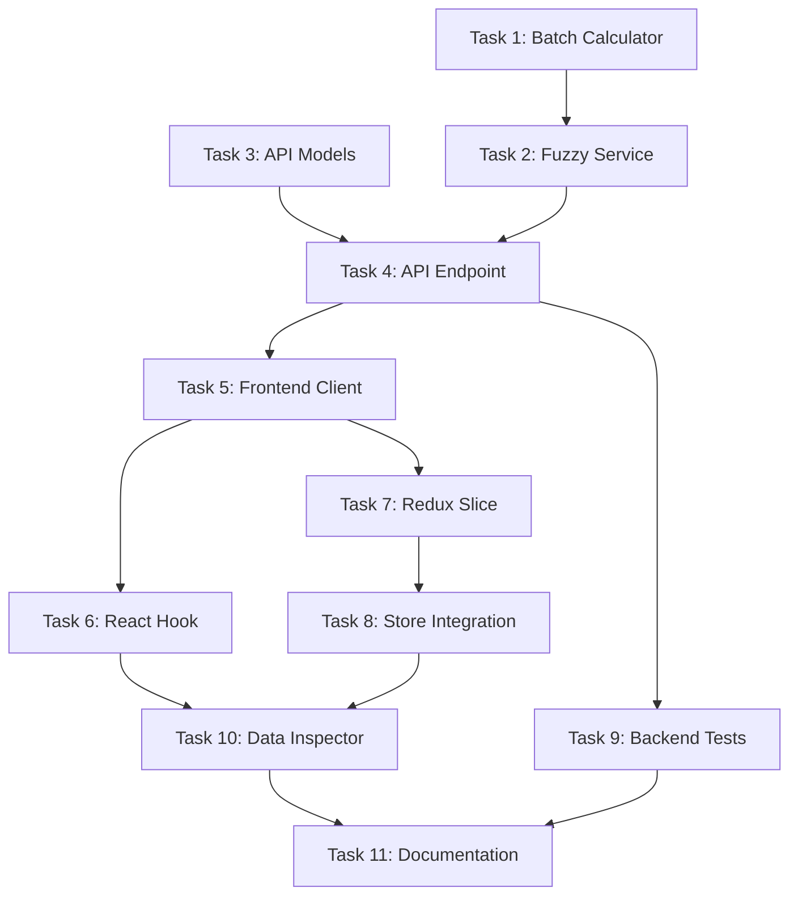

# KTRDR v3 Slice 4: Fuzzy Data Overlay API - Detailed Task Breakdown

## Overview
This task breakdown implements the Fuzzy Data Overlay API to expose time-series fuzzy membership values for chart overlays. Each task is atomic, testable, and results in a committable unit of work.

## Prerequisites
- Completed backend with working fuzzy engine and `/fuzzy/preview` endpoint
- Working indicator calculation system
- Frontend scaffolding with TypeScript/React
- Strategy YAML with fuzzy set configurations

---

## Task 1: Batch Fuzzy Membership Calculator
**File**: `ktrdr/fuzzy/batch_calculator.py`
**Commit**: "feat: Add batch fuzzy membership calculator for time series"

```
1. Create BatchFuzzyCalculator class
2. Implement calculate_memberships(indicator_name, values_series)
   - Accept pandas Series with timestamps
   - Return dict of set_name -> membership values
3. Add caching for repeated calculations
4. Handle missing/NaN values gracefully
5. Implement efficient vectorized operations
6. Add performance logging for large datasets
7. Create unit tests with sample time series
8. Test edge cases (empty series, all NaN)
```

**Test**: `test_batch_fuzzy_calculator.py` - Verify batch calculations, performance

---

## Task 2: Fuzzy Service Layer
**File**: `ktrdr/services/fuzzy_service.py`
**Commit**: "feat: Create fuzzy service for data overlay operations"

```
1. Create FuzzyService class
2. Implement get_fuzzy_overlays(symbol, timeframe, indicators=None)
3. Add logic to:
   - Load OHLCV data via DataManager
   - Calculate requested indicators
   - Apply batch fuzzy calculations
   - Structure response data
4. Handle indicator validation:
   - Check if indicator exists
   - Verify fuzzy config exists
   - Skip invalid with warnings
5. Add comprehensive error handling
6. Implement result caching strategy
7. Create service-level tests
```

**Test**: `test_fuzzy_service.py` - Test orchestration, validation, error cases

---

## Task 3: API Response Models
**File**: `ktrdr/api/models/fuzzy.py`
**Commit**: "feat: Add Pydantic models for fuzzy overlay responses"

```
1. Create FuzzyMembershipPoint model:
   - timestamp: datetime
   - value: float (0.0-1.0)
2. Create FuzzySetMembership model:
   - set: str
   - membership: List[FuzzyMembershipPoint]
3. Create FuzzyOverlayData model:
   - Dict[str, List[FuzzySetMembership]]
4. Create FuzzyOverlayResponse model:
   - symbol: str
   - timeframe: str
   - data: FuzzyOverlayData
   - warnings: Optional[List[str]]
5. Add validation for membership values (0-1 range)
6. Add JSON serialization examples
7. Create model validation tests
```

**Test**: `test_fuzzy_models.py` - Validate model constraints, serialization

---

## Task 4: Fuzzy Data API Endpoint
**File**: `ktrdr/api/endpoints/fuzzy.py` (modification)
**Commit**: "feat: Add GET /fuzzy/data endpoint for overlay data"

```
1. Add GET /fuzzy/data route
2. Define query parameters:
   - symbol: str (required)
   - timeframe: str (required)
   - indicators: Optional[List[str]]
   - start: Optional[datetime]
   - end: Optional[datetime]
3. Implement endpoint logic:
   - Validate parameters
   - Call FuzzyService
   - Handle partial results
   - Return FuzzyOverlayResponse
4. Add OpenAPI documentation
5. Implement request logging
6. Add rate limiting if needed
7. Create endpoint tests
```

**Test**: `test_fuzzy_api.py` - Test various parameter combinations

---

## Task 5: Frontend API Client
**File**: `frontend/src/api/fuzzy.ts`
**Commit**: "feat: Add TypeScript client for fuzzy overlay API"

```
1. Define TypeScript interfaces:
   - FuzzyMembershipPoint
   - FuzzySetMembership
   - FuzzyOverlayData
   - FuzzyOverlayResponse
2. Create getFuzzyOverlay function:
   - Build query params
   - Handle optional indicators array
   - Parse response with type safety
3. Add error handling with typed errors
4. Implement request cancellation
5. Add response validation
6. Create mock responses for testing
7. Add JSDoc documentation
```

**Test**: `fuzzy.test.ts` - Test API client with mocked responses

---

## Task 6: React Hook for Fuzzy Data
**File**: `frontend/src/hooks/useFuzzyData.ts`
**Commit**: "feat: Add useFuzzyData hook for fuzzy overlay fetching"

```
1. Create useFuzzyData hook with parameters:
   - symbol: string
   - timeframe: string
   - indicators?: string[]
2. Implement state management:
   - data: FuzzyOverlayData | null
   - loading: boolean
   - error: string | null
3. Add fetch function with:
   - Loading state management
   - Error handling
   - Warning logging
4. Add automatic refetch on param changes
5. Implement cleanup on unmount
6. Add request deduplication
7. Create hook tests with React Testing Library
```

**Test**: `useFuzzyData.test.tsx` - Test loading states, error handling

---

## Task 7: Redux Store Integration
**File**: `frontend/src/store/fuzzySlice.ts`
**Commit**: "feat: Add Redux slice for fuzzy overlay state"

```
1. Create fuzzySlice with initial state:
   - overlays: FuzzyOverlayData | null
   - loading: boolean
   - error: string | null
2. Add actions:
   - setFuzzyOverlays
   - clearFuzzyOverlays
   - setFuzzyLoading
   - setFuzzyError
3. Create thunk for fetching:
   - fetchFuzzyOverlays(symbol, timeframe, indicators?)
4. Add selectors:
   - selectFuzzyOverlays
   - selectFuzzyByIndicator
5. Implement cache invalidation logic
6. Add TypeScript types for all actions
7. Create store tests
```

**Test**: `fuzzySlice.test.ts` - Test reducers, actions, selectors

---

## Task 8: Integration with Existing Store
**File**: `frontend/src/store/index.ts` (modification)
**Commit**: "feat: Integrate fuzzy slice into root store"

```
1. Import fuzzySlice reducer
2. Add to root reducer configuration
3. Update RootState type
4. Create typed hooks:
   - useAppSelector with fuzzy selectors
   - useAppDispatch with fuzzy actions
5. Add fuzzy state persistence config (if needed)
6. Update store DevTools configuration
7. Test store integration
```

**Test**: `store.integration.test.ts` - Verify fuzzy state in root store

---

## Task 9: Backend Integration Tests
**File**: `tests/integration/test_fuzzy_overlay_flow.py`
**Commit**: "test: Add end-to-end tests for fuzzy overlay API"

```
1. Create test fixture with:
   - Sample OHLCV data
   - Test strategy config with fuzzy sets
   - Multiple indicators
2. Test complete flow:
   - Load data
   - Calculate indicators
   - Compute fuzzy memberships
   - Verify API response
3. Test edge cases:
   - Missing indicators
   - No fuzzy config
   - Empty data ranges
4. Performance test with large datasets
5. Test concurrent requests
6. Verify warning messages
7. Add response time assertions
```

**Test**: Full integration test suite for fuzzy overlay system

---

## Task 10: Frontend Integration & Developer Tools
**File**: `frontend/src/components/dev/FuzzyDataInspector.tsx`
**Commit**: "feat: Add fuzzy data inspector component for debugging"

```
1. Create FuzzyDataInspector component
2. Display current fuzzy overlay state
3. Add controls to:
   - Select symbol/timeframe
   - Toggle indicators
   - Refresh data
4. Show raw membership values in table
5. Add JSON export functionality
6. Create usage documentation
7. Add to developer tools panel
8. Include performance metrics
```

**Test**: `FuzzyDataInspector.test.tsx` - Test component functionality

---

## Task 11: Documentation and Examples
**File**: `docs/fuzzy-overlay-api.md`
**Commit**: "docs: Add fuzzy overlay API documentation and examples"

```
1. Document API endpoint:
   - Parameters
   - Response format
   - Error codes
2. Add curl examples
3. Create TypeScript usage examples
4. Document performance considerations
5. Add troubleshooting guide
6. Include fuzzy set configuration examples
7. Add architectural diagrams
8. Create migration guide from preview API
```

**Test**: Documentation review and example validation

---

## Execution Order and Dependencies



## Success Criteria

Each task must:
1. Pass all unit tests
2. Include TypeScript types (frontend) or type hints (backend)
3. Follow project conventions
4. Include appropriate logging
5. Handle errors gracefully
6. Result in a working git commit

## Performance Targets

- API response time < 500ms for 10,000 data points
- Frontend render without blocking UI
- Support concurrent requests
- Cache results where appropriate

## Notes for Claude Code

- Start with backend tasks (1-4) before frontend
- Tasks 1 and 3 can be done in parallel
- Use pandas for efficient calculations in Task 1
- Mock API responses for frontend testing
- Each task should take 30-60 minutes
- Run linting before commits
- Update OpenAPI spec for new endpoint
- Consider adding response compression for large datasets